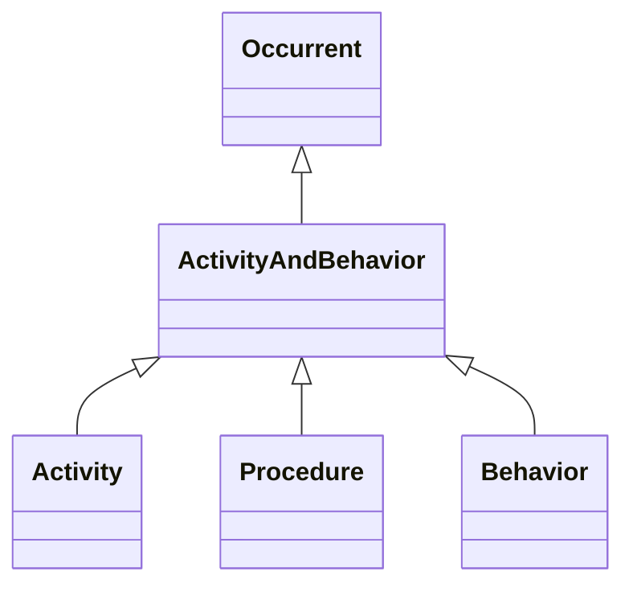

# Class: ActivityAndBehavior


_Activity or behavior of any independent integral living, organization or mechanical actor in the world_


URI: [bican:ActivityAndBehavior](https://identifiers.org/brain-bican/vocab/ActivityAndBehavior)





## Inheritance
* [PhysicalEssenceOrOccurrent](PhysicalEssenceOrOccurrent.md)
    * [Occurrent](Occurrent.md)
        * **ActivityAndBehavior**


## Slots

| Name | Cardinality and Range | Description | Inheritance |
| ---  | --- | --- | --- |


## Mixin Usage

| mixed into | description |
| --- | --- |
| [Activity](Activity.md) | An activity is something that occurs over a period of time and acts upon or w... |
| [Procedure](Procedure.md) | A series of actions conducted in a certain order or manner |
| [Behavior](Behavior.md) |  |


## Identifier and Mapping Information


### Schema Source


* from schema: https://identifiers.org/brain-bican/kb-model


## Mappings

| Mapping Type | Mapped Value |
| ---  | ---  |
| self | bican:ActivityAndBehavior |
| native | bican:ActivityAndBehavior |
| exact | UMLSSG:ACTI |


## LinkML Source

<!-- TODO: investigate https://stackoverflow.com/questions/37606292/how-to-create-tabbed-code-blocks-in-mkdocs-or-sphinx -->

### Direct

<details>
```yaml
name: activity and behavior
description: Activity or behavior of any independent integral living, organization
  or mechanical actor in the world
from_schema: https://identifiers.org/brain-bican/kb-model
exact_mappings:
- UMLSSG:ACTI
is_a: occurrent
mixin: true

```
</details>

### Induced

<details>
```yaml
name: activity and behavior
description: Activity or behavior of any independent integral living, organization
  or mechanical actor in the world
from_schema: https://identifiers.org/brain-bican/kb-model
exact_mappings:
- UMLSSG:ACTI
is_a: occurrent
mixin: true

```
</details>