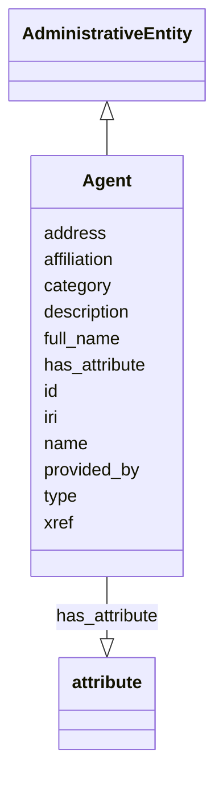

# Class: Agent


_person, group, organization or project that provides a piece of information (i.e. a knowledge association)_


URI: [bican:Agent](https://identifiers.org/brain-bican/vocab/Agent)





## Inheritance
* [Entity](Entity.md)
    * [NamedThing](NamedThing.md)
        * [AdministrativeEntity](AdministrativeEntity.md)
            * **Agent**


## Slots

| Name | Cardinality and Range | Description | Inheritance |
| ---  | --- | --- | --- |
| [affiliation](affiliation.md) | 0..* <br/> [Uriorcurie](Uriorcurie.md) | a professional relationship between one provider (often a person) within anot... | direct |
| [address](address.md) | 0..1 <br/> [String](String.md) | the particulars of the place where someone or an organization is situated | direct |
| [provided_by](provided_by.md) | 0..* <br/> [String](String.md) | The value in this node property represents the knowledge provider that create... | [NamedThing](NamedThing.md) |
| [xref](xref.md) | 0..* <br/> [Uriorcurie](Uriorcurie.md) | A database cross reference or alternative identifier for a NamedThing or edge... | [NamedThing](NamedThing.md) |
| [full_name](full_name.md) | 0..1 <br/> [LabelType](LabelType.md) | a long-form human readable name for a thing | [NamedThing](NamedThing.md) |
| [id](id.md) | 1..1 <br/> [String](String.md) | Different classes of agents have distinct preferred identifiers | [Entity](Entity.md) |
| [iri](iri.md) | 0..1 <br/> [IriType](IriType.md) | An IRI for an entity | [Entity](Entity.md) |
| [category](category.md) | 1..* <br/> [CategoryType](CategoryType.md) | Name of the high level ontology class in which this entity is categorized | [Entity](Entity.md) |
| [type](type.md) | 0..* <br/> [String](String.md) |  | [Entity](Entity.md) |
| [name](name.md) | 0..1 <br/> [LabelType](LabelType.md) | it is recommended that an author's 'name' property be formatted as "surname, ... | [Entity](Entity.md) |
| [description](description.md) | 0..1 <br/> [NarrativeText](NarrativeText.md) | a human-readable description of an entity | [Entity](Entity.md) |
| [has_attribute](has_attribute.md) | 0..* <br/> [Attribute](Attribute.md) | connects any entity to an attribute | [Entity](Entity.md) |


## Usages

| used by | used in | type | used |
| ---  | --- | --- | --- |
| [Agent](Agent.md) | [affiliation](affiliation.md) | domain | [Agent](Agent.md) |
| [Publication](Publication.md) | [authors](authors.md) | range | [Agent](Agent.md) |
| [Book](Book.md) | [authors](authors.md) | range | [Agent](Agent.md) |
| [BookChapter](BookChapter.md) | [authors](authors.md) | range | [Agent](Agent.md) |
| [Serial](Serial.md) | [authors](authors.md) | range | [Agent](Agent.md) |
| [Article](Article.md) | [authors](authors.md) | range | [Agent](Agent.md) |
| [JournalArticle](JournalArticle.md) | [authors](authors.md) | range | [Agent](Agent.md) |
| [Patent](Patent.md) | [authors](authors.md) | range | [Agent](Agent.md) |
| [WebPage](WebPage.md) | [authors](authors.md) | range | [Agent](Agent.md) |
| [PreprintPublication](PreprintPublication.md) | [authors](authors.md) | range | [Agent](Agent.md) |
| [DrugLabel](DrugLabel.md) | [authors](authors.md) | range | [Agent](Agent.md) |
| [ContributorAssociation](ContributorAssociation.md) | [object](object.md) | range | [Agent](Agent.md) |


## Aliases


* group


## Identifier and Mapping Information


### Valid ID Prefixes

Instances of this class *should* have identifiers with one of the following prefixes:

* isbn

* ORCID

* ScopusID

* ResearchID

* GSID

* isni


### Schema Source


* from schema: https://identifiers.org/brain-bican/kb-model


## Mappings

| Mapping Type | Mapped Value |
| ---  | ---  |
| self | bican:Agent |
| native | bican:Agent |
| exact | prov:Agent, dct:Agent |
| narrow | UMLSSG:ORGA, STY:T092, STY:T093, STY:T094, STY:T095, STY:T096 |


## LinkML Source

<!-- TODO: investigate https://stackoverflow.com/questions/37606292/how-to-create-tabbed-code-blocks-in-mkdocs-or-sphinx -->

### Direct

<details>
```yaml
name: agent
id_prefixes:
- isbn
- ORCID
- ScopusID
- ResearchID
- GSID
- isni
description: person, group, organization or project that provides a piece of information
  (i.e. a knowledge association)
from_schema: https://identifiers.org/brain-bican/kb-model
aliases:
- group
exact_mappings:
- prov:Agent
- dct:Agent
narrow_mappings:
- UMLSSG:ORGA
- STY:T092
- STY:T093
- STY:T094
- STY:T095
- STY:T096
is_a: administrative entity
slots:
- affiliation
- address
slot_usage:
  id:
    name: id
    description: Different classes of agents have distinct preferred identifiers.
      For publishers, use the ISBN publisher code. See https://grp.isbn-international.org/
      for publisher code lookups. For editors, authors and  individual providers,
      use the individual's ORCID if available; Otherwise, a ScopusID, ResearchID or
      Google Scholar ID ('GSID') may be used if the author ORCID is unknown. Institutional
      agents could be identified by an International Standard Name Identifier ('ISNI')
      code.
    values_from:
    - isbn
    - ORCID
    - ScopusID
    - ResearchID
    - GSID
    - isni
    domain_of:
    - genome assembly
    - ontology class
    - entity
    required: true
  name:
    name: name
    description: it is recommended that an author's 'name' property be formatted as
      "surname, firstname initial."
    domain_of:
    - attribute
    - entity
    - macromolecular machine mixin

```
</details>

### Induced

<details>
```yaml
name: agent
id_prefixes:
- isbn
- ORCID
- ScopusID
- ResearchID
- GSID
- isni
description: person, group, organization or project that provides a piece of information
  (i.e. a knowledge association)
from_schema: https://identifiers.org/brain-bican/kb-model
aliases:
- group
exact_mappings:
- prov:Agent
- dct:Agent
narrow_mappings:
- UMLSSG:ORGA
- STY:T092
- STY:T093
- STY:T094
- STY:T095
- STY:T096
is_a: administrative entity
slot_usage:
  id:
    name: id
    description: Different classes of agents have distinct preferred identifiers.
      For publishers, use the ISBN publisher code. See https://grp.isbn-international.org/
      for publisher code lookups. For editors, authors and  individual providers,
      use the individual's ORCID if available; Otherwise, a ScopusID, ResearchID or
      Google Scholar ID ('GSID') may be used if the author ORCID is unknown. Institutional
      agents could be identified by an International Standard Name Identifier ('ISNI')
      code.
    values_from:
    - isbn
    - ORCID
    - ScopusID
    - ResearchID
    - GSID
    - isni
    domain_of:
    - genome assembly
    - ontology class
    - entity
    required: true
  name:
    name: name
    description: it is recommended that an author's 'name' property be formatted as
      "surname, firstname initial."
    domain_of:
    - attribute
    - entity
    - macromolecular machine mixin
attributes:
  affiliation:
    name: affiliation
    description: a professional relationship between one provider (often a person)
      within another provider (often an organization). Target provider identity should
      be specified by a CURIE. Providers may have multiple affiliations.
    from_schema: https://identifiers.org/brain-bican/kb-model
    rank: 1000
    is_a: node property
    domain: agent
    multivalued: true
    alias: affiliation
    owner: agent
    domain_of:
    - agent
    range: uriorcurie
  address:
    name: address
    description: the particulars of the place where someone or an organization is
      situated.  For now, this slot is a simple text "blob" containing all relevant
      details of the given location for fitness of purpose. For the moment, this "address"
      can include other contact details such as email and phone number(?).
    from_schema: https://identifiers.org/brain-bican/kb-model
    rank: 1000
    is_a: node property
    domain: named thing
    alias: address
    owner: agent
    domain_of:
    - agent
    range: string
  provided by:
    name: provided by
    description: The value in this node property represents the knowledge provider
      that created or assembled the node and all of its attributes.  Used internally
      to represent how a particular node made its way into a knowledge provider or
      graph.
    from_schema: https://identifiers.org/brain-bican/kb-model
    rank: 1000
    is_a: node property
    domain: named thing
    multivalued: true
    alias: provided_by
    owner: agent
    domain_of:
    - named thing
    range: string
  xref:
    name: xref
    description: A database cross reference or alternative identifier for a NamedThing
      or edge between two  NamedThings.  This property should point to a database
      record or webpage that supports the existence of the edge, or  gives more detail
      about the edge. This property can be used on a node or edge to provide multiple
      URIs or CURIE cross references.
    in_subset:
    - translator_minimal
    from_schema: https://identifiers.org/brain-bican/kb-model
    aliases:
    - dbxref
    - Dbxref
    - DbXref
    - record_url
    - source_record_urls
    narrow_mappings:
    - gff3:Dbxref
    - gpi:DB_Xrefs
    rank: 1000
    domain: named thing
    multivalued: true
    alias: xref
    owner: agent
    domain_of:
    - named thing
    - publication
    - retrieval source
    - gene
    - gene product mixin
    range: uriorcurie
  full name:
    name: full name
    description: a long-form human readable name for a thing
    from_schema: https://identifiers.org/brain-bican/kb-model
    rank: 1000
    is_a: node property
    domain: named thing
    alias: full_name
    owner: agent
    domain_of:
    - named thing
    range: label type
  id:
    name: id
    description: Different classes of agents have distinct preferred identifiers.
      For publishers, use the ISBN publisher code. See https://grp.isbn-international.org/
      for publisher code lookups. For editors, authors and  individual providers,
      use the individual's ORCID if available; Otherwise, a ScopusID, ResearchID or
      Google Scholar ID ('GSID') may be used if the author ORCID is unknown. Institutional
      agents could be identified by an International Standard Name Identifier ('ISNI')
      code.
    from_schema: https://identifiers.org/brain-bican/kb-model
    rank: 1000
    values_from:
    - isbn
    - ORCID
    - ScopusID
    - ResearchID
    - GSID
    - isni
    domain: entity
    identifier: true
    alias: id
    owner: agent
    domain_of:
    - genome assembly
    - ontology class
    - entity
    range: string
    required: true
  iri:
    name: iri
    description: An IRI for an entity. This is determined by the id using expansion
      rules.
    in_subset:
    - translator_minimal
    - samples
    from_schema: https://identifiers.org/brain-bican/kb-model
    exact_mappings:
    - WIKIDATA_PROPERTY:P854
    rank: 1000
    alias: iri
    owner: agent
    domain_of:
    - attribute
    - entity
    range: iri type
  category:
    name: category
    description: "Name of the high level ontology class in which this entity is categorized.\
      \ Corresponds to the label for the biolink entity type class.\n * In a neo4j\
      \ database this MAY correspond to the neo4j label tag.\n * In an RDF database\
      \ it should be a biolink model class URI.\nThis field is multi-valued. It should\
      \ include values for ancestors of the biolink class; for example, a protein\
      \ such as Shh would have category values `biolink:Protein`, `biolink:GeneProduct`,\
      \ `biolink:MolecularEntity`, ...\nIn an RDF database, nodes will typically have\
      \ an rdf:type triples. This can be to the most specific biolink class, or potentially\
      \ to a class more specific than something in biolink. For example, a sequence\
      \ feature `f` may have a rdf:type assertion to a SO class such as TF_binding_site,\
      \ which is more specific than anything in biolink. Here we would have categories\
      \ {biolink:GenomicEntity, biolink:MolecularEntity, biolink:NamedThing}"
    from_schema: https://identifiers.org/brain-bican/kb-model
    rank: 1000
    is_a: type
    domain: entity
    multivalued: true
    designates_type: true
    alias: category
    owner: agent
    domain_of:
    - entity
    is_class_field: true
    range: category type
    required: true
    pattern: ^biolink:[A-Z][A-Za-z]+$
  type:
    name: type
    from_schema: https://identifiers.org/brain-bican/kb-model
    exact_mappings:
    - AGRKB:soTermId
    - gff3:type
    - gpi:DB_Object_Type
    rank: 1000
    domain: entity
    slot_uri: rdf:type
    multivalued: true
    alias: type
    owner: agent
    domain_of:
    - entity
    range: string
  name:
    name: name
    description: it is recommended that an author's 'name' property be formatted as
      "surname, firstname initial."
    from_schema: https://identifiers.org/brain-bican/kb-model
    rank: 1000
    domain: entity
    slot_uri: rdfs:label
    alias: name
    owner: agent
    domain_of:
    - attribute
    - entity
    - macromolecular machine mixin
    range: label type
  description:
    name: description
    description: a human-readable description of an entity
    in_subset:
    - translator_minimal
    from_schema: https://identifiers.org/brain-bican/kb-model
    aliases:
    - definition
    exact_mappings:
    - IAO:0000115
    - skos:definitions
    narrow_mappings:
    - gff3:Description
    rank: 1000
    slot_uri: dct:description
    alias: description
    owner: agent
    domain_of:
    - genome assembly
    - entity
    range: narrative text
  has attribute:
    name: has attribute
    description: connects any entity to an attribute
    in_subset:
    - samples
    from_schema: https://identifiers.org/brain-bican/kb-model
    exact_mappings:
    - SIO:000008
    close_mappings:
    - OBI:0001927
    narrow_mappings:
    - OBAN:association_has_subject_property
    - OBAN:association_has_object_property
    - CPT:has_possibly_included_panel_element
    - DRUGBANK:category
    - EFO:is_executed_in
    - HANCESTRO:0301
    - LOINC:has_action_guidance
    - LOINC:has_adjustment
    - LOINC:has_aggregation_view
    - LOINC:has_approach_guidance
    - LOINC:has_divisor
    - LOINC:has_exam
    - LOINC:has_method
    - LOINC:has_modality_subtype
    - LOINC:has_object_guidance
    - LOINC:has_scale
    - LOINC:has_suffix
    - LOINC:has_time_aspect
    - LOINC:has_time_modifier
    - LOINC:has_timing_of
    - NCIT:R88
    - NCIT:eo_disease_has_property_or_attribute
    - NCIT:has_data_element
    - NCIT:has_pharmaceutical_administration_method
    - NCIT:has_pharmaceutical_basic_dose_form
    - NCIT:has_pharmaceutical_intended_site
    - NCIT:has_pharmaceutical_release_characteristics
    - NCIT:has_pharmaceutical_state_of_matter
    - NCIT:has_pharmaceutical_transformation
    - NCIT:is_qualified_by
    - NCIT:qualifier_applies_to
    - NCIT:role_has_domain
    - NCIT:role_has_range
    - INO:0000154
    - HANCESTRO:0308
    - OMIM:has_inheritance_type
    - orphanet:C016
    - orphanet:C017
    - RO:0000053
    - RO:0000086
    - RO:0000087
    - SNOMED:has_access
    - SNOMED:has_clinical_course
    - SNOMED:has_count_of_base_of_active_ingredient
    - SNOMED:has_dose_form_administration_method
    - SNOMED:has_dose_form_release_characteristic
    - SNOMED:has_dose_form_transformation
    - SNOMED:has_finding_context
    - SNOMED:has_finding_informer
    - SNOMED:has_inherent_attribute
    - SNOMED:has_intent
    - SNOMED:has_interpretation
    - SNOMED:has_laterality
    - SNOMED:has_measurement_method
    - SNOMED:has_method
    - SNOMED:has_priority
    - SNOMED:has_procedure_context
    - SNOMED:has_process_duration
    - SNOMED:has_property
    - SNOMED:has_revision_status
    - SNOMED:has_scale_type
    - SNOMED:has_severity
    - SNOMED:has_specimen
    - SNOMED:has_state_of_matter
    - SNOMED:has_subject_relationship_context
    - SNOMED:has_surgical_approach
    - SNOMED:has_technique
    - SNOMED:has_temporal_context
    - SNOMED:has_time_aspect
    - SNOMED:has_units
    - UMLS:has_structural_class
    - UMLS:has_supported_concept_property
    - UMLS:has_supported_concept_relationship
    - UMLS:may_be_qualified_by
    rank: 1000
    domain: entity
    multivalued: true
    alias: has_attribute
    owner: agent
    domain_of:
    - entity
    range: attribute

```
</details>