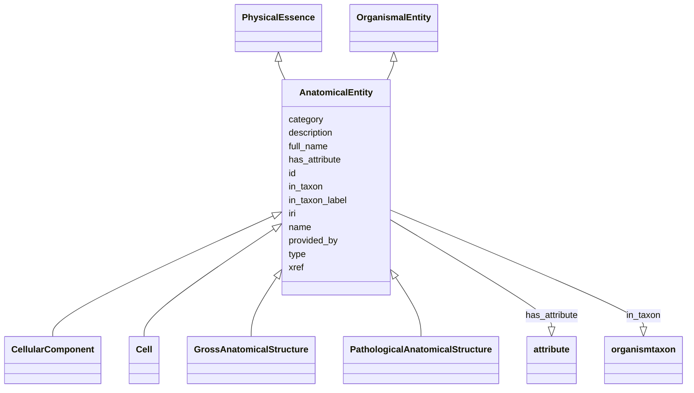

# Class: AnatomicalEntity


_A subcellular location, cell type or gross anatomical part_


URI: [bican:AnatomicalEntity](https://identifiers.org/brain-bican/vocab/AnatomicalEntity)





## Inheritance
* [Entity](Entity.md)
    * [NamedThing](NamedThing.md)
        * [BiologicalEntity](BiologicalEntity.md) [ [ThingWithTaxon](ThingWithTaxon.md)]
            * [OrganismalEntity](OrganismalEntity.md) [ [SubjectOfInvestigation](SubjectOfInvestigation.md)]
                * **AnatomicalEntity** [ [PhysicalEssence](PhysicalEssence.md)]
                    * [CellularComponent](CellularComponent.md)
                    * [Cell](Cell.md)
                    * [GrossAnatomicalStructure](GrossAnatomicalStructure.md)
                    * [PathologicalAnatomicalStructure](PathologicalAnatomicalStructure.md) [ [PathologicalEntityMixin](PathologicalEntityMixin.md)]


## Slots

| Name | Cardinality and Range | Description | Inheritance |
| ---  | --- | --- | --- |
| [in_taxon](in_taxon.md) | 0..* <br/> [OrganismTaxon](OrganismTaxon.md) | connects an entity to its taxonomic classification | [ThingWithTaxon](ThingWithTaxon.md) |
| [in_taxon_label](in_taxon_label.md) | 0..1 <br/> [LabelType](LabelType.md) | The human readable scientific name for the taxon of the entity | [ThingWithTaxon](ThingWithTaxon.md) |
| [provided_by](provided_by.md) | 0..* <br/> [String](String.md) | The value in this node property represents the knowledge provider that create... | [NamedThing](NamedThing.md) |
| [xref](xref.md) | 0..* <br/> [Uriorcurie](Uriorcurie.md) | A database cross reference or alternative identifier for a NamedThing or edge... | [NamedThing](NamedThing.md) |
| [full_name](full_name.md) | 0..1 <br/> [LabelType](LabelType.md) | a long-form human readable name for a thing | [NamedThing](NamedThing.md) |
| [id](id.md) | 1..1 <br/> [String](String.md) | A unique identifier for an entity | [Entity](Entity.md) |
| [iri](iri.md) | 0..1 <br/> [IriType](IriType.md) | An IRI for an entity | [Entity](Entity.md) |
| [category](category.md) | 1..* <br/> [CategoryType](CategoryType.md) | Name of the high level ontology class in which this entity is categorized | [Entity](Entity.md) |
| [type](type.md) | 0..* <br/> [String](String.md) |  | [Entity](Entity.md) |
| [name](name.md) | 0..1 <br/> [LabelType](LabelType.md) | A human-readable name for an attribute or entity | [Entity](Entity.md) |
| [description](description.md) | 0..1 <br/> [NarrativeText](NarrativeText.md) | a human-readable description of an entity | [Entity](Entity.md) |
| [has_attribute](has_attribute.md) | 0..* <br/> [Attribute](Attribute.md) | may often be an organism attribute | [Entity](Entity.md) |


## Usages

| used by | used in | type | used |
| ---  | --- | --- | --- |
| [GeneExpressionMixin](GeneExpressionMixin.md) | [expression_site](expression_site.md) | range | [AnatomicalEntity](AnatomicalEntity.md) |
| [GeneToGeneCoexpressionAssociation](GeneToGeneCoexpressionAssociation.md) | [expression_site](expression_site.md) | range | [AnatomicalEntity](AnatomicalEntity.md) |
| [ChemicalGeneInteractionAssociation](ChemicalGeneInteractionAssociation.md) | [subject_context_qualifier](subject_context_qualifier.md) | range | [AnatomicalEntity](AnatomicalEntity.md) |
| [ChemicalGeneInteractionAssociation](ChemicalGeneInteractionAssociation.md) | [object_context_qualifier](object_context_qualifier.md) | range | [AnatomicalEntity](AnatomicalEntity.md) |
| [ChemicalGeneInteractionAssociation](ChemicalGeneInteractionAssociation.md) | [anatomical_context_qualifier](anatomical_context_qualifier.md) | range | [AnatomicalEntity](AnatomicalEntity.md) |
| [ChemicalAffectsGeneAssociation](ChemicalAffectsGeneAssociation.md) | [subject_context_qualifier](subject_context_qualifier.md) | range | [AnatomicalEntity](AnatomicalEntity.md) |
| [ChemicalAffectsGeneAssociation](ChemicalAffectsGeneAssociation.md) | [object_context_qualifier](object_context_qualifier.md) | range | [AnatomicalEntity](AnatomicalEntity.md) |
| [ChemicalAffectsGeneAssociation](ChemicalAffectsGeneAssociation.md) | [anatomical_context_qualifier](anatomical_context_qualifier.md) | range | [AnatomicalEntity](AnatomicalEntity.md) |
| [DiseaseOrPhenotypicFeatureToLocationAssociation](DiseaseOrPhenotypicFeatureToLocationAssociation.md) | [object](object.md) | range | [AnatomicalEntity](AnatomicalEntity.md) |
| [VariantToGeneExpressionAssociation](VariantToGeneExpressionAssociation.md) | [expression_site](expression_site.md) | range | [AnatomicalEntity](AnatomicalEntity.md) |
| [GeneToExpressionSiteAssociation](GeneToExpressionSiteAssociation.md) | [object](object.md) | range | [AnatomicalEntity](AnatomicalEntity.md) |
| [AnatomicalEntityToAnatomicalEntityAssociation](AnatomicalEntityToAnatomicalEntityAssociation.md) | [subject](subject.md) | range | [AnatomicalEntity](AnatomicalEntity.md) |
| [AnatomicalEntityToAnatomicalEntityAssociation](AnatomicalEntityToAnatomicalEntityAssociation.md) | [object](object.md) | range | [AnatomicalEntity](AnatomicalEntity.md) |
| [AnatomicalEntityToAnatomicalEntityPartOfAssociation](AnatomicalEntityToAnatomicalEntityPartOfAssociation.md) | [subject](subject.md) | range | [AnatomicalEntity](AnatomicalEntity.md) |
| [AnatomicalEntityToAnatomicalEntityPartOfAssociation](AnatomicalEntityToAnatomicalEntityPartOfAssociation.md) | [object](object.md) | range | [AnatomicalEntity](AnatomicalEntity.md) |
| [AnatomicalEntityToAnatomicalEntityOntogenicAssociation](AnatomicalEntityToAnatomicalEntityOntogenicAssociation.md) | [subject](subject.md) | range | [AnatomicalEntity](AnatomicalEntity.md) |
| [AnatomicalEntityToAnatomicalEntityOntogenicAssociation](AnatomicalEntityToAnatomicalEntityOntogenicAssociation.md) | [object](object.md) | range | [AnatomicalEntity](AnatomicalEntity.md) |


## Identifier and Mapping Information


### Valid ID Prefixes

Instances of this class *should* have identifiers with one of the following prefixes:

* UBERON

* GO

* CL

* UMLS

* MESH

* NCIT

* EMAPA

* ZFA

* FBbt

* WBbt


### Schema Source


* from schema: https://identifiers.org/brain-bican/kb-model


## Mappings

| Mapping Type | Mapped Value |
| ---  | ---  |
| self | bican:AnatomicalEntity |
| native | bican:AnatomicalEntity |
| exact | UBERON:0001062, WIKIDATA:Q4936952, UMLSSG:ANAT, STY:T017, FMA:62955, CARO:0000000, SIO:001262, STY:T029, STY:T030 |
| narrow | ZFA:0100000, FBbt:10000000, EMAPA:0, MA:0000001, XAO:0000000, WBbt:0000100, NCIT:C12219, GO:0110165, STY:T031 |
| related | SNOMEDCT:123037004 |


## LinkML Source

<!-- TODO: investigate https://stackoverflow.com/questions/37606292/how-to-create-tabbed-code-blocks-in-mkdocs-or-sphinx -->

### Direct

<details>
```yaml
name: anatomical entity
id_prefixes:
- UBERON
- GO
- CL
- UMLS
- MESH
- NCIT
- EMAPA
- ZFA
- FBbt
- WBbt
description: A subcellular location, cell type or gross anatomical part
in_subset:
- model_organism_database
from_schema: https://identifiers.org/brain-bican/kb-model
exact_mappings:
- UBERON:0001062
- WIKIDATA:Q4936952
- UMLSSG:ANAT
- STY:T017
- FMA:62955
- CARO:0000000
- SIO:001262
- STY:T029
- STY:T030
related_mappings:
- SNOMEDCT:123037004
narrow_mappings:
- ZFA:0100000
- FBbt:10000000
- EMAPA:0
- MA:0000001
- XAO:0000000
- WBbt:0000100
- NCIT:C12219
- GO:0110165
- STY:T031
is_a: organismal entity
mixins:
- physical essence

```
</details>

### Induced

<details>
```yaml
name: anatomical entity
id_prefixes:
- UBERON
- GO
- CL
- UMLS
- MESH
- NCIT
- EMAPA
- ZFA
- FBbt
- WBbt
description: A subcellular location, cell type or gross anatomical part
in_subset:
- model_organism_database
from_schema: https://identifiers.org/brain-bican/kb-model
exact_mappings:
- UBERON:0001062
- WIKIDATA:Q4936952
- UMLSSG:ANAT
- STY:T017
- FMA:62955
- CARO:0000000
- SIO:001262
- STY:T029
- STY:T030
related_mappings:
- SNOMEDCT:123037004
narrow_mappings:
- ZFA:0100000
- FBbt:10000000
- EMAPA:0
- MA:0000001
- XAO:0000000
- WBbt:0000100
- NCIT:C12219
- GO:0110165
- STY:T031
is_a: organismal entity
mixins:
- physical essence
attributes:
  in taxon:
    name: in taxon
    annotations:
      canonical_predicate:
        tag: canonical_predicate
        value: 'True'
    description: connects an entity to its taxonomic classification. Only certain
      kinds of entities can be taxonomically classified; see 'thing with taxon'
    in_subset:
    - translator_minimal
    from_schema: https://identifiers.org/brain-bican/kb-model
    aliases:
    - instance of
    - is organism source of gene product
    - organism has gene
    - gene found in organism
    - gene product has organism source
    exact_mappings:
    - RO:0002162
    - WIKIDATA_PROPERTY:P703
    narrow_mappings:
    - RO:0002160
    rank: 1000
    is_a: related to at instance level
    domain: thing with taxon
    multivalued: true
    inherited: true
    alias: in_taxon
    owner: anatomical entity
    domain_of:
    - thing with taxon
    range: organism taxon
  in taxon label:
    name: in taxon label
    annotations:
      denormalized:
        tag: denormalized
        value: 'True'
    description: The human readable scientific name for the taxon of the entity.
    in_subset:
    - translator_minimal
    from_schema: https://identifiers.org/brain-bican/kb-model
    exact_mappings:
    - WIKIDATA_PROPERTY:P225
    rank: 1000
    is_a: node property
    domain: thing with taxon
    slot_uri: rdfs:label
    alias: in_taxon_label
    owner: anatomical entity
    domain_of:
    - thing with taxon
    range: label type
  provided by:
    name: provided by
    description: The value in this node property represents the knowledge provider
      that created or assembled the node and all of its attributes.  Used internally
      to represent how a particular node made its way into a knowledge provider or
      graph.
    from_schema: https://identifiers.org/brain-bican/kb-model
    rank: 1000
    is_a: node property
    domain: named thing
    multivalued: true
    alias: provided_by
    owner: anatomical entity
    domain_of:
    - named thing
    range: string
  xref:
    name: xref
    description: A database cross reference or alternative identifier for a NamedThing
      or edge between two  NamedThings.  This property should point to a database
      record or webpage that supports the existence of the edge, or  gives more detail
      about the edge. This property can be used on a node or edge to provide multiple
      URIs or CURIE cross references.
    in_subset:
    - translator_minimal
    from_schema: https://identifiers.org/brain-bican/kb-model
    aliases:
    - dbxref
    - Dbxref
    - DbXref
    - record_url
    - source_record_urls
    narrow_mappings:
    - gff3:Dbxref
    - gpi:DB_Xrefs
    rank: 1000
    domain: named thing
    multivalued: true
    alias: xref
    owner: anatomical entity
    domain_of:
    - named thing
    - publication
    - retrieval source
    - gene
    - gene product mixin
    range: uriorcurie
  full name:
    name: full name
    description: a long-form human readable name for a thing
    from_schema: https://identifiers.org/brain-bican/kb-model
    rank: 1000
    is_a: node property
    domain: named thing
    alias: full_name
    owner: anatomical entity
    domain_of:
    - named thing
    range: label type
  id:
    name: id
    description: A unique identifier for an entity. Must be either a CURIE shorthand
      for a URI or a complete URI
    in_subset:
    - translator_minimal
    from_schema: https://identifiers.org/brain-bican/kb-model
    exact_mappings:
    - AGRKB:primaryId
    - gff3:ID
    - gpi:DB_Object_ID
    rank: 1000
    domain: entity
    identifier: true
    alias: id
    owner: anatomical entity
    domain_of:
    - genome assembly
    - ontology class
    - entity
    range: string
    required: true
  iri:
    name: iri
    description: An IRI for an entity. This is determined by the id using expansion
      rules.
    in_subset:
    - translator_minimal
    - samples
    from_schema: https://identifiers.org/brain-bican/kb-model
    exact_mappings:
    - WIKIDATA_PROPERTY:P854
    rank: 1000
    alias: iri
    owner: anatomical entity
    domain_of:
    - attribute
    - entity
    range: iri type
  category:
    name: category
    description: "Name of the high level ontology class in which this entity is categorized.\
      \ Corresponds to the label for the biolink entity type class.\n * In a neo4j\
      \ database this MAY correspond to the neo4j label tag.\n * In an RDF database\
      \ it should be a biolink model class URI.\nThis field is multi-valued. It should\
      \ include values for ancestors of the biolink class; for example, a protein\
      \ such as Shh would have category values `biolink:Protein`, `biolink:GeneProduct`,\
      \ `biolink:MolecularEntity`, ...\nIn an RDF database, nodes will typically have\
      \ an rdf:type triples. This can be to the most specific biolink class, or potentially\
      \ to a class more specific than something in biolink. For example, a sequence\
      \ feature `f` may have a rdf:type assertion to a SO class such as TF_binding_site,\
      \ which is more specific than anything in biolink. Here we would have categories\
      \ {biolink:GenomicEntity, biolink:MolecularEntity, biolink:NamedThing}"
    from_schema: https://identifiers.org/brain-bican/kb-model
    rank: 1000
    is_a: type
    domain: entity
    multivalued: true
    designates_type: true
    alias: category
    owner: anatomical entity
    domain_of:
    - entity
    is_class_field: true
    range: category type
    required: true
    pattern: ^biolink:[A-Z][A-Za-z]+$
  type:
    name: type
    from_schema: https://identifiers.org/brain-bican/kb-model
    exact_mappings:
    - AGRKB:soTermId
    - gff3:type
    - gpi:DB_Object_Type
    rank: 1000
    domain: entity
    slot_uri: rdf:type
    multivalued: true
    alias: type
    owner: anatomical entity
    domain_of:
    - entity
    range: string
  name:
    name: name
    description: A human-readable name for an attribute or entity.
    in_subset:
    - translator_minimal
    - samples
    from_schema: https://identifiers.org/brain-bican/kb-model
    aliases:
    - label
    - display name
    - title
    exact_mappings:
    - gff3:Name
    - gpi:DB_Object_Name
    narrow_mappings:
    - dct:title
    - WIKIDATA_PROPERTY:P1476
    rank: 1000
    domain: entity
    slot_uri: rdfs:label
    alias: name
    owner: anatomical entity
    domain_of:
    - attribute
    - entity
    - macromolecular machine mixin
    range: label type
  description:
    name: description
    description: a human-readable description of an entity
    in_subset:
    - translator_minimal
    from_schema: https://identifiers.org/brain-bican/kb-model
    aliases:
    - definition
    exact_mappings:
    - IAO:0000115
    - skos:definitions
    narrow_mappings:
    - gff3:Description
    rank: 1000
    slot_uri: dct:description
    alias: description
    owner: anatomical entity
    domain_of:
    - genome assembly
    - entity
    range: narrative text
  has attribute:
    name: has attribute
    description: may often be an organism attribute
    from_schema: https://identifiers.org/brain-bican/kb-model
    rank: 1000
    domain: entity
    multivalued: true
    alias: has_attribute
    owner: anatomical entity
    domain_of:
    - entity
    range: attribute

```
</details>