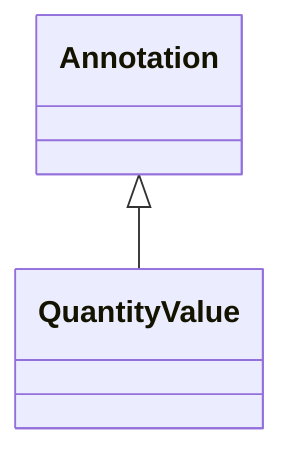

# Class: Annotation


_Biolink Model root class for entity annotations._


* __NOTE__: this is an abstract class and should not be instantiated directly


URI: [bican:Annotation](https://identifiers.org/brain-bican/vocab/Annotation)





## Inheritance
* **Annotation**
    * [QuantityValue](QuantityValue.md)


## Slots

| Name | Cardinality and Range | Description | Inheritance |
| ---  | --- | --- | --- |


## Identifier and Mapping Information


### Schema Source


* from schema: https://identifiers.org/brain-bican/kb-model


## Mappings

| Mapping Type | Mapped Value |
| ---  | ---  |
| self | bican:Annotation |
| native | bican:Annotation |


## LinkML Source

<!-- TODO: investigate https://stackoverflow.com/questions/37606292/how-to-create-tabbed-code-blocks-in-mkdocs-or-sphinx -->

### Direct

<details>
```yaml
name: annotation
description: Biolink Model root class for entity annotations.
from_schema: https://identifiers.org/brain-bican/kb-model
abstract: true

```
</details>

### Induced

<details>
```yaml
name: annotation
description: Biolink Model root class for entity annotations.
from_schema: https://identifiers.org/brain-bican/kb-model
abstract: true

```
</details>