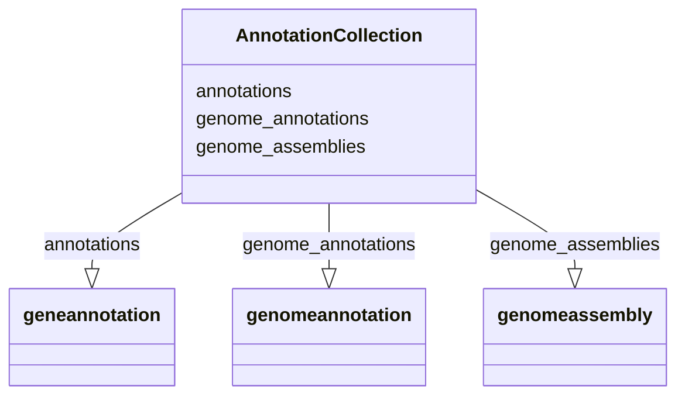

# Class: AnnotationCollection


URI: [bican:AnnotationCollection](https://identifiers.org/brain-bican/vocab/AnnotationCollection)





<!-- no inheritance hierarchy -->


## Slots

| Name | Cardinality and Range | Description | Inheritance |
| ---  | --- | --- | --- |
| [annotations](annotations.md) | 0..* <br/> [GeneAnnotation](GeneAnnotation.md) |  | direct |
| [genome_annotations](genome_annotations.md) | 0..* <br/> [GenomeAnnotation](GenomeAnnotation.md) |  | direct |
| [genome_assemblies](genome_assemblies.md) | 0..* <br/> [GenomeAssembly](GenomeAssembly.md) |  | direct |


## Identifier and Mapping Information


### Schema Source


* from schema: https://identifiers.org/brain-bican/kb-model


## Mappings

| Mapping Type | Mapped Value |
| ---  | ---  |
| self | bican:AnnotationCollection |
| native | bican:AnnotationCollection |


## LinkML Source

<!-- TODO: investigate https://stackoverflow.com/questions/37606292/how-to-create-tabbed-code-blocks-in-mkdocs-or-sphinx -->

### Direct

<details>
```yaml
name: annotation collection
from_schema: https://identifiers.org/brain-bican/kb-model
attributes:
  annotations:
    name: annotations
    from_schema: https://identifiers.org/brain-bican/kb-model
    rank: 1000
    multivalued: true
    range: gene annotation
    inlined: true
    inlined_as_list: true
  genome_annotations:
    name: genome_annotations
    from_schema: https://identifiers.org/brain-bican/kb-model
    rank: 1000
    multivalued: true
    range: genome annotation
    inlined: true
    inlined_as_list: true
  genome_assemblies:
    name: genome_assemblies
    from_schema: https://identifiers.org/brain-bican/kb-model
    rank: 1000
    multivalued: true
    range: genome assembly
    inlined: true
    inlined_as_list: true
tree_root: true

```
</details>

### Induced

<details>
```yaml
name: annotation collection
from_schema: https://identifiers.org/brain-bican/kb-model
attributes:
  annotations:
    name: annotations
    from_schema: https://identifiers.org/brain-bican/kb-model
    rank: 1000
    multivalued: true
    alias: annotations
    owner: annotation collection
    domain_of:
    - annotation collection
    range: gene annotation
    inlined: true
    inlined_as_list: true
  genome_annotations:
    name: genome_annotations
    from_schema: https://identifiers.org/brain-bican/kb-model
    rank: 1000
    multivalued: true
    alias: genome_annotations
    owner: annotation collection
    domain_of:
    - annotation collection
    range: genome annotation
    inlined: true
    inlined_as_list: true
  genome_assemblies:
    name: genome_assemblies
    from_schema: https://identifiers.org/brain-bican/kb-model
    rank: 1000
    multivalued: true
    alias: genome_assemblies
    owner: annotation collection
    domain_of:
    - annotation collection
    range: genome assembly
    inlined: true
    inlined_as_list: true
tree_root: true

```
</details>