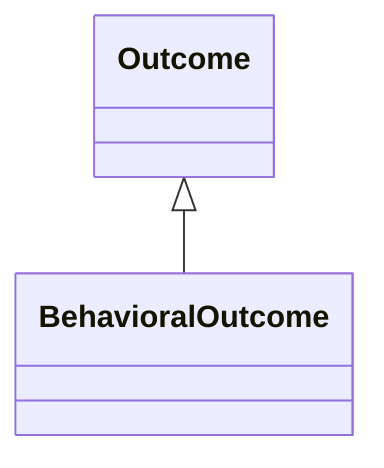

# Class: BehavioralOutcome


_An outcome resulting from an exposure event which is the manifestation of human behavior._


URI: [bican:BehavioralOutcome](https://identifiers.org/brain-bican/vocab/BehavioralOutcome)





## Inheritance
* **BehavioralOutcome** [ [Outcome](Outcome.md)]


## Slots

| Name | Cardinality and Range | Description | Inheritance |
| ---  | --- | --- | --- |


## Identifier and Mapping Information


### Schema Source


* from schema: https://identifiers.org/brain-bican/kb-model


## Mappings

| Mapping Type | Mapped Value |
| ---  | ---  |
| self | bican:BehavioralOutcome |
| native | bican:BehavioralOutcome |


## LinkML Source

<!-- TODO: investigate https://stackoverflow.com/questions/37606292/how-to-create-tabbed-code-blocks-in-mkdocs-or-sphinx -->

### Direct

<details>
```yaml
name: behavioral outcome
description: An outcome resulting from an exposure event which is the manifestation
  of human behavior.
from_schema: https://identifiers.org/brain-bican/kb-model
mixins:
- outcome

```
</details>

### Induced

<details>
```yaml
name: behavioral outcome
description: An outcome resulting from an exposure event which is the manifestation
  of human behavior.
from_schema: https://identifiers.org/brain-bican/kb-model
mixins:
- outcome

```
</details>