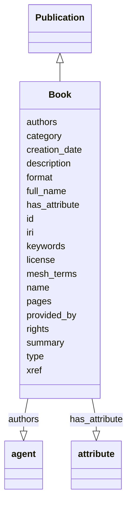

# Class: Book


_This class may rarely be instantiated except if use cases of a given knowledge graph support its utility._


URI: [bican:Book](https://identifiers.org/brain-bican/vocab/Book)





## Inheritance
* [Entity](Entity.md)
    * [NamedThing](NamedThing.md)
        * [InformationContentEntity](InformationContentEntity.md)
            * [Publication](Publication.md)
                * **Book**


## Slots

| Name | Cardinality and Range | Description | Inheritance |
| ---  | --- | --- | --- |
| [authors](authors.md) | 0..* <br/> [Agent](Agent.md) | connects an publication to the list of authors who contributed to the publica... | [Publication](Publication.md) |
| [pages](pages.md) | 0..* <br/> [String](String.md) | When a 2-tuple of page numbers are provided, they represent the start and end... | [Publication](Publication.md) |
| [summary](summary.md) | 0..1 <br/> [String](String.md) | executive  summary of a publication | [Publication](Publication.md) |
| [keywords](keywords.md) | 0..* <br/> [String](String.md) | keywords tagging a publication | [Publication](Publication.md) |
| [mesh_terms](mesh_terms.md) | 0..* <br/> [Uriorcurie](Uriorcurie.md) | mesh terms tagging a publication | [Publication](Publication.md) |
| [xref](xref.md) | 0..* <br/> [Uriorcurie](Uriorcurie.md) | A database cross reference or alternative identifier for a NamedThing or edge... | [Publication](Publication.md), [NamedThing](NamedThing.md) |
| [license](license.md) | 0..1 <br/> [String](String.md) |  | [InformationContentEntity](InformationContentEntity.md) |
| [rights](rights.md) | 0..1 <br/> [String](String.md) |  | [InformationContentEntity](InformationContentEntity.md) |
| [format](format.md) | 0..1 <br/> [String](String.md) |  | [InformationContentEntity](InformationContentEntity.md) |
| [creation_date](creation_date.md) | 0..1 <br/> [Date](Date.md) | date on which an entity was created | [InformationContentEntity](InformationContentEntity.md) |
| [provided_by](provided_by.md) | 0..* <br/> [String](String.md) | The value in this node property represents the knowledge provider that create... | [NamedThing](NamedThing.md) |
| [full_name](full_name.md) | 0..1 <br/> [LabelType](LabelType.md) | a long-form human readable name for a thing | [NamedThing](NamedThing.md) |
| [id](id.md) | 1..1 <br/> [String](String.md) | Books should have industry-standard identifier such as from ISBN | [Entity](Entity.md) |
| [iri](iri.md) | 0..1 <br/> [IriType](IriType.md) | An IRI for an entity | [Entity](Entity.md) |
| [category](category.md) | 1..* <br/> [CategoryType](CategoryType.md) | Name of the high level ontology class in which this entity is categorized | [Entity](Entity.md) |
| [type](type.md) | 0..* <br/> [String](String.md) | Should generally be set to an ontology class defined term for 'book' | [Entity](Entity.md) |
| [name](name.md) | 0..1 <br/> [LabelType](LabelType.md) | the 'title' of the publication is generally recorded in the 'name' property (... | [Entity](Entity.md) |
| [description](description.md) | 0..1 <br/> [NarrativeText](NarrativeText.md) | a human-readable description of an entity | [Entity](Entity.md) |
| [has_attribute](has_attribute.md) | 0..* <br/> [Attribute](Attribute.md) | connects any entity to an attribute | [Entity](Entity.md) |


## Identifier and Mapping Information


### Valid ID Prefixes

Instances of this class *should* have identifiers with one of the following prefixes:

* isbn

* NLMID


### Schema Source


* from schema: https://identifiers.org/brain-bican/kb-model


## Mappings

| Mapping Type | Mapped Value |
| ---  | ---  |
| self | bican:Book |
| native | bican:Book |


## LinkML Source

<!-- TODO: investigate https://stackoverflow.com/questions/37606292/how-to-create-tabbed-code-blocks-in-mkdocs-or-sphinx -->

### Direct

<details>
```yaml
name: book
id_prefixes:
- isbn
- NLMID
description: This class may rarely be instantiated except if use cases of a given
  knowledge graph support its utility.
in_subset:
- model_organism_database
from_schema: https://identifiers.org/brain-bican/kb-model
is_a: publication
slot_usage:
  id:
    name: id
    description: Books should have industry-standard identifier such as from ISBN.
    domain_of:
    - genome assembly
    - ontology class
    - entity
    required: true
  type:
    name: type
    description: Should generally be set to an ontology class defined term for 'book'.
    domain_of:
    - entity

```
</details>

### Induced

<details>
```yaml
name: book
id_prefixes:
- isbn
- NLMID
description: This class may rarely be instantiated except if use cases of a given
  knowledge graph support its utility.
in_subset:
- model_organism_database
from_schema: https://identifiers.org/brain-bican/kb-model
is_a: publication
slot_usage:
  id:
    name: id
    description: Books should have industry-standard identifier such as from ISBN.
    domain_of:
    - genome assembly
    - ontology class
    - entity
    required: true
  type:
    name: type
    description: Should generally be set to an ontology class defined term for 'book'.
    domain_of:
    - entity
attributes:
  authors:
    name: authors
    description: connects an publication to the list of authors who contributed to
      the publication. This property should be a comma-delimited list of author names.
      It is recommended that an author's name be formatted as "surname, firstname
      initial.".   Note that this property is a node annotation expressing the citation
      list of authorship which might typically otherwise be more completely documented
      in biolink:PublicationToProviderAssociation defined edges which point to full
      details about an author and possibly, some qualifiers which clarify the specific
      status of a given author in the publication.
    from_schema: https://identifiers.org/brain-bican/kb-model
    rank: 1000
    is_a: node property
    domain: publication
    multivalued: true
    alias: authors
    owner: book
    domain_of:
    - publication
    range: agent
  pages:
    name: pages
    description: When a 2-tuple of page numbers are provided, they represent the start
      and end page of the publication within its parent publication context. For books,
      this may be set to the total number of pages of the book.
    from_schema: https://identifiers.org/brain-bican/kb-model
    rank: 1000
    is_a: node property
    domain: publication
    multivalued: true
    alias: pages
    owner: book
    domain_of:
    - publication
    range: string
  summary:
    name: summary
    description: executive  summary of a publication
    from_schema: https://identifiers.org/brain-bican/kb-model
    aliases:
    - abstract
    exact_mappings:
    - dct:abstract
    - WIKIDATA:Q333291
    rank: 1000
    is_a: node property
    domain: publication
    alias: summary
    owner: book
    domain_of:
    - publication
    range: string
  keywords:
    name: keywords
    description: keywords tagging a publication
    from_schema: https://identifiers.org/brain-bican/kb-model
    rank: 1000
    is_a: node property
    domain: publication
    multivalued: true
    alias: keywords
    owner: book
    domain_of:
    - publication
    range: string
  mesh terms:
    name: mesh terms
    description: mesh terms tagging a publication
    from_schema: https://identifiers.org/brain-bican/kb-model
    exact_mappings:
    - dcid:MeSHTerm
    rank: 1000
    is_a: node property
    values_from:
    - MESH
    domain: publication
    multivalued: true
    alias: mesh_terms
    owner: book
    domain_of:
    - publication
    range: uriorcurie
  xref:
    name: xref
    description: A database cross reference or alternative identifier for a NamedThing
      or edge between two  NamedThings.  This property should point to a database
      record or webpage that supports the existence of the edge, or  gives more detail
      about the edge. This property can be used on a node or edge to provide multiple
      URIs or CURIE cross references.
    in_subset:
    - translator_minimal
    from_schema: https://identifiers.org/brain-bican/kb-model
    aliases:
    - dbxref
    - Dbxref
    - DbXref
    - record_url
    - source_record_urls
    narrow_mappings:
    - gff3:Dbxref
    - gpi:DB_Xrefs
    rank: 1000
    domain: named thing
    multivalued: true
    alias: xref
    owner: book
    domain_of:
    - named thing
    - publication
    - retrieval source
    - gene
    - gene product mixin
    range: uriorcurie
  license:
    name: license
    from_schema: https://identifiers.org/brain-bican/kb-model
    exact_mappings:
    - dct:license
    narrow_mappings:
    - WIKIDATA_PROPERTY:P275
    rank: 1000
    is_a: node property
    domain: information content entity
    alias: license
    owner: book
    domain_of:
    - information content entity
    range: string
  rights:
    name: rights
    from_schema: https://identifiers.org/brain-bican/kb-model
    exact_mappings:
    - dct:rights
    rank: 1000
    is_a: node property
    domain: information content entity
    alias: rights
    owner: book
    domain_of:
    - information content entity
    range: string
  format:
    name: format
    from_schema: https://identifiers.org/brain-bican/kb-model
    exact_mappings:
    - dct:format
    - WIKIDATA_PROPERTY:P2701
    rank: 1000
    is_a: node property
    domain: information content entity
    alias: format
    owner: book
    domain_of:
    - information content entity
    range: string
  creation date:
    name: creation date
    description: date on which an entity was created. This can be applied to nodes
      or edges
    from_schema: https://identifiers.org/brain-bican/kb-model
    aliases:
    - publication date
    exact_mappings:
    - dct:createdOn
    - WIKIDATA_PROPERTY:P577
    rank: 1000
    is_a: node property
    domain: named thing
    alias: creation_date
    owner: book
    domain_of:
    - information content entity
    range: date
  provided by:
    name: provided by
    description: The value in this node property represents the knowledge provider
      that created or assembled the node and all of its attributes.  Used internally
      to represent how a particular node made its way into a knowledge provider or
      graph.
    from_schema: https://identifiers.org/brain-bican/kb-model
    rank: 1000
    is_a: node property
    domain: named thing
    multivalued: true
    alias: provided_by
    owner: book
    domain_of:
    - named thing
    range: string
  full name:
    name: full name
    description: a long-form human readable name for a thing
    from_schema: https://identifiers.org/brain-bican/kb-model
    rank: 1000
    is_a: node property
    domain: named thing
    alias: full_name
    owner: book
    domain_of:
    - named thing
    range: label type
  id:
    name: id
    description: Books should have industry-standard identifier such as from ISBN.
    from_schema: https://identifiers.org/brain-bican/kb-model
    rank: 1000
    domain: entity
    identifier: true
    alias: id
    owner: book
    domain_of:
    - genome assembly
    - ontology class
    - entity
    range: string
    required: true
  iri:
    name: iri
    description: An IRI for an entity. This is determined by the id using expansion
      rules.
    in_subset:
    - translator_minimal
    - samples
    from_schema: https://identifiers.org/brain-bican/kb-model
    exact_mappings:
    - WIKIDATA_PROPERTY:P854
    rank: 1000
    alias: iri
    owner: book
    domain_of:
    - attribute
    - entity
    range: iri type
  category:
    name: category
    description: "Name of the high level ontology class in which this entity is categorized.\
      \ Corresponds to the label for the biolink entity type class.\n * In a neo4j\
      \ database this MAY correspond to the neo4j label tag.\n * In an RDF database\
      \ it should be a biolink model class URI.\nThis field is multi-valued. It should\
      \ include values for ancestors of the biolink class; for example, a protein\
      \ such as Shh would have category values `biolink:Protein`, `biolink:GeneProduct`,\
      \ `biolink:MolecularEntity`, ...\nIn an RDF database, nodes will typically have\
      \ an rdf:type triples. This can be to the most specific biolink class, or potentially\
      \ to a class more specific than something in biolink. For example, a sequence\
      \ feature `f` may have a rdf:type assertion to a SO class such as TF_binding_site,\
      \ which is more specific than anything in biolink. Here we would have categories\
      \ {biolink:GenomicEntity, biolink:MolecularEntity, biolink:NamedThing}"
    from_schema: https://identifiers.org/brain-bican/kb-model
    rank: 1000
    is_a: type
    domain: entity
    multivalued: true
    designates_type: true
    alias: category
    owner: book
    domain_of:
    - entity
    is_class_field: true
    range: category type
    required: true
    pattern: ^biolink:[A-Z][A-Za-z]+$
  type:
    name: type
    description: Should generally be set to an ontology class defined term for 'book'.
    from_schema: https://identifiers.org/brain-bican/kb-model
    rank: 1000
    domain: entity
    slot_uri: rdf:type
    multivalued: true
    alias: type
    owner: book
    domain_of:
    - entity
    range: string
  name:
    name: name
    description: the 'title' of the publication is generally recorded in the 'name'
      property (inherited from NamedThing). The field name 'title' is now also tagged
      as an acceptable alias for the node property 'name' (just in case).
    from_schema: https://identifiers.org/brain-bican/kb-model
    rank: 1000
    domain: entity
    slot_uri: rdfs:label
    alias: name
    owner: book
    domain_of:
    - attribute
    - entity
    - macromolecular machine mixin
    range: label type
  description:
    name: description
    description: a human-readable description of an entity
    in_subset:
    - translator_minimal
    from_schema: https://identifiers.org/brain-bican/kb-model
    aliases:
    - definition
    exact_mappings:
    - IAO:0000115
    - skos:definitions
    narrow_mappings:
    - gff3:Description
    rank: 1000
    slot_uri: dct:description
    alias: description
    owner: book
    domain_of:
    - genome assembly
    - entity
    range: narrative text
  has attribute:
    name: has attribute
    description: connects any entity to an attribute
    in_subset:
    - samples
    from_schema: https://identifiers.org/brain-bican/kb-model
    exact_mappings:
    - SIO:000008
    close_mappings:
    - OBI:0001927
    narrow_mappings:
    - OBAN:association_has_subject_property
    - OBAN:association_has_object_property
    - CPT:has_possibly_included_panel_element
    - DRUGBANK:category
    - EFO:is_executed_in
    - HANCESTRO:0301
    - LOINC:has_action_guidance
    - LOINC:has_adjustment
    - LOINC:has_aggregation_view
    - LOINC:has_approach_guidance
    - LOINC:has_divisor
    - LOINC:has_exam
    - LOINC:has_method
    - LOINC:has_modality_subtype
    - LOINC:has_object_guidance
    - LOINC:has_scale
    - LOINC:has_suffix
    - LOINC:has_time_aspect
    - LOINC:has_time_modifier
    - LOINC:has_timing_of
    - NCIT:R88
    - NCIT:eo_disease_has_property_or_attribute
    - NCIT:has_data_element
    - NCIT:has_pharmaceutical_administration_method
    - NCIT:has_pharmaceutical_basic_dose_form
    - NCIT:has_pharmaceutical_intended_site
    - NCIT:has_pharmaceutical_release_characteristics
    - NCIT:has_pharmaceutical_state_of_matter
    - NCIT:has_pharmaceutical_transformation
    - NCIT:is_qualified_by
    - NCIT:qualifier_applies_to
    - NCIT:role_has_domain
    - NCIT:role_has_range
    - INO:0000154
    - HANCESTRO:0308
    - OMIM:has_inheritance_type
    - orphanet:C016
    - orphanet:C017
    - RO:0000053
    - RO:0000086
    - RO:0000087
    - SNOMED:has_access
    - SNOMED:has_clinical_course
    - SNOMED:has_count_of_base_of_active_ingredient
    - SNOMED:has_dose_form_administration_method
    - SNOMED:has_dose_form_release_characteristic
    - SNOMED:has_dose_form_transformation
    - SNOMED:has_finding_context
    - SNOMED:has_finding_informer
    - SNOMED:has_inherent_attribute
    - SNOMED:has_intent
    - SNOMED:has_interpretation
    - SNOMED:has_laterality
    - SNOMED:has_measurement_method
    - SNOMED:has_method
    - SNOMED:has_priority
    - SNOMED:has_procedure_context
    - SNOMED:has_process_duration
    - SNOMED:has_property
    - SNOMED:has_revision_status
    - SNOMED:has_scale_type
    - SNOMED:has_severity
    - SNOMED:has_specimen
    - SNOMED:has_state_of_matter
    - SNOMED:has_subject_relationship_context
    - SNOMED:has_surgical_approach
    - SNOMED:has_technique
    - SNOMED:has_temporal_context
    - SNOMED:has_time_aspect
    - SNOMED:has_units
    - UMLS:has_structural_class
    - UMLS:has_supported_concept_property
    - UMLS:has_supported_concept_relationship
    - UMLS:may_be_qualified_by
    rank: 1000
    domain: entity
    multivalued: true
    alias: has_attribute
    owner: book
    domain_of:
    - entity
    range: attribute

```
</details>