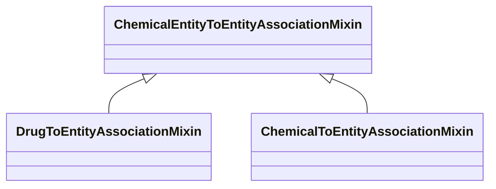

# Class: ChemicalEntityToEntityAssociationMixin


_An interaction between a chemical entity and another entity_


URI: [bican:ChemicalEntityToEntityAssociationMixin](https://identifiers.org/brain-bican/vocab/ChemicalEntityToEntityAssociationMixin)





## Inheritance
* **ChemicalEntityToEntityAssociationMixin**
    * [DrugToEntityAssociationMixin](DrugToEntityAssociationMixin.md)
    * [ChemicalToEntityAssociationMixin](ChemicalToEntityAssociationMixin.md)


## Slots

| Name | Cardinality and Range | Description | Inheritance |
| ---  | --- | --- | --- |


## Mixin Usage

| mixed into | description |
| --- | --- |


## Identifier and Mapping Information


### Schema Source


* from schema: https://identifiers.org/brain-bican/kb-model


## Mappings

| Mapping Type | Mapped Value |
| ---  | ---  |
| self | bican:ChemicalEntityToEntityAssociationMixin |
| native | bican:ChemicalEntityToEntityAssociationMixin |


## LinkML Source

<!-- TODO: investigate https://stackoverflow.com/questions/37606292/how-to-create-tabbed-code-blocks-in-mkdocs-or-sphinx -->

### Direct

<details>
```yaml
name: chemical entity to entity association mixin
description: An interaction between a chemical entity and another entity
from_schema: https://identifiers.org/brain-bican/kb-model
mixin: true
slot_usage:
  subject:
    name: subject
    description: the chemical entity that is an interactor
    range: chemical entity or gene or gene product
defining_slots:
- subject

```
</details>

### Induced

<details>
```yaml
name: chemical entity to entity association mixin
description: An interaction between a chemical entity and another entity
from_schema: https://identifiers.org/brain-bican/kb-model
mixin: true
slot_usage:
  subject:
    name: subject
    description: the chemical entity that is an interactor
    range: chemical entity or gene or gene product
defining_slots:
- subject

```
</details>