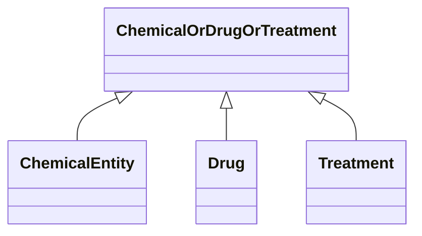

# Class: ChemicalOrDrugOrTreatment


URI: [bican:ChemicalOrDrugOrTreatment](https://identifiers.org/brain-bican/vocab/ChemicalOrDrugOrTreatment)





<!-- no inheritance hierarchy -->


## Slots

| Name | Cardinality and Range | Description | Inheritance |
| ---  | --- | --- | --- |


## Mixin Usage

| mixed into | description |
| --- | --- |
| [ChemicalEntity](ChemicalEntity.md) | A chemical entity is a physical entity that pertains to chemistry or biochemi... |
| [Drug](Drug.md) | A substance intended for use in the diagnosis, cure, mitigation, treatment, o... |
| [Treatment](Treatment.md) | A treatment is targeted at a disease or phenotype and may involve multiple dr... |


## Identifier and Mapping Information


### Schema Source


* from schema: https://identifiers.org/brain-bican/kb-model


## Mappings

| Mapping Type | Mapped Value |
| ---  | ---  |
| self | bican:ChemicalOrDrugOrTreatment |
| native | bican:ChemicalOrDrugOrTreatment |


## LinkML Source

<!-- TODO: investigate https://stackoverflow.com/questions/37606292/how-to-create-tabbed-code-blocks-in-mkdocs-or-sphinx -->

### Direct

<details>
```yaml
name: chemical or drug or treatment
from_schema: https://identifiers.org/brain-bican/kb-model
mixin: true

```
</details>

### Induced

<details>
```yaml
name: chemical or drug or treatment
from_schema: https://identifiers.org/brain-bican/kb-model
mixin: true

```
</details>