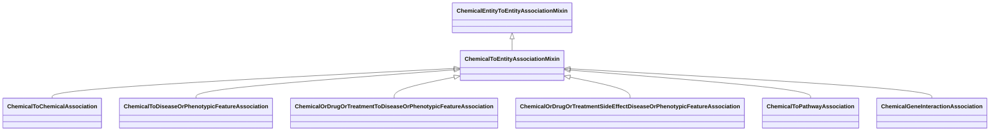

# Class: ChemicalToEntityAssociationMixin


_An interaction between a chemical entity and another entity_


URI: [bican:ChemicalToEntityAssociationMixin](https://identifiers.org/brain-bican/vocab/ChemicalToEntityAssociationMixin)





## Inheritance
* [ChemicalEntityToEntityAssociationMixin](ChemicalEntityToEntityAssociationMixin.md)
    * **ChemicalToEntityAssociationMixin**


## Slots

| Name | Cardinality and Range | Description | Inheritance |
| ---  | --- | --- | --- |


## Mixin Usage

| mixed into | description |
| --- | --- |
| [ChemicalToChemicalAssociation](ChemicalToChemicalAssociation.md) | A relationship between two chemical entities |
| [ChemicalToDiseaseOrPhenotypicFeatureAssociation](ChemicalToDiseaseOrPhenotypicFeatureAssociation.md) | An interaction between a chemical entity and a phenotype or disease, where th... |
| [ChemicalOrDrugOrTreatmentToDiseaseOrPhenotypicFeatureAssociation](ChemicalOrDrugOrTreatmentToDiseaseOrPhenotypicFeatureAssociation.md) | This association defines a relationship between a chemical or treatment (or p... |
| [ChemicalOrDrugOrTreatmentSideEffectDiseaseOrPhenotypicFeatureAssociation](ChemicalOrDrugOrTreatmentSideEffectDiseaseOrPhenotypicFeatureAssociation.md) | This association defines a relationship between a chemical or treatment (or p... |
| [ChemicalToPathwayAssociation](ChemicalToPathwayAssociation.md) | An interaction between a chemical entity and a biological process or pathway |
| [ChemicalGeneInteractionAssociation](ChemicalGeneInteractionAssociation.md) | describes a physical interaction between a chemical entity and a gene or gene... |


## Identifier and Mapping Information


### Schema Source


* from schema: https://identifiers.org/brain-bican/kb-model


## Mappings

| Mapping Type | Mapped Value |
| ---  | ---  |
| self | bican:ChemicalToEntityAssociationMixin |
| native | bican:ChemicalToEntityAssociationMixin |


## LinkML Source

<!-- TODO: investigate https://stackoverflow.com/questions/37606292/how-to-create-tabbed-code-blocks-in-mkdocs-or-sphinx -->

### Direct

<details>
```yaml
name: chemical to entity association mixin
description: An interaction between a chemical entity and another entity
from_schema: https://identifiers.org/brain-bican/kb-model
is_a: chemical entity to entity association mixin
mixin: true
slot_usage:
  subject:
    name: subject
    description: the chemical entity or entity that is an interactor
    domain_of:
    - association
    range: chemical entity or gene or gene product
defining_slots:
- subject

```
</details>

### Induced

<details>
```yaml
name: chemical to entity association mixin
description: An interaction between a chemical entity and another entity
from_schema: https://identifiers.org/brain-bican/kb-model
is_a: chemical entity to entity association mixin
mixin: true
slot_usage:
  subject:
    name: subject
    description: the chemical entity or entity that is an interactor
    domain_of:
    - association
    range: chemical entity or gene or gene product
defining_slots:
- subject

```
</details>