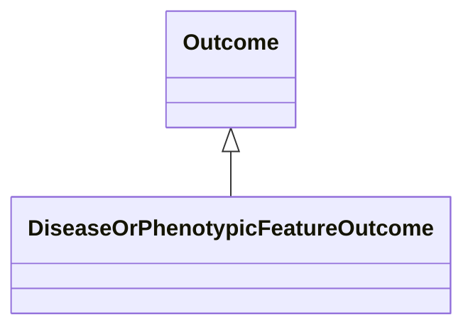

# Class: DiseaseOrPhenotypicFeatureOutcome


_Physiological outcomes resulting from an exposure event which is the manifestation of a disease or other characteristic phenotype._


URI: [bican:DiseaseOrPhenotypicFeatureOutcome](https://identifiers.org/brain-bican/vocab/DiseaseOrPhenotypicFeatureOutcome)





## Inheritance
* **DiseaseOrPhenotypicFeatureOutcome** [ [Outcome](Outcome.md)]


## Slots

| Name | Cardinality and Range | Description | Inheritance |
| ---  | --- | --- | --- |


## Identifier and Mapping Information


### Schema Source


* from schema: https://identifiers.org/brain-bican/kb-model


## Mappings

| Mapping Type | Mapped Value |
| ---  | ---  |
| self | bican:DiseaseOrPhenotypicFeatureOutcome |
| native | bican:DiseaseOrPhenotypicFeatureOutcome |


## LinkML Source

<!-- TODO: investigate https://stackoverflow.com/questions/37606292/how-to-create-tabbed-code-blocks-in-mkdocs-or-sphinx -->

### Direct

<details>
```yaml
name: disease or phenotypic feature outcome
description: Physiological outcomes resulting from an exposure event which is the
  manifestation of a disease or other characteristic phenotype.
from_schema: https://identifiers.org/brain-bican/kb-model
mixins:
- outcome

```
</details>

### Induced

<details>
```yaml
name: disease or phenotypic feature outcome
description: Physiological outcomes resulting from an exposure event which is the
  manifestation of a disease or other characteristic phenotype.
from_schema: https://identifiers.org/brain-bican/kb-model
mixins:
- outcome

```
</details>