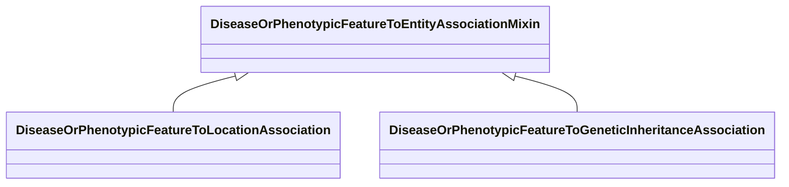

# Class: DiseaseOrPhenotypicFeatureToEntityAssociationMixin


URI: [bican:DiseaseOrPhenotypicFeatureToEntityAssociationMixin](https://identifiers.org/brain-bican/vocab/DiseaseOrPhenotypicFeatureToEntityAssociationMixin)





<!-- no inheritance hierarchy -->


## Slots

| Name | Cardinality and Range | Description | Inheritance |
| ---  | --- | --- | --- |


## Mixin Usage

| mixed into | description |
| --- | --- |
| [DiseaseOrPhenotypicFeatureToLocationAssociation](DiseaseOrPhenotypicFeatureToLocationAssociation.md) | An association between either a disease or a phenotypic feature and an anatom... |
| [DiseaseOrPhenotypicFeatureToGeneticInheritanceAssociation](DiseaseOrPhenotypicFeatureToGeneticInheritanceAssociation.md) | An association between either a disease or a phenotypic feature and its mode ... |


## Identifier and Mapping Information


### Schema Source


* from schema: https://identifiers.org/brain-bican/kb-model


## Mappings

| Mapping Type | Mapped Value |
| ---  | ---  |
| self | bican:DiseaseOrPhenotypicFeatureToEntityAssociationMixin |
| native | bican:DiseaseOrPhenotypicFeatureToEntityAssociationMixin |


## LinkML Source

<!-- TODO: investigate https://stackoverflow.com/questions/37606292/how-to-create-tabbed-code-blocks-in-mkdocs-or-sphinx -->

### Direct

<details>
```yaml
name: disease or phenotypic feature to entity association mixin
from_schema: https://identifiers.org/brain-bican/kb-model
mixin: true
slot_usage:
  subject:
    name: subject
    description: disease or phenotype
    examples:
    - value: MONDO:0017314
      description: Ehlers-Danlos syndrome, vascular type
    - value: MP:0013229
      description: abnormal brain ventricle size
    domain_of:
    - association
    range: disease or phenotypic feature
defining_slots:
- subject

```
</details>

### Induced

<details>
```yaml
name: disease or phenotypic feature to entity association mixin
from_schema: https://identifiers.org/brain-bican/kb-model
mixin: true
slot_usage:
  subject:
    name: subject
    description: disease or phenotype
    examples:
    - value: MONDO:0017314
      description: Ehlers-Danlos syndrome, vascular type
    - value: MP:0013229
      description: abnormal brain ventricle size
    domain_of:
    - association
    range: disease or phenotypic feature
defining_slots:
- subject

```
</details>