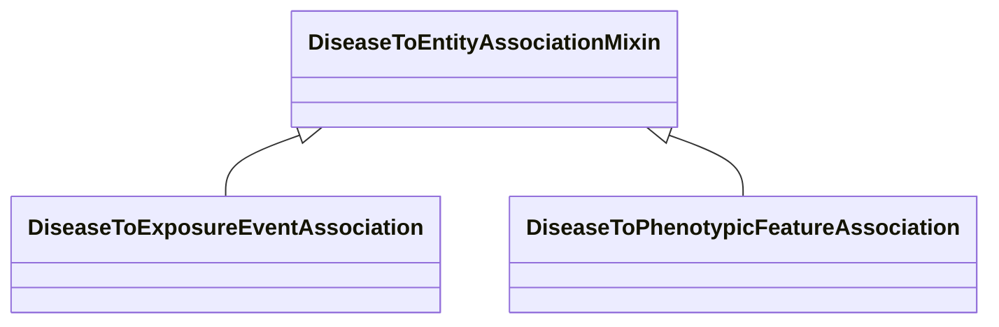

# Class: DiseaseToEntityAssociationMixin


URI: [bican:DiseaseToEntityAssociationMixin](https://identifiers.org/brain-bican/vocab/DiseaseToEntityAssociationMixin)





<!-- no inheritance hierarchy -->


## Slots

| Name | Cardinality and Range | Description | Inheritance |
| ---  | --- | --- | --- |


## Mixin Usage

| mixed into | description |
| --- | --- |
| [DiseaseToExposureEventAssociation](DiseaseToExposureEventAssociation.md) | An association between an exposure event and a disease |
| [DiseaseToPhenotypicFeatureAssociation](DiseaseToPhenotypicFeatureAssociation.md) | An association between a disease and a phenotypic feature in which the phenot... |


## Identifier and Mapping Information


### Schema Source


* from schema: https://identifiers.org/brain-bican/kb-model


## Mappings

| Mapping Type | Mapped Value |
| ---  | ---  |
| self | bican:DiseaseToEntityAssociationMixin |
| native | bican:DiseaseToEntityAssociationMixin |


## LinkML Source

<!-- TODO: investigate https://stackoverflow.com/questions/37606292/how-to-create-tabbed-code-blocks-in-mkdocs-or-sphinx -->

### Direct

<details>
```yaml
name: disease to entity association mixin
from_schema: https://identifiers.org/brain-bican/kb-model
mixin: true
slot_usage:
  subject:
    name: subject
    description: disease class
    examples:
    - value: MONDO:0017314
      description: Ehlers-Danlos syndrome, vascular type
    values_from:
    - mondo
    - omim
    - orphanet
    - ncit
    - doid
    domain_of:
    - association
    range: disease
defining_slots:
- subject

```
</details>

### Induced

<details>
```yaml
name: disease to entity association mixin
from_schema: https://identifiers.org/brain-bican/kb-model
mixin: true
slot_usage:
  subject:
    name: subject
    description: disease class
    examples:
    - value: MONDO:0017314
      description: Ehlers-Danlos syndrome, vascular type
    values_from:
    - mondo
    - omim
    - orphanet
    - ncit
    - doid
    domain_of:
    - association
    range: disease
defining_slots:
- subject

```
</details>