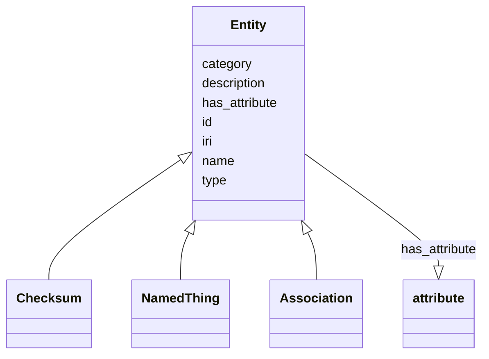

# Class: Entity


_Root Biolink Model class for all things and informational relationships, real or imagined._


* __NOTE__: this is an abstract class and should not be instantiated directly


URI: [bican:Entity](https://identifiers.org/brain-bican/vocab/Entity)





## Inheritance
* **Entity**
    * [Checksum](Checksum.md)
    * [NamedThing](NamedThing.md)
    * [Association](Association.md)


## Slots

| Name | Cardinality and Range | Description | Inheritance |
| ---  | --- | --- | --- |
| [id](id.md) | 1..1 <br/> [String](String.md) | A unique identifier for an entity | direct |
| [iri](iri.md) | 0..1 <br/> [IriType](IriType.md) | An IRI for an entity | direct |
| [category](category.md) | 0..* <br/> [CategoryType](CategoryType.md) | Name of the high level ontology class in which this entity is categorized | direct |
| [type](type.md) | 0..* <br/> [String](String.md) |  | direct |
| [name](name.md) | 0..1 <br/> [LabelType](LabelType.md) | A human-readable name for an attribute or entity | direct |
| [description](description.md) | 0..1 <br/> [NarrativeText](NarrativeText.md) | a human-readable description of an entity | direct |
| [has_attribute](has_attribute.md) | 0..* <br/> [Attribute](Attribute.md) | connects any entity to an attribute | direct |


## Usages

| used by | used in | type | used |
| ---  | --- | --- | --- |
| [GeneAnnotation](GeneAnnotation.md) | [id](id.md) | domain | [Entity](Entity.md) |
| [GeneAnnotation](GeneAnnotation.md) | [category](category.md) | domain | [Entity](Entity.md) |
| [GeneAnnotation](GeneAnnotation.md) | [type](type.md) | domain | [Entity](Entity.md) |
| [GeneAnnotation](GeneAnnotation.md) | [name](name.md) | domain | [Entity](Entity.md) |
| [GeneAnnotation](GeneAnnotation.md) | [has_attribute](has_attribute.md) | domain | [Entity](Entity.md) |
| [GenomeAnnotation](GenomeAnnotation.md) | [id](id.md) | domain | [Entity](Entity.md) |
| [GenomeAnnotation](GenomeAnnotation.md) | [category](category.md) | domain | [Entity](Entity.md) |
| [GenomeAnnotation](GenomeAnnotation.md) | [type](type.md) | domain | [Entity](Entity.md) |
| [GenomeAnnotation](GenomeAnnotation.md) | [name](name.md) | domain | [Entity](Entity.md) |
| [GenomeAnnotation](GenomeAnnotation.md) | [has_attribute](has_attribute.md) | domain | [Entity](Entity.md) |
| [Checksum](Checksum.md) | [id](id.md) | domain | [Entity](Entity.md) |
| [Checksum](Checksum.md) | [category](category.md) | domain | [Entity](Entity.md) |
| [Checksum](Checksum.md) | [type](type.md) | domain | [Entity](Entity.md) |
| [Checksum](Checksum.md) | [name](name.md) | domain | [Entity](Entity.md) |
| [Checksum](Checksum.md) | [has_attribute](has_attribute.md) | domain | [Entity](Entity.md) |
| [OntologyClass](OntologyClass.md) | [id](id.md) | domain | [Entity](Entity.md) |
| [Attribute](Attribute.md) | [name](name.md) | domain | [Entity](Entity.md) |
| [Attribute](Attribute.md) | [id](id.md) | domain | [Entity](Entity.md) |
| [Attribute](Attribute.md) | [category](category.md) | domain | [Entity](Entity.md) |
| [Attribute](Attribute.md) | [type](type.md) | domain | [Entity](Entity.md) |
| [Attribute](Attribute.md) | [has_attribute](has_attribute.md) | domain | [Entity](Entity.md) |
| [ChemicalRole](ChemicalRole.md) | [name](name.md) | domain | [Entity](Entity.md) |
| [ChemicalRole](ChemicalRole.md) | [id](id.md) | domain | [Entity](Entity.md) |
| [ChemicalRole](ChemicalRole.md) | [category](category.md) | domain | [Entity](Entity.md) |
| [ChemicalRole](ChemicalRole.md) | [type](type.md) | domain | [Entity](Entity.md) |
| [ChemicalRole](ChemicalRole.md) | [has_attribute](has_attribute.md) | domain | [Entity](Entity.md) |
| [BiologicalSex](BiologicalSex.md) | [name](name.md) | domain | [Entity](Entity.md) |
| [BiologicalSex](BiologicalSex.md) | [id](id.md) | domain | [Entity](Entity.md) |
| [BiologicalSex](BiologicalSex.md) | [category](category.md) | domain | [Entity](Entity.md) |
| [BiologicalSex](BiologicalSex.md) | [type](type.md) | domain | [Entity](Entity.md) |
| [BiologicalSex](BiologicalSex.md) | [has_attribute](has_attribute.md) | domain | [Entity](Entity.md) |
| [PhenotypicSex](PhenotypicSex.md) | [name](name.md) | domain | [Entity](Entity.md) |
| [PhenotypicSex](PhenotypicSex.md) | [id](id.md) | domain | [Entity](Entity.md) |
| [PhenotypicSex](PhenotypicSex.md) | [category](category.md) | domain | [Entity](Entity.md) |
| [PhenotypicSex](PhenotypicSex.md) | [type](type.md) | domain | [Entity](Entity.md) |
| [PhenotypicSex](PhenotypicSex.md) | [has_attribute](has_attribute.md) | domain | [Entity](Entity.md) |
| [GenotypicSex](GenotypicSex.md) | [name](name.md) | domain | [Entity](Entity.md) |
| [GenotypicSex](GenotypicSex.md) | [id](id.md) | domain | [Entity](Entity.md) |
| [GenotypicSex](GenotypicSex.md) | [category](category.md) | domain | [Entity](Entity.md) |
| [GenotypicSex](GenotypicSex.md) | [type](type.md) | domain | [Entity](Entity.md) |
| [GenotypicSex](GenotypicSex.md) | [has_attribute](has_attribute.md) | domain | [Entity](Entity.md) |
| [SeverityValue](SeverityValue.md) | [name](name.md) | domain | [Entity](Entity.md) |
| [SeverityValue](SeverityValue.md) | [id](id.md) | domain | [Entity](Entity.md) |
| [SeverityValue](SeverityValue.md) | [category](category.md) | domain | [Entity](Entity.md) |
| [SeverityValue](SeverityValue.md) | [type](type.md) | domain | [Entity](Entity.md) |
| [SeverityValue](SeverityValue.md) | [has_attribute](has_attribute.md) | domain | [Entity](Entity.md) |
| [Entity](Entity.md) | [id](id.md) | domain | [Entity](Entity.md) |
| [Entity](Entity.md) | [category](category.md) | domain | [Entity](Entity.md) |
| [Entity](Entity.md) | [type](type.md) | domain | [Entity](Entity.md) |
| [Entity](Entity.md) | [name](name.md) | domain | [Entity](Entity.md) |
| [Entity](Entity.md) | [has_attribute](has_attribute.md) | domain | [Entity](Entity.md) |
| [NamedThing](NamedThing.md) | [id](id.md) | domain | [Entity](Entity.md) |
| [NamedThing](NamedThing.md) | [category](category.md) | domain | [Entity](Entity.md) |
| [NamedThing](NamedThing.md) | [type](type.md) | domain | [Entity](Entity.md) |
| [NamedThing](NamedThing.md) | [name](name.md) | domain | [Entity](Entity.md) |
| [NamedThing](NamedThing.md) | [has_attribute](has_attribute.md) | domain | [Entity](Entity.md) |
| [RelationshipType](RelationshipType.md) | [id](id.md) | domain | [Entity](Entity.md) |
| [TaxonomicRank](TaxonomicRank.md) | [id](id.md) | domain | [Entity](Entity.md) |
| [OrganismTaxon](OrganismTaxon.md) | [id](id.md) | domain | [Entity](Entity.md) |
| [OrganismTaxon](OrganismTaxon.md) | [category](category.md) | domain | [Entity](Entity.md) |
| [OrganismTaxon](OrganismTaxon.md) | [type](type.md) | domain | [Entity](Entity.md) |
| [OrganismTaxon](OrganismTaxon.md) | [name](name.md) | domain | [Entity](Entity.md) |
| [OrganismTaxon](OrganismTaxon.md) | [has_attribute](has_attribute.md) | domain | [Entity](Entity.md) |
| [Event](Event.md) | [id](id.md) | domain | [Entity](Entity.md) |
| [Event](Event.md) | [category](category.md) | domain | [Entity](Entity.md) |
| [Event](Event.md) | [type](type.md) | domain | [Entity](Entity.md) |
| [Event](Event.md) | [name](name.md) | domain | [Entity](Entity.md) |
| [Event](Event.md) | [has_attribute](has_attribute.md) | domain | [Entity](Entity.md) |
| [AdministrativeEntity](AdministrativeEntity.md) | [id](id.md) | domain | [Entity](Entity.md) |
| [AdministrativeEntity](AdministrativeEntity.md) | [category](category.md) | domain | [Entity](Entity.md) |
| [AdministrativeEntity](AdministrativeEntity.md) | [type](type.md) | domain | [Entity](Entity.md) |
| [AdministrativeEntity](AdministrativeEntity.md) | [name](name.md) | domain | [Entity](Entity.md) |
| [AdministrativeEntity](AdministrativeEntity.md) | [has_attribute](has_attribute.md) | domain | [Entity](Entity.md) |
| [StudyResult](StudyResult.md) | [id](id.md) | domain | [Entity](Entity.md) |
| [StudyResult](StudyResult.md) | [category](category.md) | domain | [Entity](Entity.md) |
| [StudyResult](StudyResult.md) | [type](type.md) | domain | [Entity](Entity.md) |
| [StudyResult](StudyResult.md) | [name](name.md) | domain | [Entity](Entity.md) |
| [StudyResult](StudyResult.md) | [has_attribute](has_attribute.md) | domain | [Entity](Entity.md) |
| [Study](Study.md) | [id](id.md) | domain | [Entity](Entity.md) |
| [Study](Study.md) | [category](category.md) | domain | [Entity](Entity.md) |
| [Study](Study.md) | [type](type.md) | domain | [Entity](Entity.md) |
| [Study](Study.md) | [name](name.md) | domain | [Entity](Entity.md) |
| [Study](Study.md) | [has_attribute](has_attribute.md) | domain | [Entity](Entity.md) |
| [StudyVariable](StudyVariable.md) | [id](id.md) | domain | [Entity](Entity.md) |
| [StudyVariable](StudyVariable.md) | [category](category.md) | domain | [Entity](Entity.md) |
| [StudyVariable](StudyVariable.md) | [type](type.md) | domain | [Entity](Entity.md) |
| [StudyVariable](StudyVariable.md) | [name](name.md) | domain | [Entity](Entity.md) |
| [StudyVariable](StudyVariable.md) | [has_attribute](has_attribute.md) | domain | [Entity](Entity.md) |
| [CommonDataElement](CommonDataElement.md) | [id](id.md) | domain | [Entity](Entity.md) |
| [CommonDataElement](CommonDataElement.md) | [category](category.md) | domain | [Entity](Entity.md) |
| [CommonDataElement](CommonDataElement.md) | [type](type.md) | domain | [Entity](Entity.md) |
| [CommonDataElement](CommonDataElement.md) | [name](name.md) | domain | [Entity](Entity.md) |
| [CommonDataElement](CommonDataElement.md) | [has_attribute](has_attribute.md) | domain | [Entity](Entity.md) |
| [ConceptCountAnalysisResult](ConceptCountAnalysisResult.md) | [id](id.md) | domain | [Entity](Entity.md) |
| [ConceptCountAnalysisResult](ConceptCountAnalysisResult.md) | [category](category.md) | domain | [Entity](Entity.md) |
| [ConceptCountAnalysisResult](ConceptCountAnalysisResult.md) | [type](type.md) | domain | [Entity](Entity.md) |
| [ConceptCountAnalysisResult](ConceptCountAnalysisResult.md) | [name](name.md) | domain | [Entity](Entity.md) |
| [ConceptCountAnalysisResult](ConceptCountAnalysisResult.md) | [has_attribute](has_attribute.md) | domain | [Entity](Entity.md) |
| [ObservedExpectedFrequencyAnalysisResult](ObservedExpectedFrequencyAnalysisResult.md) | [id](id.md) | domain | [Entity](Entity.md) |
| [ObservedExpectedFrequencyAnalysisResult](ObservedExpectedFrequencyAnalysisResult.md) | [category](category.md) | domain | [Entity](Entity.md) |
| [ObservedExpectedFrequencyAnalysisResult](ObservedExpectedFrequencyAnalysisResult.md) | [type](type.md) | domain | [Entity](Entity.md) |
| [ObservedExpectedFrequencyAnalysisResult](ObservedExpectedFrequencyAnalysisResult.md) | [name](name.md) | domain | [Entity](Entity.md) |
| [ObservedExpectedFrequencyAnalysisResult](ObservedExpectedFrequencyAnalysisResult.md) | [has_attribute](has_attribute.md) | domain | [Entity](Entity.md) |
| [RelativeFrequencyAnalysisResult](RelativeFrequencyAnalysisResult.md) | [id](id.md) | domain | [Entity](Entity.md) |
| [RelativeFrequencyAnalysisResult](RelativeFrequencyAnalysisResult.md) | [category](category.md) | domain | [Entity](Entity.md) |
| [RelativeFrequencyAnalysisResult](RelativeFrequencyAnalysisResult.md) | [type](type.md) | domain | [Entity](Entity.md) |
| [RelativeFrequencyAnalysisResult](RelativeFrequencyAnalysisResult.md) | [name](name.md) | domain | [Entity](Entity.md) |
| [RelativeFrequencyAnalysisResult](RelativeFrequencyAnalysisResult.md) | [has_attribute](has_attribute.md) | domain | [Entity](Entity.md) |
| [TextMiningResult](TextMiningResult.md) | [id](id.md) | domain | [Entity](Entity.md) |
| [TextMiningResult](TextMiningResult.md) | [category](category.md) | domain | [Entity](Entity.md) |
| [TextMiningResult](TextMiningResult.md) | [type](type.md) | domain | [Entity](Entity.md) |
| [TextMiningResult](TextMiningResult.md) | [name](name.md) | domain | [Entity](Entity.md) |
| [TextMiningResult](TextMiningResult.md) | [has_attribute](has_attribute.md) | domain | [Entity](Entity.md) |
| [ChiSquaredAnalysisResult](ChiSquaredAnalysisResult.md) | [id](id.md) | domain | [Entity](Entity.md) |
| [ChiSquaredAnalysisResult](ChiSquaredAnalysisResult.md) | [category](category.md) | domain | [Entity](Entity.md) |
| [ChiSquaredAnalysisResult](ChiSquaredAnalysisResult.md) | [type](type.md) | domain | [Entity](Entity.md) |
| [ChiSquaredAnalysisResult](ChiSquaredAnalysisResult.md) | [name](name.md) | domain | [Entity](Entity.md) |
| [ChiSquaredAnalysisResult](ChiSquaredAnalysisResult.md) | [has_attribute](has_attribute.md) | domain | [Entity](Entity.md) |
| [LogOddsAnalysisResult](LogOddsAnalysisResult.md) | [id](id.md) | domain | [Entity](Entity.md) |
| [LogOddsAnalysisResult](LogOddsAnalysisResult.md) | [category](category.md) | domain | [Entity](Entity.md) |
| [LogOddsAnalysisResult](LogOddsAnalysisResult.md) | [type](type.md) | domain | [Entity](Entity.md) |
| [LogOddsAnalysisResult](LogOddsAnalysisResult.md) | [name](name.md) | domain | [Entity](Entity.md) |
| [LogOddsAnalysisResult](LogOddsAnalysisResult.md) | [has_attribute](has_attribute.md) | domain | [Entity](Entity.md) |
| [Agent](Agent.md) | [id](id.md) | domain | [Entity](Entity.md) |
| [Agent](Agent.md) | [category](category.md) | domain | [Entity](Entity.md) |
| [Agent](Agent.md) | [type](type.md) | domain | [Entity](Entity.md) |
| [Agent](Agent.md) | [name](name.md) | domain | [Entity](Entity.md) |
| [Agent](Agent.md) | [has_attribute](has_attribute.md) | domain | [Entity](Entity.md) |
| [InformationContentEntity](InformationContentEntity.md) | [id](id.md) | domain | [Entity](Entity.md) |
| [InformationContentEntity](InformationContentEntity.md) | [category](category.md) | domain | [Entity](Entity.md) |
| [InformationContentEntity](InformationContentEntity.md) | [type](type.md) | domain | [Entity](Entity.md) |
| [InformationContentEntity](InformationContentEntity.md) | [name](name.md) | domain | [Entity](Entity.md) |
| [InformationContentEntity](InformationContentEntity.md) | [has_attribute](has_attribute.md) | domain | [Entity](Entity.md) |
| [Dataset](Dataset.md) | [id](id.md) | domain | [Entity](Entity.md) |
| [Dataset](Dataset.md) | [category](category.md) | domain | [Entity](Entity.md) |
| [Dataset](Dataset.md) | [type](type.md) | domain | [Entity](Entity.md) |
| [Dataset](Dataset.md) | [name](name.md) | domain | [Entity](Entity.md) |
| [Dataset](Dataset.md) | [has_attribute](has_attribute.md) | domain | [Entity](Entity.md) |
| [DatasetDistribution](DatasetDistribution.md) | [id](id.md) | domain | [Entity](Entity.md) |
| [DatasetDistribution](DatasetDistribution.md) | [category](category.md) | domain | [Entity](Entity.md) |
| [DatasetDistribution](DatasetDistribution.md) | [type](type.md) | domain | [Entity](Entity.md) |
| [DatasetDistribution](DatasetDistribution.md) | [name](name.md) | domain | [Entity](Entity.md) |
| [DatasetDistribution](DatasetDistribution.md) | [has_attribute](has_attribute.md) | domain | [Entity](Entity.md) |
| [DatasetVersion](DatasetVersion.md) | [id](id.md) | domain | [Entity](Entity.md) |
| [DatasetVersion](DatasetVersion.md) | [category](category.md) | domain | [Entity](Entity.md) |
| [DatasetVersion](DatasetVersion.md) | [type](type.md) | domain | [Entity](Entity.md) |
| [DatasetVersion](DatasetVersion.md) | [name](name.md) | domain | [Entity](Entity.md) |
| [DatasetVersion](DatasetVersion.md) | [has_attribute](has_attribute.md) | domain | [Entity](Entity.md) |
| [DatasetSummary](DatasetSummary.md) | [id](id.md) | domain | [Entity](Entity.md) |
| [DatasetSummary](DatasetSummary.md) | [category](category.md) | domain | [Entity](Entity.md) |
| [DatasetSummary](DatasetSummary.md) | [type](type.md) | domain | [Entity](Entity.md) |
| [DatasetSummary](DatasetSummary.md) | [name](name.md) | domain | [Entity](Entity.md) |
| [DatasetSummary](DatasetSummary.md) | [has_attribute](has_attribute.md) | domain | [Entity](Entity.md) |
| [ConfidenceLevel](ConfidenceLevel.md) | [id](id.md) | domain | [Entity](Entity.md) |
| [ConfidenceLevel](ConfidenceLevel.md) | [category](category.md) | domain | [Entity](Entity.md) |
| [ConfidenceLevel](ConfidenceLevel.md) | [type](type.md) | domain | [Entity](Entity.md) |
| [ConfidenceLevel](ConfidenceLevel.md) | [name](name.md) | domain | [Entity](Entity.md) |
| [ConfidenceLevel](ConfidenceLevel.md) | [has_attribute](has_attribute.md) | domain | [Entity](Entity.md) |
| [EvidenceType](EvidenceType.md) | [id](id.md) | domain | [Entity](Entity.md) |
| [EvidenceType](EvidenceType.md) | [category](category.md) | domain | [Entity](Entity.md) |
| [EvidenceType](EvidenceType.md) | [type](type.md) | domain | [Entity](Entity.md) |
| [EvidenceType](EvidenceType.md) | [name](name.md) | domain | [Entity](Entity.md) |
| [EvidenceType](EvidenceType.md) | [has_attribute](has_attribute.md) | domain | [Entity](Entity.md) |
| [Publication](Publication.md) | [id](id.md) | domain | [Entity](Entity.md) |
| [Publication](Publication.md) | [category](category.md) | domain | [Entity](Entity.md) |
| [Publication](Publication.md) | [type](type.md) | domain | [Entity](Entity.md) |
| [Publication](Publication.md) | [name](name.md) | domain | [Entity](Entity.md) |
| [Publication](Publication.md) | [has_attribute](has_attribute.md) | domain | [Entity](Entity.md) |
| [Book](Book.md) | [id](id.md) | domain | [Entity](Entity.md) |
| [Book](Book.md) | [category](category.md) | domain | [Entity](Entity.md) |
| [Book](Book.md) | [type](type.md) | domain | [Entity](Entity.md) |
| [Book](Book.md) | [name](name.md) | domain | [Entity](Entity.md) |
| [Book](Book.md) | [has_attribute](has_attribute.md) | domain | [Entity](Entity.md) |
| [BookChapter](BookChapter.md) | [id](id.md) | domain | [Entity](Entity.md) |
| [BookChapter](BookChapter.md) | [category](category.md) | domain | [Entity](Entity.md) |
| [BookChapter](BookChapter.md) | [type](type.md) | domain | [Entity](Entity.md) |
| [BookChapter](BookChapter.md) | [name](name.md) | domain | [Entity](Entity.md) |
| [BookChapter](BookChapter.md) | [has_attribute](has_attribute.md) | domain | [Entity](Entity.md) |
| [Serial](Serial.md) | [id](id.md) | domain | [Entity](Entity.md) |
| [Serial](Serial.md) | [category](category.md) | domain | [Entity](Entity.md) |
| [Serial](Serial.md) | [type](type.md) | domain | [Entity](Entity.md) |
| [Serial](Serial.md) | [name](name.md) | domain | [Entity](Entity.md) |
| [Serial](Serial.md) | [has_attribute](has_attribute.md) | domain | [Entity](Entity.md) |
| [Article](Article.md) | [id](id.md) | domain | [Entity](Entity.md) |
| [Article](Article.md) | [category](category.md) | domain | [Entity](Entity.md) |
| [Article](Article.md) | [type](type.md) | domain | [Entity](Entity.md) |
| [Article](Article.md) | [name](name.md) | domain | [Entity](Entity.md) |
| [Article](Article.md) | [has_attribute](has_attribute.md) | domain | [Entity](Entity.md) |
| [JournalArticle](JournalArticle.md) | [id](id.md) | domain | [Entity](Entity.md) |
| [JournalArticle](JournalArticle.md) | [category](category.md) | domain | [Entity](Entity.md) |
| [JournalArticle](JournalArticle.md) | [type](type.md) | domain | [Entity](Entity.md) |
| [JournalArticle](JournalArticle.md) | [name](name.md) | domain | [Entity](Entity.md) |
| [JournalArticle](JournalArticle.md) | [has_attribute](has_attribute.md) | domain | [Entity](Entity.md) |
| [Patent](Patent.md) | [id](id.md) | domain | [Entity](Entity.md) |
| [Patent](Patent.md) | [category](category.md) | domain | [Entity](Entity.md) |
| [Patent](Patent.md) | [type](type.md) | domain | [Entity](Entity.md) |
| [Patent](Patent.md) | [name](name.md) | domain | [Entity](Entity.md) |
| [Patent](Patent.md) | [has_attribute](has_attribute.md) | domain | [Entity](Entity.md) |
| [WebPage](WebPage.md) | [id](id.md) | domain | [Entity](Entity.md) |
| [WebPage](WebPage.md) | [category](category.md) | domain | [Entity](Entity.md) |
| [WebPage](WebPage.md) | [type](type.md) | domain | [Entity](Entity.md) |
| [WebPage](WebPage.md) | [name](name.md) | domain | [Entity](Entity.md) |
| [WebPage](WebPage.md) | [has_attribute](has_attribute.md) | domain | [Entity](Entity.md) |
| [PreprintPublication](PreprintPublication.md) | [id](id.md) | domain | [Entity](Entity.md) |
| [PreprintPublication](PreprintPublication.md) | [category](category.md) | domain | [Entity](Entity.md) |
| [PreprintPublication](PreprintPublication.md) | [type](type.md) | domain | [Entity](Entity.md) |
| [PreprintPublication](PreprintPublication.md) | [name](name.md) | domain | [Entity](Entity.md) |
| [PreprintPublication](PreprintPublication.md) | [has_attribute](has_attribute.md) | domain | [Entity](Entity.md) |
| [DrugLabel](DrugLabel.md) | [id](id.md) | domain | [Entity](Entity.md) |
| [DrugLabel](DrugLabel.md) | [category](category.md) | domain | [Entity](Entity.md) |
| [DrugLabel](DrugLabel.md) | [type](type.md) | domain | [Entity](Entity.md) |
| [DrugLabel](DrugLabel.md) | [name](name.md) | domain | [Entity](Entity.md) |
| [DrugLabel](DrugLabel.md) | [has_attribute](has_attribute.md) | domain | [Entity](Entity.md) |
| [RetrievalSource](RetrievalSource.md) | [id](id.md) | domain | [Entity](Entity.md) |
| [RetrievalSource](RetrievalSource.md) | [category](category.md) | domain | [Entity](Entity.md) |
| [RetrievalSource](RetrievalSource.md) | [type](type.md) | domain | [Entity](Entity.md) |
| [RetrievalSource](RetrievalSource.md) | [name](name.md) | domain | [Entity](Entity.md) |
| [RetrievalSource](RetrievalSource.md) | [has_attribute](has_attribute.md) | domain | [Entity](Entity.md) |
| [PhysicalEntity](PhysicalEntity.md) | [id](id.md) | domain | [Entity](Entity.md) |
| [PhysicalEntity](PhysicalEntity.md) | [category](category.md) | domain | [Entity](Entity.md) |
| [PhysicalEntity](PhysicalEntity.md) | [type](type.md) | domain | [Entity](Entity.md) |
| [PhysicalEntity](PhysicalEntity.md) | [name](name.md) | domain | [Entity](Entity.md) |
| [PhysicalEntity](PhysicalEntity.md) | [has_attribute](has_attribute.md) | domain | [Entity](Entity.md) |
| [Activity](Activity.md) | [id](id.md) | domain | [Entity](Entity.md) |
| [Activity](Activity.md) | [category](category.md) | domain | [Entity](Entity.md) |
| [Activity](Activity.md) | [type](type.md) | domain | [Entity](Entity.md) |
| [Activity](Activity.md) | [name](name.md) | domain | [Entity](Entity.md) |
| [Activity](Activity.md) | [has_attribute](has_attribute.md) | domain | [Entity](Entity.md) |
| [Procedure](Procedure.md) | [id](id.md) | domain | [Entity](Entity.md) |
| [Procedure](Procedure.md) | [category](category.md) | domain | [Entity](Entity.md) |
| [Procedure](Procedure.md) | [type](type.md) | domain | [Entity](Entity.md) |
| [Procedure](Procedure.md) | [name](name.md) | domain | [Entity](Entity.md) |
| [Procedure](Procedure.md) | [has_attribute](has_attribute.md) | domain | [Entity](Entity.md) |
| [Phenomenon](Phenomenon.md) | [id](id.md) | domain | [Entity](Entity.md) |
| [Phenomenon](Phenomenon.md) | [category](category.md) | domain | [Entity](Entity.md) |
| [Phenomenon](Phenomenon.md) | [type](type.md) | domain | [Entity](Entity.md) |
| [Phenomenon](Phenomenon.md) | [name](name.md) | domain | [Entity](Entity.md) |
| [Phenomenon](Phenomenon.md) | [has_attribute](has_attribute.md) | domain | [Entity](Entity.md) |
| [Device](Device.md) | [id](id.md) | domain | [Entity](Entity.md) |
| [Device](Device.md) | [category](category.md) | domain | [Entity](Entity.md) |
| [Device](Device.md) | [type](type.md) | domain | [Entity](Entity.md) |
| [Device](Device.md) | [name](name.md) | domain | [Entity](Entity.md) |
| [Device](Device.md) | [has_attribute](has_attribute.md) | domain | [Entity](Entity.md) |
| [DiagnosticAid](DiagnosticAid.md) | [id](id.md) | domain | [Entity](Entity.md) |
| [DiagnosticAid](DiagnosticAid.md) | [category](category.md) | domain | [Entity](Entity.md) |
| [DiagnosticAid](DiagnosticAid.md) | [type](type.md) | domain | [Entity](Entity.md) |
| [DiagnosticAid](DiagnosticAid.md) | [name](name.md) | domain | [Entity](Entity.md) |
| [DiagnosticAid](DiagnosticAid.md) | [has_attribute](has_attribute.md) | domain | [Entity](Entity.md) |
| [StudyPopulation](StudyPopulation.md) | [id](id.md) | domain | [Entity](Entity.md) |
| [StudyPopulation](StudyPopulation.md) | [category](category.md) | domain | [Entity](Entity.md) |
| [StudyPopulation](StudyPopulation.md) | [type](type.md) | domain | [Entity](Entity.md) |
| [StudyPopulation](StudyPopulation.md) | [name](name.md) | domain | [Entity](Entity.md) |
| [StudyPopulation](StudyPopulation.md) | [has_attribute](has_attribute.md) | domain | [Entity](Entity.md) |
| [MaterialSample](MaterialSample.md) | [id](id.md) | domain | [Entity](Entity.md) |
| [MaterialSample](MaterialSample.md) | [category](category.md) | domain | [Entity](Entity.md) |
| [MaterialSample](MaterialSample.md) | [type](type.md) | domain | [Entity](Entity.md) |
| [MaterialSample](MaterialSample.md) | [name](name.md) | domain | [Entity](Entity.md) |
| [MaterialSample](MaterialSample.md) | [has_attribute](has_attribute.md) | domain | [Entity](Entity.md) |
| [PlanetaryEntity](PlanetaryEntity.md) | [id](id.md) | domain | [Entity](Entity.md) |
| [PlanetaryEntity](PlanetaryEntity.md) | [category](category.md) | domain | [Entity](Entity.md) |
| [PlanetaryEntity](PlanetaryEntity.md) | [type](type.md) | domain | [Entity](Entity.md) |
| [PlanetaryEntity](PlanetaryEntity.md) | [name](name.md) | domain | [Entity](Entity.md) |
| [PlanetaryEntity](PlanetaryEntity.md) | [has_attribute](has_attribute.md) | domain | [Entity](Entity.md) |
| [EnvironmentalProcess](EnvironmentalProcess.md) | [id](id.md) | domain | [Entity](Entity.md) |
| [EnvironmentalProcess](EnvironmentalProcess.md) | [category](category.md) | domain | [Entity](Entity.md) |
| [EnvironmentalProcess](EnvironmentalProcess.md) | [type](type.md) | domain | [Entity](Entity.md) |
| [EnvironmentalProcess](EnvironmentalProcess.md) | [name](name.md) | domain | [Entity](Entity.md) |
| [EnvironmentalProcess](EnvironmentalProcess.md) | [has_attribute](has_attribute.md) | domain | [Entity](Entity.md) |
| [EnvironmentalFeature](EnvironmentalFeature.md) | [id](id.md) | domain | [Entity](Entity.md) |
| [EnvironmentalFeature](EnvironmentalFeature.md) | [category](category.md) | domain | [Entity](Entity.md) |
| [EnvironmentalFeature](EnvironmentalFeature.md) | [type](type.md) | domain | [Entity](Entity.md) |
| [EnvironmentalFeature](EnvironmentalFeature.md) | [name](name.md) | domain | [Entity](Entity.md) |
| [EnvironmentalFeature](EnvironmentalFeature.md) | [has_attribute](has_attribute.md) | domain | [Entity](Entity.md) |
| [GeographicLocation](GeographicLocation.md) | [id](id.md) | domain | [Entity](Entity.md) |
| [GeographicLocation](GeographicLocation.md) | [category](category.md) | domain | [Entity](Entity.md) |
| [GeographicLocation](GeographicLocation.md) | [type](type.md) | domain | [Entity](Entity.md) |
| [GeographicLocation](GeographicLocation.md) | [name](name.md) | domain | [Entity](Entity.md) |
| [GeographicLocation](GeographicLocation.md) | [has_attribute](has_attribute.md) | domain | [Entity](Entity.md) |
| [GeographicLocationAtTime](GeographicLocationAtTime.md) | [id](id.md) | domain | [Entity](Entity.md) |
| [GeographicLocationAtTime](GeographicLocationAtTime.md) | [category](category.md) | domain | [Entity](Entity.md) |
| [GeographicLocationAtTime](GeographicLocationAtTime.md) | [type](type.md) | domain | [Entity](Entity.md) |
| [GeographicLocationAtTime](GeographicLocationAtTime.md) | [name](name.md) | domain | [Entity](Entity.md) |
| [GeographicLocationAtTime](GeographicLocationAtTime.md) | [has_attribute](has_attribute.md) | domain | [Entity](Entity.md) |
| [BiologicalEntity](BiologicalEntity.md) | [id](id.md) | domain | [Entity](Entity.md) |
| [BiologicalEntity](BiologicalEntity.md) | [category](category.md) | domain | [Entity](Entity.md) |
| [BiologicalEntity](BiologicalEntity.md) | [type](type.md) | domain | [Entity](Entity.md) |
| [BiologicalEntity](BiologicalEntity.md) | [name](name.md) | domain | [Entity](Entity.md) |
| [BiologicalEntity](BiologicalEntity.md) | [has_attribute](has_attribute.md) | domain | [Entity](Entity.md) |
| [MolecularEntity](MolecularEntity.md) | [id](id.md) | domain | [Entity](Entity.md) |
| [MolecularEntity](MolecularEntity.md) | [category](category.md) | domain | [Entity](Entity.md) |
| [MolecularEntity](MolecularEntity.md) | [type](type.md) | domain | [Entity](Entity.md) |
| [MolecularEntity](MolecularEntity.md) | [name](name.md) | domain | [Entity](Entity.md) |
| [MolecularEntity](MolecularEntity.md) | [has_attribute](has_attribute.md) | domain | [Entity](Entity.md) |
| [ChemicalEntity](ChemicalEntity.md) | [id](id.md) | domain | [Entity](Entity.md) |
| [ChemicalEntity](ChemicalEntity.md) | [category](category.md) | domain | [Entity](Entity.md) |
| [ChemicalEntity](ChemicalEntity.md) | [type](type.md) | domain | [Entity](Entity.md) |
| [ChemicalEntity](ChemicalEntity.md) | [name](name.md) | domain | [Entity](Entity.md) |
| [ChemicalEntity](ChemicalEntity.md) | [has_attribute](has_attribute.md) | domain | [Entity](Entity.md) |
| [SmallMolecule](SmallMolecule.md) | [id](id.md) | domain | [Entity](Entity.md) |
| [SmallMolecule](SmallMolecule.md) | [category](category.md) | domain | [Entity](Entity.md) |
| [SmallMolecule](SmallMolecule.md) | [type](type.md) | domain | [Entity](Entity.md) |
| [SmallMolecule](SmallMolecule.md) | [name](name.md) | domain | [Entity](Entity.md) |
| [SmallMolecule](SmallMolecule.md) | [has_attribute](has_attribute.md) | domain | [Entity](Entity.md) |
| [ChemicalMixture](ChemicalMixture.md) | [id](id.md) | domain | [Entity](Entity.md) |
| [ChemicalMixture](ChemicalMixture.md) | [category](category.md) | domain | [Entity](Entity.md) |
| [ChemicalMixture](ChemicalMixture.md) | [type](type.md) | domain | [Entity](Entity.md) |
| [ChemicalMixture](ChemicalMixture.md) | [name](name.md) | domain | [Entity](Entity.md) |
| [ChemicalMixture](ChemicalMixture.md) | [has_attribute](has_attribute.md) | domain | [Entity](Entity.md) |
| [NucleicAcidEntity](NucleicAcidEntity.md) | [id](id.md) | domain | [Entity](Entity.md) |
| [NucleicAcidEntity](NucleicAcidEntity.md) | [category](category.md) | domain | [Entity](Entity.md) |
| [NucleicAcidEntity](NucleicAcidEntity.md) | [type](type.md) | domain | [Entity](Entity.md) |
| [NucleicAcidEntity](NucleicAcidEntity.md) | [name](name.md) | domain | [Entity](Entity.md) |
| [NucleicAcidEntity](NucleicAcidEntity.md) | [has_attribute](has_attribute.md) | domain | [Entity](Entity.md) |
| [RegulatoryRegion](RegulatoryRegion.md) | [id](id.md) | domain | [Entity](Entity.md) |
| [RegulatoryRegion](RegulatoryRegion.md) | [category](category.md) | domain | [Entity](Entity.md) |
| [RegulatoryRegion](RegulatoryRegion.md) | [type](type.md) | domain | [Entity](Entity.md) |
| [RegulatoryRegion](RegulatoryRegion.md) | [name](name.md) | domain | [Entity](Entity.md) |
| [RegulatoryRegion](RegulatoryRegion.md) | [has_attribute](has_attribute.md) | domain | [Entity](Entity.md) |
| [AccessibleDnaRegion](AccessibleDnaRegion.md) | [id](id.md) | domain | [Entity](Entity.md) |
| [AccessibleDnaRegion](AccessibleDnaRegion.md) | [category](category.md) | domain | [Entity](Entity.md) |
| [AccessibleDnaRegion](AccessibleDnaRegion.md) | [type](type.md) | domain | [Entity](Entity.md) |
| [AccessibleDnaRegion](AccessibleDnaRegion.md) | [name](name.md) | domain | [Entity](Entity.md) |
| [AccessibleDnaRegion](AccessibleDnaRegion.md) | [has_attribute](has_attribute.md) | domain | [Entity](Entity.md) |
| [TranscriptionFactorBindingSite](TranscriptionFactorBindingSite.md) | [id](id.md) | domain | [Entity](Entity.md) |
| [TranscriptionFactorBindingSite](TranscriptionFactorBindingSite.md) | [category](category.md) | domain | [Entity](Entity.md) |
| [TranscriptionFactorBindingSite](TranscriptionFactorBindingSite.md) | [type](type.md) | domain | [Entity](Entity.md) |
| [TranscriptionFactorBindingSite](TranscriptionFactorBindingSite.md) | [name](name.md) | domain | [Entity](Entity.md) |
| [TranscriptionFactorBindingSite](TranscriptionFactorBindingSite.md) | [has_attribute](has_attribute.md) | domain | [Entity](Entity.md) |
| [MolecularMixture](MolecularMixture.md) | [id](id.md) | domain | [Entity](Entity.md) |
| [MolecularMixture](MolecularMixture.md) | [category](category.md) | domain | [Entity](Entity.md) |
| [MolecularMixture](MolecularMixture.md) | [type](type.md) | domain | [Entity](Entity.md) |
| [MolecularMixture](MolecularMixture.md) | [name](name.md) | domain | [Entity](Entity.md) |
| [MolecularMixture](MolecularMixture.md) | [has_attribute](has_attribute.md) | domain | [Entity](Entity.md) |
| [ComplexMolecularMixture](ComplexMolecularMixture.md) | [id](id.md) | domain | [Entity](Entity.md) |
| [ComplexMolecularMixture](ComplexMolecularMixture.md) | [category](category.md) | domain | [Entity](Entity.md) |
| [ComplexMolecularMixture](ComplexMolecularMixture.md) | [type](type.md) | domain | [Entity](Entity.md) |
| [ComplexMolecularMixture](ComplexMolecularMixture.md) | [name](name.md) | domain | [Entity](Entity.md) |
| [ComplexMolecularMixture](ComplexMolecularMixture.md) | [has_attribute](has_attribute.md) | domain | [Entity](Entity.md) |
| [BiologicalProcessOrActivity](BiologicalProcessOrActivity.md) | [id](id.md) | domain | [Entity](Entity.md) |
| [BiologicalProcessOrActivity](BiologicalProcessOrActivity.md) | [category](category.md) | domain | [Entity](Entity.md) |
| [BiologicalProcessOrActivity](BiologicalProcessOrActivity.md) | [type](type.md) | domain | [Entity](Entity.md) |
| [BiologicalProcessOrActivity](BiologicalProcessOrActivity.md) | [name](name.md) | domain | [Entity](Entity.md) |
| [BiologicalProcessOrActivity](BiologicalProcessOrActivity.md) | [has_attribute](has_attribute.md) | domain | [Entity](Entity.md) |
| [MolecularActivity](MolecularActivity.md) | [id](id.md) | domain | [Entity](Entity.md) |
| [MolecularActivity](MolecularActivity.md) | [category](category.md) | domain | [Entity](Entity.md) |
| [MolecularActivity](MolecularActivity.md) | [type](type.md) | domain | [Entity](Entity.md) |
| [MolecularActivity](MolecularActivity.md) | [name](name.md) | domain | [Entity](Entity.md) |
| [MolecularActivity](MolecularActivity.md) | [has_attribute](has_attribute.md) | domain | [Entity](Entity.md) |
| [BiologicalProcess](BiologicalProcess.md) | [id](id.md) | domain | [Entity](Entity.md) |
| [BiologicalProcess](BiologicalProcess.md) | [category](category.md) | domain | [Entity](Entity.md) |
| [BiologicalProcess](BiologicalProcess.md) | [type](type.md) | domain | [Entity](Entity.md) |
| [BiologicalProcess](BiologicalProcess.md) | [name](name.md) | domain | [Entity](Entity.md) |
| [BiologicalProcess](BiologicalProcess.md) | [has_attribute](has_attribute.md) | domain | [Entity](Entity.md) |
| [Pathway](Pathway.md) | [id](id.md) | domain | [Entity](Entity.md) |
| [Pathway](Pathway.md) | [category](category.md) | domain | [Entity](Entity.md) |
| [Pathway](Pathway.md) | [type](type.md) | domain | [Entity](Entity.md) |
| [Pathway](Pathway.md) | [name](name.md) | domain | [Entity](Entity.md) |
| [Pathway](Pathway.md) | [has_attribute](has_attribute.md) | domain | [Entity](Entity.md) |
| [PhysiologicalProcess](PhysiologicalProcess.md) | [id](id.md) | domain | [Entity](Entity.md) |
| [PhysiologicalProcess](PhysiologicalProcess.md) | [category](category.md) | domain | [Entity](Entity.md) |
| [PhysiologicalProcess](PhysiologicalProcess.md) | [type](type.md) | domain | [Entity](Entity.md) |
| [PhysiologicalProcess](PhysiologicalProcess.md) | [name](name.md) | domain | [Entity](Entity.md) |
| [PhysiologicalProcess](PhysiologicalProcess.md) | [has_attribute](has_attribute.md) | domain | [Entity](Entity.md) |
| [Behavior](Behavior.md) | [id](id.md) | domain | [Entity](Entity.md) |
| [Behavior](Behavior.md) | [category](category.md) | domain | [Entity](Entity.md) |
| [Behavior](Behavior.md) | [type](type.md) | domain | [Entity](Entity.md) |
| [Behavior](Behavior.md) | [name](name.md) | domain | [Entity](Entity.md) |
| [Behavior](Behavior.md) | [has_attribute](has_attribute.md) | domain | [Entity](Entity.md) |
| [ProcessedMaterial](ProcessedMaterial.md) | [id](id.md) | domain | [Entity](Entity.md) |
| [ProcessedMaterial](ProcessedMaterial.md) | [category](category.md) | domain | [Entity](Entity.md) |
| [ProcessedMaterial](ProcessedMaterial.md) | [type](type.md) | domain | [Entity](Entity.md) |
| [ProcessedMaterial](ProcessedMaterial.md) | [name](name.md) | domain | [Entity](Entity.md) |
| [ProcessedMaterial](ProcessedMaterial.md) | [has_attribute](has_attribute.md) | domain | [Entity](Entity.md) |
| [Drug](Drug.md) | [id](id.md) | domain | [Entity](Entity.md) |
| [Drug](Drug.md) | [category](category.md) | domain | [Entity](Entity.md) |
| [Drug](Drug.md) | [type](type.md) | domain | [Entity](Entity.md) |
| [Drug](Drug.md) | [name](name.md) | domain | [Entity](Entity.md) |
| [Drug](Drug.md) | [has_attribute](has_attribute.md) | domain | [Entity](Entity.md) |
| [EnvironmentalFoodContaminant](EnvironmentalFoodContaminant.md) | [id](id.md) | domain | [Entity](Entity.md) |
| [EnvironmentalFoodContaminant](EnvironmentalFoodContaminant.md) | [category](category.md) | domain | [Entity](Entity.md) |
| [EnvironmentalFoodContaminant](EnvironmentalFoodContaminant.md) | [type](type.md) | domain | [Entity](Entity.md) |
| [EnvironmentalFoodContaminant](EnvironmentalFoodContaminant.md) | [name](name.md) | domain | [Entity](Entity.md) |
| [EnvironmentalFoodContaminant](EnvironmentalFoodContaminant.md) | [has_attribute](has_attribute.md) | domain | [Entity](Entity.md) |
| [FoodAdditive](FoodAdditive.md) | [id](id.md) | domain | [Entity](Entity.md) |
| [FoodAdditive](FoodAdditive.md) | [category](category.md) | domain | [Entity](Entity.md) |
| [FoodAdditive](FoodAdditive.md) | [type](type.md) | domain | [Entity](Entity.md) |
| [FoodAdditive](FoodAdditive.md) | [name](name.md) | domain | [Entity](Entity.md) |
| [FoodAdditive](FoodAdditive.md) | [has_attribute](has_attribute.md) | domain | [Entity](Entity.md) |
| [Food](Food.md) | [id](id.md) | domain | [Entity](Entity.md) |
| [Food](Food.md) | [category](category.md) | domain | [Entity](Entity.md) |
| [Food](Food.md) | [type](type.md) | domain | [Entity](Entity.md) |
| [Food](Food.md) | [name](name.md) | domain | [Entity](Entity.md) |
| [Food](Food.md) | [has_attribute](has_attribute.md) | domain | [Entity](Entity.md) |
| [OrganismAttribute](OrganismAttribute.md) | [name](name.md) | domain | [Entity](Entity.md) |
| [OrganismAttribute](OrganismAttribute.md) | [id](id.md) | domain | [Entity](Entity.md) |
| [OrganismAttribute](OrganismAttribute.md) | [category](category.md) | domain | [Entity](Entity.md) |
| [OrganismAttribute](OrganismAttribute.md) | [type](type.md) | domain | [Entity](Entity.md) |
| [OrganismAttribute](OrganismAttribute.md) | [has_attribute](has_attribute.md) | domain | [Entity](Entity.md) |
| [PhenotypicQuality](PhenotypicQuality.md) | [name](name.md) | domain | [Entity](Entity.md) |
| [PhenotypicQuality](PhenotypicQuality.md) | [id](id.md) | domain | [Entity](Entity.md) |
| [PhenotypicQuality](PhenotypicQuality.md) | [category](category.md) | domain | [Entity](Entity.md) |
| [PhenotypicQuality](PhenotypicQuality.md) | [type](type.md) | domain | [Entity](Entity.md) |
| [PhenotypicQuality](PhenotypicQuality.md) | [has_attribute](has_attribute.md) | domain | [Entity](Entity.md) |
| [GeneticInheritance](GeneticInheritance.md) | [id](id.md) | domain | [Entity](Entity.md) |
| [GeneticInheritance](GeneticInheritance.md) | [category](category.md) | domain | [Entity](Entity.md) |
| [GeneticInheritance](GeneticInheritance.md) | [type](type.md) | domain | [Entity](Entity.md) |
| [GeneticInheritance](GeneticInheritance.md) | [name](name.md) | domain | [Entity](Entity.md) |
| [GeneticInheritance](GeneticInheritance.md) | [has_attribute](has_attribute.md) | domain | [Entity](Entity.md) |
| [OrganismalEntity](OrganismalEntity.md) | [id](id.md) | domain | [Entity](Entity.md) |
| [OrganismalEntity](OrganismalEntity.md) | [category](category.md) | domain | [Entity](Entity.md) |
| [OrganismalEntity](OrganismalEntity.md) | [type](type.md) | domain | [Entity](Entity.md) |
| [OrganismalEntity](OrganismalEntity.md) | [name](name.md) | domain | [Entity](Entity.md) |
| [OrganismalEntity](OrganismalEntity.md) | [has_attribute](has_attribute.md) | domain | [Entity](Entity.md) |
| [Bacterium](Bacterium.md) | [id](id.md) | domain | [Entity](Entity.md) |
| [Bacterium](Bacterium.md) | [category](category.md) | domain | [Entity](Entity.md) |
| [Bacterium](Bacterium.md) | [type](type.md) | domain | [Entity](Entity.md) |
| [Bacterium](Bacterium.md) | [name](name.md) | domain | [Entity](Entity.md) |
| [Bacterium](Bacterium.md) | [has_attribute](has_attribute.md) | domain | [Entity](Entity.md) |
| [Virus](Virus.md) | [id](id.md) | domain | [Entity](Entity.md) |
| [Virus](Virus.md) | [category](category.md) | domain | [Entity](Entity.md) |
| [Virus](Virus.md) | [type](type.md) | domain | [Entity](Entity.md) |
| [Virus](Virus.md) | [name](name.md) | domain | [Entity](Entity.md) |
| [Virus](Virus.md) | [has_attribute](has_attribute.md) | domain | [Entity](Entity.md) |
| [CellularOrganism](CellularOrganism.md) | [id](id.md) | domain | [Entity](Entity.md) |
| [CellularOrganism](CellularOrganism.md) | [category](category.md) | domain | [Entity](Entity.md) |
| [CellularOrganism](CellularOrganism.md) | [type](type.md) | domain | [Entity](Entity.md) |
| [CellularOrganism](CellularOrganism.md) | [name](name.md) | domain | [Entity](Entity.md) |
| [CellularOrganism](CellularOrganism.md) | [has_attribute](has_attribute.md) | domain | [Entity](Entity.md) |
| [Mammal](Mammal.md) | [id](id.md) | domain | [Entity](Entity.md) |
| [Mammal](Mammal.md) | [category](category.md) | domain | [Entity](Entity.md) |
| [Mammal](Mammal.md) | [type](type.md) | domain | [Entity](Entity.md) |
| [Mammal](Mammal.md) | [name](name.md) | domain | [Entity](Entity.md) |
| [Mammal](Mammal.md) | [has_attribute](has_attribute.md) | domain | [Entity](Entity.md) |
| [Human](Human.md) | [id](id.md) | domain | [Entity](Entity.md) |
| [Human](Human.md) | [category](category.md) | domain | [Entity](Entity.md) |
| [Human](Human.md) | [type](type.md) | domain | [Entity](Entity.md) |
| [Human](Human.md) | [name](name.md) | domain | [Entity](Entity.md) |
| [Human](Human.md) | [has_attribute](has_attribute.md) | domain | [Entity](Entity.md) |
| [Plant](Plant.md) | [id](id.md) | domain | [Entity](Entity.md) |
| [Plant](Plant.md) | [category](category.md) | domain | [Entity](Entity.md) |
| [Plant](Plant.md) | [type](type.md) | domain | [Entity](Entity.md) |
| [Plant](Plant.md) | [name](name.md) | domain | [Entity](Entity.md) |
| [Plant](Plant.md) | [has_attribute](has_attribute.md) | domain | [Entity](Entity.md) |
| [Invertebrate](Invertebrate.md) | [id](id.md) | domain | [Entity](Entity.md) |
| [Invertebrate](Invertebrate.md) | [category](category.md) | domain | [Entity](Entity.md) |
| [Invertebrate](Invertebrate.md) | [type](type.md) | domain | [Entity](Entity.md) |
| [Invertebrate](Invertebrate.md) | [name](name.md) | domain | [Entity](Entity.md) |
| [Invertebrate](Invertebrate.md) | [has_attribute](has_attribute.md) | domain | [Entity](Entity.md) |
| [Vertebrate](Vertebrate.md) | [id](id.md) | domain | [Entity](Entity.md) |
| [Vertebrate](Vertebrate.md) | [category](category.md) | domain | [Entity](Entity.md) |
| [Vertebrate](Vertebrate.md) | [type](type.md) | domain | [Entity](Entity.md) |
| [Vertebrate](Vertebrate.md) | [name](name.md) | domain | [Entity](Entity.md) |
| [Vertebrate](Vertebrate.md) | [has_attribute](has_attribute.md) | domain | [Entity](Entity.md) |
| [Fungus](Fungus.md) | [id](id.md) | domain | [Entity](Entity.md) |
| [Fungus](Fungus.md) | [category](category.md) | domain | [Entity](Entity.md) |
| [Fungus](Fungus.md) | [type](type.md) | domain | [Entity](Entity.md) |
| [Fungus](Fungus.md) | [name](name.md) | domain | [Entity](Entity.md) |
| [Fungus](Fungus.md) | [has_attribute](has_attribute.md) | domain | [Entity](Entity.md) |
| [LifeStage](LifeStage.md) | [id](id.md) | domain | [Entity](Entity.md) |
| [LifeStage](LifeStage.md) | [category](category.md) | domain | [Entity](Entity.md) |
| [LifeStage](LifeStage.md) | [type](type.md) | domain | [Entity](Entity.md) |
| [LifeStage](LifeStage.md) | [name](name.md) | domain | [Entity](Entity.md) |
| [LifeStage](LifeStage.md) | [has_attribute](has_attribute.md) | domain | [Entity](Entity.md) |
| [IndividualOrganism](IndividualOrganism.md) | [id](id.md) | domain | [Entity](Entity.md) |
| [IndividualOrganism](IndividualOrganism.md) | [category](category.md) | domain | [Entity](Entity.md) |
| [IndividualOrganism](IndividualOrganism.md) | [type](type.md) | domain | [Entity](Entity.md) |
| [IndividualOrganism](IndividualOrganism.md) | [name](name.md) | domain | [Entity](Entity.md) |
| [IndividualOrganism](IndividualOrganism.md) | [has_attribute](has_attribute.md) | domain | [Entity](Entity.md) |
| [PopulationOfIndividualOrganisms](PopulationOfIndividualOrganisms.md) | [id](id.md) | domain | [Entity](Entity.md) |
| [PopulationOfIndividualOrganisms](PopulationOfIndividualOrganisms.md) | [category](category.md) | domain | [Entity](Entity.md) |
| [PopulationOfIndividualOrganisms](PopulationOfIndividualOrganisms.md) | [type](type.md) | domain | [Entity](Entity.md) |
| [PopulationOfIndividualOrganisms](PopulationOfIndividualOrganisms.md) | [name](name.md) | domain | [Entity](Entity.md) |
| [PopulationOfIndividualOrganisms](PopulationOfIndividualOrganisms.md) | [has_attribute](has_attribute.md) | domain | [Entity](Entity.md) |
| [DiseaseOrPhenotypicFeature](DiseaseOrPhenotypicFeature.md) | [id](id.md) | domain | [Entity](Entity.md) |
| [DiseaseOrPhenotypicFeature](DiseaseOrPhenotypicFeature.md) | [category](category.md) | domain | [Entity](Entity.md) |
| [DiseaseOrPhenotypicFeature](DiseaseOrPhenotypicFeature.md) | [type](type.md) | domain | [Entity](Entity.md) |
| [DiseaseOrPhenotypicFeature](DiseaseOrPhenotypicFeature.md) | [name](name.md) | domain | [Entity](Entity.md) |
| [DiseaseOrPhenotypicFeature](DiseaseOrPhenotypicFeature.md) | [has_attribute](has_attribute.md) | domain | [Entity](Entity.md) |
| [Disease](Disease.md) | [id](id.md) | domain | [Entity](Entity.md) |
| [Disease](Disease.md) | [category](category.md) | domain | [Entity](Entity.md) |
| [Disease](Disease.md) | [type](type.md) | domain | [Entity](Entity.md) |
| [Disease](Disease.md) | [name](name.md) | domain | [Entity](Entity.md) |
| [Disease](Disease.md) | [has_attribute](has_attribute.md) | domain | [Entity](Entity.md) |
| [PhenotypicFeature](PhenotypicFeature.md) | [id](id.md) | domain | [Entity](Entity.md) |
| [PhenotypicFeature](PhenotypicFeature.md) | [category](category.md) | domain | [Entity](Entity.md) |
| [PhenotypicFeature](PhenotypicFeature.md) | [type](type.md) | domain | [Entity](Entity.md) |
| [PhenotypicFeature](PhenotypicFeature.md) | [name](name.md) | domain | [Entity](Entity.md) |
| [PhenotypicFeature](PhenotypicFeature.md) | [has_attribute](has_attribute.md) | domain | [Entity](Entity.md) |
| [BehavioralFeature](BehavioralFeature.md) | [id](id.md) | domain | [Entity](Entity.md) |
| [BehavioralFeature](BehavioralFeature.md) | [category](category.md) | domain | [Entity](Entity.md) |
| [BehavioralFeature](BehavioralFeature.md) | [type](type.md) | domain | [Entity](Entity.md) |
| [BehavioralFeature](BehavioralFeature.md) | [name](name.md) | domain | [Entity](Entity.md) |
| [BehavioralFeature](BehavioralFeature.md) | [has_attribute](has_attribute.md) | domain | [Entity](Entity.md) |
| [AnatomicalEntity](AnatomicalEntity.md) | [id](id.md) | domain | [Entity](Entity.md) |
| [AnatomicalEntity](AnatomicalEntity.md) | [category](category.md) | domain | [Entity](Entity.md) |
| [AnatomicalEntity](AnatomicalEntity.md) | [type](type.md) | domain | [Entity](Entity.md) |
| [AnatomicalEntity](AnatomicalEntity.md) | [name](name.md) | domain | [Entity](Entity.md) |
| [AnatomicalEntity](AnatomicalEntity.md) | [has_attribute](has_attribute.md) | domain | [Entity](Entity.md) |
| [CellularComponent](CellularComponent.md) | [id](id.md) | domain | [Entity](Entity.md) |
| [CellularComponent](CellularComponent.md) | [category](category.md) | domain | [Entity](Entity.md) |
| [CellularComponent](CellularComponent.md) | [type](type.md) | domain | [Entity](Entity.md) |
| [CellularComponent](CellularComponent.md) | [name](name.md) | domain | [Entity](Entity.md) |
| [CellularComponent](CellularComponent.md) | [has_attribute](has_attribute.md) | domain | [Entity](Entity.md) |
| [Cell](Cell.md) | [id](id.md) | domain | [Entity](Entity.md) |
| [Cell](Cell.md) | [category](category.md) | domain | [Entity](Entity.md) |
| [Cell](Cell.md) | [type](type.md) | domain | [Entity](Entity.md) |
| [Cell](Cell.md) | [name](name.md) | domain | [Entity](Entity.md) |
| [Cell](Cell.md) | [has_attribute](has_attribute.md) | domain | [Entity](Entity.md) |
| [CellLine](CellLine.md) | [id](id.md) | domain | [Entity](Entity.md) |
| [CellLine](CellLine.md) | [category](category.md) | domain | [Entity](Entity.md) |
| [CellLine](CellLine.md) | [type](type.md) | domain | [Entity](Entity.md) |
| [CellLine](CellLine.md) | [name](name.md) | domain | [Entity](Entity.md) |
| [CellLine](CellLine.md) | [has_attribute](has_attribute.md) | domain | [Entity](Entity.md) |
| [GrossAnatomicalStructure](GrossAnatomicalStructure.md) | [id](id.md) | domain | [Entity](Entity.md) |
| [GrossAnatomicalStructure](GrossAnatomicalStructure.md) | [category](category.md) | domain | [Entity](Entity.md) |
| [GrossAnatomicalStructure](GrossAnatomicalStructure.md) | [type](type.md) | domain | [Entity](Entity.md) |
| [GrossAnatomicalStructure](GrossAnatomicalStructure.md) | [name](name.md) | domain | [Entity](Entity.md) |
| [GrossAnatomicalStructure](GrossAnatomicalStructure.md) | [has_attribute](has_attribute.md) | domain | [Entity](Entity.md) |
| [MacromolecularMachineMixin](MacromolecularMachineMixin.md) | [name](name.md) | domain | [Entity](Entity.md) |
| [GeneOrGeneProduct](GeneOrGeneProduct.md) | [name](name.md) | domain | [Entity](Entity.md) |
| [Gene](Gene.md) | [id](id.md) | domain | [Entity](Entity.md) |
| [Gene](Gene.md) | [category](category.md) | domain | [Entity](Entity.md) |
| [Gene](Gene.md) | [type](type.md) | domain | [Entity](Entity.md) |
| [Gene](Gene.md) | [name](name.md) | domain | [Entity](Entity.md) |
| [Gene](Gene.md) | [has_attribute](has_attribute.md) | domain | [Entity](Entity.md) |
| [GeneProductMixin](GeneProductMixin.md) | [name](name.md) | domain | [Entity](Entity.md) |
| [GeneProductIsoformMixin](GeneProductIsoformMixin.md) | [name](name.md) | domain | [Entity](Entity.md) |
| [MacromolecularComplex](MacromolecularComplex.md) | [name](name.md) | domain | [Entity](Entity.md) |
| [MacromolecularComplex](MacromolecularComplex.md) | [id](id.md) | domain | [Entity](Entity.md) |
| [MacromolecularComplex](MacromolecularComplex.md) | [category](category.md) | domain | [Entity](Entity.md) |
| [MacromolecularComplex](MacromolecularComplex.md) | [type](type.md) | domain | [Entity](Entity.md) |
| [MacromolecularComplex](MacromolecularComplex.md) | [has_attribute](has_attribute.md) | domain | [Entity](Entity.md) |
| [NucleosomeModification](NucleosomeModification.md) | [id](id.md) | domain | [Entity](Entity.md) |
| [NucleosomeModification](NucleosomeModification.md) | [category](category.md) | domain | [Entity](Entity.md) |
| [NucleosomeModification](NucleosomeModification.md) | [type](type.md) | domain | [Entity](Entity.md) |
| [NucleosomeModification](NucleosomeModification.md) | [name](name.md) | domain | [Entity](Entity.md) |
| [NucleosomeModification](NucleosomeModification.md) | [has_attribute](has_attribute.md) | domain | [Entity](Entity.md) |
| [Genome](Genome.md) | [id](id.md) | domain | [Entity](Entity.md) |
| [Genome](Genome.md) | [category](category.md) | domain | [Entity](Entity.md) |
| [Genome](Genome.md) | [type](type.md) | domain | [Entity](Entity.md) |
| [Genome](Genome.md) | [name](name.md) | domain | [Entity](Entity.md) |
| [Genome](Genome.md) | [has_attribute](has_attribute.md) | domain | [Entity](Entity.md) |
| [Exon](Exon.md) | [id](id.md) | domain | [Entity](Entity.md) |
| [Exon](Exon.md) | [category](category.md) | domain | [Entity](Entity.md) |
| [Exon](Exon.md) | [type](type.md) | domain | [Entity](Entity.md) |
| [Exon](Exon.md) | [name](name.md) | domain | [Entity](Entity.md) |
| [Exon](Exon.md) | [has_attribute](has_attribute.md) | domain | [Entity](Entity.md) |
| [Transcript](Transcript.md) | [id](id.md) | domain | [Entity](Entity.md) |
| [Transcript](Transcript.md) | [category](category.md) | domain | [Entity](Entity.md) |
| [Transcript](Transcript.md) | [type](type.md) | domain | [Entity](Entity.md) |
| [Transcript](Transcript.md) | [name](name.md) | domain | [Entity](Entity.md) |
| [Transcript](Transcript.md) | [has_attribute](has_attribute.md) | domain | [Entity](Entity.md) |
| [CodingSequence](CodingSequence.md) | [id](id.md) | domain | [Entity](Entity.md) |
| [CodingSequence](CodingSequence.md) | [category](category.md) | domain | [Entity](Entity.md) |
| [CodingSequence](CodingSequence.md) | [type](type.md) | domain | [Entity](Entity.md) |
| [CodingSequence](CodingSequence.md) | [name](name.md) | domain | [Entity](Entity.md) |
| [CodingSequence](CodingSequence.md) | [has_attribute](has_attribute.md) | domain | [Entity](Entity.md) |
| [Polypeptide](Polypeptide.md) | [id](id.md) | domain | [Entity](Entity.md) |
| [Polypeptide](Polypeptide.md) | [category](category.md) | domain | [Entity](Entity.md) |
| [Polypeptide](Polypeptide.md) | [type](type.md) | domain | [Entity](Entity.md) |
| [Polypeptide](Polypeptide.md) | [name](name.md) | domain | [Entity](Entity.md) |
| [Polypeptide](Polypeptide.md) | [has_attribute](has_attribute.md) | domain | [Entity](Entity.md) |
| [Protein](Protein.md) | [id](id.md) | domain | [Entity](Entity.md) |
| [Protein](Protein.md) | [category](category.md) | domain | [Entity](Entity.md) |
| [Protein](Protein.md) | [type](type.md) | domain | [Entity](Entity.md) |
| [Protein](Protein.md) | [name](name.md) | domain | [Entity](Entity.md) |
| [Protein](Protein.md) | [has_attribute](has_attribute.md) | domain | [Entity](Entity.md) |
| [ProteinIsoform](ProteinIsoform.md) | [id](id.md) | domain | [Entity](Entity.md) |
| [ProteinIsoform](ProteinIsoform.md) | [category](category.md) | domain | [Entity](Entity.md) |
| [ProteinIsoform](ProteinIsoform.md) | [type](type.md) | domain | [Entity](Entity.md) |
| [ProteinIsoform](ProteinIsoform.md) | [name](name.md) | domain | [Entity](Entity.md) |
| [ProteinIsoform](ProteinIsoform.md) | [has_attribute](has_attribute.md) | domain | [Entity](Entity.md) |
| [ProteinDomain](ProteinDomain.md) | [id](id.md) | domain | [Entity](Entity.md) |
| [ProteinDomain](ProteinDomain.md) | [category](category.md) | domain | [Entity](Entity.md) |
| [ProteinDomain](ProteinDomain.md) | [type](type.md) | domain | [Entity](Entity.md) |
| [ProteinDomain](ProteinDomain.md) | [name](name.md) | domain | [Entity](Entity.md) |
| [ProteinDomain](ProteinDomain.md) | [has_attribute](has_attribute.md) | domain | [Entity](Entity.md) |
| [PosttranslationalModification](PosttranslationalModification.md) | [id](id.md) | domain | [Entity](Entity.md) |
| [PosttranslationalModification](PosttranslationalModification.md) | [category](category.md) | domain | [Entity](Entity.md) |
| [PosttranslationalModification](PosttranslationalModification.md) | [type](type.md) | domain | [Entity](Entity.md) |
| [PosttranslationalModification](PosttranslationalModification.md) | [name](name.md) | domain | [Entity](Entity.md) |
| [PosttranslationalModification](PosttranslationalModification.md) | [has_attribute](has_attribute.md) | domain | [Entity](Entity.md) |
| [ProteinFamily](ProteinFamily.md) | [id](id.md) | domain | [Entity](Entity.md) |
| [ProteinFamily](ProteinFamily.md) | [category](category.md) | domain | [Entity](Entity.md) |
| [ProteinFamily](ProteinFamily.md) | [type](type.md) | domain | [Entity](Entity.md) |
| [ProteinFamily](ProteinFamily.md) | [name](name.md) | domain | [Entity](Entity.md) |
| [ProteinFamily](ProteinFamily.md) | [has_attribute](has_attribute.md) | domain | [Entity](Entity.md) |
| [NucleicAcidSequenceMotif](NucleicAcidSequenceMotif.md) | [id](id.md) | domain | [Entity](Entity.md) |
| [NucleicAcidSequenceMotif](NucleicAcidSequenceMotif.md) | [category](category.md) | domain | [Entity](Entity.md) |
| [NucleicAcidSequenceMotif](NucleicAcidSequenceMotif.md) | [type](type.md) | domain | [Entity](Entity.md) |
| [NucleicAcidSequenceMotif](NucleicAcidSequenceMotif.md) | [name](name.md) | domain | [Entity](Entity.md) |
| [NucleicAcidSequenceMotif](NucleicAcidSequenceMotif.md) | [has_attribute](has_attribute.md) | domain | [Entity](Entity.md) |
| [RNAProduct](RNAProduct.md) | [id](id.md) | domain | [Entity](Entity.md) |
| [RNAProduct](RNAProduct.md) | [category](category.md) | domain | [Entity](Entity.md) |
| [RNAProduct](RNAProduct.md) | [type](type.md) | domain | [Entity](Entity.md) |
| [RNAProduct](RNAProduct.md) | [name](name.md) | domain | [Entity](Entity.md) |
| [RNAProduct](RNAProduct.md) | [has_attribute](has_attribute.md) | domain | [Entity](Entity.md) |
| [RNAProductIsoform](RNAProductIsoform.md) | [id](id.md) | domain | [Entity](Entity.md) |
| [RNAProductIsoform](RNAProductIsoform.md) | [category](category.md) | domain | [Entity](Entity.md) |
| [RNAProductIsoform](RNAProductIsoform.md) | [type](type.md) | domain | [Entity](Entity.md) |
| [RNAProductIsoform](RNAProductIsoform.md) | [name](name.md) | domain | [Entity](Entity.md) |
| [RNAProductIsoform](RNAProductIsoform.md) | [has_attribute](has_attribute.md) | domain | [Entity](Entity.md) |
| [NoncodingRNAProduct](NoncodingRNAProduct.md) | [id](id.md) | domain | [Entity](Entity.md) |
| [NoncodingRNAProduct](NoncodingRNAProduct.md) | [category](category.md) | domain | [Entity](Entity.md) |
| [NoncodingRNAProduct](NoncodingRNAProduct.md) | [type](type.md) | domain | [Entity](Entity.md) |
| [NoncodingRNAProduct](NoncodingRNAProduct.md) | [name](name.md) | domain | [Entity](Entity.md) |
| [NoncodingRNAProduct](NoncodingRNAProduct.md) | [has_attribute](has_attribute.md) | domain | [Entity](Entity.md) |
| [MicroRNA](MicroRNA.md) | [id](id.md) | domain | [Entity](Entity.md) |
| [MicroRNA](MicroRNA.md) | [category](category.md) | domain | [Entity](Entity.md) |
| [MicroRNA](MicroRNA.md) | [type](type.md) | domain | [Entity](Entity.md) |
| [MicroRNA](MicroRNA.md) | [name](name.md) | domain | [Entity](Entity.md) |
| [MicroRNA](MicroRNA.md) | [has_attribute](has_attribute.md) | domain | [Entity](Entity.md) |
| [SiRNA](SiRNA.md) | [id](id.md) | domain | [Entity](Entity.md) |
| [SiRNA](SiRNA.md) | [category](category.md) | domain | [Entity](Entity.md) |
| [SiRNA](SiRNA.md) | [type](type.md) | domain | [Entity](Entity.md) |
| [SiRNA](SiRNA.md) | [name](name.md) | domain | [Entity](Entity.md) |
| [SiRNA](SiRNA.md) | [has_attribute](has_attribute.md) | domain | [Entity](Entity.md) |
| [GeneFamily](GeneFamily.md) | [id](id.md) | domain | [Entity](Entity.md) |
| [GeneFamily](GeneFamily.md) | [category](category.md) | domain | [Entity](Entity.md) |
| [GeneFamily](GeneFamily.md) | [type](type.md) | domain | [Entity](Entity.md) |
| [GeneFamily](GeneFamily.md) | [name](name.md) | domain | [Entity](Entity.md) |
| [GeneFamily](GeneFamily.md) | [has_attribute](has_attribute.md) | domain | [Entity](Entity.md) |
| [Zygosity](Zygosity.md) | [name](name.md) | domain | [Entity](Entity.md) |
| [Zygosity](Zygosity.md) | [id](id.md) | domain | [Entity](Entity.md) |
| [Zygosity](Zygosity.md) | [category](category.md) | domain | [Entity](Entity.md) |
| [Zygosity](Zygosity.md) | [type](type.md) | domain | [Entity](Entity.md) |
| [Zygosity](Zygosity.md) | [has_attribute](has_attribute.md) | domain | [Entity](Entity.md) |
| [Genotype](Genotype.md) | [id](id.md) | domain | [Entity](Entity.md) |
| [Genotype](Genotype.md) | [category](category.md) | domain | [Entity](Entity.md) |
| [Genotype](Genotype.md) | [type](type.md) | domain | [Entity](Entity.md) |
| [Genotype](Genotype.md) | [name](name.md) | domain | [Entity](Entity.md) |
| [Genotype](Genotype.md) | [has_attribute](has_attribute.md) | domain | [Entity](Entity.md) |
| [Haplotype](Haplotype.md) | [id](id.md) | domain | [Entity](Entity.md) |
| [Haplotype](Haplotype.md) | [category](category.md) | domain | [Entity](Entity.md) |
| [Haplotype](Haplotype.md) | [type](type.md) | domain | [Entity](Entity.md) |
| [Haplotype](Haplotype.md) | [name](name.md) | domain | [Entity](Entity.md) |
| [Haplotype](Haplotype.md) | [has_attribute](has_attribute.md) | domain | [Entity](Entity.md) |
| [SequenceVariant](SequenceVariant.md) | [id](id.md) | domain | [Entity](Entity.md) |
| [SequenceVariant](SequenceVariant.md) | [category](category.md) | domain | [Entity](Entity.md) |
| [SequenceVariant](SequenceVariant.md) | [type](type.md) | domain | [Entity](Entity.md) |
| [SequenceVariant](SequenceVariant.md) | [name](name.md) | domain | [Entity](Entity.md) |
| [SequenceVariant](SequenceVariant.md) | [has_attribute](has_attribute.md) | domain | [Entity](Entity.md) |
| [Snv](Snv.md) | [id](id.md) | domain | [Entity](Entity.md) |
| [Snv](Snv.md) | [category](category.md) | domain | [Entity](Entity.md) |
| [Snv](Snv.md) | [type](type.md) | domain | [Entity](Entity.md) |
| [Snv](Snv.md) | [name](name.md) | domain | [Entity](Entity.md) |
| [Snv](Snv.md) | [has_attribute](has_attribute.md) | domain | [Entity](Entity.md) |
| [ReagentTargetedGene](ReagentTargetedGene.md) | [id](id.md) | domain | [Entity](Entity.md) |
| [ReagentTargetedGene](ReagentTargetedGene.md) | [category](category.md) | domain | [Entity](Entity.md) |
| [ReagentTargetedGene](ReagentTargetedGene.md) | [type](type.md) | domain | [Entity](Entity.md) |
| [ReagentTargetedGene](ReagentTargetedGene.md) | [name](name.md) | domain | [Entity](Entity.md) |
| [ReagentTargetedGene](ReagentTargetedGene.md) | [has_attribute](has_attribute.md) | domain | [Entity](Entity.md) |
| [ClinicalAttribute](ClinicalAttribute.md) | [name](name.md) | domain | [Entity](Entity.md) |
| [ClinicalAttribute](ClinicalAttribute.md) | [id](id.md) | domain | [Entity](Entity.md) |
| [ClinicalAttribute](ClinicalAttribute.md) | [category](category.md) | domain | [Entity](Entity.md) |
| [ClinicalAttribute](ClinicalAttribute.md) | [type](type.md) | domain | [Entity](Entity.md) |
| [ClinicalAttribute](ClinicalAttribute.md) | [has_attribute](has_attribute.md) | domain | [Entity](Entity.md) |
| [ClinicalMeasurement](ClinicalMeasurement.md) | [name](name.md) | domain | [Entity](Entity.md) |
| [ClinicalMeasurement](ClinicalMeasurement.md) | [id](id.md) | domain | [Entity](Entity.md) |
| [ClinicalMeasurement](ClinicalMeasurement.md) | [category](category.md) | domain | [Entity](Entity.md) |
| [ClinicalMeasurement](ClinicalMeasurement.md) | [type](type.md) | domain | [Entity](Entity.md) |
| [ClinicalMeasurement](ClinicalMeasurement.md) | [has_attribute](has_attribute.md) | domain | [Entity](Entity.md) |
| [ClinicalModifier](ClinicalModifier.md) | [name](name.md) | domain | [Entity](Entity.md) |
| [ClinicalModifier](ClinicalModifier.md) | [id](id.md) | domain | [Entity](Entity.md) |
| [ClinicalModifier](ClinicalModifier.md) | [category](category.md) | domain | [Entity](Entity.md) |
| [ClinicalModifier](ClinicalModifier.md) | [type](type.md) | domain | [Entity](Entity.md) |
| [ClinicalModifier](ClinicalModifier.md) | [has_attribute](has_attribute.md) | domain | [Entity](Entity.md) |
| [ClinicalCourse](ClinicalCourse.md) | [name](name.md) | domain | [Entity](Entity.md) |
| [ClinicalCourse](ClinicalCourse.md) | [id](id.md) | domain | [Entity](Entity.md) |
| [ClinicalCourse](ClinicalCourse.md) | [category](category.md) | domain | [Entity](Entity.md) |
| [ClinicalCourse](ClinicalCourse.md) | [type](type.md) | domain | [Entity](Entity.md) |
| [ClinicalCourse](ClinicalCourse.md) | [has_attribute](has_attribute.md) | domain | [Entity](Entity.md) |
| [Onset](Onset.md) | [name](name.md) | domain | [Entity](Entity.md) |
| [Onset](Onset.md) | [id](id.md) | domain | [Entity](Entity.md) |
| [Onset](Onset.md) | [category](category.md) | domain | [Entity](Entity.md) |
| [Onset](Onset.md) | [type](type.md) | domain | [Entity](Entity.md) |
| [Onset](Onset.md) | [has_attribute](has_attribute.md) | domain | [Entity](Entity.md) |
| [ClinicalEntity](ClinicalEntity.md) | [id](id.md) | domain | [Entity](Entity.md) |
| [ClinicalEntity](ClinicalEntity.md) | [category](category.md) | domain | [Entity](Entity.md) |
| [ClinicalEntity](ClinicalEntity.md) | [type](type.md) | domain | [Entity](Entity.md) |
| [ClinicalEntity](ClinicalEntity.md) | [name](name.md) | domain | [Entity](Entity.md) |
| [ClinicalEntity](ClinicalEntity.md) | [has_attribute](has_attribute.md) | domain | [Entity](Entity.md) |
| [ClinicalTrial](ClinicalTrial.md) | [id](id.md) | domain | [Entity](Entity.md) |
| [ClinicalTrial](ClinicalTrial.md) | [category](category.md) | domain | [Entity](Entity.md) |
| [ClinicalTrial](ClinicalTrial.md) | [type](type.md) | domain | [Entity](Entity.md) |
| [ClinicalTrial](ClinicalTrial.md) | [name](name.md) | domain | [Entity](Entity.md) |
| [ClinicalTrial](ClinicalTrial.md) | [has_attribute](has_attribute.md) | domain | [Entity](Entity.md) |
| [ClinicalIntervention](ClinicalIntervention.md) | [id](id.md) | domain | [Entity](Entity.md) |
| [ClinicalIntervention](ClinicalIntervention.md) | [category](category.md) | domain | [Entity](Entity.md) |
| [ClinicalIntervention](ClinicalIntervention.md) | [type](type.md) | domain | [Entity](Entity.md) |
| [ClinicalIntervention](ClinicalIntervention.md) | [name](name.md) | domain | [Entity](Entity.md) |
| [ClinicalIntervention](ClinicalIntervention.md) | [has_attribute](has_attribute.md) | domain | [Entity](Entity.md) |
| [ClinicalFinding](ClinicalFinding.md) | [id](id.md) | domain | [Entity](Entity.md) |
| [ClinicalFinding](ClinicalFinding.md) | [category](category.md) | domain | [Entity](Entity.md) |
| [ClinicalFinding](ClinicalFinding.md) | [type](type.md) | domain | [Entity](Entity.md) |
| [ClinicalFinding](ClinicalFinding.md) | [name](name.md) | domain | [Entity](Entity.md) |
| [ClinicalFinding](ClinicalFinding.md) | [has_attribute](has_attribute.md) | domain | [Entity](Entity.md) |
| [Hospitalization](Hospitalization.md) | [id](id.md) | domain | [Entity](Entity.md) |
| [Hospitalization](Hospitalization.md) | [category](category.md) | domain | [Entity](Entity.md) |
| [Hospitalization](Hospitalization.md) | [type](type.md) | domain | [Entity](Entity.md) |
| [Hospitalization](Hospitalization.md) | [name](name.md) | domain | [Entity](Entity.md) |
| [Hospitalization](Hospitalization.md) | [has_attribute](has_attribute.md) | domain | [Entity](Entity.md) |
| [SocioeconomicAttribute](SocioeconomicAttribute.md) | [name](name.md) | domain | [Entity](Entity.md) |
| [SocioeconomicAttribute](SocioeconomicAttribute.md) | [id](id.md) | domain | [Entity](Entity.md) |
| [SocioeconomicAttribute](SocioeconomicAttribute.md) | [category](category.md) | domain | [Entity](Entity.md) |
| [SocioeconomicAttribute](SocioeconomicAttribute.md) | [type](type.md) | domain | [Entity](Entity.md) |
| [SocioeconomicAttribute](SocioeconomicAttribute.md) | [has_attribute](has_attribute.md) | domain | [Entity](Entity.md) |
| [Case](Case.md) | [id](id.md) | domain | [Entity](Entity.md) |
| [Case](Case.md) | [category](category.md) | domain | [Entity](Entity.md) |
| [Case](Case.md) | [type](type.md) | domain | [Entity](Entity.md) |
| [Case](Case.md) | [name](name.md) | domain | [Entity](Entity.md) |
| [Case](Case.md) | [has_attribute](has_attribute.md) | domain | [Entity](Entity.md) |
| [Cohort](Cohort.md) | [id](id.md) | domain | [Entity](Entity.md) |
| [Cohort](Cohort.md) | [category](category.md) | domain | [Entity](Entity.md) |
| [Cohort](Cohort.md) | [type](type.md) | domain | [Entity](Entity.md) |
| [Cohort](Cohort.md) | [name](name.md) | domain | [Entity](Entity.md) |
| [Cohort](Cohort.md) | [has_attribute](has_attribute.md) | domain | [Entity](Entity.md) |
| [ExposureEvent](ExposureEvent.md) | [id](id.md) | domain | [Entity](Entity.md) |
| [GenomicBackgroundExposure](GenomicBackgroundExposure.md) | [id](id.md) | domain | [Entity](Entity.md) |
| [GenomicBackgroundExposure](GenomicBackgroundExposure.md) | [name](name.md) | domain | [Entity](Entity.md) |
| [GenomicBackgroundExposure](GenomicBackgroundExposure.md) | [category](category.md) | domain | [Entity](Entity.md) |
| [GenomicBackgroundExposure](GenomicBackgroundExposure.md) | [type](type.md) | domain | [Entity](Entity.md) |
| [GenomicBackgroundExposure](GenomicBackgroundExposure.md) | [has_attribute](has_attribute.md) | domain | [Entity](Entity.md) |
| [PathologicalProcess](PathologicalProcess.md) | [id](id.md) | domain | [Entity](Entity.md) |
| [PathologicalProcess](PathologicalProcess.md) | [category](category.md) | domain | [Entity](Entity.md) |
| [PathologicalProcess](PathologicalProcess.md) | [type](type.md) | domain | [Entity](Entity.md) |
| [PathologicalProcess](PathologicalProcess.md) | [name](name.md) | domain | [Entity](Entity.md) |
| [PathologicalProcess](PathologicalProcess.md) | [has_attribute](has_attribute.md) | domain | [Entity](Entity.md) |
| [PathologicalProcessExposure](PathologicalProcessExposure.md) | [name](name.md) | domain | [Entity](Entity.md) |
| [PathologicalProcessExposure](PathologicalProcessExposure.md) | [id](id.md) | domain | [Entity](Entity.md) |
| [PathologicalProcessExposure](PathologicalProcessExposure.md) | [category](category.md) | domain | [Entity](Entity.md) |
| [PathologicalProcessExposure](PathologicalProcessExposure.md) | [type](type.md) | domain | [Entity](Entity.md) |
| [PathologicalProcessExposure](PathologicalProcessExposure.md) | [has_attribute](has_attribute.md) | domain | [Entity](Entity.md) |
| [PathologicalAnatomicalStructure](PathologicalAnatomicalStructure.md) | [id](id.md) | domain | [Entity](Entity.md) |
| [PathologicalAnatomicalStructure](PathologicalAnatomicalStructure.md) | [category](category.md) | domain | [Entity](Entity.md) |
| [PathologicalAnatomicalStructure](PathologicalAnatomicalStructure.md) | [type](type.md) | domain | [Entity](Entity.md) |
| [PathologicalAnatomicalStructure](PathologicalAnatomicalStructure.md) | [name](name.md) | domain | [Entity](Entity.md) |
| [PathologicalAnatomicalStructure](PathologicalAnatomicalStructure.md) | [has_attribute](has_attribute.md) | domain | [Entity](Entity.md) |
| [PathologicalAnatomicalExposure](PathologicalAnatomicalExposure.md) | [name](name.md) | domain | [Entity](Entity.md) |
| [PathologicalAnatomicalExposure](PathologicalAnatomicalExposure.md) | [id](id.md) | domain | [Entity](Entity.md) |
| [PathologicalAnatomicalExposure](PathologicalAnatomicalExposure.md) | [category](category.md) | domain | [Entity](Entity.md) |
| [PathologicalAnatomicalExposure](PathologicalAnatomicalExposure.md) | [type](type.md) | domain | [Entity](Entity.md) |
| [PathologicalAnatomicalExposure](PathologicalAnatomicalExposure.md) | [has_attribute](has_attribute.md) | domain | [Entity](Entity.md) |
| [DiseaseOrPhenotypicFeatureExposure](DiseaseOrPhenotypicFeatureExposure.md) | [name](name.md) | domain | [Entity](Entity.md) |
| [DiseaseOrPhenotypicFeatureExposure](DiseaseOrPhenotypicFeatureExposure.md) | [id](id.md) | domain | [Entity](Entity.md) |
| [DiseaseOrPhenotypicFeatureExposure](DiseaseOrPhenotypicFeatureExposure.md) | [category](category.md) | domain | [Entity](Entity.md) |
| [DiseaseOrPhenotypicFeatureExposure](DiseaseOrPhenotypicFeatureExposure.md) | [type](type.md) | domain | [Entity](Entity.md) |
| [DiseaseOrPhenotypicFeatureExposure](DiseaseOrPhenotypicFeatureExposure.md) | [has_attribute](has_attribute.md) | domain | [Entity](Entity.md) |
| [ChemicalExposure](ChemicalExposure.md) | [name](name.md) | domain | [Entity](Entity.md) |
| [ChemicalExposure](ChemicalExposure.md) | [id](id.md) | domain | [Entity](Entity.md) |
| [ChemicalExposure](ChemicalExposure.md) | [category](category.md) | domain | [Entity](Entity.md) |
| [ChemicalExposure](ChemicalExposure.md) | [type](type.md) | domain | [Entity](Entity.md) |
| [ChemicalExposure](ChemicalExposure.md) | [has_attribute](has_attribute.md) | domain | [Entity](Entity.md) |
| [ComplexChemicalExposure](ComplexChemicalExposure.md) | [name](name.md) | domain | [Entity](Entity.md) |
| [ComplexChemicalExposure](ComplexChemicalExposure.md) | [id](id.md) | domain | [Entity](Entity.md) |
| [ComplexChemicalExposure](ComplexChemicalExposure.md) | [category](category.md) | domain | [Entity](Entity.md) |
| [ComplexChemicalExposure](ComplexChemicalExposure.md) | [type](type.md) | domain | [Entity](Entity.md) |
| [ComplexChemicalExposure](ComplexChemicalExposure.md) | [has_attribute](has_attribute.md) | domain | [Entity](Entity.md) |
| [DrugExposure](DrugExposure.md) | [name](name.md) | domain | [Entity](Entity.md) |
| [DrugExposure](DrugExposure.md) | [id](id.md) | domain | [Entity](Entity.md) |
| [DrugExposure](DrugExposure.md) | [category](category.md) | domain | [Entity](Entity.md) |
| [DrugExposure](DrugExposure.md) | [type](type.md) | domain | [Entity](Entity.md) |
| [DrugExposure](DrugExposure.md) | [has_attribute](has_attribute.md) | domain | [Entity](Entity.md) |
| [DrugToGeneInteractionExposure](DrugToGeneInteractionExposure.md) | [name](name.md) | domain | [Entity](Entity.md) |
| [DrugToGeneInteractionExposure](DrugToGeneInteractionExposure.md) | [id](id.md) | domain | [Entity](Entity.md) |
| [DrugToGeneInteractionExposure](DrugToGeneInteractionExposure.md) | [category](category.md) | domain | [Entity](Entity.md) |
| [DrugToGeneInteractionExposure](DrugToGeneInteractionExposure.md) | [type](type.md) | domain | [Entity](Entity.md) |
| [DrugToGeneInteractionExposure](DrugToGeneInteractionExposure.md) | [has_attribute](has_attribute.md) | domain | [Entity](Entity.md) |
| [Treatment](Treatment.md) | [id](id.md) | domain | [Entity](Entity.md) |
| [Treatment](Treatment.md) | [category](category.md) | domain | [Entity](Entity.md) |
| [Treatment](Treatment.md) | [type](type.md) | domain | [Entity](Entity.md) |
| [Treatment](Treatment.md) | [name](name.md) | domain | [Entity](Entity.md) |
| [Treatment](Treatment.md) | [has_attribute](has_attribute.md) | domain | [Entity](Entity.md) |
| [BioticExposure](BioticExposure.md) | [name](name.md) | domain | [Entity](Entity.md) |
| [BioticExposure](BioticExposure.md) | [id](id.md) | domain | [Entity](Entity.md) |
| [BioticExposure](BioticExposure.md) | [category](category.md) | domain | [Entity](Entity.md) |
| [BioticExposure](BioticExposure.md) | [type](type.md) | domain | [Entity](Entity.md) |
| [BioticExposure](BioticExposure.md) | [has_attribute](has_attribute.md) | domain | [Entity](Entity.md) |
| [GeographicExposure](GeographicExposure.md) | [name](name.md) | domain | [Entity](Entity.md) |
| [GeographicExposure](GeographicExposure.md) | [id](id.md) | domain | [Entity](Entity.md) |
| [GeographicExposure](GeographicExposure.md) | [category](category.md) | domain | [Entity](Entity.md) |
| [GeographicExposure](GeographicExposure.md) | [type](type.md) | domain | [Entity](Entity.md) |
| [GeographicExposure](GeographicExposure.md) | [has_attribute](has_attribute.md) | domain | [Entity](Entity.md) |
| [EnvironmentalExposure](EnvironmentalExposure.md) | [name](name.md) | domain | [Entity](Entity.md) |
| [EnvironmentalExposure](EnvironmentalExposure.md) | [id](id.md) | domain | [Entity](Entity.md) |
| [EnvironmentalExposure](EnvironmentalExposure.md) | [category](category.md) | domain | [Entity](Entity.md) |
| [EnvironmentalExposure](EnvironmentalExposure.md) | [type](type.md) | domain | [Entity](Entity.md) |
| [EnvironmentalExposure](EnvironmentalExposure.md) | [has_attribute](has_attribute.md) | domain | [Entity](Entity.md) |
| [BehavioralExposure](BehavioralExposure.md) | [name](name.md) | domain | [Entity](Entity.md) |
| [BehavioralExposure](BehavioralExposure.md) | [id](id.md) | domain | [Entity](Entity.md) |
| [BehavioralExposure](BehavioralExposure.md) | [category](category.md) | domain | [Entity](Entity.md) |
| [BehavioralExposure](BehavioralExposure.md) | [type](type.md) | domain | [Entity](Entity.md) |
| [BehavioralExposure](BehavioralExposure.md) | [has_attribute](has_attribute.md) | domain | [Entity](Entity.md) |
| [SocioeconomicExposure](SocioeconomicExposure.md) | [name](name.md) | domain | [Entity](Entity.md) |
| [SocioeconomicExposure](SocioeconomicExposure.md) | [id](id.md) | domain | [Entity](Entity.md) |
| [SocioeconomicExposure](SocioeconomicExposure.md) | [category](category.md) | domain | [Entity](Entity.md) |
| [SocioeconomicExposure](SocioeconomicExposure.md) | [type](type.md) | domain | [Entity](Entity.md) |
| [SocioeconomicExposure](SocioeconomicExposure.md) | [has_attribute](has_attribute.md) | domain | [Entity](Entity.md) |
| [Association](Association.md) | [id](id.md) | domain | [Entity](Entity.md) |
| [Association](Association.md) | [category](category.md) | domain | [Entity](Entity.md) |
| [Association](Association.md) | [type](type.md) | domain | [Entity](Entity.md) |
| [Association](Association.md) | [name](name.md) | domain | [Entity](Entity.md) |
| [Association](Association.md) | [has_attribute](has_attribute.md) | domain | [Entity](Entity.md) |
| [ChemicalEntityAssessesNamedThingAssociation](ChemicalEntityAssessesNamedThingAssociation.md) | [id](id.md) | domain | [Entity](Entity.md) |
| [ChemicalEntityAssessesNamedThingAssociation](ChemicalEntityAssessesNamedThingAssociation.md) | [category](category.md) | domain | [Entity](Entity.md) |
| [ChemicalEntityAssessesNamedThingAssociation](ChemicalEntityAssessesNamedThingAssociation.md) | [type](type.md) | domain | [Entity](Entity.md) |
| [ChemicalEntityAssessesNamedThingAssociation](ChemicalEntityAssessesNamedThingAssociation.md) | [name](name.md) | domain | [Entity](Entity.md) |
| [ChemicalEntityAssessesNamedThingAssociation](ChemicalEntityAssessesNamedThingAssociation.md) | [has_attribute](has_attribute.md) | domain | [Entity](Entity.md) |
| [ContributorAssociation](ContributorAssociation.md) | [id](id.md) | domain | [Entity](Entity.md) |
| [ContributorAssociation](ContributorAssociation.md) | [category](category.md) | domain | [Entity](Entity.md) |
| [ContributorAssociation](ContributorAssociation.md) | [type](type.md) | domain | [Entity](Entity.md) |
| [ContributorAssociation](ContributorAssociation.md) | [name](name.md) | domain | [Entity](Entity.md) |
| [ContributorAssociation](ContributorAssociation.md) | [has_attribute](has_attribute.md) | domain | [Entity](Entity.md) |
| [GenotypeToGenotypePartAssociation](GenotypeToGenotypePartAssociation.md) | [id](id.md) | domain | [Entity](Entity.md) |
| [GenotypeToGenotypePartAssociation](GenotypeToGenotypePartAssociation.md) | [category](category.md) | domain | [Entity](Entity.md) |
| [GenotypeToGenotypePartAssociation](GenotypeToGenotypePartAssociation.md) | [type](type.md) | domain | [Entity](Entity.md) |
| [GenotypeToGenotypePartAssociation](GenotypeToGenotypePartAssociation.md) | [name](name.md) | domain | [Entity](Entity.md) |
| [GenotypeToGenotypePartAssociation](GenotypeToGenotypePartAssociation.md) | [has_attribute](has_attribute.md) | domain | [Entity](Entity.md) |
| [GenotypeToGeneAssociation](GenotypeToGeneAssociation.md) | [id](id.md) | domain | [Entity](Entity.md) |
| [GenotypeToGeneAssociation](GenotypeToGeneAssociation.md) | [category](category.md) | domain | [Entity](Entity.md) |
| [GenotypeToGeneAssociation](GenotypeToGeneAssociation.md) | [type](type.md) | domain | [Entity](Entity.md) |
| [GenotypeToGeneAssociation](GenotypeToGeneAssociation.md) | [name](name.md) | domain | [Entity](Entity.md) |
| [GenotypeToGeneAssociation](GenotypeToGeneAssociation.md) | [has_attribute](has_attribute.md) | domain | [Entity](Entity.md) |
| [GenotypeToVariantAssociation](GenotypeToVariantAssociation.md) | [id](id.md) | domain | [Entity](Entity.md) |
| [GenotypeToVariantAssociation](GenotypeToVariantAssociation.md) | [category](category.md) | domain | [Entity](Entity.md) |
| [GenotypeToVariantAssociation](GenotypeToVariantAssociation.md) | [type](type.md) | domain | [Entity](Entity.md) |
| [GenotypeToVariantAssociation](GenotypeToVariantAssociation.md) | [name](name.md) | domain | [Entity](Entity.md) |
| [GenotypeToVariantAssociation](GenotypeToVariantAssociation.md) | [has_attribute](has_attribute.md) | domain | [Entity](Entity.md) |
| [GeneToGeneAssociation](GeneToGeneAssociation.md) | [id](id.md) | domain | [Entity](Entity.md) |
| [GeneToGeneAssociation](GeneToGeneAssociation.md) | [category](category.md) | domain | [Entity](Entity.md) |
| [GeneToGeneAssociation](GeneToGeneAssociation.md) | [type](type.md) | domain | [Entity](Entity.md) |
| [GeneToGeneAssociation](GeneToGeneAssociation.md) | [name](name.md) | domain | [Entity](Entity.md) |
| [GeneToGeneAssociation](GeneToGeneAssociation.md) | [has_attribute](has_attribute.md) | domain | [Entity](Entity.md) |
| [GeneToGeneHomologyAssociation](GeneToGeneHomologyAssociation.md) | [id](id.md) | domain | [Entity](Entity.md) |
| [GeneToGeneHomologyAssociation](GeneToGeneHomologyAssociation.md) | [category](category.md) | domain | [Entity](Entity.md) |
| [GeneToGeneHomologyAssociation](GeneToGeneHomologyAssociation.md) | [type](type.md) | domain | [Entity](Entity.md) |
| [GeneToGeneHomologyAssociation](GeneToGeneHomologyAssociation.md) | [name](name.md) | domain | [Entity](Entity.md) |
| [GeneToGeneHomologyAssociation](GeneToGeneHomologyAssociation.md) | [has_attribute](has_attribute.md) | domain | [Entity](Entity.md) |
| [GeneToGeneFamilyAssociation](GeneToGeneFamilyAssociation.md) | [id](id.md) | domain | [Entity](Entity.md) |
| [GeneToGeneFamilyAssociation](GeneToGeneFamilyAssociation.md) | [category](category.md) | domain | [Entity](Entity.md) |
| [GeneToGeneFamilyAssociation](GeneToGeneFamilyAssociation.md) | [type](type.md) | domain | [Entity](Entity.md) |
| [GeneToGeneFamilyAssociation](GeneToGeneFamilyAssociation.md) | [name](name.md) | domain | [Entity](Entity.md) |
| [GeneToGeneFamilyAssociation](GeneToGeneFamilyAssociation.md) | [has_attribute](has_attribute.md) | domain | [Entity](Entity.md) |
| [GeneToGeneCoexpressionAssociation](GeneToGeneCoexpressionAssociation.md) | [id](id.md) | domain | [Entity](Entity.md) |
| [GeneToGeneCoexpressionAssociation](GeneToGeneCoexpressionAssociation.md) | [category](category.md) | domain | [Entity](Entity.md) |
| [GeneToGeneCoexpressionAssociation](GeneToGeneCoexpressionAssociation.md) | [type](type.md) | domain | [Entity](Entity.md) |
| [GeneToGeneCoexpressionAssociation](GeneToGeneCoexpressionAssociation.md) | [name](name.md) | domain | [Entity](Entity.md) |
| [GeneToGeneCoexpressionAssociation](GeneToGeneCoexpressionAssociation.md) | [has_attribute](has_attribute.md) | domain | [Entity](Entity.md) |
| [PairwiseGeneToGeneInteraction](PairwiseGeneToGeneInteraction.md) | [id](id.md) | domain | [Entity](Entity.md) |
| [PairwiseGeneToGeneInteraction](PairwiseGeneToGeneInteraction.md) | [category](category.md) | domain | [Entity](Entity.md) |
| [PairwiseGeneToGeneInteraction](PairwiseGeneToGeneInteraction.md) | [type](type.md) | domain | [Entity](Entity.md) |
| [PairwiseGeneToGeneInteraction](PairwiseGeneToGeneInteraction.md) | [name](name.md) | domain | [Entity](Entity.md) |
| [PairwiseGeneToGeneInteraction](PairwiseGeneToGeneInteraction.md) | [has_attribute](has_attribute.md) | domain | [Entity](Entity.md) |
| [PairwiseMolecularInteraction](PairwiseMolecularInteraction.md) | [id](id.md) | domain | [Entity](Entity.md) |
| [PairwiseMolecularInteraction](PairwiseMolecularInteraction.md) | [category](category.md) | domain | [Entity](Entity.md) |
| [PairwiseMolecularInteraction](PairwiseMolecularInteraction.md) | [type](type.md) | domain | [Entity](Entity.md) |
| [PairwiseMolecularInteraction](PairwiseMolecularInteraction.md) | [name](name.md) | domain | [Entity](Entity.md) |
| [PairwiseMolecularInteraction](PairwiseMolecularInteraction.md) | [has_attribute](has_attribute.md) | domain | [Entity](Entity.md) |
| [CellLineToDiseaseOrPhenotypicFeatureAssociation](CellLineToDiseaseOrPhenotypicFeatureAssociation.md) | [id](id.md) | domain | [Entity](Entity.md) |
| [CellLineToDiseaseOrPhenotypicFeatureAssociation](CellLineToDiseaseOrPhenotypicFeatureAssociation.md) | [category](category.md) | domain | [Entity](Entity.md) |
| [CellLineToDiseaseOrPhenotypicFeatureAssociation](CellLineToDiseaseOrPhenotypicFeatureAssociation.md) | [type](type.md) | domain | [Entity](Entity.md) |
| [CellLineToDiseaseOrPhenotypicFeatureAssociation](CellLineToDiseaseOrPhenotypicFeatureAssociation.md) | [name](name.md) | domain | [Entity](Entity.md) |
| [CellLineToDiseaseOrPhenotypicFeatureAssociation](CellLineToDiseaseOrPhenotypicFeatureAssociation.md) | [has_attribute](has_attribute.md) | domain | [Entity](Entity.md) |
| [ChemicalToChemicalAssociation](ChemicalToChemicalAssociation.md) | [id](id.md) | domain | [Entity](Entity.md) |
| [ChemicalToChemicalAssociation](ChemicalToChemicalAssociation.md) | [category](category.md) | domain | [Entity](Entity.md) |
| [ChemicalToChemicalAssociation](ChemicalToChemicalAssociation.md) | [type](type.md) | domain | [Entity](Entity.md) |
| [ChemicalToChemicalAssociation](ChemicalToChemicalAssociation.md) | [name](name.md) | domain | [Entity](Entity.md) |
| [ChemicalToChemicalAssociation](ChemicalToChemicalAssociation.md) | [has_attribute](has_attribute.md) | domain | [Entity](Entity.md) |
| [ReactionToParticipantAssociation](ReactionToParticipantAssociation.md) | [id](id.md) | domain | [Entity](Entity.md) |
| [ReactionToParticipantAssociation](ReactionToParticipantAssociation.md) | [category](category.md) | domain | [Entity](Entity.md) |
| [ReactionToParticipantAssociation](ReactionToParticipantAssociation.md) | [type](type.md) | domain | [Entity](Entity.md) |
| [ReactionToParticipantAssociation](ReactionToParticipantAssociation.md) | [name](name.md) | domain | [Entity](Entity.md) |
| [ReactionToParticipantAssociation](ReactionToParticipantAssociation.md) | [has_attribute](has_attribute.md) | domain | [Entity](Entity.md) |
| [ReactionToCatalystAssociation](ReactionToCatalystAssociation.md) | [id](id.md) | domain | [Entity](Entity.md) |
| [ReactionToCatalystAssociation](ReactionToCatalystAssociation.md) | [category](category.md) | domain | [Entity](Entity.md) |
| [ReactionToCatalystAssociation](ReactionToCatalystAssociation.md) | [type](type.md) | domain | [Entity](Entity.md) |
| [ReactionToCatalystAssociation](ReactionToCatalystAssociation.md) | [name](name.md) | domain | [Entity](Entity.md) |
| [ReactionToCatalystAssociation](ReactionToCatalystAssociation.md) | [has_attribute](has_attribute.md) | domain | [Entity](Entity.md) |
| [ChemicalToChemicalDerivationAssociation](ChemicalToChemicalDerivationAssociation.md) | [id](id.md) | domain | [Entity](Entity.md) |
| [ChemicalToChemicalDerivationAssociation](ChemicalToChemicalDerivationAssociation.md) | [category](category.md) | domain | [Entity](Entity.md) |
| [ChemicalToChemicalDerivationAssociation](ChemicalToChemicalDerivationAssociation.md) | [type](type.md) | domain | [Entity](Entity.md) |
| [ChemicalToChemicalDerivationAssociation](ChemicalToChemicalDerivationAssociation.md) | [name](name.md) | domain | [Entity](Entity.md) |
| [ChemicalToChemicalDerivationAssociation](ChemicalToChemicalDerivationAssociation.md) | [has_attribute](has_attribute.md) | domain | [Entity](Entity.md) |
| [ChemicalToDiseaseOrPhenotypicFeatureAssociation](ChemicalToDiseaseOrPhenotypicFeatureAssociation.md) | [id](id.md) | domain | [Entity](Entity.md) |
| [ChemicalToDiseaseOrPhenotypicFeatureAssociation](ChemicalToDiseaseOrPhenotypicFeatureAssociation.md) | [category](category.md) | domain | [Entity](Entity.md) |
| [ChemicalToDiseaseOrPhenotypicFeatureAssociation](ChemicalToDiseaseOrPhenotypicFeatureAssociation.md) | [type](type.md) | domain | [Entity](Entity.md) |
| [ChemicalToDiseaseOrPhenotypicFeatureAssociation](ChemicalToDiseaseOrPhenotypicFeatureAssociation.md) | [name](name.md) | domain | [Entity](Entity.md) |
| [ChemicalToDiseaseOrPhenotypicFeatureAssociation](ChemicalToDiseaseOrPhenotypicFeatureAssociation.md) | [has_attribute](has_attribute.md) | domain | [Entity](Entity.md) |
| [ChemicalOrDrugOrTreatmentToDiseaseOrPhenotypicFeatureAssociation](ChemicalOrDrugOrTreatmentToDiseaseOrPhenotypicFeatureAssociation.md) | [id](id.md) | domain | [Entity](Entity.md) |
| [ChemicalOrDrugOrTreatmentToDiseaseOrPhenotypicFeatureAssociation](ChemicalOrDrugOrTreatmentToDiseaseOrPhenotypicFeatureAssociation.md) | [category](category.md) | domain | [Entity](Entity.md) |
| [ChemicalOrDrugOrTreatmentToDiseaseOrPhenotypicFeatureAssociation](ChemicalOrDrugOrTreatmentToDiseaseOrPhenotypicFeatureAssociation.md) | [type](type.md) | domain | [Entity](Entity.md) |
| [ChemicalOrDrugOrTreatmentToDiseaseOrPhenotypicFeatureAssociation](ChemicalOrDrugOrTreatmentToDiseaseOrPhenotypicFeatureAssociation.md) | [name](name.md) | domain | [Entity](Entity.md) |
| [ChemicalOrDrugOrTreatmentToDiseaseOrPhenotypicFeatureAssociation](ChemicalOrDrugOrTreatmentToDiseaseOrPhenotypicFeatureAssociation.md) | [has_attribute](has_attribute.md) | domain | [Entity](Entity.md) |
| [ChemicalOrDrugOrTreatmentSideEffectDiseaseOrPhenotypicFeatureAssociation](ChemicalOrDrugOrTreatmentSideEffectDiseaseOrPhenotypicFeatureAssociation.md) | [id](id.md) | domain | [Entity](Entity.md) |
| [ChemicalOrDrugOrTreatmentSideEffectDiseaseOrPhenotypicFeatureAssociation](ChemicalOrDrugOrTreatmentSideEffectDiseaseOrPhenotypicFeatureAssociation.md) | [category](category.md) | domain | [Entity](Entity.md) |
| [ChemicalOrDrugOrTreatmentSideEffectDiseaseOrPhenotypicFeatureAssociation](ChemicalOrDrugOrTreatmentSideEffectDiseaseOrPhenotypicFeatureAssociation.md) | [type](type.md) | domain | [Entity](Entity.md) |
| [ChemicalOrDrugOrTreatmentSideEffectDiseaseOrPhenotypicFeatureAssociation](ChemicalOrDrugOrTreatmentSideEffectDiseaseOrPhenotypicFeatureAssociation.md) | [name](name.md) | domain | [Entity](Entity.md) |
| [ChemicalOrDrugOrTreatmentSideEffectDiseaseOrPhenotypicFeatureAssociation](ChemicalOrDrugOrTreatmentSideEffectDiseaseOrPhenotypicFeatureAssociation.md) | [has_attribute](has_attribute.md) | domain | [Entity](Entity.md) |
| [GeneToPathwayAssociation](GeneToPathwayAssociation.md) | [id](id.md) | domain | [Entity](Entity.md) |
| [GeneToPathwayAssociation](GeneToPathwayAssociation.md) | [category](category.md) | domain | [Entity](Entity.md) |
| [GeneToPathwayAssociation](GeneToPathwayAssociation.md) | [type](type.md) | domain | [Entity](Entity.md) |
| [GeneToPathwayAssociation](GeneToPathwayAssociation.md) | [name](name.md) | domain | [Entity](Entity.md) |
| [GeneToPathwayAssociation](GeneToPathwayAssociation.md) | [has_attribute](has_attribute.md) | domain | [Entity](Entity.md) |
| [MolecularActivityToPathwayAssociation](MolecularActivityToPathwayAssociation.md) | [id](id.md) | domain | [Entity](Entity.md) |
| [MolecularActivityToPathwayAssociation](MolecularActivityToPathwayAssociation.md) | [category](category.md) | domain | [Entity](Entity.md) |
| [MolecularActivityToPathwayAssociation](MolecularActivityToPathwayAssociation.md) | [type](type.md) | domain | [Entity](Entity.md) |
| [MolecularActivityToPathwayAssociation](MolecularActivityToPathwayAssociation.md) | [name](name.md) | domain | [Entity](Entity.md) |
| [MolecularActivityToPathwayAssociation](MolecularActivityToPathwayAssociation.md) | [has_attribute](has_attribute.md) | domain | [Entity](Entity.md) |
| [ChemicalToPathwayAssociation](ChemicalToPathwayAssociation.md) | [id](id.md) | domain | [Entity](Entity.md) |
| [ChemicalToPathwayAssociation](ChemicalToPathwayAssociation.md) | [category](category.md) | domain | [Entity](Entity.md) |
| [ChemicalToPathwayAssociation](ChemicalToPathwayAssociation.md) | [type](type.md) | domain | [Entity](Entity.md) |
| [ChemicalToPathwayAssociation](ChemicalToPathwayAssociation.md) | [name](name.md) | domain | [Entity](Entity.md) |
| [ChemicalToPathwayAssociation](ChemicalToPathwayAssociation.md) | [has_attribute](has_attribute.md) | domain | [Entity](Entity.md) |
| [NamedThingAssociatedWithLikelihoodOfNamedThingAssociation](NamedThingAssociatedWithLikelihoodOfNamedThingAssociation.md) | [id](id.md) | domain | [Entity](Entity.md) |
| [NamedThingAssociatedWithLikelihoodOfNamedThingAssociation](NamedThingAssociatedWithLikelihoodOfNamedThingAssociation.md) | [category](category.md) | domain | [Entity](Entity.md) |
| [NamedThingAssociatedWithLikelihoodOfNamedThingAssociation](NamedThingAssociatedWithLikelihoodOfNamedThingAssociation.md) | [type](type.md) | domain | [Entity](Entity.md) |
| [NamedThingAssociatedWithLikelihoodOfNamedThingAssociation](NamedThingAssociatedWithLikelihoodOfNamedThingAssociation.md) | [name](name.md) | domain | [Entity](Entity.md) |
| [NamedThingAssociatedWithLikelihoodOfNamedThingAssociation](NamedThingAssociatedWithLikelihoodOfNamedThingAssociation.md) | [has_attribute](has_attribute.md) | domain | [Entity](Entity.md) |
| [ChemicalGeneInteractionAssociation](ChemicalGeneInteractionAssociation.md) | [id](id.md) | domain | [Entity](Entity.md) |
| [ChemicalGeneInteractionAssociation](ChemicalGeneInteractionAssociation.md) | [category](category.md) | domain | [Entity](Entity.md) |
| [ChemicalGeneInteractionAssociation](ChemicalGeneInteractionAssociation.md) | [type](type.md) | domain | [Entity](Entity.md) |
| [ChemicalGeneInteractionAssociation](ChemicalGeneInteractionAssociation.md) | [name](name.md) | domain | [Entity](Entity.md) |
| [ChemicalGeneInteractionAssociation](ChemicalGeneInteractionAssociation.md) | [has_attribute](has_attribute.md) | domain | [Entity](Entity.md) |
| [ChemicalAffectsGeneAssociation](ChemicalAffectsGeneAssociation.md) | [id](id.md) | domain | [Entity](Entity.md) |
| [ChemicalAffectsGeneAssociation](ChemicalAffectsGeneAssociation.md) | [category](category.md) | domain | [Entity](Entity.md) |
| [ChemicalAffectsGeneAssociation](ChemicalAffectsGeneAssociation.md) | [type](type.md) | domain | [Entity](Entity.md) |
| [ChemicalAffectsGeneAssociation](ChemicalAffectsGeneAssociation.md) | [name](name.md) | domain | [Entity](Entity.md) |
| [ChemicalAffectsGeneAssociation](ChemicalAffectsGeneAssociation.md) | [has_attribute](has_attribute.md) | domain | [Entity](Entity.md) |
| [DrugToGeneAssociation](DrugToGeneAssociation.md) | [id](id.md) | domain | [Entity](Entity.md) |
| [DrugToGeneAssociation](DrugToGeneAssociation.md) | [category](category.md) | domain | [Entity](Entity.md) |
| [DrugToGeneAssociation](DrugToGeneAssociation.md) | [type](type.md) | domain | [Entity](Entity.md) |
| [DrugToGeneAssociation](DrugToGeneAssociation.md) | [name](name.md) | domain | [Entity](Entity.md) |
| [DrugToGeneAssociation](DrugToGeneAssociation.md) | [has_attribute](has_attribute.md) | domain | [Entity](Entity.md) |
| [MaterialSampleDerivationAssociation](MaterialSampleDerivationAssociation.md) | [id](id.md) | domain | [Entity](Entity.md) |
| [MaterialSampleDerivationAssociation](MaterialSampleDerivationAssociation.md) | [category](category.md) | domain | [Entity](Entity.md) |
| [MaterialSampleDerivationAssociation](MaterialSampleDerivationAssociation.md) | [type](type.md) | domain | [Entity](Entity.md) |
| [MaterialSampleDerivationAssociation](MaterialSampleDerivationAssociation.md) | [name](name.md) | domain | [Entity](Entity.md) |
| [MaterialSampleDerivationAssociation](MaterialSampleDerivationAssociation.md) | [has_attribute](has_attribute.md) | domain | [Entity](Entity.md) |
| [MaterialSampleToDiseaseOrPhenotypicFeatureAssociation](MaterialSampleToDiseaseOrPhenotypicFeatureAssociation.md) | [id](id.md) | domain | [Entity](Entity.md) |
| [MaterialSampleToDiseaseOrPhenotypicFeatureAssociation](MaterialSampleToDiseaseOrPhenotypicFeatureAssociation.md) | [category](category.md) | domain | [Entity](Entity.md) |
| [MaterialSampleToDiseaseOrPhenotypicFeatureAssociation](MaterialSampleToDiseaseOrPhenotypicFeatureAssociation.md) | [type](type.md) | domain | [Entity](Entity.md) |
| [MaterialSampleToDiseaseOrPhenotypicFeatureAssociation](MaterialSampleToDiseaseOrPhenotypicFeatureAssociation.md) | [name](name.md) | domain | [Entity](Entity.md) |
| [MaterialSampleToDiseaseOrPhenotypicFeatureAssociation](MaterialSampleToDiseaseOrPhenotypicFeatureAssociation.md) | [has_attribute](has_attribute.md) | domain | [Entity](Entity.md) |
| [DiseaseToExposureEventAssociation](DiseaseToExposureEventAssociation.md) | [id](id.md) | domain | [Entity](Entity.md) |
| [DiseaseToExposureEventAssociation](DiseaseToExposureEventAssociation.md) | [category](category.md) | domain | [Entity](Entity.md) |
| [DiseaseToExposureEventAssociation](DiseaseToExposureEventAssociation.md) | [type](type.md) | domain | [Entity](Entity.md) |
| [DiseaseToExposureEventAssociation](DiseaseToExposureEventAssociation.md) | [name](name.md) | domain | [Entity](Entity.md) |
| [DiseaseToExposureEventAssociation](DiseaseToExposureEventAssociation.md) | [has_attribute](has_attribute.md) | domain | [Entity](Entity.md) |
| [ExposureEventToOutcomeAssociation](ExposureEventToOutcomeAssociation.md) | [id](id.md) | domain | [Entity](Entity.md) |
| [ExposureEventToOutcomeAssociation](ExposureEventToOutcomeAssociation.md) | [category](category.md) | domain | [Entity](Entity.md) |
| [ExposureEventToOutcomeAssociation](ExposureEventToOutcomeAssociation.md) | [type](type.md) | domain | [Entity](Entity.md) |
| [ExposureEventToOutcomeAssociation](ExposureEventToOutcomeAssociation.md) | [name](name.md) | domain | [Entity](Entity.md) |
| [ExposureEventToOutcomeAssociation](ExposureEventToOutcomeAssociation.md) | [has_attribute](has_attribute.md) | domain | [Entity](Entity.md) |
| [InformationContentEntityToNamedThingAssociation](InformationContentEntityToNamedThingAssociation.md) | [id](id.md) | domain | [Entity](Entity.md) |
| [InformationContentEntityToNamedThingAssociation](InformationContentEntityToNamedThingAssociation.md) | [category](category.md) | domain | [Entity](Entity.md) |
| [InformationContentEntityToNamedThingAssociation](InformationContentEntityToNamedThingAssociation.md) | [type](type.md) | domain | [Entity](Entity.md) |
| [InformationContentEntityToNamedThingAssociation](InformationContentEntityToNamedThingAssociation.md) | [name](name.md) | domain | [Entity](Entity.md) |
| [InformationContentEntityToNamedThingAssociation](InformationContentEntityToNamedThingAssociation.md) | [has_attribute](has_attribute.md) | domain | [Entity](Entity.md) |
| [DiseaseOrPhenotypicFeatureToLocationAssociation](DiseaseOrPhenotypicFeatureToLocationAssociation.md) | [id](id.md) | domain | [Entity](Entity.md) |
| [DiseaseOrPhenotypicFeatureToLocationAssociation](DiseaseOrPhenotypicFeatureToLocationAssociation.md) | [category](category.md) | domain | [Entity](Entity.md) |
| [DiseaseOrPhenotypicFeatureToLocationAssociation](DiseaseOrPhenotypicFeatureToLocationAssociation.md) | [type](type.md) | domain | [Entity](Entity.md) |
| [DiseaseOrPhenotypicFeatureToLocationAssociation](DiseaseOrPhenotypicFeatureToLocationAssociation.md) | [name](name.md) | domain | [Entity](Entity.md) |
| [DiseaseOrPhenotypicFeatureToLocationAssociation](DiseaseOrPhenotypicFeatureToLocationAssociation.md) | [has_attribute](has_attribute.md) | domain | [Entity](Entity.md) |
| [DiseaseOrPhenotypicFeatureToGeneticInheritanceAssociation](DiseaseOrPhenotypicFeatureToGeneticInheritanceAssociation.md) | [id](id.md) | domain | [Entity](Entity.md) |
| [DiseaseOrPhenotypicFeatureToGeneticInheritanceAssociation](DiseaseOrPhenotypicFeatureToGeneticInheritanceAssociation.md) | [category](category.md) | domain | [Entity](Entity.md) |
| [DiseaseOrPhenotypicFeatureToGeneticInheritanceAssociation](DiseaseOrPhenotypicFeatureToGeneticInheritanceAssociation.md) | [type](type.md) | domain | [Entity](Entity.md) |
| [DiseaseOrPhenotypicFeatureToGeneticInheritanceAssociation](DiseaseOrPhenotypicFeatureToGeneticInheritanceAssociation.md) | [name](name.md) | domain | [Entity](Entity.md) |
| [DiseaseOrPhenotypicFeatureToGeneticInheritanceAssociation](DiseaseOrPhenotypicFeatureToGeneticInheritanceAssociation.md) | [has_attribute](has_attribute.md) | domain | [Entity](Entity.md) |
| [GenotypeToPhenotypicFeatureAssociation](GenotypeToPhenotypicFeatureAssociation.md) | [id](id.md) | domain | [Entity](Entity.md) |
| [GenotypeToPhenotypicFeatureAssociation](GenotypeToPhenotypicFeatureAssociation.md) | [category](category.md) | domain | [Entity](Entity.md) |
| [GenotypeToPhenotypicFeatureAssociation](GenotypeToPhenotypicFeatureAssociation.md) | [type](type.md) | domain | [Entity](Entity.md) |
| [GenotypeToPhenotypicFeatureAssociation](GenotypeToPhenotypicFeatureAssociation.md) | [name](name.md) | domain | [Entity](Entity.md) |
| [GenotypeToPhenotypicFeatureAssociation](GenotypeToPhenotypicFeatureAssociation.md) | [has_attribute](has_attribute.md) | domain | [Entity](Entity.md) |
| [ExposureEventToPhenotypicFeatureAssociation](ExposureEventToPhenotypicFeatureAssociation.md) | [id](id.md) | domain | [Entity](Entity.md) |
| [ExposureEventToPhenotypicFeatureAssociation](ExposureEventToPhenotypicFeatureAssociation.md) | [category](category.md) | domain | [Entity](Entity.md) |
| [ExposureEventToPhenotypicFeatureAssociation](ExposureEventToPhenotypicFeatureAssociation.md) | [type](type.md) | domain | [Entity](Entity.md) |
| [ExposureEventToPhenotypicFeatureAssociation](ExposureEventToPhenotypicFeatureAssociation.md) | [name](name.md) | domain | [Entity](Entity.md) |
| [ExposureEventToPhenotypicFeatureAssociation](ExposureEventToPhenotypicFeatureAssociation.md) | [has_attribute](has_attribute.md) | domain | [Entity](Entity.md) |
| [DiseaseToPhenotypicFeatureAssociation](DiseaseToPhenotypicFeatureAssociation.md) | [id](id.md) | domain | [Entity](Entity.md) |
| [DiseaseToPhenotypicFeatureAssociation](DiseaseToPhenotypicFeatureAssociation.md) | [category](category.md) | domain | [Entity](Entity.md) |
| [DiseaseToPhenotypicFeatureAssociation](DiseaseToPhenotypicFeatureAssociation.md) | [type](type.md) | domain | [Entity](Entity.md) |
| [DiseaseToPhenotypicFeatureAssociation](DiseaseToPhenotypicFeatureAssociation.md) | [name](name.md) | domain | [Entity](Entity.md) |
| [DiseaseToPhenotypicFeatureAssociation](DiseaseToPhenotypicFeatureAssociation.md) | [has_attribute](has_attribute.md) | domain | [Entity](Entity.md) |
| [CaseToPhenotypicFeatureAssociation](CaseToPhenotypicFeatureAssociation.md) | [id](id.md) | domain | [Entity](Entity.md) |
| [CaseToPhenotypicFeatureAssociation](CaseToPhenotypicFeatureAssociation.md) | [category](category.md) | domain | [Entity](Entity.md) |
| [CaseToPhenotypicFeatureAssociation](CaseToPhenotypicFeatureAssociation.md) | [type](type.md) | domain | [Entity](Entity.md) |
| [CaseToPhenotypicFeatureAssociation](CaseToPhenotypicFeatureAssociation.md) | [name](name.md) | domain | [Entity](Entity.md) |
| [CaseToPhenotypicFeatureAssociation](CaseToPhenotypicFeatureAssociation.md) | [has_attribute](has_attribute.md) | domain | [Entity](Entity.md) |
| [BehaviorToBehavioralFeatureAssociation](BehaviorToBehavioralFeatureAssociation.md) | [id](id.md) | domain | [Entity](Entity.md) |
| [BehaviorToBehavioralFeatureAssociation](BehaviorToBehavioralFeatureAssociation.md) | [category](category.md) | domain | [Entity](Entity.md) |
| [BehaviorToBehavioralFeatureAssociation](BehaviorToBehavioralFeatureAssociation.md) | [type](type.md) | domain | [Entity](Entity.md) |
| [BehaviorToBehavioralFeatureAssociation](BehaviorToBehavioralFeatureAssociation.md) | [name](name.md) | domain | [Entity](Entity.md) |
| [BehaviorToBehavioralFeatureAssociation](BehaviorToBehavioralFeatureAssociation.md) | [has_attribute](has_attribute.md) | domain | [Entity](Entity.md) |
| [GeneToDiseaseOrPhenotypicFeatureAssociation](GeneToDiseaseOrPhenotypicFeatureAssociation.md) | [id](id.md) | domain | [Entity](Entity.md) |
| [GeneToDiseaseOrPhenotypicFeatureAssociation](GeneToDiseaseOrPhenotypicFeatureAssociation.md) | [category](category.md) | domain | [Entity](Entity.md) |
| [GeneToDiseaseOrPhenotypicFeatureAssociation](GeneToDiseaseOrPhenotypicFeatureAssociation.md) | [type](type.md) | domain | [Entity](Entity.md) |
| [GeneToDiseaseOrPhenotypicFeatureAssociation](GeneToDiseaseOrPhenotypicFeatureAssociation.md) | [name](name.md) | domain | [Entity](Entity.md) |
| [GeneToDiseaseOrPhenotypicFeatureAssociation](GeneToDiseaseOrPhenotypicFeatureAssociation.md) | [has_attribute](has_attribute.md) | domain | [Entity](Entity.md) |
| [GeneToPhenotypicFeatureAssociation](GeneToPhenotypicFeatureAssociation.md) | [id](id.md) | domain | [Entity](Entity.md) |
| [GeneToPhenotypicFeatureAssociation](GeneToPhenotypicFeatureAssociation.md) | [category](category.md) | domain | [Entity](Entity.md) |
| [GeneToPhenotypicFeatureAssociation](GeneToPhenotypicFeatureAssociation.md) | [type](type.md) | domain | [Entity](Entity.md) |
| [GeneToPhenotypicFeatureAssociation](GeneToPhenotypicFeatureAssociation.md) | [name](name.md) | domain | [Entity](Entity.md) |
| [GeneToPhenotypicFeatureAssociation](GeneToPhenotypicFeatureAssociation.md) | [has_attribute](has_attribute.md) | domain | [Entity](Entity.md) |
| [GeneToDiseaseAssociation](GeneToDiseaseAssociation.md) | [id](id.md) | domain | [Entity](Entity.md) |
| [GeneToDiseaseAssociation](GeneToDiseaseAssociation.md) | [category](category.md) | domain | [Entity](Entity.md) |
| [GeneToDiseaseAssociation](GeneToDiseaseAssociation.md) | [type](type.md) | domain | [Entity](Entity.md) |
| [GeneToDiseaseAssociation](GeneToDiseaseAssociation.md) | [name](name.md) | domain | [Entity](Entity.md) |
| [GeneToDiseaseAssociation](GeneToDiseaseAssociation.md) | [has_attribute](has_attribute.md) | domain | [Entity](Entity.md) |
| [CausalGeneToDiseaseAssociation](CausalGeneToDiseaseAssociation.md) | [id](id.md) | domain | [Entity](Entity.md) |
| [CausalGeneToDiseaseAssociation](CausalGeneToDiseaseAssociation.md) | [category](category.md) | domain | [Entity](Entity.md) |
| [CausalGeneToDiseaseAssociation](CausalGeneToDiseaseAssociation.md) | [type](type.md) | domain | [Entity](Entity.md) |
| [CausalGeneToDiseaseAssociation](CausalGeneToDiseaseAssociation.md) | [name](name.md) | domain | [Entity](Entity.md) |
| [CausalGeneToDiseaseAssociation](CausalGeneToDiseaseAssociation.md) | [has_attribute](has_attribute.md) | domain | [Entity](Entity.md) |
| [CorrelatedGeneToDiseaseAssociation](CorrelatedGeneToDiseaseAssociation.md) | [id](id.md) | domain | [Entity](Entity.md) |
| [CorrelatedGeneToDiseaseAssociation](CorrelatedGeneToDiseaseAssociation.md) | [category](category.md) | domain | [Entity](Entity.md) |
| [CorrelatedGeneToDiseaseAssociation](CorrelatedGeneToDiseaseAssociation.md) | [type](type.md) | domain | [Entity](Entity.md) |
| [CorrelatedGeneToDiseaseAssociation](CorrelatedGeneToDiseaseAssociation.md) | [name](name.md) | domain | [Entity](Entity.md) |
| [CorrelatedGeneToDiseaseAssociation](CorrelatedGeneToDiseaseAssociation.md) | [has_attribute](has_attribute.md) | domain | [Entity](Entity.md) |
| [DruggableGeneToDiseaseAssociation](DruggableGeneToDiseaseAssociation.md) | [id](id.md) | domain | [Entity](Entity.md) |
| [DruggableGeneToDiseaseAssociation](DruggableGeneToDiseaseAssociation.md) | [category](category.md) | domain | [Entity](Entity.md) |
| [DruggableGeneToDiseaseAssociation](DruggableGeneToDiseaseAssociation.md) | [type](type.md) | domain | [Entity](Entity.md) |
| [DruggableGeneToDiseaseAssociation](DruggableGeneToDiseaseAssociation.md) | [name](name.md) | domain | [Entity](Entity.md) |
| [DruggableGeneToDiseaseAssociation](DruggableGeneToDiseaseAssociation.md) | [has_attribute](has_attribute.md) | domain | [Entity](Entity.md) |
| [VariantToGeneAssociation](VariantToGeneAssociation.md) | [id](id.md) | domain | [Entity](Entity.md) |
| [VariantToGeneAssociation](VariantToGeneAssociation.md) | [category](category.md) | domain | [Entity](Entity.md) |
| [VariantToGeneAssociation](VariantToGeneAssociation.md) | [type](type.md) | domain | [Entity](Entity.md) |
| [VariantToGeneAssociation](VariantToGeneAssociation.md) | [name](name.md) | domain | [Entity](Entity.md) |
| [VariantToGeneAssociation](VariantToGeneAssociation.md) | [has_attribute](has_attribute.md) | domain | [Entity](Entity.md) |
| [VariantToGeneExpressionAssociation](VariantToGeneExpressionAssociation.md) | [id](id.md) | domain | [Entity](Entity.md) |
| [VariantToGeneExpressionAssociation](VariantToGeneExpressionAssociation.md) | [category](category.md) | domain | [Entity](Entity.md) |
| [VariantToGeneExpressionAssociation](VariantToGeneExpressionAssociation.md) | [type](type.md) | domain | [Entity](Entity.md) |
| [VariantToGeneExpressionAssociation](VariantToGeneExpressionAssociation.md) | [name](name.md) | domain | [Entity](Entity.md) |
| [VariantToGeneExpressionAssociation](VariantToGeneExpressionAssociation.md) | [has_attribute](has_attribute.md) | domain | [Entity](Entity.md) |
| [VariantToPopulationAssociation](VariantToPopulationAssociation.md) | [id](id.md) | domain | [Entity](Entity.md) |
| [VariantToPopulationAssociation](VariantToPopulationAssociation.md) | [category](category.md) | domain | [Entity](Entity.md) |
| [VariantToPopulationAssociation](VariantToPopulationAssociation.md) | [type](type.md) | domain | [Entity](Entity.md) |
| [VariantToPopulationAssociation](VariantToPopulationAssociation.md) | [name](name.md) | domain | [Entity](Entity.md) |
| [VariantToPopulationAssociation](VariantToPopulationAssociation.md) | [has_attribute](has_attribute.md) | domain | [Entity](Entity.md) |
| [PopulationToPopulationAssociation](PopulationToPopulationAssociation.md) | [id](id.md) | domain | [Entity](Entity.md) |
| [PopulationToPopulationAssociation](PopulationToPopulationAssociation.md) | [category](category.md) | domain | [Entity](Entity.md) |
| [PopulationToPopulationAssociation](PopulationToPopulationAssociation.md) | [type](type.md) | domain | [Entity](Entity.md) |
| [PopulationToPopulationAssociation](PopulationToPopulationAssociation.md) | [name](name.md) | domain | [Entity](Entity.md) |
| [PopulationToPopulationAssociation](PopulationToPopulationAssociation.md) | [has_attribute](has_attribute.md) | domain | [Entity](Entity.md) |
| [VariantToPhenotypicFeatureAssociation](VariantToPhenotypicFeatureAssociation.md) | [id](id.md) | domain | [Entity](Entity.md) |
| [VariantToPhenotypicFeatureAssociation](VariantToPhenotypicFeatureAssociation.md) | [category](category.md) | domain | [Entity](Entity.md) |
| [VariantToPhenotypicFeatureAssociation](VariantToPhenotypicFeatureAssociation.md) | [type](type.md) | domain | [Entity](Entity.md) |
| [VariantToPhenotypicFeatureAssociation](VariantToPhenotypicFeatureAssociation.md) | [name](name.md) | domain | [Entity](Entity.md) |
| [VariantToPhenotypicFeatureAssociation](VariantToPhenotypicFeatureAssociation.md) | [has_attribute](has_attribute.md) | domain | [Entity](Entity.md) |
| [VariantToDiseaseAssociation](VariantToDiseaseAssociation.md) | [id](id.md) | domain | [Entity](Entity.md) |
| [VariantToDiseaseAssociation](VariantToDiseaseAssociation.md) | [category](category.md) | domain | [Entity](Entity.md) |
| [VariantToDiseaseAssociation](VariantToDiseaseAssociation.md) | [type](type.md) | domain | [Entity](Entity.md) |
| [VariantToDiseaseAssociation](VariantToDiseaseAssociation.md) | [name](name.md) | domain | [Entity](Entity.md) |
| [VariantToDiseaseAssociation](VariantToDiseaseAssociation.md) | [has_attribute](has_attribute.md) | domain | [Entity](Entity.md) |
| [GenotypeToDiseaseAssociation](GenotypeToDiseaseAssociation.md) | [id](id.md) | domain | [Entity](Entity.md) |
| [GenotypeToDiseaseAssociation](GenotypeToDiseaseAssociation.md) | [category](category.md) | domain | [Entity](Entity.md) |
| [GenotypeToDiseaseAssociation](GenotypeToDiseaseAssociation.md) | [type](type.md) | domain | [Entity](Entity.md) |
| [GenotypeToDiseaseAssociation](GenotypeToDiseaseAssociation.md) | [name](name.md) | domain | [Entity](Entity.md) |
| [GenotypeToDiseaseAssociation](GenotypeToDiseaseAssociation.md) | [has_attribute](has_attribute.md) | domain | [Entity](Entity.md) |
| [GeneAsAModelOfDiseaseAssociation](GeneAsAModelOfDiseaseAssociation.md) | [id](id.md) | domain | [Entity](Entity.md) |
| [GeneAsAModelOfDiseaseAssociation](GeneAsAModelOfDiseaseAssociation.md) | [category](category.md) | domain | [Entity](Entity.md) |
| [GeneAsAModelOfDiseaseAssociation](GeneAsAModelOfDiseaseAssociation.md) | [type](type.md) | domain | [Entity](Entity.md) |
| [GeneAsAModelOfDiseaseAssociation](GeneAsAModelOfDiseaseAssociation.md) | [name](name.md) | domain | [Entity](Entity.md) |
| [GeneAsAModelOfDiseaseAssociation](GeneAsAModelOfDiseaseAssociation.md) | [has_attribute](has_attribute.md) | domain | [Entity](Entity.md) |
| [VariantAsAModelOfDiseaseAssociation](VariantAsAModelOfDiseaseAssociation.md) | [id](id.md) | domain | [Entity](Entity.md) |
| [VariantAsAModelOfDiseaseAssociation](VariantAsAModelOfDiseaseAssociation.md) | [category](category.md) | domain | [Entity](Entity.md) |
| [VariantAsAModelOfDiseaseAssociation](VariantAsAModelOfDiseaseAssociation.md) | [type](type.md) | domain | [Entity](Entity.md) |
| [VariantAsAModelOfDiseaseAssociation](VariantAsAModelOfDiseaseAssociation.md) | [name](name.md) | domain | [Entity](Entity.md) |
| [VariantAsAModelOfDiseaseAssociation](VariantAsAModelOfDiseaseAssociation.md) | [has_attribute](has_attribute.md) | domain | [Entity](Entity.md) |
| [GenotypeAsAModelOfDiseaseAssociation](GenotypeAsAModelOfDiseaseAssociation.md) | [id](id.md) | domain | [Entity](Entity.md) |
| [GenotypeAsAModelOfDiseaseAssociation](GenotypeAsAModelOfDiseaseAssociation.md) | [category](category.md) | domain | [Entity](Entity.md) |
| [GenotypeAsAModelOfDiseaseAssociation](GenotypeAsAModelOfDiseaseAssociation.md) | [type](type.md) | domain | [Entity](Entity.md) |
| [GenotypeAsAModelOfDiseaseAssociation](GenotypeAsAModelOfDiseaseAssociation.md) | [name](name.md) | domain | [Entity](Entity.md) |
| [GenotypeAsAModelOfDiseaseAssociation](GenotypeAsAModelOfDiseaseAssociation.md) | [has_attribute](has_attribute.md) | domain | [Entity](Entity.md) |
| [CellLineAsAModelOfDiseaseAssociation](CellLineAsAModelOfDiseaseAssociation.md) | [id](id.md) | domain | [Entity](Entity.md) |
| [CellLineAsAModelOfDiseaseAssociation](CellLineAsAModelOfDiseaseAssociation.md) | [category](category.md) | domain | [Entity](Entity.md) |
| [CellLineAsAModelOfDiseaseAssociation](CellLineAsAModelOfDiseaseAssociation.md) | [type](type.md) | domain | [Entity](Entity.md) |
| [CellLineAsAModelOfDiseaseAssociation](CellLineAsAModelOfDiseaseAssociation.md) | [name](name.md) | domain | [Entity](Entity.md) |
| [CellLineAsAModelOfDiseaseAssociation](CellLineAsAModelOfDiseaseAssociation.md) | [has_attribute](has_attribute.md) | domain | [Entity](Entity.md) |
| [OrganismalEntityAsAModelOfDiseaseAssociation](OrganismalEntityAsAModelOfDiseaseAssociation.md) | [id](id.md) | domain | [Entity](Entity.md) |
| [OrganismalEntityAsAModelOfDiseaseAssociation](OrganismalEntityAsAModelOfDiseaseAssociation.md) | [category](category.md) | domain | [Entity](Entity.md) |
| [OrganismalEntityAsAModelOfDiseaseAssociation](OrganismalEntityAsAModelOfDiseaseAssociation.md) | [type](type.md) | domain | [Entity](Entity.md) |
| [OrganismalEntityAsAModelOfDiseaseAssociation](OrganismalEntityAsAModelOfDiseaseAssociation.md) | [name](name.md) | domain | [Entity](Entity.md) |
| [OrganismalEntityAsAModelOfDiseaseAssociation](OrganismalEntityAsAModelOfDiseaseAssociation.md) | [has_attribute](has_attribute.md) | domain | [Entity](Entity.md) |
| [OrganismToOrganismAssociation](OrganismToOrganismAssociation.md) | [id](id.md) | domain | [Entity](Entity.md) |
| [OrganismToOrganismAssociation](OrganismToOrganismAssociation.md) | [category](category.md) | domain | [Entity](Entity.md) |
| [OrganismToOrganismAssociation](OrganismToOrganismAssociation.md) | [type](type.md) | domain | [Entity](Entity.md) |
| [OrganismToOrganismAssociation](OrganismToOrganismAssociation.md) | [name](name.md) | domain | [Entity](Entity.md) |
| [OrganismToOrganismAssociation](OrganismToOrganismAssociation.md) | [has_attribute](has_attribute.md) | domain | [Entity](Entity.md) |
| [TaxonToTaxonAssociation](TaxonToTaxonAssociation.md) | [id](id.md) | domain | [Entity](Entity.md) |
| [TaxonToTaxonAssociation](TaxonToTaxonAssociation.md) | [category](category.md) | domain | [Entity](Entity.md) |
| [TaxonToTaxonAssociation](TaxonToTaxonAssociation.md) | [type](type.md) | domain | [Entity](Entity.md) |
| [TaxonToTaxonAssociation](TaxonToTaxonAssociation.md) | [name](name.md) | domain | [Entity](Entity.md) |
| [TaxonToTaxonAssociation](TaxonToTaxonAssociation.md) | [has_attribute](has_attribute.md) | domain | [Entity](Entity.md) |
| [GeneHasVariantThatContributesToDiseaseAssociation](GeneHasVariantThatContributesToDiseaseAssociation.md) | [id](id.md) | domain | [Entity](Entity.md) |
| [GeneHasVariantThatContributesToDiseaseAssociation](GeneHasVariantThatContributesToDiseaseAssociation.md) | [category](category.md) | domain | [Entity](Entity.md) |
| [GeneHasVariantThatContributesToDiseaseAssociation](GeneHasVariantThatContributesToDiseaseAssociation.md) | [type](type.md) | domain | [Entity](Entity.md) |
| [GeneHasVariantThatContributesToDiseaseAssociation](GeneHasVariantThatContributesToDiseaseAssociation.md) | [name](name.md) | domain | [Entity](Entity.md) |
| [GeneHasVariantThatContributesToDiseaseAssociation](GeneHasVariantThatContributesToDiseaseAssociation.md) | [has_attribute](has_attribute.md) | domain | [Entity](Entity.md) |
| [GeneToExpressionSiteAssociation](GeneToExpressionSiteAssociation.md) | [id](id.md) | domain | [Entity](Entity.md) |
| [GeneToExpressionSiteAssociation](GeneToExpressionSiteAssociation.md) | [category](category.md) | domain | [Entity](Entity.md) |
| [GeneToExpressionSiteAssociation](GeneToExpressionSiteAssociation.md) | [type](type.md) | domain | [Entity](Entity.md) |
| [GeneToExpressionSiteAssociation](GeneToExpressionSiteAssociation.md) | [name](name.md) | domain | [Entity](Entity.md) |
| [GeneToExpressionSiteAssociation](GeneToExpressionSiteAssociation.md) | [has_attribute](has_attribute.md) | domain | [Entity](Entity.md) |
| [SequenceVariantModulatesTreatmentAssociation](SequenceVariantModulatesTreatmentAssociation.md) | [id](id.md) | domain | [Entity](Entity.md) |
| [SequenceVariantModulatesTreatmentAssociation](SequenceVariantModulatesTreatmentAssociation.md) | [category](category.md) | domain | [Entity](Entity.md) |
| [SequenceVariantModulatesTreatmentAssociation](SequenceVariantModulatesTreatmentAssociation.md) | [type](type.md) | domain | [Entity](Entity.md) |
| [SequenceVariantModulatesTreatmentAssociation](SequenceVariantModulatesTreatmentAssociation.md) | [name](name.md) | domain | [Entity](Entity.md) |
| [SequenceVariantModulatesTreatmentAssociation](SequenceVariantModulatesTreatmentAssociation.md) | [has_attribute](has_attribute.md) | domain | [Entity](Entity.md) |
| [FunctionalAssociation](FunctionalAssociation.md) | [id](id.md) | domain | [Entity](Entity.md) |
| [FunctionalAssociation](FunctionalAssociation.md) | [category](category.md) | domain | [Entity](Entity.md) |
| [FunctionalAssociation](FunctionalAssociation.md) | [type](type.md) | domain | [Entity](Entity.md) |
| [FunctionalAssociation](FunctionalAssociation.md) | [name](name.md) | domain | [Entity](Entity.md) |
| [FunctionalAssociation](FunctionalAssociation.md) | [has_attribute](has_attribute.md) | domain | [Entity](Entity.md) |
| [MacromolecularMachineToMolecularActivityAssociation](MacromolecularMachineToMolecularActivityAssociation.md) | [id](id.md) | domain | [Entity](Entity.md) |
| [MacromolecularMachineToMolecularActivityAssociation](MacromolecularMachineToMolecularActivityAssociation.md) | [category](category.md) | domain | [Entity](Entity.md) |
| [MacromolecularMachineToMolecularActivityAssociation](MacromolecularMachineToMolecularActivityAssociation.md) | [type](type.md) | domain | [Entity](Entity.md) |
| [MacromolecularMachineToMolecularActivityAssociation](MacromolecularMachineToMolecularActivityAssociation.md) | [name](name.md) | domain | [Entity](Entity.md) |
| [MacromolecularMachineToMolecularActivityAssociation](MacromolecularMachineToMolecularActivityAssociation.md) | [has_attribute](has_attribute.md) | domain | [Entity](Entity.md) |
| [MacromolecularMachineToBiologicalProcessAssociation](MacromolecularMachineToBiologicalProcessAssociation.md) | [id](id.md) | domain | [Entity](Entity.md) |
| [MacromolecularMachineToBiologicalProcessAssociation](MacromolecularMachineToBiologicalProcessAssociation.md) | [category](category.md) | domain | [Entity](Entity.md) |
| [MacromolecularMachineToBiologicalProcessAssociation](MacromolecularMachineToBiologicalProcessAssociation.md) | [type](type.md) | domain | [Entity](Entity.md) |
| [MacromolecularMachineToBiologicalProcessAssociation](MacromolecularMachineToBiologicalProcessAssociation.md) | [name](name.md) | domain | [Entity](Entity.md) |
| [MacromolecularMachineToBiologicalProcessAssociation](MacromolecularMachineToBiologicalProcessAssociation.md) | [has_attribute](has_attribute.md) | domain | [Entity](Entity.md) |
| [MacromolecularMachineToCellularComponentAssociation](MacromolecularMachineToCellularComponentAssociation.md) | [id](id.md) | domain | [Entity](Entity.md) |
| [MacromolecularMachineToCellularComponentAssociation](MacromolecularMachineToCellularComponentAssociation.md) | [category](category.md) | domain | [Entity](Entity.md) |
| [MacromolecularMachineToCellularComponentAssociation](MacromolecularMachineToCellularComponentAssociation.md) | [type](type.md) | domain | [Entity](Entity.md) |
| [MacromolecularMachineToCellularComponentAssociation](MacromolecularMachineToCellularComponentAssociation.md) | [name](name.md) | domain | [Entity](Entity.md) |
| [MacromolecularMachineToCellularComponentAssociation](MacromolecularMachineToCellularComponentAssociation.md) | [has_attribute](has_attribute.md) | domain | [Entity](Entity.md) |
| [MolecularActivityToChemicalEntityAssociation](MolecularActivityToChemicalEntityAssociation.md) | [id](id.md) | domain | [Entity](Entity.md) |
| [MolecularActivityToChemicalEntityAssociation](MolecularActivityToChemicalEntityAssociation.md) | [category](category.md) | domain | [Entity](Entity.md) |
| [MolecularActivityToChemicalEntityAssociation](MolecularActivityToChemicalEntityAssociation.md) | [type](type.md) | domain | [Entity](Entity.md) |
| [MolecularActivityToChemicalEntityAssociation](MolecularActivityToChemicalEntityAssociation.md) | [name](name.md) | domain | [Entity](Entity.md) |
| [MolecularActivityToChemicalEntityAssociation](MolecularActivityToChemicalEntityAssociation.md) | [has_attribute](has_attribute.md) | domain | [Entity](Entity.md) |
| [MolecularActivityToMolecularActivityAssociation](MolecularActivityToMolecularActivityAssociation.md) | [id](id.md) | domain | [Entity](Entity.md) |
| [MolecularActivityToMolecularActivityAssociation](MolecularActivityToMolecularActivityAssociation.md) | [category](category.md) | domain | [Entity](Entity.md) |
| [MolecularActivityToMolecularActivityAssociation](MolecularActivityToMolecularActivityAssociation.md) | [type](type.md) | domain | [Entity](Entity.md) |
| [MolecularActivityToMolecularActivityAssociation](MolecularActivityToMolecularActivityAssociation.md) | [name](name.md) | domain | [Entity](Entity.md) |
| [MolecularActivityToMolecularActivityAssociation](MolecularActivityToMolecularActivityAssociation.md) | [has_attribute](has_attribute.md) | domain | [Entity](Entity.md) |
| [GeneToGoTermAssociation](GeneToGoTermAssociation.md) | [id](id.md) | domain | [Entity](Entity.md) |
| [GeneToGoTermAssociation](GeneToGoTermAssociation.md) | [category](category.md) | domain | [Entity](Entity.md) |
| [GeneToGoTermAssociation](GeneToGoTermAssociation.md) | [type](type.md) | domain | [Entity](Entity.md) |
| [GeneToGoTermAssociation](GeneToGoTermAssociation.md) | [name](name.md) | domain | [Entity](Entity.md) |
| [GeneToGoTermAssociation](GeneToGoTermAssociation.md) | [has_attribute](has_attribute.md) | domain | [Entity](Entity.md) |
| [EntityToDiseaseAssociation](EntityToDiseaseAssociation.md) | [id](id.md) | domain | [Entity](Entity.md) |
| [EntityToDiseaseAssociation](EntityToDiseaseAssociation.md) | [category](category.md) | domain | [Entity](Entity.md) |
| [EntityToDiseaseAssociation](EntityToDiseaseAssociation.md) | [type](type.md) | domain | [Entity](Entity.md) |
| [EntityToDiseaseAssociation](EntityToDiseaseAssociation.md) | [name](name.md) | domain | [Entity](Entity.md) |
| [EntityToDiseaseAssociation](EntityToDiseaseAssociation.md) | [has_attribute](has_attribute.md) | domain | [Entity](Entity.md) |
| [EntityToPhenotypicFeatureAssociation](EntityToPhenotypicFeatureAssociation.md) | [id](id.md) | domain | [Entity](Entity.md) |
| [EntityToPhenotypicFeatureAssociation](EntityToPhenotypicFeatureAssociation.md) | [category](category.md) | domain | [Entity](Entity.md) |
| [EntityToPhenotypicFeatureAssociation](EntityToPhenotypicFeatureAssociation.md) | [type](type.md) | domain | [Entity](Entity.md) |
| [EntityToPhenotypicFeatureAssociation](EntityToPhenotypicFeatureAssociation.md) | [name](name.md) | domain | [Entity](Entity.md) |
| [EntityToPhenotypicFeatureAssociation](EntityToPhenotypicFeatureAssociation.md) | [has_attribute](has_attribute.md) | domain | [Entity](Entity.md) |
| [SequenceAssociation](SequenceAssociation.md) | [id](id.md) | domain | [Entity](Entity.md) |
| [SequenceAssociation](SequenceAssociation.md) | [category](category.md) | domain | [Entity](Entity.md) |
| [SequenceAssociation](SequenceAssociation.md) | [type](type.md) | domain | [Entity](Entity.md) |
| [SequenceAssociation](SequenceAssociation.md) | [name](name.md) | domain | [Entity](Entity.md) |
| [SequenceAssociation](SequenceAssociation.md) | [has_attribute](has_attribute.md) | domain | [Entity](Entity.md) |
| [GenomicSequenceLocalization](GenomicSequenceLocalization.md) | [id](id.md) | domain | [Entity](Entity.md) |
| [GenomicSequenceLocalization](GenomicSequenceLocalization.md) | [category](category.md) | domain | [Entity](Entity.md) |
| [GenomicSequenceLocalization](GenomicSequenceLocalization.md) | [type](type.md) | domain | [Entity](Entity.md) |
| [GenomicSequenceLocalization](GenomicSequenceLocalization.md) | [name](name.md) | domain | [Entity](Entity.md) |
| [GenomicSequenceLocalization](GenomicSequenceLocalization.md) | [has_attribute](has_attribute.md) | domain | [Entity](Entity.md) |
| [SequenceFeatureRelationship](SequenceFeatureRelationship.md) | [id](id.md) | domain | [Entity](Entity.md) |
| [SequenceFeatureRelationship](SequenceFeatureRelationship.md) | [category](category.md) | domain | [Entity](Entity.md) |
| [SequenceFeatureRelationship](SequenceFeatureRelationship.md) | [type](type.md) | domain | [Entity](Entity.md) |
| [SequenceFeatureRelationship](SequenceFeatureRelationship.md) | [name](name.md) | domain | [Entity](Entity.md) |
| [SequenceFeatureRelationship](SequenceFeatureRelationship.md) | [has_attribute](has_attribute.md) | domain | [Entity](Entity.md) |
| [TranscriptToGeneRelationship](TranscriptToGeneRelationship.md) | [id](id.md) | domain | [Entity](Entity.md) |
| [TranscriptToGeneRelationship](TranscriptToGeneRelationship.md) | [category](category.md) | domain | [Entity](Entity.md) |
| [TranscriptToGeneRelationship](TranscriptToGeneRelationship.md) | [type](type.md) | domain | [Entity](Entity.md) |
| [TranscriptToGeneRelationship](TranscriptToGeneRelationship.md) | [name](name.md) | domain | [Entity](Entity.md) |
| [TranscriptToGeneRelationship](TranscriptToGeneRelationship.md) | [has_attribute](has_attribute.md) | domain | [Entity](Entity.md) |
| [GeneToGeneProductRelationship](GeneToGeneProductRelationship.md) | [id](id.md) | domain | [Entity](Entity.md) |
| [GeneToGeneProductRelationship](GeneToGeneProductRelationship.md) | [category](category.md) | domain | [Entity](Entity.md) |
| [GeneToGeneProductRelationship](GeneToGeneProductRelationship.md) | [type](type.md) | domain | [Entity](Entity.md) |
| [GeneToGeneProductRelationship](GeneToGeneProductRelationship.md) | [name](name.md) | domain | [Entity](Entity.md) |
| [GeneToGeneProductRelationship](GeneToGeneProductRelationship.md) | [has_attribute](has_attribute.md) | domain | [Entity](Entity.md) |
| [ExonToTranscriptRelationship](ExonToTranscriptRelationship.md) | [id](id.md) | domain | [Entity](Entity.md) |
| [ExonToTranscriptRelationship](ExonToTranscriptRelationship.md) | [category](category.md) | domain | [Entity](Entity.md) |
| [ExonToTranscriptRelationship](ExonToTranscriptRelationship.md) | [type](type.md) | domain | [Entity](Entity.md) |
| [ExonToTranscriptRelationship](ExonToTranscriptRelationship.md) | [name](name.md) | domain | [Entity](Entity.md) |
| [ExonToTranscriptRelationship](ExonToTranscriptRelationship.md) | [has_attribute](has_attribute.md) | domain | [Entity](Entity.md) |
| [ChemicalEntityOrGeneOrGeneProductRegulatesGeneAssociation](ChemicalEntityOrGeneOrGeneProductRegulatesGeneAssociation.md) | [id](id.md) | domain | [Entity](Entity.md) |
| [ChemicalEntityOrGeneOrGeneProductRegulatesGeneAssociation](ChemicalEntityOrGeneOrGeneProductRegulatesGeneAssociation.md) | [category](category.md) | domain | [Entity](Entity.md) |
| [ChemicalEntityOrGeneOrGeneProductRegulatesGeneAssociation](ChemicalEntityOrGeneOrGeneProductRegulatesGeneAssociation.md) | [type](type.md) | domain | [Entity](Entity.md) |
| [ChemicalEntityOrGeneOrGeneProductRegulatesGeneAssociation](ChemicalEntityOrGeneOrGeneProductRegulatesGeneAssociation.md) | [name](name.md) | domain | [Entity](Entity.md) |
| [ChemicalEntityOrGeneOrGeneProductRegulatesGeneAssociation](ChemicalEntityOrGeneOrGeneProductRegulatesGeneAssociation.md) | [has_attribute](has_attribute.md) | domain | [Entity](Entity.md) |
| [AnatomicalEntityToAnatomicalEntityAssociation](AnatomicalEntityToAnatomicalEntityAssociation.md) | [id](id.md) | domain | [Entity](Entity.md) |
| [AnatomicalEntityToAnatomicalEntityAssociation](AnatomicalEntityToAnatomicalEntityAssociation.md) | [category](category.md) | domain | [Entity](Entity.md) |
| [AnatomicalEntityToAnatomicalEntityAssociation](AnatomicalEntityToAnatomicalEntityAssociation.md) | [type](type.md) | domain | [Entity](Entity.md) |
| [AnatomicalEntityToAnatomicalEntityAssociation](AnatomicalEntityToAnatomicalEntityAssociation.md) | [name](name.md) | domain | [Entity](Entity.md) |
| [AnatomicalEntityToAnatomicalEntityAssociation](AnatomicalEntityToAnatomicalEntityAssociation.md) | [has_attribute](has_attribute.md) | domain | [Entity](Entity.md) |
| [AnatomicalEntityToAnatomicalEntityPartOfAssociation](AnatomicalEntityToAnatomicalEntityPartOfAssociation.md) | [id](id.md) | domain | [Entity](Entity.md) |
| [AnatomicalEntityToAnatomicalEntityPartOfAssociation](AnatomicalEntityToAnatomicalEntityPartOfAssociation.md) | [category](category.md) | domain | [Entity](Entity.md) |
| [AnatomicalEntityToAnatomicalEntityPartOfAssociation](AnatomicalEntityToAnatomicalEntityPartOfAssociation.md) | [type](type.md) | domain | [Entity](Entity.md) |
| [AnatomicalEntityToAnatomicalEntityPartOfAssociation](AnatomicalEntityToAnatomicalEntityPartOfAssociation.md) | [name](name.md) | domain | [Entity](Entity.md) |
| [AnatomicalEntityToAnatomicalEntityPartOfAssociation](AnatomicalEntityToAnatomicalEntityPartOfAssociation.md) | [has_attribute](has_attribute.md) | domain | [Entity](Entity.md) |
| [AnatomicalEntityToAnatomicalEntityOntogenicAssociation](AnatomicalEntityToAnatomicalEntityOntogenicAssociation.md) | [id](id.md) | domain | [Entity](Entity.md) |
| [AnatomicalEntityToAnatomicalEntityOntogenicAssociation](AnatomicalEntityToAnatomicalEntityOntogenicAssociation.md) | [category](category.md) | domain | [Entity](Entity.md) |
| [AnatomicalEntityToAnatomicalEntityOntogenicAssociation](AnatomicalEntityToAnatomicalEntityOntogenicAssociation.md) | [type](type.md) | domain | [Entity](Entity.md) |
| [AnatomicalEntityToAnatomicalEntityOntogenicAssociation](AnatomicalEntityToAnatomicalEntityOntogenicAssociation.md) | [name](name.md) | domain | [Entity](Entity.md) |
| [AnatomicalEntityToAnatomicalEntityOntogenicAssociation](AnatomicalEntityToAnatomicalEntityOntogenicAssociation.md) | [has_attribute](has_attribute.md) | domain | [Entity](Entity.md) |
| [OrganismTaxonToOrganismTaxonAssociation](OrganismTaxonToOrganismTaxonAssociation.md) | [id](id.md) | domain | [Entity](Entity.md) |
| [OrganismTaxonToOrganismTaxonAssociation](OrganismTaxonToOrganismTaxonAssociation.md) | [category](category.md) | domain | [Entity](Entity.md) |
| [OrganismTaxonToOrganismTaxonAssociation](OrganismTaxonToOrganismTaxonAssociation.md) | [type](type.md) | domain | [Entity](Entity.md) |
| [OrganismTaxonToOrganismTaxonAssociation](OrganismTaxonToOrganismTaxonAssociation.md) | [name](name.md) | domain | [Entity](Entity.md) |
| [OrganismTaxonToOrganismTaxonAssociation](OrganismTaxonToOrganismTaxonAssociation.md) | [has_attribute](has_attribute.md) | domain | [Entity](Entity.md) |
| [OrganismTaxonToOrganismTaxonSpecialization](OrganismTaxonToOrganismTaxonSpecialization.md) | [id](id.md) | domain | [Entity](Entity.md) |
| [OrganismTaxonToOrganismTaxonSpecialization](OrganismTaxonToOrganismTaxonSpecialization.md) | [category](category.md) | domain | [Entity](Entity.md) |
| [OrganismTaxonToOrganismTaxonSpecialization](OrganismTaxonToOrganismTaxonSpecialization.md) | [type](type.md) | domain | [Entity](Entity.md) |
| [OrganismTaxonToOrganismTaxonSpecialization](OrganismTaxonToOrganismTaxonSpecialization.md) | [name](name.md) | domain | [Entity](Entity.md) |
| [OrganismTaxonToOrganismTaxonSpecialization](OrganismTaxonToOrganismTaxonSpecialization.md) | [has_attribute](has_attribute.md) | domain | [Entity](Entity.md) |
| [OrganismTaxonToOrganismTaxonInteraction](OrganismTaxonToOrganismTaxonInteraction.md) | [id](id.md) | domain | [Entity](Entity.md) |
| [OrganismTaxonToOrganismTaxonInteraction](OrganismTaxonToOrganismTaxonInteraction.md) | [category](category.md) | domain | [Entity](Entity.md) |
| [OrganismTaxonToOrganismTaxonInteraction](OrganismTaxonToOrganismTaxonInteraction.md) | [type](type.md) | domain | [Entity](Entity.md) |
| [OrganismTaxonToOrganismTaxonInteraction](OrganismTaxonToOrganismTaxonInteraction.md) | [name](name.md) | domain | [Entity](Entity.md) |
| [OrganismTaxonToOrganismTaxonInteraction](OrganismTaxonToOrganismTaxonInteraction.md) | [has_attribute](has_attribute.md) | domain | [Entity](Entity.md) |
| [OrganismTaxonToEnvironmentAssociation](OrganismTaxonToEnvironmentAssociation.md) | [id](id.md) | domain | [Entity](Entity.md) |
| [OrganismTaxonToEnvironmentAssociation](OrganismTaxonToEnvironmentAssociation.md) | [category](category.md) | domain | [Entity](Entity.md) |
| [OrganismTaxonToEnvironmentAssociation](OrganismTaxonToEnvironmentAssociation.md) | [type](type.md) | domain | [Entity](Entity.md) |
| [OrganismTaxonToEnvironmentAssociation](OrganismTaxonToEnvironmentAssociation.md) | [name](name.md) | domain | [Entity](Entity.md) |
| [OrganismTaxonToEnvironmentAssociation](OrganismTaxonToEnvironmentAssociation.md) | [has_attribute](has_attribute.md) | domain | [Entity](Entity.md) |


## Identifier and Mapping Information


### Schema Source


* from schema: https://identifiers.org/brain-bican/kb-model


## Mappings

| Mapping Type | Mapped Value |
| ---  | ---  |
| self | bican:Entity |
| native | bican:Entity |


## LinkML Source

<!-- TODO: investigate https://stackoverflow.com/questions/37606292/how-to-create-tabbed-code-blocks-in-mkdocs-or-sphinx -->

### Direct

<details>
```yaml
name: entity
description: Root Biolink Model class for all things and informational relationships,
  real or imagined.
from_schema: https://identifiers.org/brain-bican/kb-model
abstract: true
slots:
- id
- iri
- category
- type
- name
- description
- has attribute

```
</details>

### Induced

<details>
```yaml
name: entity
description: Root Biolink Model class for all things and informational relationships,
  real or imagined.
from_schema: https://identifiers.org/brain-bican/kb-model
abstract: true
attributes:
  id:
    name: id
    description: A unique identifier for an entity. Must be either a CURIE shorthand
      for a URI or a complete URI
    in_subset:
    - translator_minimal
    from_schema: https://identifiers.org/brain-bican/kb-model
    exact_mappings:
    - AGRKB:primaryId
    - gff3:ID
    - gpi:DB_Object_ID
    rank: 1000
    domain: entity
    identifier: true
    alias: id
    owner: entity
    domain_of:
    - genome assembly
    - ontology class
    - entity
    range: string
    required: true
  iri:
    name: iri
    description: An IRI for an entity. This is determined by the id using expansion
      rules.
    in_subset:
    - translator_minimal
    - samples
    from_schema: https://identifiers.org/brain-bican/kb-model
    exact_mappings:
    - WIKIDATA_PROPERTY:P854
    rank: 1000
    alias: iri
    owner: entity
    domain_of:
    - attribute
    - entity
    range: iri type
  category:
    name: category
    description: "Name of the high level ontology class in which this entity is categorized.\
      \ Corresponds to the label for the biolink entity type class.\n * In a neo4j\
      \ database this MAY correspond to the neo4j label tag.\n * In an RDF database\
      \ it should be a biolink model class URI.\nThis field is multi-valued. It should\
      \ include values for ancestors of the biolink class; for example, a protein\
      \ such as Shh would have category values `biolink:Protein`, `biolink:GeneProduct`,\
      \ `biolink:MolecularEntity`, ...\nIn an RDF database, nodes will typically have\
      \ an rdf:type triples. This can be to the most specific biolink class, or potentially\
      \ to a class more specific than something in biolink. For example, a sequence\
      \ feature `f` may have a rdf:type assertion to a SO class such as TF_binding_site,\
      \ which is more specific than anything in biolink. Here we would have categories\
      \ {biolink:GenomicEntity, biolink:MolecularEntity, biolink:NamedThing}"
    in_subset:
    - translator_minimal
    from_schema: https://identifiers.org/brain-bican/kb-model
    rank: 1000
    is_a: type
    domain: entity
    multivalued: true
    designates_type: true
    alias: category
    owner: entity
    domain_of:
    - entity
    is_class_field: true
    range: category type
  type:
    name: type
    from_schema: https://identifiers.org/brain-bican/kb-model
    exact_mappings:
    - AGRKB:soTermId
    - gff3:type
    - gpi:DB_Object_Type
    rank: 1000
    domain: entity
    slot_uri: rdf:type
    multivalued: true
    alias: type
    owner: entity
    domain_of:
    - entity
    range: string
  name:
    name: name
    description: A human-readable name for an attribute or entity.
    in_subset:
    - translator_minimal
    - samples
    from_schema: https://identifiers.org/brain-bican/kb-model
    aliases:
    - label
    - display name
    - title
    exact_mappings:
    - gff3:Name
    - gpi:DB_Object_Name
    narrow_mappings:
    - dct:title
    - WIKIDATA_PROPERTY:P1476
    rank: 1000
    domain: entity
    slot_uri: rdfs:label
    alias: name
    owner: entity
    domain_of:
    - attribute
    - entity
    - macromolecular machine mixin
    range: label type
  description:
    name: description
    description: a human-readable description of an entity
    in_subset:
    - translator_minimal
    from_schema: https://identifiers.org/brain-bican/kb-model
    aliases:
    - definition
    exact_mappings:
    - IAO:0000115
    - skos:definitions
    narrow_mappings:
    - gff3:Description
    rank: 1000
    slot_uri: dct:description
    alias: description
    owner: entity
    domain_of:
    - genome assembly
    - entity
    range: narrative text
  has attribute:
    name: has attribute
    description: connects any entity to an attribute
    in_subset:
    - samples
    from_schema: https://identifiers.org/brain-bican/kb-model
    exact_mappings:
    - SIO:000008
    close_mappings:
    - OBI:0001927
    narrow_mappings:
    - OBAN:association_has_subject_property
    - OBAN:association_has_object_property
    - CPT:has_possibly_included_panel_element
    - DRUGBANK:category
    - EFO:is_executed_in
    - HANCESTRO:0301
    - LOINC:has_action_guidance
    - LOINC:has_adjustment
    - LOINC:has_aggregation_view
    - LOINC:has_approach_guidance
    - LOINC:has_divisor
    - LOINC:has_exam
    - LOINC:has_method
    - LOINC:has_modality_subtype
    - LOINC:has_object_guidance
    - LOINC:has_scale
    - LOINC:has_suffix
    - LOINC:has_time_aspect
    - LOINC:has_time_modifier
    - LOINC:has_timing_of
    - NCIT:R88
    - NCIT:eo_disease_has_property_or_attribute
    - NCIT:has_data_element
    - NCIT:has_pharmaceutical_administration_method
    - NCIT:has_pharmaceutical_basic_dose_form
    - NCIT:has_pharmaceutical_intended_site
    - NCIT:has_pharmaceutical_release_characteristics
    - NCIT:has_pharmaceutical_state_of_matter
    - NCIT:has_pharmaceutical_transformation
    - NCIT:is_qualified_by
    - NCIT:qualifier_applies_to
    - NCIT:role_has_domain
    - NCIT:role_has_range
    - INO:0000154
    - HANCESTRO:0308
    - OMIM:has_inheritance_type
    - orphanet:C016
    - orphanet:C017
    - RO:0000053
    - RO:0000086
    - RO:0000087
    - SNOMED:has_access
    - SNOMED:has_clinical_course
    - SNOMED:has_count_of_base_of_active_ingredient
    - SNOMED:has_dose_form_administration_method
    - SNOMED:has_dose_form_release_characteristic
    - SNOMED:has_dose_form_transformation
    - SNOMED:has_finding_context
    - SNOMED:has_finding_informer
    - SNOMED:has_inherent_attribute
    - SNOMED:has_intent
    - SNOMED:has_interpretation
    - SNOMED:has_laterality
    - SNOMED:has_measurement_method
    - SNOMED:has_method
    - SNOMED:has_priority
    - SNOMED:has_procedure_context
    - SNOMED:has_process_duration
    - SNOMED:has_property
    - SNOMED:has_revision_status
    - SNOMED:has_scale_type
    - SNOMED:has_severity
    - SNOMED:has_specimen
    - SNOMED:has_state_of_matter
    - SNOMED:has_subject_relationship_context
    - SNOMED:has_surgical_approach
    - SNOMED:has_technique
    - SNOMED:has_temporal_context
    - SNOMED:has_time_aspect
    - SNOMED:has_units
    - UMLS:has_structural_class
    - UMLS:has_supported_concept_property
    - UMLS:has_supported_concept_relationship
    - UMLS:may_be_qualified_by
    rank: 1000
    domain: entity
    multivalued: true
    alias: has_attribute
    owner: entity
    domain_of:
    - entity
    range: attribute

```
</details>