# Class: EntityToDiseaseAssociationMixin


_mixin class for any association whose object (target node) is a disease_


URI: [bican:EntityToDiseaseAssociationMixin](https://identifiers.org/brain-bican/vocab/EntityToDiseaseAssociationMixin)

```mermaid
 classDiagram
    class EntityToDiseaseAssociationMixin
      EntityToFeatureOrDiseaseQualifiersMixin <|-- EntityToDiseaseAssociationMixin
      

      EntityToDiseaseAssociationMixin <|-- GeneToDiseaseAssociation
      EntityToDiseaseAssociationMixin <|-- CausalGeneToDiseaseAssociation
      EntityToDiseaseAssociationMixin <|-- CorrelatedGeneToDiseaseAssociation
      EntityToDiseaseAssociationMixin <|-- DruggableGeneToDiseaseAssociation
      EntityToDiseaseAssociationMixin <|-- VariantToDiseaseAssociation
      EntityToDiseaseAssociationMixin <|-- GenotypeToDiseaseAssociation
      EntityToDiseaseAssociationMixin <|-- GeneAsAModelOfDiseaseAssociation
      EntityToDiseaseAssociationMixin <|-- VariantAsAModelOfDiseaseAssociation
      EntityToDiseaseAssociationMixin <|-- GenotypeAsAModelOfDiseaseAssociation
      EntityToDiseaseAssociationMixin <|-- CellLineAsAModelOfDiseaseAssociation
      EntityToDiseaseAssociationMixin <|-- OrganismalEntityAsAModelOfDiseaseAssociation
      
      
      EntityToDiseaseAssociationMixin : frequency_qualifier
        
      EntityToDiseaseAssociationMixin : onset_qualifier
        
          EntityToDiseaseAssociationMixin --|> onset : onset_qualifier
        
      EntityToDiseaseAssociationMixin : severity_qualifier
        
          EntityToDiseaseAssociationMixin --|> severity value : severity_qualifier
        
      
```





## Inheritance
* [FrequencyQualifierMixin](FrequencyQualifierMixin.md)
    * [EntityToFeatureOrDiseaseQualifiersMixin](EntityToFeatureOrDiseaseQualifiersMixin.md)
        * **EntityToDiseaseAssociationMixin**


## Slots

| Name | Cardinality and Range | Description | Inheritance |
| ---  | --- | --- | --- |
| [severity_qualifier](severity_qualifier.md) | 0..1 <br/> [SeverityValue](SeverityValue.md) | a qualifier used in a phenotypic association to state how severe the phenotyp... | [EntityToFeatureOrDiseaseQualifiersMixin](EntityToFeatureOrDiseaseQualifiersMixin.md) |
| [onset_qualifier](onset_qualifier.md) | 0..1 <br/> [Onset](Onset.md) | a qualifier used in a phenotypic association to state when the phenotype appe... | [EntityToFeatureOrDiseaseQualifiersMixin](EntityToFeatureOrDiseaseQualifiersMixin.md) |
| [frequency_qualifier](frequency_qualifier.md) | 0..1 <br/> [FrequencyValue](FrequencyValue.md) | a qualifier used in a phenotypic association to state how frequent the phenot... | [FrequencyQualifierMixin](FrequencyQualifierMixin.md) |


## Mixin Usage

| mixed into | description |
| --- | --- |
| [GeneToDiseaseAssociation](GeneToDiseaseAssociation.md) |  |
| [CausalGeneToDiseaseAssociation](CausalGeneToDiseaseAssociation.md) |  |
| [CorrelatedGeneToDiseaseAssociation](CorrelatedGeneToDiseaseAssociation.md) |  |
| [DruggableGeneToDiseaseAssociation](DruggableGeneToDiseaseAssociation.md) |  |
| [VariantToDiseaseAssociation](VariantToDiseaseAssociation.md) |  |
| [GenotypeToDiseaseAssociation](GenotypeToDiseaseAssociation.md) |  |
| [GeneAsAModelOfDiseaseAssociation](GeneAsAModelOfDiseaseAssociation.md) |  |
| [VariantAsAModelOfDiseaseAssociation](VariantAsAModelOfDiseaseAssociation.md) |  |
| [GenotypeAsAModelOfDiseaseAssociation](GenotypeAsAModelOfDiseaseAssociation.md) |  |
| [CellLineAsAModelOfDiseaseAssociation](CellLineAsAModelOfDiseaseAssociation.md) |  |
| [OrganismalEntityAsAModelOfDiseaseAssociation](OrganismalEntityAsAModelOfDiseaseAssociation.md) |  |


## Identifier and Mapping Information


### Schema Source


* from schema: https://identifiers.org/brain-bican/kb-model


## Mappings

| Mapping Type | Mapped Value |
| ---  | ---  |
| self | bican:EntityToDiseaseAssociationMixin |
| native | bican:EntityToDiseaseAssociationMixin |


## LinkML Source

<!-- TODO: investigate https://stackoverflow.com/questions/37606292/how-to-create-tabbed-code-blocks-in-mkdocs-or-sphinx -->

### Direct

<details>
```yaml
name: entity to disease association mixin
description: mixin class for any association whose object (target node) is a disease
from_schema: https://identifiers.org/brain-bican/kb-model
is_a: entity to feature or disease qualifiers mixin
mixin: true
slot_usage:
  object:
    name: object
    description: disease
    examples:
    - value: MONDO:0020066
      description: Ehlers-Danlos syndrome
    domain_of:
    - association
    range: disease
defining_slots:
- object

```
</details>

### Induced

<details>
```yaml
name: entity to disease association mixin
description: mixin class for any association whose object (target node) is a disease
from_schema: https://identifiers.org/brain-bican/kb-model
is_a: entity to feature or disease qualifiers mixin
mixin: true
slot_usage:
  object:
    name: object
    description: disease
    examples:
    - value: MONDO:0020066
      description: Ehlers-Danlos syndrome
    domain_of:
    - association
    range: disease
attributes:
  severity qualifier:
    name: severity qualifier
    description: a qualifier used in a phenotypic association to state how severe
      the phenotype is in the subject
    in_subset:
    - translator_minimal
    from_schema: https://identifiers.org/brain-bican/kb-model
    rank: 1000
    is_a: qualifier
    domain: association
    alias: severity_qualifier
    owner: entity to disease association mixin
    domain_of:
    - entity to feature or disease qualifiers mixin
    range: severity value
  onset qualifier:
    name: onset qualifier
    description: a qualifier used in a phenotypic association to state when the phenotype
      appears is in the subject
    in_subset:
    - translator_minimal
    from_schema: https://identifiers.org/brain-bican/kb-model
    rank: 1000
    is_a: qualifier
    domain: association
    alias: onset_qualifier
    owner: entity to disease association mixin
    domain_of:
    - entity to feature or disease qualifiers mixin
    range: onset
  frequency qualifier:
    name: frequency qualifier
    description: a qualifier used in a phenotypic association to state how frequent
      the phenotype is observed in the subject
    in_subset:
    - translator_minimal
    from_schema: https://identifiers.org/brain-bican/kb-model
    rank: 1000
    is_a: qualifier
    domain: association
    alias: frequency_qualifier
    owner: entity to disease association mixin
    domain_of:
    - frequency qualifier mixin
    range: frequency value
defining_slots:
- object

```
</details>