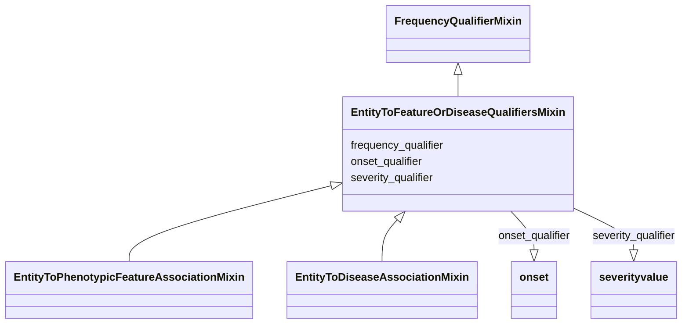

# Class: EntityToFeatureOrDiseaseQualifiersMixin


_Qualifiers for entity to disease or phenotype associations._


URI: [bican:EntityToFeatureOrDiseaseQualifiersMixin](https://identifiers.org/brain-bican/vocab/EntityToFeatureOrDiseaseQualifiersMixin)





## Inheritance
* [FrequencyQualifierMixin](FrequencyQualifierMixin.md)
    * **EntityToFeatureOrDiseaseQualifiersMixin**
        * [EntityToPhenotypicFeatureAssociationMixin](EntityToPhenotypicFeatureAssociationMixin.md) [ [FrequencyQuantifier](FrequencyQuantifier.md)]
        * [EntityToDiseaseAssociationMixin](EntityToDiseaseAssociationMixin.md)


## Slots

| Name | Cardinality and Range | Description | Inheritance |
| ---  | --- | --- | --- |
| [severity_qualifier](severity_qualifier.md) | 0..1 <br/> [SeverityValue](SeverityValue.md) | a qualifier used in a phenotypic association to state how severe the phenotyp... | direct |
| [onset_qualifier](onset_qualifier.md) | 0..1 <br/> [Onset](Onset.md) | a qualifier used in a phenotypic association to state when the phenotype appe... | direct |
| [frequency_qualifier](frequency_qualifier.md) | 0..1 <br/> [FrequencyValue](FrequencyValue.md) | a qualifier used in a phenotypic association to state how frequent the phenot... | [FrequencyQualifierMixin](FrequencyQualifierMixin.md) |


## Mixin Usage

| mixed into | description |
| --- | --- |


## Identifier and Mapping Information


### Schema Source


* from schema: https://identifiers.org/brain-bican/kb-model


## Mappings

| Mapping Type | Mapped Value |
| ---  | ---  |
| self | bican:EntityToFeatureOrDiseaseQualifiersMixin |
| native | bican:EntityToFeatureOrDiseaseQualifiersMixin |


## LinkML Source

<!-- TODO: investigate https://stackoverflow.com/questions/37606292/how-to-create-tabbed-code-blocks-in-mkdocs-or-sphinx -->

### Direct

<details>
```yaml
name: entity to feature or disease qualifiers mixin
description: Qualifiers for entity to disease or phenotype associations.
from_schema: https://identifiers.org/brain-bican/kb-model
is_a: frequency qualifier mixin
mixin: true
slots:
- severity qualifier
- onset qualifier

```
</details>

### Induced

<details>
```yaml
name: entity to feature or disease qualifiers mixin
description: Qualifiers for entity to disease or phenotype associations.
from_schema: https://identifiers.org/brain-bican/kb-model
is_a: frequency qualifier mixin
mixin: true
attributes:
  severity qualifier:
    name: severity qualifier
    description: a qualifier used in a phenotypic association to state how severe
      the phenotype is in the subject
    in_subset:
    - translator_minimal
    from_schema: https://identifiers.org/brain-bican/kb-model
    rank: 1000
    is_a: qualifier
    domain: association
    alias: severity_qualifier
    owner: entity to feature or disease qualifiers mixin
    domain_of:
    - entity to feature or disease qualifiers mixin
    range: severity value
  onset qualifier:
    name: onset qualifier
    description: a qualifier used in a phenotypic association to state when the phenotype
      appears is in the subject
    in_subset:
    - translator_minimal
    from_schema: https://identifiers.org/brain-bican/kb-model
    rank: 1000
    is_a: qualifier
    domain: association
    alias: onset_qualifier
    owner: entity to feature or disease qualifiers mixin
    domain_of:
    - entity to feature or disease qualifiers mixin
    range: onset
  frequency qualifier:
    name: frequency qualifier
    description: a qualifier used in a phenotypic association to state how frequent
      the phenotype is observed in the subject
    in_subset:
    - translator_minimal
    from_schema: https://identifiers.org/brain-bican/kb-model
    rank: 1000
    is_a: qualifier
    domain: association
    alias: frequency_qualifier
    owner: entity to feature or disease qualifiers mixin
    domain_of:
    - frequency qualifier mixin
    range: frequency value

```
</details>