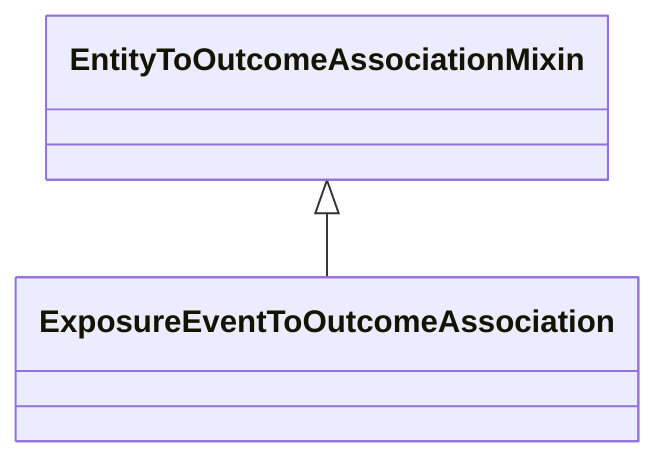

# Class: EntityToOutcomeAssociationMixin


_An association between some entity and an outcome_


URI: [bican:EntityToOutcomeAssociationMixin](https://identifiers.org/brain-bican/vocab/EntityToOutcomeAssociationMixin)





<!-- no inheritance hierarchy -->


## Slots

| Name | Cardinality and Range | Description | Inheritance |
| ---  | --- | --- | --- |


## Mixin Usage

| mixed into | description |
| --- | --- |
| [ExposureEventToOutcomeAssociation](ExposureEventToOutcomeAssociation.md) | An association between an exposure event and an outcome |


## Identifier and Mapping Information


### Schema Source


* from schema: https://identifiers.org/brain-bican/kb-model


## Mappings

| Mapping Type | Mapped Value |
| ---  | ---  |
| self | bican:EntityToOutcomeAssociationMixin |
| native | bican:EntityToOutcomeAssociationMixin |


## LinkML Source

<!-- TODO: investigate https://stackoverflow.com/questions/37606292/how-to-create-tabbed-code-blocks-in-mkdocs-or-sphinx -->

### Direct

<details>
```yaml
name: entity to outcome association mixin
description: An association between some entity and an outcome
from_schema: https://identifiers.org/brain-bican/kb-model
mixin: true
slot_usage:
  object:
    name: object
    domain_of:
    - association
    range: outcome
defining_slots:
- object

```
</details>

### Induced

<details>
```yaml
name: entity to outcome association mixin
description: An association between some entity and an outcome
from_schema: https://identifiers.org/brain-bican/kb-model
mixin: true
slot_usage:
  object:
    name: object
    domain_of:
    - association
    range: outcome
defining_slots:
- object

```
</details>