# Class: EntityToPhenotypicFeatureAssociationMixin


URI: [bican:EntityToPhenotypicFeatureAssociationMixin](https://identifiers.org/brain-bican/vocab/EntityToPhenotypicFeatureAssociationMixin)

```mermaid
 classDiagram
    class EntityToPhenotypicFeatureAssociationMixin
      FrequencyQuantifier <|-- EntityToPhenotypicFeatureAssociationMixin
      EntityToFeatureOrDiseaseQualifiersMixin <|-- EntityToPhenotypicFeatureAssociationMixin
      

      EntityToPhenotypicFeatureAssociationMixin <|-- GenotypeToPhenotypicFeatureAssociation
      EntityToPhenotypicFeatureAssociationMixin <|-- ExposureEventToPhenotypicFeatureAssociation
      EntityToPhenotypicFeatureAssociationMixin <|-- DiseaseToPhenotypicFeatureAssociation
      EntityToPhenotypicFeatureAssociationMixin <|-- CaseToPhenotypicFeatureAssociation
      EntityToPhenotypicFeatureAssociationMixin <|-- BehaviorToBehavioralFeatureAssociation
      EntityToPhenotypicFeatureAssociationMixin <|-- GeneToDiseaseOrPhenotypicFeatureAssociation
      EntityToPhenotypicFeatureAssociationMixin <|-- GeneToPhenotypicFeatureAssociation
      EntityToPhenotypicFeatureAssociationMixin <|-- VariantToPhenotypicFeatureAssociation
      
      
      EntityToPhenotypicFeatureAssociationMixin : frequency_qualifier
        
      EntityToPhenotypicFeatureAssociationMixin : has_count
        
      EntityToPhenotypicFeatureAssociationMixin : has_percentage
        
      EntityToPhenotypicFeatureAssociationMixin : has_quotient
        
      EntityToPhenotypicFeatureAssociationMixin : has_total
        
      EntityToPhenotypicFeatureAssociationMixin : onset_qualifier
        
          EntityToPhenotypicFeatureAssociationMixin --|> onset : onset_qualifier
        
      EntityToPhenotypicFeatureAssociationMixin : severity_qualifier
        
          EntityToPhenotypicFeatureAssociationMixin --|> severity value : severity_qualifier
        
      EntityToPhenotypicFeatureAssociationMixin : sex_qualifier
        
          EntityToPhenotypicFeatureAssociationMixin --|> biological sex : sex_qualifier
        
      
```





## Inheritance
* [FrequencyQualifierMixin](FrequencyQualifierMixin.md)
    * [EntityToFeatureOrDiseaseQualifiersMixin](EntityToFeatureOrDiseaseQualifiersMixin.md)
        * **EntityToPhenotypicFeatureAssociationMixin** [ [FrequencyQuantifier](FrequencyQuantifier.md)]


## Slots

| Name | Cardinality and Range | Description | Inheritance |
| ---  | --- | --- | --- |
| [sex_qualifier](sex_qualifier.md) | 0..1 <br/> [BiologicalSex](BiologicalSex.md) | a qualifier used in a phenotypic association to state whether the association... | direct |
| [has_count](has_count.md) | 0..1 <br/> [Integer](Integer.md) | number of things with a particular property | [FrequencyQuantifier](FrequencyQuantifier.md) |
| [has_total](has_total.md) | 0..1 <br/> [Integer](Integer.md) | total number of things in a particular reference set | [FrequencyQuantifier](FrequencyQuantifier.md) |
| [has_quotient](has_quotient.md) | 0..1 <br/> [Double](Double.md) |  | [FrequencyQuantifier](FrequencyQuantifier.md) |
| [has_percentage](has_percentage.md) | 0..1 <br/> [Double](Double.md) | equivalent to has quotient multiplied by 100 | [FrequencyQuantifier](FrequencyQuantifier.md) |
| [severity_qualifier](severity_qualifier.md) | 0..1 <br/> [SeverityValue](SeverityValue.md) | a qualifier used in a phenotypic association to state how severe the phenotyp... | [EntityToFeatureOrDiseaseQualifiersMixin](EntityToFeatureOrDiseaseQualifiersMixin.md) |
| [onset_qualifier](onset_qualifier.md) | 0..1 <br/> [Onset](Onset.md) | a qualifier used in a phenotypic association to state when the phenotype appe... | [EntityToFeatureOrDiseaseQualifiersMixin](EntityToFeatureOrDiseaseQualifiersMixin.md) |
| [frequency_qualifier](frequency_qualifier.md) | 0..1 <br/> [FrequencyValue](FrequencyValue.md) | a qualifier used in a phenotypic association to state how frequent the phenot... | [FrequencyQualifierMixin](FrequencyQualifierMixin.md) |


## Mixin Usage

| mixed into | description |
| --- | --- |
| [GenotypeToPhenotypicFeatureAssociation](GenotypeToPhenotypicFeatureAssociation.md) | Any association between one genotype and a phenotypic feature, where having t... |
| [ExposureEventToPhenotypicFeatureAssociation](ExposureEventToPhenotypicFeatureAssociation.md) | Any association between an environment and a phenotypic feature, where being ... |
| [DiseaseToPhenotypicFeatureAssociation](DiseaseToPhenotypicFeatureAssociation.md) | An association between a disease and a phenotypic feature in which the phenot... |
| [CaseToPhenotypicFeatureAssociation](CaseToPhenotypicFeatureAssociation.md) | An association between a case (e |
| [BehaviorToBehavioralFeatureAssociation](BehaviorToBehavioralFeatureAssociation.md) | An association between an mixture behavior and a behavioral feature manifeste... |
| [GeneToDiseaseOrPhenotypicFeatureAssociation](GeneToDiseaseOrPhenotypicFeatureAssociation.md) |  |
| [GeneToPhenotypicFeatureAssociation](GeneToPhenotypicFeatureAssociation.md) |  |
| [VariantToPhenotypicFeatureAssociation](VariantToPhenotypicFeatureAssociation.md) |  |


## Identifier and Mapping Information


### Schema Source


* from schema: https://identifiers.org/brain-bican/kb-model


## Mappings

| Mapping Type | Mapped Value |
| ---  | ---  |
| self | bican:EntityToPhenotypicFeatureAssociationMixin |
| native | bican:EntityToPhenotypicFeatureAssociationMixin |


## LinkML Source

<!-- TODO: investigate https://stackoverflow.com/questions/37606292/how-to-create-tabbed-code-blocks-in-mkdocs-or-sphinx -->

### Direct

<details>
```yaml
name: entity to phenotypic feature association mixin
from_schema: https://identifiers.org/brain-bican/kb-model
is_a: entity to feature or disease qualifiers mixin
mixin: true
mixins:
- frequency quantifier
slots:
- sex qualifier
slot_usage:
  object:
    name: object
    examples:
    - value: HP:0002487
      description: Hyperkinesis
    - value: WBPhenotype:0000180
      description: axon morphology variant
    - value: MP:0001569
      description: abnormal circulating bilirubin level
    values_from:
    - upheno
    - hp
    - mp
    - wbphenotype
    domain_of:
    - association
    range: phenotypic feature
defining_slots:
- object

```
</details>

### Induced

<details>
```yaml
name: entity to phenotypic feature association mixin
from_schema: https://identifiers.org/brain-bican/kb-model
is_a: entity to feature or disease qualifiers mixin
mixin: true
mixins:
- frequency quantifier
slot_usage:
  object:
    name: object
    examples:
    - value: HP:0002487
      description: Hyperkinesis
    - value: WBPhenotype:0000180
      description: axon morphology variant
    - value: MP:0001569
      description: abnormal circulating bilirubin level
    values_from:
    - upheno
    - hp
    - mp
    - wbphenotype
    domain_of:
    - association
    range: phenotypic feature
attributes:
  sex qualifier:
    name: sex qualifier
    description: a qualifier used in a phenotypic association to state whether the
      association is specific to a particular sex.
    in_subset:
    - translator_minimal
    from_schema: https://identifiers.org/brain-bican/kb-model
    rank: 1000
    is_a: qualifier
    domain: association
    alias: sex_qualifier
    owner: entity to phenotypic feature association mixin
    domain_of:
    - entity to phenotypic feature association mixin
    range: biological sex
  has count:
    name: has count
    description: number of things with a particular property
    from_schema: https://identifiers.org/brain-bican/kb-model
    exact_mappings:
    - LOINC:has_count
    rank: 1000
    is_a: aggregate statistic
    domain: named thing
    alias: has_count
    owner: entity to phenotypic feature association mixin
    domain_of:
    - frequency quantifier
    range: integer
  has total:
    name: has total
    description: total number of things in a particular reference set
    from_schema: https://identifiers.org/brain-bican/kb-model
    rank: 1000
    is_a: aggregate statistic
    domain: named thing
    alias: has_total
    owner: entity to phenotypic feature association mixin
    domain_of:
    - frequency quantifier
    range: integer
  has quotient:
    name: has quotient
    from_schema: https://identifiers.org/brain-bican/kb-model
    rank: 1000
    is_a: aggregate statistic
    domain: named thing
    alias: has_quotient
    owner: entity to phenotypic feature association mixin
    domain_of:
    - frequency quantifier
    range: double
  has percentage:
    name: has percentage
    description: equivalent to has quotient multiplied by 100
    from_schema: https://identifiers.org/brain-bican/kb-model
    rank: 1000
    is_a: aggregate statistic
    domain: named thing
    alias: has_percentage
    owner: entity to phenotypic feature association mixin
    domain_of:
    - frequency quantifier
    range: double
  severity qualifier:
    name: severity qualifier
    description: a qualifier used in a phenotypic association to state how severe
      the phenotype is in the subject
    in_subset:
    - translator_minimal
    from_schema: https://identifiers.org/brain-bican/kb-model
    rank: 1000
    is_a: qualifier
    domain: association
    alias: severity_qualifier
    owner: entity to phenotypic feature association mixin
    domain_of:
    - entity to feature or disease qualifiers mixin
    range: severity value
  onset qualifier:
    name: onset qualifier
    description: a qualifier used in a phenotypic association to state when the phenotype
      appears is in the subject
    in_subset:
    - translator_minimal
    from_schema: https://identifiers.org/brain-bican/kb-model
    rank: 1000
    is_a: qualifier
    domain: association
    alias: onset_qualifier
    owner: entity to phenotypic feature association mixin
    domain_of:
    - entity to feature or disease qualifiers mixin
    range: onset
  frequency qualifier:
    name: frequency qualifier
    description: a qualifier used in a phenotypic association to state how frequent
      the phenotype is observed in the subject
    in_subset:
    - translator_minimal
    from_schema: https://identifiers.org/brain-bican/kb-model
    rank: 1000
    is_a: qualifier
    domain: association
    alias: frequency_qualifier
    owner: entity to phenotypic feature association mixin
    domain_of:
    - frequency qualifier mixin
    range: frequency value
defining_slots:
- object

```
</details>