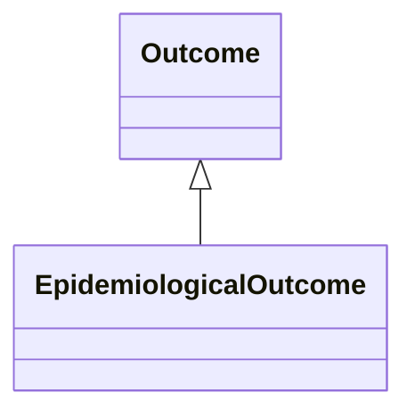

# Class: EpidemiologicalOutcome


_An epidemiological outcome, such as societal disease burden, resulting from an exposure event._


URI: [bican:EpidemiologicalOutcome](https://identifiers.org/brain-bican/vocab/EpidemiologicalOutcome)





## Inheritance
* **EpidemiologicalOutcome** [ [Outcome](Outcome.md)]


## Slots

| Name | Cardinality and Range | Description | Inheritance |
| ---  | --- | --- | --- |


## Identifier and Mapping Information


### Schema Source


* from schema: https://identifiers.org/brain-bican/kb-model


## Mappings

| Mapping Type | Mapped Value |
| ---  | ---  |
| self | bican:EpidemiologicalOutcome |
| native | bican:EpidemiologicalOutcome |
| related | NCIT:C19291 |


## LinkML Source

<!-- TODO: investigate https://stackoverflow.com/questions/37606292/how-to-create-tabbed-code-blocks-in-mkdocs-or-sphinx -->

### Direct

<details>
```yaml
name: epidemiological outcome
description: An epidemiological outcome, such as societal disease burden, resulting
  from an exposure event.
from_schema: https://identifiers.org/brain-bican/kb-model
related_mappings:
- NCIT:C19291
mixins:
- outcome

```
</details>

### Induced

<details>
```yaml
name: epidemiological outcome
description: An epidemiological outcome, such as societal disease burden, resulting
  from an exposure event.
from_schema: https://identifiers.org/brain-bican/kb-model
related_mappings:
- NCIT:C19291
mixins:
- outcome

```
</details>