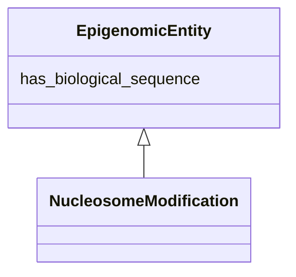

# Class: EpigenomicEntity


URI: [bican:EpigenomicEntity](https://identifiers.org/brain-bican/vocab/EpigenomicEntity)





<!-- no inheritance hierarchy -->


## Slots

| Name | Cardinality and Range | Description | Inheritance |
| ---  | --- | --- | --- |
| [has_biological_sequence](has_biological_sequence.md) | 0..1 <br/> [BiologicalSequence](BiologicalSequence.md) | connects a genomic feature to its sequence | direct |


## Mixin Usage

| mixed into | description |
| --- | --- |
| [NucleosomeModification](NucleosomeModification.md) | A chemical modification of a histone protein within a nucleosome octomer or a... |


## Identifier and Mapping Information


### Schema Source


* from schema: https://identifiers.org/brain-bican/kb-model


## Mappings

| Mapping Type | Mapped Value |
| ---  | ---  |
| self | bican:EpigenomicEntity |
| native | bican:EpigenomicEntity |


## LinkML Source

<!-- TODO: investigate https://stackoverflow.com/questions/37606292/how-to-create-tabbed-code-blocks-in-mkdocs-or-sphinx -->

### Direct

<details>
```yaml
name: epigenomic entity
in_subset:
- translator_minimal
from_schema: https://identifiers.org/brain-bican/kb-model
mixin: true
slots:
- has biological sequence

```
</details>

### Induced

<details>
```yaml
name: epigenomic entity
in_subset:
- translator_minimal
from_schema: https://identifiers.org/brain-bican/kb-model
mixin: true
attributes:
  has biological sequence:
    name: has biological sequence
    description: connects a genomic feature to its sequence
    from_schema: https://identifiers.org/brain-bican/kb-model
    rank: 1000
    is_a: node property
    domain: named thing
    alias: has_biological_sequence
    owner: epigenomic entity
    domain_of:
    - genomic entity
    - epigenomic entity
    range: biological sequence

```
</details>