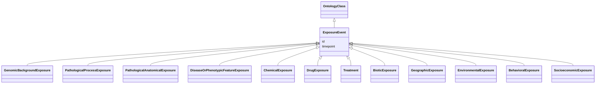

# Class: ExposureEvent


_A (possibly time bounded) incidence of a feature of the environment of an organism that influences one or more phenotypic features of that organism, potentially mediated by genes_


URI: [bican:ExposureEvent](https://identifiers.org/brain-bican/vocab/ExposureEvent)





## Inheritance
* [OntologyClass](OntologyClass.md)
    * **ExposureEvent**


## Slots

| Name | Cardinality and Range | Description | Inheritance |
| ---  | --- | --- | --- |
| [timepoint](timepoint.md) | 0..1 <br/> [TimeType](TimeType.md) | a point in time | direct |
| [id](id.md) | 1..1 <br/> [String](String.md) | A unique identifier for an entity | [OntologyClass](OntologyClass.md) |


## Mixin Usage

| mixed into | description |
| --- | --- |
| [GenomicBackgroundExposure](GenomicBackgroundExposure.md) | A genomic background exposure is where an individual's specific genomic backg... |
| [PathologicalProcessExposure](PathologicalProcessExposure.md) | A pathological process, when viewed as an exposure, representing a preconditi... |
| [PathologicalAnatomicalExposure](PathologicalAnatomicalExposure.md) | An abnormal anatomical structure, when viewed as an exposure, representing an... |
| [DiseaseOrPhenotypicFeatureExposure](DiseaseOrPhenotypicFeatureExposure.md) | A disease or phenotypic feature state, when viewed as an exposure, represents... |
| [ChemicalExposure](ChemicalExposure.md) | A chemical exposure is an intake of a particular chemical entity |
| [DrugExposure](DrugExposure.md) | A drug exposure is an intake of a particular drug |
| [Treatment](Treatment.md) | A treatment is targeted at a disease or phenotype and may involve multiple dr... |
| [BioticExposure](BioticExposure.md) | An external biotic exposure is an intake of (sometimes pathological) biologic... |
| [GeographicExposure](GeographicExposure.md) | A geographic exposure is a factor relating to geographic proximity to some im... |
| [EnvironmentalExposure](EnvironmentalExposure.md) | A environmental exposure is a factor relating to abiotic processes in the env... |
| [BehavioralExposure](BehavioralExposure.md) | A behavioral exposure is a factor relating to behavior impacting an individua... |
| [SocioeconomicExposure](SocioeconomicExposure.md) | A socioeconomic exposure is a factor relating to social and financial status ... |


## Usages

| used by | used in | type | used |
| ---  | --- | --- | --- |
| [DiseaseToExposureEventAssociation](DiseaseToExposureEventAssociation.md) | [object](object.md) | range | [ExposureEvent](ExposureEvent.md) |
| [ExposureEventToPhenotypicFeatureAssociation](ExposureEventToPhenotypicFeatureAssociation.md) | [subject](subject.md) | range | [ExposureEvent](ExposureEvent.md) |


## Aliases


* exposure
* experimental condition


## Identifier and Mapping Information


### Schema Source


* from schema: https://identifiers.org/brain-bican/kb-model


## Mappings

| Mapping Type | Mapped Value |
| ---  | ---  |
| self | bican:ExposureEvent |
| native | bican:ExposureEvent |
| exact | XCO:0000000 |


## LinkML Source

<!-- TODO: investigate https://stackoverflow.com/questions/37606292/how-to-create-tabbed-code-blocks-in-mkdocs-or-sphinx -->

### Direct

<details>
```yaml
name: exposure event
description: A (possibly time bounded) incidence of a feature of the environment of
  an organism that influences one or more phenotypic features of that organism, potentially
  mediated by genes
in_subset:
- model_organism_database
from_schema: https://identifiers.org/brain-bican/kb-model
aliases:
- exposure
- experimental condition
exact_mappings:
- XCO:0000000
is_a: ontology class
mixin: true
slots:
- timepoint

```
</details>

### Induced

<details>
```yaml
name: exposure event
description: A (possibly time bounded) incidence of a feature of the environment of
  an organism that influences one or more phenotypic features of that organism, potentially
  mediated by genes
in_subset:
- model_organism_database
from_schema: https://identifiers.org/brain-bican/kb-model
aliases:
- exposure
- experimental condition
exact_mappings:
- XCO:0000000
is_a: ontology class
mixin: true
attributes:
  timepoint:
    name: timepoint
    description: a point in time
    from_schema: https://identifiers.org/brain-bican/kb-model
    aliases:
    - duration
    rank: 1000
    alias: timepoint
    owner: exposure event
    domain_of:
    - geographic location at time
    - exposure event
    - association
    range: time type
  id:
    name: id
    description: A unique identifier for an entity. Must be either a CURIE shorthand
      for a URI or a complete URI
    in_subset:
    - translator_minimal
    from_schema: https://identifiers.org/brain-bican/kb-model
    exact_mappings:
    - AGRKB:primaryId
    - gff3:ID
    - gpi:DB_Object_ID
    rank: 1000
    domain: entity
    identifier: true
    alias: id
    owner: exposure event
    domain_of:
    - genome assembly
    - ontology class
    - entity
    range: string
    required: true

```
</details>