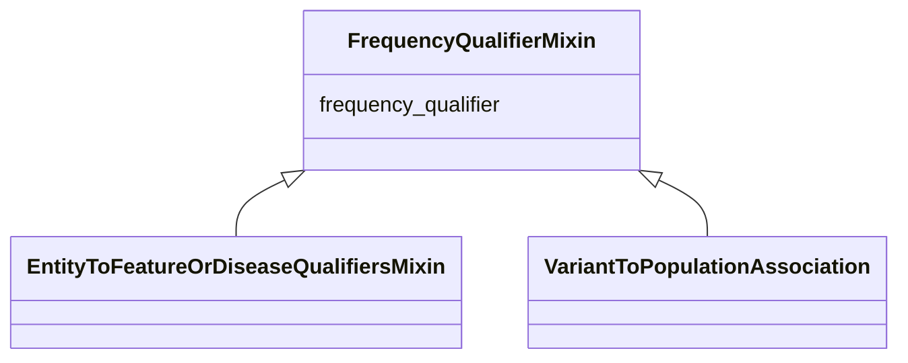

# Class: FrequencyQualifierMixin


_Qualifier for frequency type associations_


URI: [bican:FrequencyQualifierMixin](https://identifiers.org/brain-bican/vocab/FrequencyQualifierMixin)





## Inheritance
* **FrequencyQualifierMixin**
    * [EntityToFeatureOrDiseaseQualifiersMixin](EntityToFeatureOrDiseaseQualifiersMixin.md)


## Slots

| Name | Cardinality and Range | Description | Inheritance |
| ---  | --- | --- | --- |
| [frequency_qualifier](frequency_qualifier.md) | 0..1 <br/> [FrequencyValue](FrequencyValue.md) | a qualifier used in a phenotypic association to state how frequent the phenot... | direct |


## Mixin Usage

| mixed into | description |
| --- | --- |
| [VariantToPopulationAssociation](VariantToPopulationAssociation.md) | An association between a variant and a population, where the variant has part... |


## Identifier and Mapping Information


### Schema Source


* from schema: https://identifiers.org/brain-bican/kb-model


## Mappings

| Mapping Type | Mapped Value |
| ---  | ---  |
| self | bican:FrequencyQualifierMixin |
| native | bican:FrequencyQualifierMixin |


## LinkML Source

<!-- TODO: investigate https://stackoverflow.com/questions/37606292/how-to-create-tabbed-code-blocks-in-mkdocs-or-sphinx -->

### Direct

<details>
```yaml
name: frequency qualifier mixin
description: Qualifier for frequency type associations
from_schema: https://identifiers.org/brain-bican/kb-model
mixin: true
slots:
- frequency qualifier

```
</details>

### Induced

<details>
```yaml
name: frequency qualifier mixin
description: Qualifier for frequency type associations
from_schema: https://identifiers.org/brain-bican/kb-model
mixin: true
attributes:
  frequency qualifier:
    name: frequency qualifier
    description: a qualifier used in a phenotypic association to state how frequent
      the phenotype is observed in the subject
    in_subset:
    - translator_minimal
    from_schema: https://identifiers.org/brain-bican/kb-model
    rank: 1000
    is_a: qualifier
    domain: association
    alias: frequency_qualifier
    owner: frequency qualifier mixin
    domain_of:
    - frequency qualifier mixin
    range: frequency value

```
</details>