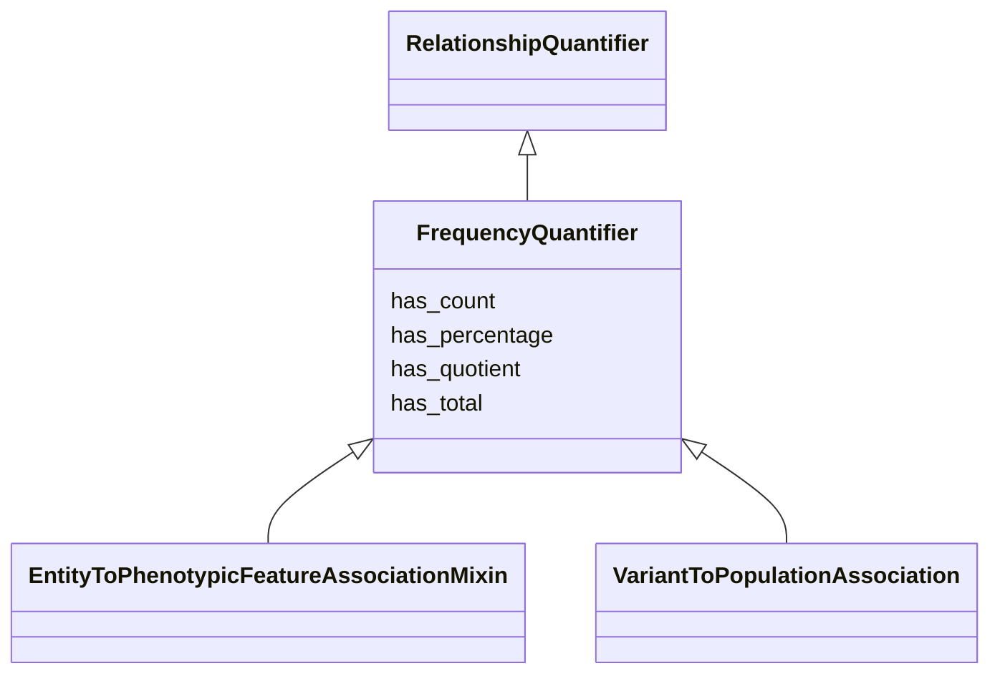

# Class: FrequencyQuantifier


URI: [bican:FrequencyQuantifier](https://identifiers.org/brain-bican/vocab/FrequencyQuantifier)





## Inheritance
* [RelationshipQuantifier](RelationshipQuantifier.md)
    * **FrequencyQuantifier**


## Slots

| Name | Cardinality and Range | Description | Inheritance |
| ---  | --- | --- | --- |
| [has_count](has_count.md) | 0..1 <br/> [Integer](Integer.md) | number of things with a particular property | direct |
| [has_total](has_total.md) | 0..1 <br/> [Integer](Integer.md) | total number of things in a particular reference set | direct |
| [has_quotient](has_quotient.md) | 0..1 <br/> [Double](Double.md) |  | direct |
| [has_percentage](has_percentage.md) | 0..1 <br/> [Double](Double.md) | equivalent to has quotient multiplied by 100 | direct |


## Mixin Usage

| mixed into | description |
| --- | --- |
| [EntityToPhenotypicFeatureAssociationMixin](EntityToPhenotypicFeatureAssociationMixin.md) |  |
| [VariantToPopulationAssociation](VariantToPopulationAssociation.md) | An association between a variant and a population, where the variant has part... |


## Identifier and Mapping Information


### Schema Source


* from schema: https://identifiers.org/brain-bican/kb-model


## Mappings

| Mapping Type | Mapped Value |
| ---  | ---  |
| self | bican:FrequencyQuantifier |
| native | bican:FrequencyQuantifier |


## LinkML Source

<!-- TODO: investigate https://stackoverflow.com/questions/37606292/how-to-create-tabbed-code-blocks-in-mkdocs-or-sphinx -->

### Direct

<details>
```yaml
name: frequency quantifier
from_schema: https://identifiers.org/brain-bican/kb-model
is_a: relationship quantifier
mixin: true
slots:
- has count
- has total
- has quotient
- has percentage

```
</details>

### Induced

<details>
```yaml
name: frequency quantifier
from_schema: https://identifiers.org/brain-bican/kb-model
is_a: relationship quantifier
mixin: true
attributes:
  has count:
    name: has count
    description: number of things with a particular property
    from_schema: https://identifiers.org/brain-bican/kb-model
    exact_mappings:
    - LOINC:has_count
    rank: 1000
    is_a: aggregate statistic
    domain: named thing
    alias: has_count
    owner: frequency quantifier
    domain_of:
    - frequency quantifier
    range: integer
  has total:
    name: has total
    description: total number of things in a particular reference set
    from_schema: https://identifiers.org/brain-bican/kb-model
    rank: 1000
    is_a: aggregate statistic
    domain: named thing
    alias: has_total
    owner: frequency quantifier
    domain_of:
    - frequency quantifier
    range: integer
  has quotient:
    name: has quotient
    from_schema: https://identifiers.org/brain-bican/kb-model
    rank: 1000
    is_a: aggregate statistic
    domain: named thing
    alias: has_quotient
    owner: frequency quantifier
    domain_of:
    - frequency quantifier
    range: double
  has percentage:
    name: has percentage
    description: equivalent to has quotient multiplied by 100
    from_schema: https://identifiers.org/brain-bican/kb-model
    rank: 1000
    is_a: aggregate statistic
    domain: named thing
    alias: has_percentage
    owner: frequency quantifier
    domain_of:
    - frequency quantifier
    range: double

```
</details>