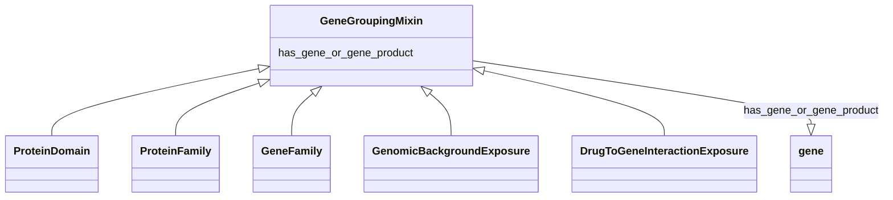

# Class: GeneGroupingMixin


_any grouping of multiple genes or gene products_


URI: [bican:GeneGroupingMixin](https://identifiers.org/brain-bican/vocab/GeneGroupingMixin)





<!-- no inheritance hierarchy -->


## Slots

| Name | Cardinality and Range | Description | Inheritance |
| ---  | --- | --- | --- |
| [has_gene_or_gene_product](has_gene_or_gene_product.md) | 0..* <br/> [Gene](Gene.md) | connects an entity with one or more gene or gene products | direct |


## Mixin Usage

| mixed into | description |
| --- | --- |
| [ProteinDomain](ProteinDomain.md) | A conserved part of protein sequence and (tertiary) structure that can evolve... |
| [ProteinFamily](ProteinFamily.md) |  |
| [GeneFamily](GeneFamily.md) | any grouping of multiple genes or gene products related by common descent |
| [GenomicBackgroundExposure](GenomicBackgroundExposure.md) | A genomic background exposure is where an individual's specific genomic backg... |
| [DrugToGeneInteractionExposure](DrugToGeneInteractionExposure.md) | drug to gene interaction exposure is a drug exposure is where the interaction... |


## Identifier and Mapping Information


### Schema Source


* from schema: https://identifiers.org/brain-bican/kb-model


## Mappings

| Mapping Type | Mapped Value |
| ---  | ---  |
| self | bican:GeneGroupingMixin |
| native | bican:GeneGroupingMixin |


## LinkML Source

<!-- TODO: investigate https://stackoverflow.com/questions/37606292/how-to-create-tabbed-code-blocks-in-mkdocs-or-sphinx -->

### Direct

<details>
```yaml
name: gene grouping mixin
description: any grouping of multiple genes or gene products
from_schema: https://identifiers.org/brain-bican/kb-model
mixin: true
slots:
- has gene or gene product

```
</details>

### Induced

<details>
```yaml
name: gene grouping mixin
description: any grouping of multiple genes or gene products
from_schema: https://identifiers.org/brain-bican/kb-model
mixin: true
attributes:
  has gene or gene product:
    name: has gene or gene product
    description: connects an entity with one or more gene or gene products
    from_schema: https://identifiers.org/brain-bican/kb-model
    rank: 1000
    is_a: node property
    domain: named thing
    multivalued: true
    alias: has_gene_or_gene_product
    owner: gene grouping mixin
    domain_of:
    - gene grouping mixin
    range: gene

```
</details>