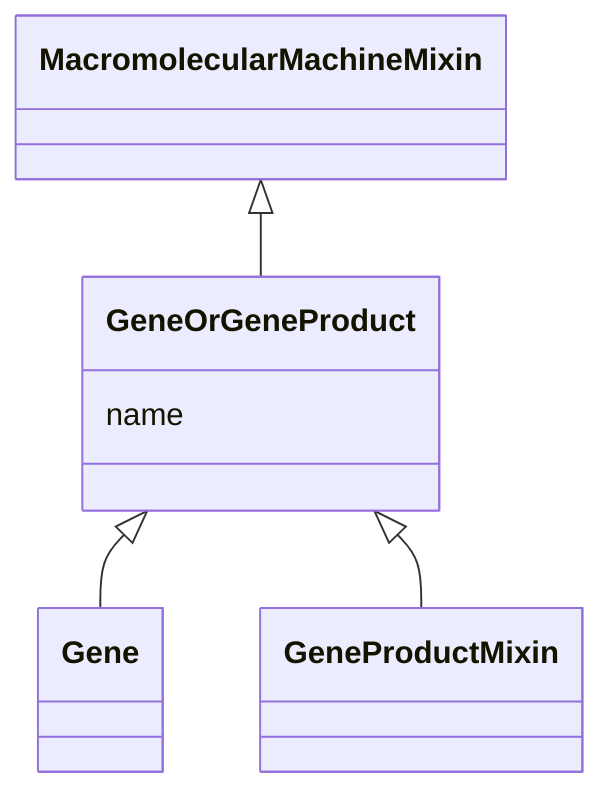

# Class: GeneOrGeneProduct


_A union of gene loci or gene products. Frequently an identifier for one will be used as proxy for another_


URI: [bican:GeneOrGeneProduct](https://identifiers.org/brain-bican/vocab/GeneOrGeneProduct)





## Inheritance
* [MacromolecularMachineMixin](MacromolecularMachineMixin.md)
    * **GeneOrGeneProduct**
        * [GeneProductMixin](GeneProductMixin.md)


## Slots

| Name | Cardinality and Range | Description | Inheritance |
| ---  | --- | --- | --- |
| [name](name.md) | 0..1 <br/> [SymbolType](SymbolType.md) | genes are typically designated by a short symbol and a full name | [MacromolecularMachineMixin](MacromolecularMachineMixin.md) |


## Mixin Usage

| mixed into | description |
| --- | --- |
| [Gene](Gene.md) | A region (or regions) that includes all of the sequence elements necessary to... |


## Usages

| used by | used in | type | used |
| ---  | --- | --- | --- |
| [GeneToGeneAssociation](GeneToGeneAssociation.md) | [subject](subject.md) | range | [GeneOrGeneProduct](GeneOrGeneProduct.md) |
| [GeneToGeneAssociation](GeneToGeneAssociation.md) | [object](object.md) | range | [GeneOrGeneProduct](GeneOrGeneProduct.md) |
| [GeneToGeneHomologyAssociation](GeneToGeneHomologyAssociation.md) | [subject](subject.md) | range | [GeneOrGeneProduct](GeneOrGeneProduct.md) |
| [GeneToGeneHomologyAssociation](GeneToGeneHomologyAssociation.md) | [object](object.md) | range | [GeneOrGeneProduct](GeneOrGeneProduct.md) |
| [GeneToGeneCoexpressionAssociation](GeneToGeneCoexpressionAssociation.md) | [subject](subject.md) | range | [GeneOrGeneProduct](GeneOrGeneProduct.md) |
| [GeneToGeneCoexpressionAssociation](GeneToGeneCoexpressionAssociation.md) | [object](object.md) | range | [GeneOrGeneProduct](GeneOrGeneProduct.md) |
| [PairwiseGeneToGeneInteraction](PairwiseGeneToGeneInteraction.md) | [subject](subject.md) | range | [GeneOrGeneProduct](GeneOrGeneProduct.md) |
| [PairwiseGeneToGeneInteraction](PairwiseGeneToGeneInteraction.md) | [object](object.md) | range | [GeneOrGeneProduct](GeneOrGeneProduct.md) |
| [ReactionToCatalystAssociation](ReactionToCatalystAssociation.md) | [object](object.md) | range | [GeneOrGeneProduct](GeneOrGeneProduct.md) |
| [GeneToPathwayAssociation](GeneToPathwayAssociation.md) | [subject](subject.md) | range | [GeneOrGeneProduct](GeneOrGeneProduct.md) |
| [ChemicalGeneInteractionAssociation](ChemicalGeneInteractionAssociation.md) | [object](object.md) | range | [GeneOrGeneProduct](GeneOrGeneProduct.md) |
| [ChemicalAffectsGeneAssociation](ChemicalAffectsGeneAssociation.md) | [object](object.md) | range | [GeneOrGeneProduct](GeneOrGeneProduct.md) |
| [DrugToGeneAssociation](DrugToGeneAssociation.md) | [object](object.md) | range | [GeneOrGeneProduct](GeneOrGeneProduct.md) |
| [GeneToDiseaseOrPhenotypicFeatureAssociation](GeneToDiseaseOrPhenotypicFeatureAssociation.md) | [subject](subject.md) | range | [GeneOrGeneProduct](GeneOrGeneProduct.md) |
| [GeneToPhenotypicFeatureAssociation](GeneToPhenotypicFeatureAssociation.md) | [subject](subject.md) | range | [GeneOrGeneProduct](GeneOrGeneProduct.md) |
| [GeneToDiseaseAssociation](GeneToDiseaseAssociation.md) | [subject](subject.md) | range | [GeneOrGeneProduct](GeneOrGeneProduct.md) |
| [CausalGeneToDiseaseAssociation](CausalGeneToDiseaseAssociation.md) | [subject](subject.md) | range | [GeneOrGeneProduct](GeneOrGeneProduct.md) |
| [CorrelatedGeneToDiseaseAssociation](CorrelatedGeneToDiseaseAssociation.md) | [subject](subject.md) | range | [GeneOrGeneProduct](GeneOrGeneProduct.md) |
| [DruggableGeneToDiseaseAssociation](DruggableGeneToDiseaseAssociation.md) | [subject](subject.md) | range | [GeneOrGeneProduct](GeneOrGeneProduct.md) |
| [GeneAsAModelOfDiseaseAssociation](GeneAsAModelOfDiseaseAssociation.md) | [subject](subject.md) | range | [GeneOrGeneProduct](GeneOrGeneProduct.md) |
| [GeneHasVariantThatContributesToDiseaseAssociation](GeneHasVariantThatContributesToDiseaseAssociation.md) | [subject](subject.md) | range | [GeneOrGeneProduct](GeneOrGeneProduct.md) |
| [GeneToExpressionSiteAssociation](GeneToExpressionSiteAssociation.md) | [subject](subject.md) | range | [GeneOrGeneProduct](GeneOrGeneProduct.md) |
| [ChemicalEntityOrGeneOrGeneProductRegulatesGeneAssociation](ChemicalEntityOrGeneOrGeneProductRegulatesGeneAssociation.md) | [object](object.md) | range | [GeneOrGeneProduct](GeneOrGeneProduct.md) |


## Identifier and Mapping Information


### Valid ID Prefixes

Instances of this class *should* have identifiers with one of the following prefixes:

* CHEMBL.TARGET

* IUPHAR.FAMILY


### Schema Source


* from schema: https://identifiers.org/brain-bican/kb-model


## Mappings

| Mapping Type | Mapped Value |
| ---  | ---  |
| self | bican:GeneOrGeneProduct |
| native | bican:GeneOrGeneProduct |


## LinkML Source

<!-- TODO: investigate https://stackoverflow.com/questions/37606292/how-to-create-tabbed-code-blocks-in-mkdocs-or-sphinx -->

### Direct

<details>
```yaml
name: gene or gene product
id_prefixes:
- CHEMBL.TARGET
- IUPHAR.FAMILY
description: A union of gene loci or gene products. Frequently an identifier for one
  will be used as proxy for another
from_schema: https://identifiers.org/brain-bican/kb-model
is_a: macromolecular machine mixin
mixin: true

```
</details>

### Induced

<details>
```yaml
name: gene or gene product
id_prefixes:
- CHEMBL.TARGET
- IUPHAR.FAMILY
description: A union of gene loci or gene products. Frequently an identifier for one
  will be used as proxy for another
from_schema: https://identifiers.org/brain-bican/kb-model
is_a: macromolecular machine mixin
mixin: true
attributes:
  name:
    name: name
    description: genes are typically designated by a short symbol and a full name.
      We map the symbol to the default display name and use an additional slot for
      full name
    from_schema: https://identifiers.org/brain-bican/kb-model
    rank: 1000
    domain: entity
    slot_uri: rdfs:label
    alias: name
    owner: gene or gene product
    domain_of:
    - attribute
    - entity
    - macromolecular machine mixin
    range: symbol type

```
</details>