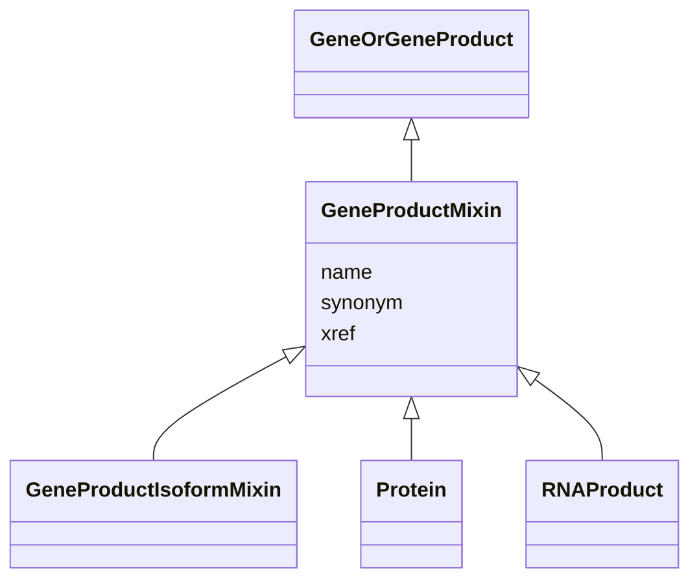

# Class: GeneProductMixin


_The functional molecular product of a single gene locus. Gene products are either proteins or functional RNA molecules._


URI: [bican:GeneProductMixin](https://identifiers.org/brain-bican/vocab/GeneProductMixin)





## Inheritance
* [MacromolecularMachineMixin](MacromolecularMachineMixin.md)
    * [GeneOrGeneProduct](GeneOrGeneProduct.md)
        * **GeneProductMixin**
            * [GeneProductIsoformMixin](GeneProductIsoformMixin.md)


## Slots

| Name | Cardinality and Range | Description | Inheritance |
| ---  | --- | --- | --- |
| [synonym](synonym.md) | 0..* <br/> [LabelType](LabelType.md) | Alternate human-readable names for a thing | direct |
| [xref](xref.md) | 0..* <br/> [Uriorcurie](Uriorcurie.md) | A database cross reference or alternative identifier for a NamedThing or edge... | direct |
| [name](name.md) | 0..1 <br/> [SymbolType](SymbolType.md) | genes are typically designated by a short symbol and a full name | [MacromolecularMachineMixin](MacromolecularMachineMixin.md) |


## Mixin Usage

| mixed into | description |
| --- | --- |
| [Protein](Protein.md) | A gene product that is composed of a chain of amino acid sequences and is pro... |
| [RNAProduct](RNAProduct.md) |  |


## Usages

| used by | used in | type | used |
| ---  | --- | --- | --- |
| [GeneToGeneProductRelationship](GeneToGeneProductRelationship.md) | [object](object.md) | range | [GeneProductMixin](GeneProductMixin.md) |


## Identifier and Mapping Information


### Valid ID Prefixes

Instances of this class *should* have identifiers with one of the following prefixes:

* UniProtKB

* gtpo

* PR


### Schema Source


* from schema: https://identifiers.org/brain-bican/kb-model


## Mappings

| Mapping Type | Mapped Value |
| ---  | ---  |
| self | bican:GeneProductMixin |
| native | bican:GeneProductMixin |
| exact | WIKIDATA:Q424689, GENO:0000907, NCIT:C26548 |


## LinkML Source

<!-- TODO: investigate https://stackoverflow.com/questions/37606292/how-to-create-tabbed-code-blocks-in-mkdocs-or-sphinx -->

### Direct

<details>
```yaml
name: gene product mixin
id_prefixes:
- UniProtKB
- gtpo
- PR
description: The functional molecular product of a single gene locus. Gene products
  are either proteins or functional RNA molecules.
from_schema: https://identifiers.org/brain-bican/kb-model
exact_mappings:
- WIKIDATA:Q424689
- GENO:0000907
- NCIT:C26548
is_a: gene or gene product
mixin: true
slots:
- synonym
- xref

```
</details>

### Induced

<details>
```yaml
name: gene product mixin
id_prefixes:
- UniProtKB
- gtpo
- PR
description: The functional molecular product of a single gene locus. Gene products
  are either proteins or functional RNA molecules.
from_schema: https://identifiers.org/brain-bican/kb-model
exact_mappings:
- WIKIDATA:Q424689
- GENO:0000907
- NCIT:C26548
is_a: gene or gene product
mixin: true
attributes:
  synonym:
    name: synonym
    description: Alternate human-readable names for a thing
    in_subset:
    - translator_minimal
    from_schema: https://identifiers.org/brain-bican/kb-model
    aliases:
    - alias
    narrow_mappings:
    - skos:altLabel
    - gff3:Alias
    - AGRKB:synonyms
    - gpi:DB_Object_Synonyms
    - HANCESTRO:0330
    - IAO:0000136
    - RXNORM:has_tradename
    rank: 1000
    is_a: node property
    domain: named thing
    multivalued: true
    alias: synonym
    owner: gene product mixin
    domain_of:
    - gene
    - gene product mixin
    range: label type
  xref:
    name: xref
    description: A database cross reference or alternative identifier for a NamedThing
      or edge between two  NamedThings.  This property should point to a database
      record or webpage that supports the existence of the edge, or  gives more detail
      about the edge. This property can be used on a node or edge to provide multiple
      URIs or CURIE cross references.
    in_subset:
    - translator_minimal
    from_schema: https://identifiers.org/brain-bican/kb-model
    aliases:
    - dbxref
    - Dbxref
    - DbXref
    - record_url
    - source_record_urls
    narrow_mappings:
    - gff3:Dbxref
    - gpi:DB_Xrefs
    rank: 1000
    domain: named thing
    multivalued: true
    alias: xref
    owner: gene product mixin
    domain_of:
    - named thing
    - publication
    - retrieval source
    - gene
    - gene product mixin
    range: uriorcurie
  name:
    name: name
    description: genes are typically designated by a short symbol and a full name.
      We map the symbol to the default display name and use an additional slot for
      full name
    from_schema: https://identifiers.org/brain-bican/kb-model
    rank: 1000
    domain: entity
    slot_uri: rdfs:label
    alias: name
    owner: gene product mixin
    domain_of:
    - attribute
    - entity
    - macromolecular machine mixin
    range: symbol type

```
</details>