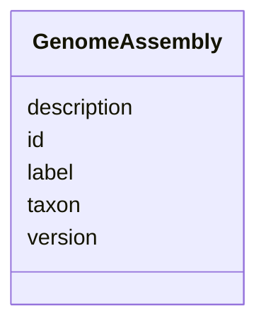

# Class: GenomeAssembly


_Genome assembly to contain version and label information_


URI: [bican:GenomeAssembly](https://identifiers.org/brain-bican/vocab/GenomeAssembly)





<!-- no inheritance hierarchy -->


## Slots

| Name | Cardinality and Range | Description | Inheritance |
| ---  | --- | --- | --- |
| [id](id.md) | 0..1 <br/> [String](String.md) |  | direct |
| [taxon](taxon.md) | 0..1 <br/> [String](String.md) |  | direct |
| [version](version.md) | 0..1 <br/> [String](String.md) |  | direct |
| [label](label.md) | 0..1 <br/> [String](String.md) |  | direct |
| [description](description.md) | 0..1 <br/> [String](String.md) |  | direct |


## Usages

| used by | used in | type | used |
| ---  | --- | --- | --- |
| [AnnotationCollection](AnnotationCollection.md) | [genome_assemblies](genome_assemblies.md) | range | [GenomeAssembly](GenomeAssembly.md) |


## Identifier and Mapping Information


### Schema Source


* from schema: https://identifiers.org/brain-bican/kb-model


## Mappings

| Mapping Type | Mapped Value |
| ---  | ---  |
| self | bican:GenomeAssembly |
| native | bican:GenomeAssembly |


## LinkML Source

<!-- TODO: investigate https://stackoverflow.com/questions/37606292/how-to-create-tabbed-code-blocks-in-mkdocs-or-sphinx -->

### Direct

<details>
```yaml
name: genome assembly
description: Genome assembly to contain version and label information
from_schema: https://identifiers.org/brain-bican/kb-model
attributes:
  id:
    name: id
    from_schema: https://identifiers.org/brain-bican/kb-model
  taxon:
    name: taxon
    from_schema: https://identifiers.org/brain-bican/kb-model
    rank: 1000
  version:
    name: version
    from_schema: https://identifiers.org/brain-bican/kb-model
  label:
    name: label
    from_schema: https://identifiers.org/brain-bican/kb-model
    rank: 1000
  description:
    name: description
    from_schema: https://identifiers.org/brain-bican/kb-model

```
</details>

### Induced

<details>
```yaml
name: genome assembly
description: Genome assembly to contain version and label information
from_schema: https://identifiers.org/brain-bican/kb-model
attributes:
  id:
    name: id
    from_schema: https://identifiers.org/brain-bican/kb-model
    alias: id
    owner: genome assembly
    domain_of:
    - genome assembly
    - ontology class
    - entity
    range: string
  taxon:
    name: taxon
    from_schema: https://identifiers.org/brain-bican/kb-model
    rank: 1000
    alias: taxon
    owner: genome assembly
    domain_of:
    - genome assembly
    range: string
  version:
    name: version
    from_schema: https://identifiers.org/brain-bican/kb-model
    alias: version
    owner: genome assembly
    domain_of:
    - genome annotation
    - genome assembly
    range: string
  label:
    name: label
    from_schema: https://identifiers.org/brain-bican/kb-model
    rank: 1000
    alias: label
    owner: genome assembly
    domain_of:
    - genome assembly
    range: string
  description:
    name: description
    from_schema: https://identifiers.org/brain-bican/kb-model
    alias: description
    owner: genome assembly
    domain_of:
    - genome assembly
    - entity
    range: string

```
</details>