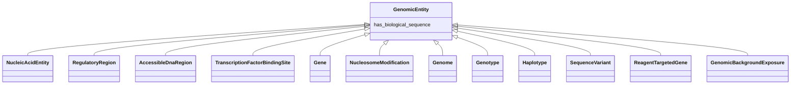

# Class: GenomicEntity


URI: [bican:GenomicEntity](https://identifiers.org/brain-bican/vocab/GenomicEntity)





<!-- no inheritance hierarchy -->


## Slots

| Name | Cardinality and Range | Description | Inheritance |
| ---  | --- | --- | --- |
| [has_biological_sequence](has_biological_sequence.md) | 0..1 <br/> [BiologicalSequence](BiologicalSequence.md) | connects a genomic feature to its sequence | direct |


## Mixin Usage

| mixed into | description |
| --- | --- |
| [NucleicAcidEntity](NucleicAcidEntity.md) | A nucleic acid entity is a molecular entity characterized by availability in ... |
| [RegulatoryRegion](RegulatoryRegion.md) | A region (or regions) of the genome that contains known or putative regulator... |
| [AccessibleDnaRegion](AccessibleDnaRegion.md) | A region (or regions) of a chromatinized genome that has been measured to be ... |
| [TranscriptionFactorBindingSite](TranscriptionFactorBindingSite.md) | A region (or regions) of the genome that contains a region of DNA known or pr... |
| [Gene](Gene.md) | A region (or regions) that includes all of the sequence elements necessary to... |
| [NucleosomeModification](NucleosomeModification.md) | A chemical modification of a histone protein within a nucleosome octomer or a... |
| [Genome](Genome.md) | A genome is the sum of genetic material within a cell or virion |
| [Genotype](Genotype.md) | An information content entity that describes a genome by specifying the total... |
| [Haplotype](Haplotype.md) | A set of zero or more Alleles on a single instance of a Sequence[VMC] |
| [SequenceVariant](SequenceVariant.md) | A sequence_variant is a non exact copy of a sequence_feature or genome exhibi... |
| [ReagentTargetedGene](ReagentTargetedGene.md) | A gene altered in its expression level in the context of some experiment as a... |
| [GenomicBackgroundExposure](GenomicBackgroundExposure.md) | A genomic background exposure is where an individual's specific genomic backg... |


## Identifier and Mapping Information


### Schema Source


* from schema: https://identifiers.org/brain-bican/kb-model


## Mappings

| Mapping Type | Mapped Value |
| ---  | ---  |
| self | bican:GenomicEntity |
| native | bican:GenomicEntity |
| narrow | STY:T028, GENO:0000897 |


## LinkML Source

<!-- TODO: investigate https://stackoverflow.com/questions/37606292/how-to-create-tabbed-code-blocks-in-mkdocs-or-sphinx -->

### Direct

<details>
```yaml
name: genomic entity
in_subset:
- translator_minimal
from_schema: https://identifiers.org/brain-bican/kb-model
narrow_mappings:
- STY:T028
- GENO:0000897
mixin: true
slots:
- has biological sequence

```
</details>

### Induced

<details>
```yaml
name: genomic entity
in_subset:
- translator_minimal
from_schema: https://identifiers.org/brain-bican/kb-model
narrow_mappings:
- STY:T028
- GENO:0000897
mixin: true
attributes:
  has biological sequence:
    name: has biological sequence
    description: connects a genomic feature to its sequence
    from_schema: https://identifiers.org/brain-bican/kb-model
    rank: 1000
    is_a: node property
    domain: named thing
    alias: has_biological_sequence
    owner: genomic entity
    domain_of:
    - genomic entity
    - epigenomic entity
    range: biological sequence

```
</details>