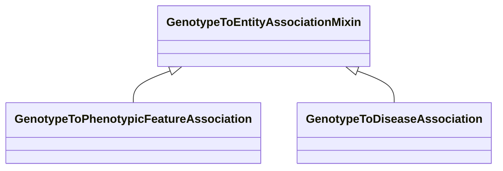

# Class: GenotypeToEntityAssociationMixin


URI: [bican:GenotypeToEntityAssociationMixin](https://identifiers.org/brain-bican/vocab/GenotypeToEntityAssociationMixin)





<!-- no inheritance hierarchy -->


## Slots

| Name | Cardinality and Range | Description | Inheritance |
| ---  | --- | --- | --- |


## Mixin Usage

| mixed into | description |
| --- | --- |
| [GenotypeToPhenotypicFeatureAssociation](GenotypeToPhenotypicFeatureAssociation.md) | Any association between one genotype and a phenotypic feature, where having t... |
| [GenotypeToDiseaseAssociation](GenotypeToDiseaseAssociation.md) |  |


## Identifier and Mapping Information


### Schema Source


* from schema: https://identifiers.org/brain-bican/kb-model


## Mappings

| Mapping Type | Mapped Value |
| ---  | ---  |
| self | bican:GenotypeToEntityAssociationMixin |
| native | bican:GenotypeToEntityAssociationMixin |


## LinkML Source

<!-- TODO: investigate https://stackoverflow.com/questions/37606292/how-to-create-tabbed-code-blocks-in-mkdocs-or-sphinx -->

### Direct

<details>
```yaml
name: genotype to entity association mixin
from_schema: https://identifiers.org/brain-bican/kb-model
mixin: true
slot_usage:
  subject:
    name: subject
    description: genotype that is the subject of the association
    range: genotype
defining_slots:
- subject

```
</details>

### Induced

<details>
```yaml
name: genotype to entity association mixin
from_schema: https://identifiers.org/brain-bican/kb-model
mixin: true
slot_usage:
  subject:
    name: subject
    description: genotype that is the subject of the association
    range: genotype
defining_slots:
- subject

```
</details>