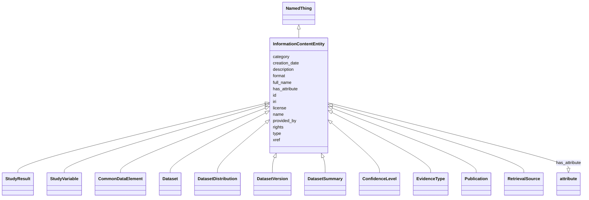

# Class: InformationContentEntity


_a piece of information that typically describes some topic of discourse or is used as support._


* __NOTE__: this is an abstract class and should not be instantiated directly


URI: [bican:InformationContentEntity](https://identifiers.org/brain-bican/vocab/InformationContentEntity)





## Inheritance
* [Entity](Entity.md)
    * [NamedThing](NamedThing.md)
        * **InformationContentEntity**
            * [StudyResult](StudyResult.md)
            * [StudyVariable](StudyVariable.md)
            * [CommonDataElement](CommonDataElement.md)
            * [Dataset](Dataset.md)
            * [DatasetDistribution](DatasetDistribution.md)
            * [DatasetVersion](DatasetVersion.md)
            * [DatasetSummary](DatasetSummary.md)
            * [ConfidenceLevel](ConfidenceLevel.md)
            * [EvidenceType](EvidenceType.md)
            * [Publication](Publication.md)
            * [RetrievalSource](RetrievalSource.md)


## Slots

| Name | Cardinality and Range | Description | Inheritance |
| ---  | --- | --- | --- |
| [license](license.md) | 0..1 <br/> [String](String.md) |  | direct |
| [rights](rights.md) | 0..1 <br/> [String](String.md) |  | direct |
| [format](format.md) | 0..1 <br/> [String](String.md) |  | direct |
| [creation_date](creation_date.md) | 0..1 <br/> [Date](Date.md) | date on which an entity was created | direct |
| [provided_by](provided_by.md) | 0..* <br/> [String](String.md) | The value in this node property represents the knowledge provider that create... | [NamedThing](NamedThing.md) |
| [xref](xref.md) | 0..* <br/> [Uriorcurie](Uriorcurie.md) | A database cross reference or alternative identifier for a NamedThing or edge... | [NamedThing](NamedThing.md) |
| [full_name](full_name.md) | 0..1 <br/> [LabelType](LabelType.md) | a long-form human readable name for a thing | [NamedThing](NamedThing.md) |
| [id](id.md) | 1..1 <br/> [String](String.md) | A unique identifier for an entity | [Entity](Entity.md) |
| [iri](iri.md) | 0..1 <br/> [IriType](IriType.md) | An IRI for an entity | [Entity](Entity.md) |
| [category](category.md) | 1..* <br/> [CategoryType](CategoryType.md) | Name of the high level ontology class in which this entity is categorized | [Entity](Entity.md) |
| [type](type.md) | 0..* <br/> [String](String.md) |  | [Entity](Entity.md) |
| [name](name.md) | 0..1 <br/> [LabelType](LabelType.md) | A human-readable name for an attribute or entity | [Entity](Entity.md) |
| [description](description.md) | 0..1 <br/> [NarrativeText](NarrativeText.md) | a human-readable description of an entity | [Entity](Entity.md) |
| [has_attribute](has_attribute.md) | 0..* <br/> [Attribute](Attribute.md) | connects any entity to an attribute | [Entity](Entity.md) |


## Usages

| used by | used in | type | used |
| ---  | --- | --- | --- |
| [StudyResult](StudyResult.md) | [license](license.md) | domain | [InformationContentEntity](InformationContentEntity.md) |
| [StudyResult](StudyResult.md) | [rights](rights.md) | domain | [InformationContentEntity](InformationContentEntity.md) |
| [StudyResult](StudyResult.md) | [format](format.md) | domain | [InformationContentEntity](InformationContentEntity.md) |
| [StudyVariable](StudyVariable.md) | [license](license.md) | domain | [InformationContentEntity](InformationContentEntity.md) |
| [StudyVariable](StudyVariable.md) | [rights](rights.md) | domain | [InformationContentEntity](InformationContentEntity.md) |
| [StudyVariable](StudyVariable.md) | [format](format.md) | domain | [InformationContentEntity](InformationContentEntity.md) |
| [CommonDataElement](CommonDataElement.md) | [license](license.md) | domain | [InformationContentEntity](InformationContentEntity.md) |
| [CommonDataElement](CommonDataElement.md) | [rights](rights.md) | domain | [InformationContentEntity](InformationContentEntity.md) |
| [CommonDataElement](CommonDataElement.md) | [format](format.md) | domain | [InformationContentEntity](InformationContentEntity.md) |
| [ConceptCountAnalysisResult](ConceptCountAnalysisResult.md) | [license](license.md) | domain | [InformationContentEntity](InformationContentEntity.md) |
| [ConceptCountAnalysisResult](ConceptCountAnalysisResult.md) | [rights](rights.md) | domain | [InformationContentEntity](InformationContentEntity.md) |
| [ConceptCountAnalysisResult](ConceptCountAnalysisResult.md) | [format](format.md) | domain | [InformationContentEntity](InformationContentEntity.md) |
| [ObservedExpectedFrequencyAnalysisResult](ObservedExpectedFrequencyAnalysisResult.md) | [license](license.md) | domain | [InformationContentEntity](InformationContentEntity.md) |
| [ObservedExpectedFrequencyAnalysisResult](ObservedExpectedFrequencyAnalysisResult.md) | [rights](rights.md) | domain | [InformationContentEntity](InformationContentEntity.md) |
| [ObservedExpectedFrequencyAnalysisResult](ObservedExpectedFrequencyAnalysisResult.md) | [format](format.md) | domain | [InformationContentEntity](InformationContentEntity.md) |
| [RelativeFrequencyAnalysisResult](RelativeFrequencyAnalysisResult.md) | [license](license.md) | domain | [InformationContentEntity](InformationContentEntity.md) |
| [RelativeFrequencyAnalysisResult](RelativeFrequencyAnalysisResult.md) | [rights](rights.md) | domain | [InformationContentEntity](InformationContentEntity.md) |
| [RelativeFrequencyAnalysisResult](RelativeFrequencyAnalysisResult.md) | [format](format.md) | domain | [InformationContentEntity](InformationContentEntity.md) |
| [TextMiningResult](TextMiningResult.md) | [license](license.md) | domain | [InformationContentEntity](InformationContentEntity.md) |
| [TextMiningResult](TextMiningResult.md) | [rights](rights.md) | domain | [InformationContentEntity](InformationContentEntity.md) |
| [TextMiningResult](TextMiningResult.md) | [format](format.md) | domain | [InformationContentEntity](InformationContentEntity.md) |
| [ChiSquaredAnalysisResult](ChiSquaredAnalysisResult.md) | [license](license.md) | domain | [InformationContentEntity](InformationContentEntity.md) |
| [ChiSquaredAnalysisResult](ChiSquaredAnalysisResult.md) | [rights](rights.md) | domain | [InformationContentEntity](InformationContentEntity.md) |
| [ChiSquaredAnalysisResult](ChiSquaredAnalysisResult.md) | [format](format.md) | domain | [InformationContentEntity](InformationContentEntity.md) |
| [LogOddsAnalysisResult](LogOddsAnalysisResult.md) | [license](license.md) | domain | [InformationContentEntity](InformationContentEntity.md) |
| [LogOddsAnalysisResult](LogOddsAnalysisResult.md) | [rights](rights.md) | domain | [InformationContentEntity](InformationContentEntity.md) |
| [LogOddsAnalysisResult](LogOddsAnalysisResult.md) | [format](format.md) | domain | [InformationContentEntity](InformationContentEntity.md) |
| [InformationContentEntity](InformationContentEntity.md) | [license](license.md) | domain | [InformationContentEntity](InformationContentEntity.md) |
| [InformationContentEntity](InformationContentEntity.md) | [rights](rights.md) | domain | [InformationContentEntity](InformationContentEntity.md) |
| [InformationContentEntity](InformationContentEntity.md) | [format](format.md) | domain | [InformationContentEntity](InformationContentEntity.md) |
| [Dataset](Dataset.md) | [license](license.md) | domain | [InformationContentEntity](InformationContentEntity.md) |
| [Dataset](Dataset.md) | [rights](rights.md) | domain | [InformationContentEntity](InformationContentEntity.md) |
| [Dataset](Dataset.md) | [format](format.md) | domain | [InformationContentEntity](InformationContentEntity.md) |
| [DatasetDistribution](DatasetDistribution.md) | [license](license.md) | domain | [InformationContentEntity](InformationContentEntity.md) |
| [DatasetDistribution](DatasetDistribution.md) | [rights](rights.md) | domain | [InformationContentEntity](InformationContentEntity.md) |
| [DatasetDistribution](DatasetDistribution.md) | [format](format.md) | domain | [InformationContentEntity](InformationContentEntity.md) |
| [DatasetVersion](DatasetVersion.md) | [license](license.md) | domain | [InformationContentEntity](InformationContentEntity.md) |
| [DatasetVersion](DatasetVersion.md) | [rights](rights.md) | domain | [InformationContentEntity](InformationContentEntity.md) |
| [DatasetVersion](DatasetVersion.md) | [format](format.md) | domain | [InformationContentEntity](InformationContentEntity.md) |
| [DatasetSummary](DatasetSummary.md) | [license](license.md) | domain | [InformationContentEntity](InformationContentEntity.md) |
| [DatasetSummary](DatasetSummary.md) | [rights](rights.md) | domain | [InformationContentEntity](InformationContentEntity.md) |
| [DatasetSummary](DatasetSummary.md) | [format](format.md) | domain | [InformationContentEntity](InformationContentEntity.md) |
| [ConfidenceLevel](ConfidenceLevel.md) | [license](license.md) | domain | [InformationContentEntity](InformationContentEntity.md) |
| [ConfidenceLevel](ConfidenceLevel.md) | [rights](rights.md) | domain | [InformationContentEntity](InformationContentEntity.md) |
| [ConfidenceLevel](ConfidenceLevel.md) | [format](format.md) | domain | [InformationContentEntity](InformationContentEntity.md) |
| [EvidenceType](EvidenceType.md) | [license](license.md) | domain | [InformationContentEntity](InformationContentEntity.md) |
| [EvidenceType](EvidenceType.md) | [rights](rights.md) | domain | [InformationContentEntity](InformationContentEntity.md) |
| [EvidenceType](EvidenceType.md) | [format](format.md) | domain | [InformationContentEntity](InformationContentEntity.md) |
| [Publication](Publication.md) | [license](license.md) | domain | [InformationContentEntity](InformationContentEntity.md) |
| [Publication](Publication.md) | [rights](rights.md) | domain | [InformationContentEntity](InformationContentEntity.md) |
| [Publication](Publication.md) | [format](format.md) | domain | [InformationContentEntity](InformationContentEntity.md) |
| [Book](Book.md) | [license](license.md) | domain | [InformationContentEntity](InformationContentEntity.md) |
| [Book](Book.md) | [rights](rights.md) | domain | [InformationContentEntity](InformationContentEntity.md) |
| [Book](Book.md) | [format](format.md) | domain | [InformationContentEntity](InformationContentEntity.md) |
| [BookChapter](BookChapter.md) | [license](license.md) | domain | [InformationContentEntity](InformationContentEntity.md) |
| [BookChapter](BookChapter.md) | [rights](rights.md) | domain | [InformationContentEntity](InformationContentEntity.md) |
| [BookChapter](BookChapter.md) | [format](format.md) | domain | [InformationContentEntity](InformationContentEntity.md) |
| [Serial](Serial.md) | [license](license.md) | domain | [InformationContentEntity](InformationContentEntity.md) |
| [Serial](Serial.md) | [rights](rights.md) | domain | [InformationContentEntity](InformationContentEntity.md) |
| [Serial](Serial.md) | [format](format.md) | domain | [InformationContentEntity](InformationContentEntity.md) |
| [Article](Article.md) | [license](license.md) | domain | [InformationContentEntity](InformationContentEntity.md) |
| [Article](Article.md) | [rights](rights.md) | domain | [InformationContentEntity](InformationContentEntity.md) |
| [Article](Article.md) | [format](format.md) | domain | [InformationContentEntity](InformationContentEntity.md) |
| [JournalArticle](JournalArticle.md) | [license](license.md) | domain | [InformationContentEntity](InformationContentEntity.md) |
| [JournalArticle](JournalArticle.md) | [rights](rights.md) | domain | [InformationContentEntity](InformationContentEntity.md) |
| [JournalArticle](JournalArticle.md) | [format](format.md) | domain | [InformationContentEntity](InformationContentEntity.md) |
| [Patent](Patent.md) | [license](license.md) | domain | [InformationContentEntity](InformationContentEntity.md) |
| [Patent](Patent.md) | [rights](rights.md) | domain | [InformationContentEntity](InformationContentEntity.md) |
| [Patent](Patent.md) | [format](format.md) | domain | [InformationContentEntity](InformationContentEntity.md) |
| [WebPage](WebPage.md) | [license](license.md) | domain | [InformationContentEntity](InformationContentEntity.md) |
| [WebPage](WebPage.md) | [rights](rights.md) | domain | [InformationContentEntity](InformationContentEntity.md) |
| [WebPage](WebPage.md) | [format](format.md) | domain | [InformationContentEntity](InformationContentEntity.md) |
| [PreprintPublication](PreprintPublication.md) | [license](license.md) | domain | [InformationContentEntity](InformationContentEntity.md) |
| [PreprintPublication](PreprintPublication.md) | [rights](rights.md) | domain | [InformationContentEntity](InformationContentEntity.md) |
| [PreprintPublication](PreprintPublication.md) | [format](format.md) | domain | [InformationContentEntity](InformationContentEntity.md) |
| [DrugLabel](DrugLabel.md) | [license](license.md) | domain | [InformationContentEntity](InformationContentEntity.md) |
| [DrugLabel](DrugLabel.md) | [rights](rights.md) | domain | [InformationContentEntity](InformationContentEntity.md) |
| [DrugLabel](DrugLabel.md) | [format](format.md) | domain | [InformationContentEntity](InformationContentEntity.md) |
| [RetrievalSource](RetrievalSource.md) | [license](license.md) | domain | [InformationContentEntity](InformationContentEntity.md) |
| [RetrievalSource](RetrievalSource.md) | [rights](rights.md) | domain | [InformationContentEntity](InformationContentEntity.md) |
| [RetrievalSource](RetrievalSource.md) | [format](format.md) | domain | [InformationContentEntity](InformationContentEntity.md) |
| [ContributorAssociation](ContributorAssociation.md) | [subject](subject.md) | range | [InformationContentEntity](InformationContentEntity.md) |


## Aliases


* information
* information artefact
* information entity


## Identifier and Mapping Information


### Valid ID Prefixes

Instances of this class *should* have identifiers with one of the following prefixes:

* doi


### Schema Source


* from schema: https://identifiers.org/brain-bican/kb-model


## Mappings

| Mapping Type | Mapped Value |
| ---  | ---  |
| self | bican:InformationContentEntity |
| native | bican:InformationContentEntity |
| exact | IAO:0000030 |
| narrow | UMLSSG:CONC, STY:T077, STY:T078, STY:T079, STY:T080, STY:T081, STY:T082, STY:T089, STY:T102, STY:T169, STY:T171, STY:T185 |


## LinkML Source

<!-- TODO: investigate https://stackoverflow.com/questions/37606292/how-to-create-tabbed-code-blocks-in-mkdocs-or-sphinx -->

### Direct

<details>
```yaml
name: information content entity
id_prefixes:
- doi
description: a piece of information that typically describes some topic of discourse
  or is used as support.
from_schema: https://identifiers.org/brain-bican/kb-model
aliases:
- information
- information artefact
- information entity
exact_mappings:
- IAO:0000030
narrow_mappings:
- UMLSSG:CONC
- STY:T077
- STY:T078
- STY:T079
- STY:T080
- STY:T081
- STY:T082
- STY:T089
- STY:T102
- STY:T169
- STY:T171
- STY:T185
is_a: named thing
abstract: true
slots:
- license
- rights
- format
- creation date

```
</details>

### Induced

<details>
```yaml
name: information content entity
id_prefixes:
- doi
description: a piece of information that typically describes some topic of discourse
  or is used as support.
from_schema: https://identifiers.org/brain-bican/kb-model
aliases:
- information
- information artefact
- information entity
exact_mappings:
- IAO:0000030
narrow_mappings:
- UMLSSG:CONC
- STY:T077
- STY:T078
- STY:T079
- STY:T080
- STY:T081
- STY:T082
- STY:T089
- STY:T102
- STY:T169
- STY:T171
- STY:T185
is_a: named thing
abstract: true
attributes:
  license:
    name: license
    from_schema: https://identifiers.org/brain-bican/kb-model
    exact_mappings:
    - dct:license
    narrow_mappings:
    - WIKIDATA_PROPERTY:P275
    rank: 1000
    is_a: node property
    domain: information content entity
    alias: license
    owner: information content entity
    domain_of:
    - information content entity
    range: string
  rights:
    name: rights
    from_schema: https://identifiers.org/brain-bican/kb-model
    exact_mappings:
    - dct:rights
    rank: 1000
    is_a: node property
    domain: information content entity
    alias: rights
    owner: information content entity
    domain_of:
    - information content entity
    range: string
  format:
    name: format
    from_schema: https://identifiers.org/brain-bican/kb-model
    exact_mappings:
    - dct:format
    - WIKIDATA_PROPERTY:P2701
    rank: 1000
    is_a: node property
    domain: information content entity
    alias: format
    owner: information content entity
    domain_of:
    - information content entity
    range: string
  creation date:
    name: creation date
    description: date on which an entity was created. This can be applied to nodes
      or edges
    from_schema: https://identifiers.org/brain-bican/kb-model
    aliases:
    - publication date
    exact_mappings:
    - dct:createdOn
    - WIKIDATA_PROPERTY:P577
    rank: 1000
    is_a: node property
    domain: named thing
    alias: creation_date
    owner: information content entity
    domain_of:
    - information content entity
    range: date
  provided by:
    name: provided by
    description: The value in this node property represents the knowledge provider
      that created or assembled the node and all of its attributes.  Used internally
      to represent how a particular node made its way into a knowledge provider or
      graph.
    from_schema: https://identifiers.org/brain-bican/kb-model
    rank: 1000
    is_a: node property
    domain: named thing
    multivalued: true
    alias: provided_by
    owner: information content entity
    domain_of:
    - named thing
    range: string
  xref:
    name: xref
    description: A database cross reference or alternative identifier for a NamedThing
      or edge between two  NamedThings.  This property should point to a database
      record or webpage that supports the existence of the edge, or  gives more detail
      about the edge. This property can be used on a node or edge to provide multiple
      URIs or CURIE cross references.
    in_subset:
    - translator_minimal
    from_schema: https://identifiers.org/brain-bican/kb-model
    aliases:
    - dbxref
    - Dbxref
    - DbXref
    - record_url
    - source_record_urls
    narrow_mappings:
    - gff3:Dbxref
    - gpi:DB_Xrefs
    rank: 1000
    domain: named thing
    multivalued: true
    alias: xref
    owner: information content entity
    domain_of:
    - named thing
    - publication
    - retrieval source
    - gene
    - gene product mixin
    range: uriorcurie
  full name:
    name: full name
    description: a long-form human readable name for a thing
    from_schema: https://identifiers.org/brain-bican/kb-model
    rank: 1000
    is_a: node property
    domain: named thing
    alias: full_name
    owner: information content entity
    domain_of:
    - named thing
    range: label type
  id:
    name: id
    description: A unique identifier for an entity. Must be either a CURIE shorthand
      for a URI or a complete URI
    in_subset:
    - translator_minimal
    from_schema: https://identifiers.org/brain-bican/kb-model
    exact_mappings:
    - AGRKB:primaryId
    - gff3:ID
    - gpi:DB_Object_ID
    rank: 1000
    domain: entity
    identifier: true
    alias: id
    owner: information content entity
    domain_of:
    - genome assembly
    - ontology class
    - entity
    range: string
    required: true
  iri:
    name: iri
    description: An IRI for an entity. This is determined by the id using expansion
      rules.
    in_subset:
    - translator_minimal
    - samples
    from_schema: https://identifiers.org/brain-bican/kb-model
    exact_mappings:
    - WIKIDATA_PROPERTY:P854
    rank: 1000
    alias: iri
    owner: information content entity
    domain_of:
    - attribute
    - entity
    range: iri type
  category:
    name: category
    description: "Name of the high level ontology class in which this entity is categorized.\
      \ Corresponds to the label for the biolink entity type class.\n * In a neo4j\
      \ database this MAY correspond to the neo4j label tag.\n * In an RDF database\
      \ it should be a biolink model class URI.\nThis field is multi-valued. It should\
      \ include values for ancestors of the biolink class; for example, a protein\
      \ such as Shh would have category values `biolink:Protein`, `biolink:GeneProduct`,\
      \ `biolink:MolecularEntity`, ...\nIn an RDF database, nodes will typically have\
      \ an rdf:type triples. This can be to the most specific biolink class, or potentially\
      \ to a class more specific than something in biolink. For example, a sequence\
      \ feature `f` may have a rdf:type assertion to a SO class such as TF_binding_site,\
      \ which is more specific than anything in biolink. Here we would have categories\
      \ {biolink:GenomicEntity, biolink:MolecularEntity, biolink:NamedThing}"
    from_schema: https://identifiers.org/brain-bican/kb-model
    rank: 1000
    is_a: type
    domain: entity
    multivalued: true
    designates_type: true
    alias: category
    owner: information content entity
    domain_of:
    - entity
    is_class_field: true
    range: category type
    required: true
    pattern: ^biolink:[A-Z][A-Za-z]+$
  type:
    name: type
    from_schema: https://identifiers.org/brain-bican/kb-model
    exact_mappings:
    - AGRKB:soTermId
    - gff3:type
    - gpi:DB_Object_Type
    rank: 1000
    domain: entity
    slot_uri: rdf:type
    multivalued: true
    alias: type
    owner: information content entity
    domain_of:
    - entity
    range: string
  name:
    name: name
    description: A human-readable name for an attribute or entity.
    in_subset:
    - translator_minimal
    - samples
    from_schema: https://identifiers.org/brain-bican/kb-model
    aliases:
    - label
    - display name
    - title
    exact_mappings:
    - gff3:Name
    - gpi:DB_Object_Name
    narrow_mappings:
    - dct:title
    - WIKIDATA_PROPERTY:P1476
    rank: 1000
    domain: entity
    slot_uri: rdfs:label
    alias: name
    owner: information content entity
    domain_of:
    - attribute
    - entity
    - macromolecular machine mixin
    range: label type
  description:
    name: description
    description: a human-readable description of an entity
    in_subset:
    - translator_minimal
    from_schema: https://identifiers.org/brain-bican/kb-model
    aliases:
    - definition
    exact_mappings:
    - IAO:0000115
    - skos:definitions
    narrow_mappings:
    - gff3:Description
    rank: 1000
    slot_uri: dct:description
    alias: description
    owner: information content entity
    domain_of:
    - genome assembly
    - entity
    range: narrative text
  has attribute:
    name: has attribute
    description: connects any entity to an attribute
    in_subset:
    - samples
    from_schema: https://identifiers.org/brain-bican/kb-model
    exact_mappings:
    - SIO:000008
    close_mappings:
    - OBI:0001927
    narrow_mappings:
    - OBAN:association_has_subject_property
    - OBAN:association_has_object_property
    - CPT:has_possibly_included_panel_element
    - DRUGBANK:category
    - EFO:is_executed_in
    - HANCESTRO:0301
    - LOINC:has_action_guidance
    - LOINC:has_adjustment
    - LOINC:has_aggregation_view
    - LOINC:has_approach_guidance
    - LOINC:has_divisor
    - LOINC:has_exam
    - LOINC:has_method
    - LOINC:has_modality_subtype
    - LOINC:has_object_guidance
    - LOINC:has_scale
    - LOINC:has_suffix
    - LOINC:has_time_aspect
    - LOINC:has_time_modifier
    - LOINC:has_timing_of
    - NCIT:R88
    - NCIT:eo_disease_has_property_or_attribute
    - NCIT:has_data_element
    - NCIT:has_pharmaceutical_administration_method
    - NCIT:has_pharmaceutical_basic_dose_form
    - NCIT:has_pharmaceutical_intended_site
    - NCIT:has_pharmaceutical_release_characteristics
    - NCIT:has_pharmaceutical_state_of_matter
    - NCIT:has_pharmaceutical_transformation
    - NCIT:is_qualified_by
    - NCIT:qualifier_applies_to
    - NCIT:role_has_domain
    - NCIT:role_has_range
    - INO:0000154
    - HANCESTRO:0308
    - OMIM:has_inheritance_type
    - orphanet:C016
    - orphanet:C017
    - RO:0000053
    - RO:0000086
    - RO:0000087
    - SNOMED:has_access
    - SNOMED:has_clinical_course
    - SNOMED:has_count_of_base_of_active_ingredient
    - SNOMED:has_dose_form_administration_method
    - SNOMED:has_dose_form_release_characteristic
    - SNOMED:has_dose_form_transformation
    - SNOMED:has_finding_context
    - SNOMED:has_finding_informer
    - SNOMED:has_inherent_attribute
    - SNOMED:has_intent
    - SNOMED:has_interpretation
    - SNOMED:has_laterality
    - SNOMED:has_measurement_method
    - SNOMED:has_method
    - SNOMED:has_priority
    - SNOMED:has_procedure_context
    - SNOMED:has_process_duration
    - SNOMED:has_property
    - SNOMED:has_revision_status
    - SNOMED:has_scale_type
    - SNOMED:has_severity
    - SNOMED:has_specimen
    - SNOMED:has_state_of_matter
    - SNOMED:has_subject_relationship_context
    - SNOMED:has_surgical_approach
    - SNOMED:has_technique
    - SNOMED:has_temporal_context
    - SNOMED:has_time_aspect
    - SNOMED:has_units
    - UMLS:has_structural_class
    - UMLS:has_supported_concept_property
    - UMLS:has_supported_concept_relationship
    - UMLS:may_be_qualified_by
    rank: 1000
    domain: entity
    multivalued: true
    alias: has_attribute
    owner: information content entity
    domain_of:
    - entity
    range: attribute

```
</details>