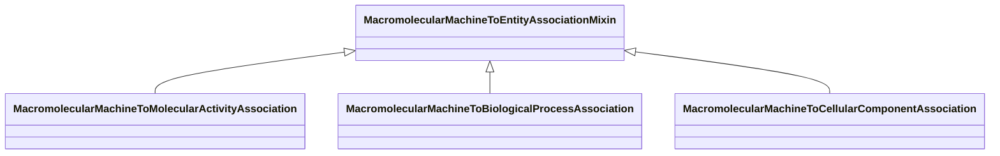

# Class: MacromolecularMachineToEntityAssociationMixin


_an association which has a macromolecular machine mixin as a subject_


URI: [bican:MacromolecularMachineToEntityAssociationMixin](https://identifiers.org/brain-bican/vocab/MacromolecularMachineToEntityAssociationMixin)





<!-- no inheritance hierarchy -->


## Slots

| Name | Cardinality and Range | Description | Inheritance |
| ---  | --- | --- | --- |


## Mixin Usage

| mixed into | description |
| --- | --- |
| [MacromolecularMachineToMolecularActivityAssociation](MacromolecularMachineToMolecularActivityAssociation.md) | A functional association between a macromolecular machine (gene, gene product... |
| [MacromolecularMachineToBiologicalProcessAssociation](MacromolecularMachineToBiologicalProcessAssociation.md) | A functional association between a macromolecular machine (gene, gene product... |
| [MacromolecularMachineToCellularComponentAssociation](MacromolecularMachineToCellularComponentAssociation.md) | A functional association between a macromolecular machine (gene, gene product... |


## Identifier and Mapping Information


### Schema Source


* from schema: https://identifiers.org/brain-bican/kb-model


## Mappings

| Mapping Type | Mapped Value |
| ---  | ---  |
| self | bican:MacromolecularMachineToEntityAssociationMixin |
| native | bican:MacromolecularMachineToEntityAssociationMixin |


## LinkML Source

<!-- TODO: investigate https://stackoverflow.com/questions/37606292/how-to-create-tabbed-code-blocks-in-mkdocs-or-sphinx -->

### Direct

<details>
```yaml
name: macromolecular machine to entity association mixin
description: an association which has a macromolecular machine mixin as a subject
from_schema: https://identifiers.org/brain-bican/kb-model
mixin: true
slot_usage:
  subject:
    name: subject
    domain: macromolecular machine mixin
    domain_of:
    - association

```
</details>

### Induced

<details>
```yaml
name: macromolecular machine to entity association mixin
description: an association which has a macromolecular machine mixin as a subject
from_schema: https://identifiers.org/brain-bican/kb-model
mixin: true
slot_usage:
  subject:
    name: subject
    domain: macromolecular machine mixin
    domain_of:
    - association

```
</details>