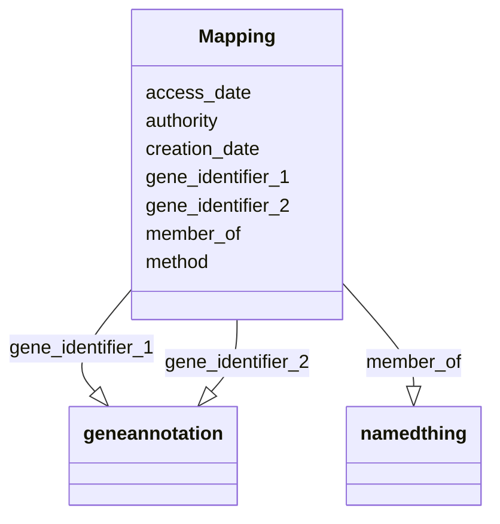

# Class: Mapping


_text_


URI: [bican:Mapping](https://identifiers.org/brain-bican/vocab/Mapping)





<!-- no inheritance hierarchy -->


## Slots

| Name | Cardinality and Range | Description | Inheritance |
| ---  | --- | --- | --- |
| [gene_identifier_1](gene_identifier_1.md) | 0..1 <br/> [GeneAnnotation](GeneAnnotation.md) |  | direct |
| [gene_identifier_2](gene_identifier_2.md) | 0..1 <br/> [GeneAnnotation](GeneAnnotation.md) |  | direct |
| [authority](authority.md) | 0..1 <br/> [String](String.md) |  | direct |
| [method](method.md) | 0..1 <br/> [String](String.md) |  | direct |
| [creation_date](creation_date.md) | 0..1 <br/> [String](String.md) |  | direct |
| [access_date](access_date.md) | 0..1 <br/> [String](String.md) |  | direct |
| [member_of](member_of.md) | 0..* <br/> [NamedThing](NamedThing.md) | Defines a mereological relation between a item and a collection | direct |


## Identifier and Mapping Information


### Schema Source


* from schema: https://identifiers.org/brain-bican/kb-model


## Mappings

| Mapping Type | Mapped Value |
| ---  | ---  |
| self | bican:Mapping |
| native | bican:Mapping |


## LinkML Source

<!-- TODO: investigate https://stackoverflow.com/questions/37606292/how-to-create-tabbed-code-blocks-in-mkdocs-or-sphinx -->

### Direct

<details>
```yaml
name: mapping
description: text
notes:
- relate to - https://mapping-commons.github.io/sssom/
from_schema: https://identifiers.org/brain-bican/kb-model
slots:
- gene_identifier_1
- gene_identifier_2
- authority
- method
- creation_date
- access_date
- member of

```
</details>

### Induced

<details>
```yaml
name: mapping
description: text
notes:
- relate to - https://mapping-commons.github.io/sssom/
from_schema: https://identifiers.org/brain-bican/kb-model
attributes:
  gene_identifier_1:
    name: gene_identifier_1
    from_schema: https://identifiers.org/brain-bican/kb-model
    rank: 1000
    alias: gene_identifier_1
    owner: mapping
    domain_of:
    - mapping
    range: gene annotation
  gene_identifier_2:
    name: gene_identifier_2
    from_schema: https://identifiers.org/brain-bican/kb-model
    rank: 1000
    alias: gene_identifier_2
    owner: mapping
    domain_of:
    - mapping
    range: gene annotation
  authority:
    name: authority
    from_schema: https://identifiers.org/brain-bican/kb-model
    rank: 1000
    alias: authority
    owner: mapping
    domain_of:
    - mapping
    range: string
  method:
    name: method
    from_schema: https://identifiers.org/brain-bican/kb-model
    rank: 1000
    alias: method
    owner: mapping
    domain_of:
    - mapping
    range: string
  creation_date:
    name: creation_date
    from_schema: https://identifiers.org/brain-bican/kb-model
    rank: 1000
    alias: creation_date
    owner: mapping
    domain_of:
    - mapping
    range: string
  access_date:
    name: access_date
    from_schema: https://identifiers.org/brain-bican/kb-model
    rank: 1000
    alias: access_date
    owner: mapping
    domain_of:
    - mapping
    range: string
  member of:
    name: member of
    description: Defines a mereological relation between a item and a collection.
    in_subset:
    - translator_minimal
    from_schema: https://identifiers.org/brain-bican/kb-model
    exact_mappings:
    - RO:0002350
    close_mappings:
    - skos:member
    rank: 1000
    is_a: related to at concept level
    domain: named thing
    multivalued: true
    inherited: true
    alias: member_of
    owner: mapping
    domain_of:
    - mapping
    inverse: has member
    range: named thing

```
</details>