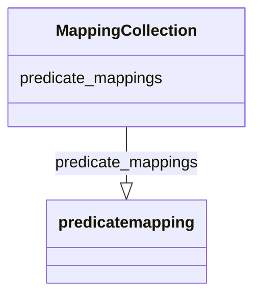

# Class: MappingCollection


_A collection of deprecated mappings._


* __NOTE__: this is an abstract class and should not be instantiated directly


URI: [bican:MappingCollection](https://identifiers.org/brain-bican/vocab/MappingCollection)





<!-- no inheritance hierarchy -->


## Slots

| Name | Cardinality and Range | Description | Inheritance |
| ---  | --- | --- | --- |
| [predicate_mappings](predicate_mappings.md) | 0..* <br/> [PredicateMapping](PredicateMapping.md) | A collection of relationships that are not used in biolink, but have biolink ... | direct |


## Identifier and Mapping Information


### Schema Source


* from schema: https://identifiers.org/brain-bican/kb-model


## Mappings

| Mapping Type | Mapped Value |
| ---  | ---  |
| self | bican:MappingCollection |
| native | bican:MappingCollection |


## LinkML Source

<!-- TODO: investigate https://stackoverflow.com/questions/37606292/how-to-create-tabbed-code-blocks-in-mkdocs-or-sphinx -->

### Direct

<details>
```yaml
name: mapping collection
description: A collection of deprecated mappings.
from_schema: https://identifiers.org/brain-bican/kb-model
abstract: true
slots:
- predicate mappings
tree_root: true

```
</details>

### Induced

<details>
```yaml
name: mapping collection
description: A collection of deprecated mappings.
from_schema: https://identifiers.org/brain-bican/kb-model
abstract: true
attributes:
  predicate mappings:
    name: predicate mappings
    description: A collection of relationships that are not used in biolink, but have
      biolink patterns that can  be used to replace them.  This is a temporary slot
      to help with the transition to the fully qualified predicate model in Biolink3.
    from_schema: https://identifiers.org/brain-bican/kb-model
    rank: 1000
    multivalued: true
    alias: predicate_mappings
    owner: mapping collection
    domain_of:
    - mapping collection
    range: predicate mapping
    inlined: true
    inlined_as_list: true
tree_root: true

```
</details>