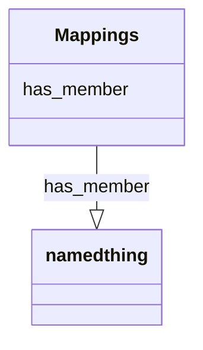

# Class: Mappings


_A collection of mappings between identifiers_

__


URI: [bican:Mappings](https://identifiers.org/brain-bican/vocab/Mappings)





<!-- no inheritance hierarchy -->


## Slots

| Name | Cardinality and Range | Description | Inheritance |
| ---  | --- | --- | --- |
| [has_member](has_member.md) | 0..* <br/> [NamedThing](NamedThing.md) | Defines a mereological relation between a collection and an item | direct |


## Identifier and Mapping Information


### Schema Source


* from schema: https://identifiers.org/brain-bican/kb-model


## Mappings

| Mapping Type | Mapped Value |
| ---  | ---  |
| self | bican:Mappings |
| native | bican:Mappings |


## LinkML Source

<!-- TODO: investigate https://stackoverflow.com/questions/37606292/how-to-create-tabbed-code-blocks-in-mkdocs-or-sphinx -->

### Direct

<details>
```yaml
name: mappings
description: 'A collection of mappings between identifiers

  '
notes:
- use this model - https://mapping-commons.github.io/sssom/
from_schema: https://identifiers.org/brain-bican/kb-model
slots:
- has member

```
</details>

### Induced

<details>
```yaml
name: mappings
description: 'A collection of mappings between identifiers

  '
notes:
- use this model - https://mapping-commons.github.io/sssom/
from_schema: https://identifiers.org/brain-bican/kb-model
attributes:
  has member:
    name: has member
    description: Defines a mereological relation between a collection and an item.
    in_subset:
    - translator_minimal
    from_schema: https://identifiers.org/brain-bican/kb-model
    exact_mappings:
    - RO:0002351
    - skos:member
    rank: 1000
    is_a: related to at concept level
    domain: named thing
    multivalued: true
    inherited: true
    alias: has_member
    owner: mappings
    domain_of:
    - mappings
    range: named thing

```
</details>