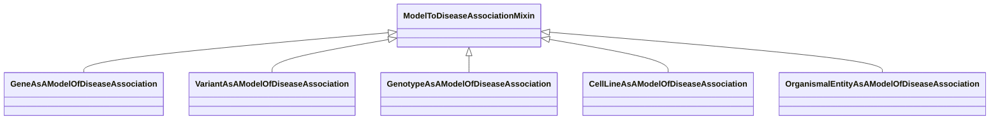

# Class: ModelToDiseaseAssociationMixin


_This mixin is used for any association class for which the subject (source node) plays the role of a 'model', in that it recapitulates some features of the disease in a way that is useful for studying the disease outside a patient carrying the disease_


URI: [bican:ModelToDiseaseAssociationMixin](https://identifiers.org/brain-bican/vocab/ModelToDiseaseAssociationMixin)





<!-- no inheritance hierarchy -->


## Slots

| Name | Cardinality and Range | Description | Inheritance |
| ---  | --- | --- | --- |


## Mixin Usage

| mixed into | description |
| --- | --- |
| [GeneAsAModelOfDiseaseAssociation](GeneAsAModelOfDiseaseAssociation.md) |  |
| [VariantAsAModelOfDiseaseAssociation](VariantAsAModelOfDiseaseAssociation.md) |  |
| [GenotypeAsAModelOfDiseaseAssociation](GenotypeAsAModelOfDiseaseAssociation.md) |  |
| [CellLineAsAModelOfDiseaseAssociation](CellLineAsAModelOfDiseaseAssociation.md) |  |
| [OrganismalEntityAsAModelOfDiseaseAssociation](OrganismalEntityAsAModelOfDiseaseAssociation.md) |  |


## Identifier and Mapping Information


### Schema Source


* from schema: https://identifiers.org/brain-bican/kb-model


## Mappings

| Mapping Type | Mapped Value |
| ---  | ---  |
| self | bican:ModelToDiseaseAssociationMixin |
| native | bican:ModelToDiseaseAssociationMixin |


## LinkML Source

<!-- TODO: investigate https://stackoverflow.com/questions/37606292/how-to-create-tabbed-code-blocks-in-mkdocs-or-sphinx -->

### Direct

<details>
```yaml
name: model to disease association mixin
description: This mixin is used for any association class for which the subject (source
  node) plays the role of a 'model', in that it recapitulates some features of the
  disease in a way that is useful for studying the disease outside a patient carrying
  the disease
from_schema: https://identifiers.org/brain-bican/kb-model
mixin: true
slot_usage:
  subject:
    name: subject
    description: The entity that serves as the model of the disease. This may be an
      organism, a strain of organism, a genotype or variant that exhibits similar
      features, or a gene that when mutated exhibits features of the disease
  predicate:
    name: predicate
    description: The relationship to the disease
    domain_of:
    - predicate mapping
    - association
    subproperty_of: model of

```
</details>

### Induced

<details>
```yaml
name: model to disease association mixin
description: This mixin is used for any association class for which the subject (source
  node) plays the role of a 'model', in that it recapitulates some features of the
  disease in a way that is useful for studying the disease outside a patient carrying
  the disease
from_schema: https://identifiers.org/brain-bican/kb-model
mixin: true
slot_usage:
  subject:
    name: subject
    description: The entity that serves as the model of the disease. This may be an
      organism, a strain of organism, a genotype or variant that exhibits similar
      features, or a gene that when mutated exhibits features of the disease
  predicate:
    name: predicate
    description: The relationship to the disease
    domain_of:
    - predicate mapping
    - association
    subproperty_of: model of

```
</details>