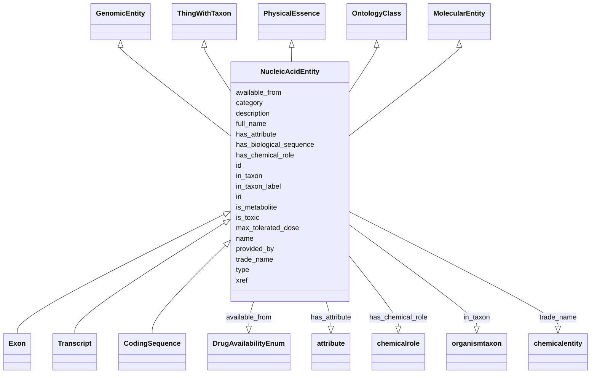

# Class: NucleicAcidEntity


_A nucleic acid entity is a molecular entity characterized by availability in gene databases of nucleotide-based sequence representations of its precise sequence; for convenience of representation, partial sequences of various kinds are included._


URI: [bican:NucleicAcidEntity](https://identifiers.org/brain-bican/vocab/NucleicAcidEntity)





## Inheritance
* [Entity](Entity.md)
    * [NamedThing](NamedThing.md)
        * [ChemicalEntity](ChemicalEntity.md) [ [PhysicalEssence](PhysicalEssence.md) [ChemicalOrDrugOrTreatment](ChemicalOrDrugOrTreatment.md) [ChemicalEntityOrGeneOrGeneProduct](ChemicalEntityOrGeneOrGeneProduct.md) [ChemicalEntityOrProteinOrPolypeptide](ChemicalEntityOrProteinOrPolypeptide.md)]
            * [MolecularEntity](MolecularEntity.md)
                * **NucleicAcidEntity** [ [GenomicEntity](GenomicEntity.md) [ThingWithTaxon](ThingWithTaxon.md) [PhysicalEssence](PhysicalEssence.md) [OntologyClass](OntologyClass.md)]
                    * [Exon](Exon.md)
                    * [Transcript](Transcript.md)
                    * [CodingSequence](CodingSequence.md)


## Slots

| Name | Cardinality and Range | Description | Inheritance |
| ---  | --- | --- | --- |
| [has_biological_sequence](has_biological_sequence.md) | 0..1 <br/> [BiologicalSequence](BiologicalSequence.md) | connects a genomic feature to its sequence | [GenomicEntity](GenomicEntity.md) |
| [in_taxon](in_taxon.md) | 0..* <br/> [OrganismTaxon](OrganismTaxon.md) | connects an entity to its taxonomic classification | [ThingWithTaxon](ThingWithTaxon.md) |
| [in_taxon_label](in_taxon_label.md) | 0..1 <br/> [LabelType](LabelType.md) | The human readable scientific name for the taxon of the entity | [ThingWithTaxon](ThingWithTaxon.md) |
| [id](id.md) | 1..1 <br/> [String](String.md) | A unique identifier for an entity | [Entity](Entity.md), [OntologyClass](OntologyClass.md) |
| [is_metabolite](is_metabolite.md) | 0..1 <br/> [Boolean](Boolean.md) | indicates whether a molecular entity is a metabolite | [MolecularEntity](MolecularEntity.md) |
| [trade_name](trade_name.md) | 0..1 <br/> [ChemicalEntity](ChemicalEntity.md) |  | [ChemicalEntity](ChemicalEntity.md) |
| [available_from](available_from.md) | 0..* <br/> [DrugAvailabilityEnum](DrugAvailabilityEnum.md) |  | [ChemicalEntity](ChemicalEntity.md) |
| [max_tolerated_dose](max_tolerated_dose.md) | 0..1 <br/> [String](String.md) | The highest dose of a drug or treatment that does not cause unacceptable side... | [ChemicalEntity](ChemicalEntity.md) |
| [is_toxic](is_toxic.md) | 0..1 <br/> [Boolean](Boolean.md) |  | [ChemicalEntity](ChemicalEntity.md) |
| [has_chemical_role](has_chemical_role.md) | 0..* <br/> [ChemicalRole](ChemicalRole.md) | A role is particular behaviour which a chemical entity may exhibit | [ChemicalEntity](ChemicalEntity.md) |
| [provided_by](provided_by.md) | 0..* <br/> [String](String.md) | The value in this node property represents the knowledge provider that create... | [NamedThing](NamedThing.md) |
| [xref](xref.md) | 0..* <br/> [Uriorcurie](Uriorcurie.md) | A database cross reference or alternative identifier for a NamedThing or edge... | [NamedThing](NamedThing.md) |
| [full_name](full_name.md) | 0..1 <br/> [LabelType](LabelType.md) | a long-form human readable name for a thing | [NamedThing](NamedThing.md) |
| [iri](iri.md) | 0..1 <br/> [IriType](IriType.md) | An IRI for an entity | [Entity](Entity.md) |
| [category](category.md) | 1..* <br/> [CategoryType](CategoryType.md) | Name of the high level ontology class in which this entity is categorized | [Entity](Entity.md) |
| [type](type.md) | 0..* <br/> [String](String.md) |  | [Entity](Entity.md) |
| [name](name.md) | 0..1 <br/> [LabelType](LabelType.md) | A human-readable name for an attribute or entity | [Entity](Entity.md) |
| [description](description.md) | 0..1 <br/> [NarrativeText](NarrativeText.md) | a human-readable description of an entity | [Entity](Entity.md) |
| [has_attribute](has_attribute.md) | 0..* <br/> [Attribute](Attribute.md) | connects any entity to an attribute | [Entity](Entity.md) |


## Usages

| used by | used in | type | used |
| ---  | --- | --- | --- |
| [Genotype](Genotype.md) | [has_zygosity](has_zygosity.md) | domain | [NucleicAcidEntity](NucleicAcidEntity.md) |
| [GenomicSequenceLocalization](GenomicSequenceLocalization.md) | [subject](subject.md) | range | [NucleicAcidEntity](NucleicAcidEntity.md) |
| [GenomicSequenceLocalization](GenomicSequenceLocalization.md) | [object](object.md) | range | [NucleicAcidEntity](NucleicAcidEntity.md) |
| [SequenceFeatureRelationship](SequenceFeatureRelationship.md) | [subject](subject.md) | range | [NucleicAcidEntity](NucleicAcidEntity.md) |
| [SequenceFeatureRelationship](SequenceFeatureRelationship.md) | [object](object.md) | range | [NucleicAcidEntity](NucleicAcidEntity.md) |


## Aliases


* sequence feature
* genomic entity


## Identifier and Mapping Information


### Valid ID Prefixes

Instances of this class *should* have identifiers with one of the following prefixes:

* PUBCHEM.COMPOUND

* CHEMBL.COMPOUND

* UNII

* CHEBI

* MESH

* CAS

* GTOPDB

* HMDB

* KEGG

* KEGG.COMPOUND

* ChemBank

* PUBCHEM.SUBSTANCE

* INCHI

* INCHIKEY

* KEGG.GLYCAN

* KEGG.ENVIRON


### Schema Source


* from schema: https://identifiers.org/brain-bican/kb-model


## Mappings

| Mapping Type | Mapped Value |
| ---  | ---  |
| self | bican:NucleicAcidEntity |
| native | bican:NucleicAcidEntity |
| exact | SO:0000110 |
| narrow | STY:T086, STY:T114 |


## LinkML Source

<!-- TODO: investigate https://stackoverflow.com/questions/37606292/how-to-create-tabbed-code-blocks-in-mkdocs-or-sphinx -->

### Direct

<details>
```yaml
name: nucleic acid entity
id_prefixes:
- PUBCHEM.COMPOUND
- CHEMBL.COMPOUND
- UNII
- CHEBI
- MESH
- CAS
- GTOPDB
- HMDB
- KEGG
- KEGG.COMPOUND
- ChemBank
- PUBCHEM.SUBSTANCE
- INCHI
- INCHIKEY
- KEGG.GLYCAN
- KEGG.ENVIRON
description: A nucleic acid entity is a molecular entity characterized by availability
  in gene databases of nucleotide-based sequence representations of its precise sequence;
  for convenience of representation, partial sequences of various kinds are included.
in_subset:
- model_organism_database
- translator_minimal
from_schema: https://identifiers.org/brain-bican/kb-model
aliases:
- sequence feature
- genomic entity
exact_mappings:
- SO:0000110
narrow_mappings:
- STY:T086
- STY:T114
is_a: molecular entity
mixins:
- genomic entity
- thing with taxon
- physical essence
- ontology class

```
</details>

### Induced

<details>
```yaml
name: nucleic acid entity
id_prefixes:
- PUBCHEM.COMPOUND
- CHEMBL.COMPOUND
- UNII
- CHEBI
- MESH
- CAS
- GTOPDB
- HMDB
- KEGG
- KEGG.COMPOUND
- ChemBank
- PUBCHEM.SUBSTANCE
- INCHI
- INCHIKEY
- KEGG.GLYCAN
- KEGG.ENVIRON
description: A nucleic acid entity is a molecular entity characterized by availability
  in gene databases of nucleotide-based sequence representations of its precise sequence;
  for convenience of representation, partial sequences of various kinds are included.
in_subset:
- model_organism_database
- translator_minimal
from_schema: https://identifiers.org/brain-bican/kb-model
aliases:
- sequence feature
- genomic entity
exact_mappings:
- SO:0000110
narrow_mappings:
- STY:T086
- STY:T114
is_a: molecular entity
mixins:
- genomic entity
- thing with taxon
- physical essence
- ontology class
attributes:
  has biological sequence:
    name: has biological sequence
    description: connects a genomic feature to its sequence
    from_schema: https://identifiers.org/brain-bican/kb-model
    rank: 1000
    is_a: node property
    domain: named thing
    alias: has_biological_sequence
    owner: nucleic acid entity
    domain_of:
    - genomic entity
    - epigenomic entity
    range: biological sequence
  in taxon:
    name: in taxon
    annotations:
      canonical_predicate:
        tag: canonical_predicate
        value: 'True'
    description: connects an entity to its taxonomic classification. Only certain
      kinds of entities can be taxonomically classified; see 'thing with taxon'
    in_subset:
    - translator_minimal
    from_schema: https://identifiers.org/brain-bican/kb-model
    aliases:
    - instance of
    - is organism source of gene product
    - organism has gene
    - gene found in organism
    - gene product has organism source
    exact_mappings:
    - RO:0002162
    - WIKIDATA_PROPERTY:P703
    narrow_mappings:
    - RO:0002160
    rank: 1000
    is_a: related to at instance level
    domain: thing with taxon
    multivalued: true
    inherited: true
    alias: in_taxon
    owner: nucleic acid entity
    domain_of:
    - thing with taxon
    range: organism taxon
  in taxon label:
    name: in taxon label
    annotations:
      denormalized:
        tag: denormalized
        value: 'True'
    description: The human readable scientific name for the taxon of the entity.
    in_subset:
    - translator_minimal
    from_schema: https://identifiers.org/brain-bican/kb-model
    exact_mappings:
    - WIKIDATA_PROPERTY:P225
    rank: 1000
    is_a: node property
    domain: thing with taxon
    slot_uri: rdfs:label
    alias: in_taxon_label
    owner: nucleic acid entity
    domain_of:
    - thing with taxon
    range: label type
  id:
    name: id
    description: A unique identifier for an entity. Must be either a CURIE shorthand
      for a URI or a complete URI
    in_subset:
    - translator_minimal
    from_schema: https://identifiers.org/brain-bican/kb-model
    exact_mappings:
    - AGRKB:primaryId
    - gff3:ID
    - gpi:DB_Object_ID
    rank: 1000
    domain: entity
    identifier: true
    alias: id
    owner: nucleic acid entity
    domain_of:
    - genome assembly
    - ontology class
    - entity
    range: string
    required: true
  is metabolite:
    name: is metabolite
    description: indicates whether a molecular entity is a metabolite
    from_schema: https://identifiers.org/brain-bican/kb-model
    exact_mappings:
    - CHEBI:25212
    rank: 1000
    is_a: node property
    domain: molecular entity
    alias: is_metabolite
    owner: nucleic acid entity
    domain_of:
    - molecular entity
    range: boolean
  trade name:
    name: trade name
    description: ''
    from_schema: https://identifiers.org/brain-bican/kb-model
    rank: 1000
    is_a: node property
    domain: named thing
    alias: trade_name
    owner: nucleic acid entity
    domain_of:
    - chemical entity
    range: chemical entity
  available from:
    name: available from
    description: ''
    from_schema: https://identifiers.org/brain-bican/kb-model
    rank: 1000
    is_a: node property
    domain: named thing
    multivalued: true
    alias: available_from
    owner: nucleic acid entity
    domain_of:
    - chemical entity
    range: DrugAvailabilityEnum
  max tolerated dose:
    name: max tolerated dose
    description: The highest dose of a drug or treatment that does not cause unacceptable
      side effects. The maximum tolerated dose is determined in clinical trials by
      testing increasing doses on different groups of people until the highest dose
      with acceptable side effects is found. Also called MTD.
    from_schema: https://identifiers.org/brain-bican/kb-model
    rank: 1000
    is_a: node property
    domain: named thing
    multivalued: false
    alias: max_tolerated_dose
    owner: nucleic acid entity
    domain_of:
    - chemical entity
    range: string
  is toxic:
    name: is toxic
    description: ''
    from_schema: https://identifiers.org/brain-bican/kb-model
    rank: 1000
    is_a: node property
    domain: named thing
    multivalued: false
    alias: is_toxic
    owner: nucleic acid entity
    domain_of:
    - chemical entity
    range: boolean
  has chemical role:
    name: has chemical role
    id_prefixes:
    - CHEBI
    description: A role is particular behaviour which a chemical entity may exhibit.
    comments:
    - We expect primarily to use CHEBI chemical roles here; however, we are looking
      for a mapping between CHEBI And ATC codes to support this slot.
    from_schema: https://identifiers.org/brain-bican/kb-model
    rank: 1000
    is_a: related to at concept level
    domain: named thing
    multivalued: true
    inherited: true
    alias: has_chemical_role
    owner: nucleic acid entity
    domain_of:
    - chemical entity
    range: chemical role
  provided by:
    name: provided by
    description: The value in this node property represents the knowledge provider
      that created or assembled the node and all of its attributes.  Used internally
      to represent how a particular node made its way into a knowledge provider or
      graph.
    from_schema: https://identifiers.org/brain-bican/kb-model
    rank: 1000
    is_a: node property
    domain: named thing
    multivalued: true
    alias: provided_by
    owner: nucleic acid entity
    domain_of:
    - named thing
    range: string
  xref:
    name: xref
    description: A database cross reference or alternative identifier for a NamedThing
      or edge between two  NamedThings.  This property should point to a database
      record or webpage that supports the existence of the edge, or  gives more detail
      about the edge. This property can be used on a node or edge to provide multiple
      URIs or CURIE cross references.
    in_subset:
    - translator_minimal
    from_schema: https://identifiers.org/brain-bican/kb-model
    aliases:
    - dbxref
    - Dbxref
    - DbXref
    - record_url
    - source_record_urls
    narrow_mappings:
    - gff3:Dbxref
    - gpi:DB_Xrefs
    rank: 1000
    domain: named thing
    multivalued: true
    alias: xref
    owner: nucleic acid entity
    domain_of:
    - named thing
    - publication
    - retrieval source
    - gene
    - gene product mixin
    range: uriorcurie
  full name:
    name: full name
    description: a long-form human readable name for a thing
    from_schema: https://identifiers.org/brain-bican/kb-model
    rank: 1000
    is_a: node property
    domain: named thing
    alias: full_name
    owner: nucleic acid entity
    domain_of:
    - named thing
    range: label type
  iri:
    name: iri
    description: An IRI for an entity. This is determined by the id using expansion
      rules.
    in_subset:
    - translator_minimal
    - samples
    from_schema: https://identifiers.org/brain-bican/kb-model
    exact_mappings:
    - WIKIDATA_PROPERTY:P854
    rank: 1000
    alias: iri
    owner: nucleic acid entity
    domain_of:
    - attribute
    - entity
    range: iri type
  category:
    name: category
    description: "Name of the high level ontology class in which this entity is categorized.\
      \ Corresponds to the label for the biolink entity type class.\n * In a neo4j\
      \ database this MAY correspond to the neo4j label tag.\n * In an RDF database\
      \ it should be a biolink model class URI.\nThis field is multi-valued. It should\
      \ include values for ancestors of the biolink class; for example, a protein\
      \ such as Shh would have category values `biolink:Protein`, `biolink:GeneProduct`,\
      \ `biolink:MolecularEntity`, ...\nIn an RDF database, nodes will typically have\
      \ an rdf:type triples. This can be to the most specific biolink class, or potentially\
      \ to a class more specific than something in biolink. For example, a sequence\
      \ feature `f` may have a rdf:type assertion to a SO class such as TF_binding_site,\
      \ which is more specific than anything in biolink. Here we would have categories\
      \ {biolink:GenomicEntity, biolink:MolecularEntity, biolink:NamedThing}"
    from_schema: https://identifiers.org/brain-bican/kb-model
    rank: 1000
    is_a: type
    domain: entity
    multivalued: true
    designates_type: true
    alias: category
    owner: nucleic acid entity
    domain_of:
    - entity
    is_class_field: true
    range: category type
    required: true
    pattern: ^biolink:[A-Z][A-Za-z]+$
  type:
    name: type
    from_schema: https://identifiers.org/brain-bican/kb-model
    exact_mappings:
    - AGRKB:soTermId
    - gff3:type
    - gpi:DB_Object_Type
    rank: 1000
    domain: entity
    slot_uri: rdf:type
    multivalued: true
    alias: type
    owner: nucleic acid entity
    domain_of:
    - entity
    range: string
  name:
    name: name
    description: A human-readable name for an attribute or entity.
    in_subset:
    - translator_minimal
    - samples
    from_schema: https://identifiers.org/brain-bican/kb-model
    aliases:
    - label
    - display name
    - title
    exact_mappings:
    - gff3:Name
    - gpi:DB_Object_Name
    narrow_mappings:
    - dct:title
    - WIKIDATA_PROPERTY:P1476
    rank: 1000
    domain: entity
    slot_uri: rdfs:label
    alias: name
    owner: nucleic acid entity
    domain_of:
    - attribute
    - entity
    - macromolecular machine mixin
    range: label type
  description:
    name: description
    description: a human-readable description of an entity
    in_subset:
    - translator_minimal
    from_schema: https://identifiers.org/brain-bican/kb-model
    aliases:
    - definition
    exact_mappings:
    - IAO:0000115
    - skos:definitions
    narrow_mappings:
    - gff3:Description
    rank: 1000
    slot_uri: dct:description
    alias: description
    owner: nucleic acid entity
    domain_of:
    - genome assembly
    - entity
    range: narrative text
  has attribute:
    name: has attribute
    description: connects any entity to an attribute
    in_subset:
    - samples
    from_schema: https://identifiers.org/brain-bican/kb-model
    exact_mappings:
    - SIO:000008
    close_mappings:
    - OBI:0001927
    narrow_mappings:
    - OBAN:association_has_subject_property
    - OBAN:association_has_object_property
    - CPT:has_possibly_included_panel_element
    - DRUGBANK:category
    - EFO:is_executed_in
    - HANCESTRO:0301
    - LOINC:has_action_guidance
    - LOINC:has_adjustment
    - LOINC:has_aggregation_view
    - LOINC:has_approach_guidance
    - LOINC:has_divisor
    - LOINC:has_exam
    - LOINC:has_method
    - LOINC:has_modality_subtype
    - LOINC:has_object_guidance
    - LOINC:has_scale
    - LOINC:has_suffix
    - LOINC:has_time_aspect
    - LOINC:has_time_modifier
    - LOINC:has_timing_of
    - NCIT:R88
    - NCIT:eo_disease_has_property_or_attribute
    - NCIT:has_data_element
    - NCIT:has_pharmaceutical_administration_method
    - NCIT:has_pharmaceutical_basic_dose_form
    - NCIT:has_pharmaceutical_intended_site
    - NCIT:has_pharmaceutical_release_characteristics
    - NCIT:has_pharmaceutical_state_of_matter
    - NCIT:has_pharmaceutical_transformation
    - NCIT:is_qualified_by
    - NCIT:qualifier_applies_to
    - NCIT:role_has_domain
    - NCIT:role_has_range
    - INO:0000154
    - HANCESTRO:0308
    - OMIM:has_inheritance_type
    - orphanet:C016
    - orphanet:C017
    - RO:0000053
    - RO:0000086
    - RO:0000087
    - SNOMED:has_access
    - SNOMED:has_clinical_course
    - SNOMED:has_count_of_base_of_active_ingredient
    - SNOMED:has_dose_form_administration_method
    - SNOMED:has_dose_form_release_characteristic
    - SNOMED:has_dose_form_transformation
    - SNOMED:has_finding_context
    - SNOMED:has_finding_informer
    - SNOMED:has_inherent_attribute
    - SNOMED:has_intent
    - SNOMED:has_interpretation
    - SNOMED:has_laterality
    - SNOMED:has_measurement_method
    - SNOMED:has_method
    - SNOMED:has_priority
    - SNOMED:has_procedure_context
    - SNOMED:has_process_duration
    - SNOMED:has_property
    - SNOMED:has_revision_status
    - SNOMED:has_scale_type
    - SNOMED:has_severity
    - SNOMED:has_specimen
    - SNOMED:has_state_of_matter
    - SNOMED:has_subject_relationship_context
    - SNOMED:has_surgical_approach
    - SNOMED:has_technique
    - SNOMED:has_temporal_context
    - SNOMED:has_time_aspect
    - SNOMED:has_units
    - UMLS:has_structural_class
    - UMLS:has_supported_concept_property
    - UMLS:has_supported_concept_relationship
    - UMLS:may_be_qualified_by
    rank: 1000
    domain: entity
    multivalued: true
    alias: has_attribute
    owner: nucleic acid entity
    domain_of:
    - entity
    range: attribute

```
</details>