# Class: OntologyClass


_a concept or class in an ontology, vocabulary or thesaurus. Note that nodes in a biolink compatible KG can be considered both instances of biolink classes, and OWL classes in their own right. In general you should not need to use this class directly. Instead, use the appropriate biolink class. For example, for the GO concept of endocytosis (GO:0006897), use bl:BiologicalProcess as the type._


URI: [bican:OntologyClass](https://identifiers.org/brain-bican/vocab/OntologyClass)

```mermaid
 classDiagram
    class OntologyClass
      OntologyClass <|-- Attribute
      OntologyClass <|-- RelationshipType
      OntologyClass <|-- TaxonomicRank
      OntologyClass <|-- NucleicAcidEntity
      OntologyClass <|-- RegulatoryRegion
      OntologyClass <|-- AccessibleDnaRegion
      OntologyClass <|-- TranscriptionFactorBindingSite
      OntologyClass <|-- BiologicalProcessOrActivity
      OntologyClass <|-- MolecularActivity
      OntologyClass <|-- BiologicalProcess
      OntologyClass <|-- Pathway
      OntologyClass <|-- PhysiologicalProcess
      OntologyClass <|-- Behavior
      OntologyClass <|-- Drug
      OntologyClass <|-- Gene
      OntologyClass <|-- Genome
      OntologyClass <|-- Genotype
      OntologyClass <|-- Haplotype
      OntologyClass <|-- SequenceVariant
      OntologyClass <|-- ReagentTargetedGene
      OntologyClass <|-- ExposureEvent
      OntologyClass <|-- GenomicBackgroundExposure
      
      OntologyClass : id
        
      
```





## Inheritance
* **OntologyClass**
    * [RelationshipType](RelationshipType.md)
    * [TaxonomicRank](TaxonomicRank.md)
    * [ExposureEvent](ExposureEvent.md)


## Slots

| Name | Cardinality and Range | Description | Inheritance |
| ---  | --- | --- | --- |
| [id](id.md) | 1..1 <br/> [String](String.md) | A unique identifier for an entity | direct |


## Mixin Usage

| mixed into | description |
| --- | --- |
| [Attribute](Attribute.md) | A property or characteristic of an entity |
| [NucleicAcidEntity](NucleicAcidEntity.md) | A nucleic acid entity is a molecular entity characterized by availability in ... |
| [RegulatoryRegion](RegulatoryRegion.md) | A region (or regions) of the genome that contains known or putative regulator... |
| [AccessibleDnaRegion](AccessibleDnaRegion.md) | A region (or regions) of a chromatinized genome that has been measured to be ... |
| [TranscriptionFactorBindingSite](TranscriptionFactorBindingSite.md) | A region (or regions) of the genome that contains a region of DNA known or pr... |
| [BiologicalProcessOrActivity](BiologicalProcessOrActivity.md) | Either an individual molecular activity, or a collection of causally connecte... |
| [MolecularActivity](MolecularActivity.md) | An execution of a molecular function carried out by a gene product or macromo... |
| [BiologicalProcess](BiologicalProcess.md) | One or more causally connected executions of molecular functions |
| [Pathway](Pathway.md) |  |
| [PhysiologicalProcess](PhysiologicalProcess.md) |  |
| [Behavior](Behavior.md) |  |
| [Drug](Drug.md) | A substance intended for use in the diagnosis, cure, mitigation, treatment, o... |
| [Gene](Gene.md) | A region (or regions) that includes all of the sequence elements necessary to... |
| [Genome](Genome.md) | A genome is the sum of genetic material within a cell or virion |
| [Genotype](Genotype.md) | An information content entity that describes a genome by specifying the total... |
| [Haplotype](Haplotype.md) | A set of zero or more Alleles on a single instance of a Sequence[VMC] |
| [SequenceVariant](SequenceVariant.md) | A sequence_variant is a non exact copy of a sequence_feature or genome exhibi... |
| [ReagentTargetedGene](ReagentTargetedGene.md) | A gene altered in its expression level in the context of some experiment as a... |
| [GenomicBackgroundExposure](GenomicBackgroundExposure.md) | A genomic background exposure is where an individual's specific genomic backg... |


## Usages

| used by | used in | type | used |
| ---  | --- | --- | --- |
| [Attribute](Attribute.md) | [has_attribute_type](has_attribute_type.md) | range | [OntologyClass](OntologyClass.md) |
| [ChemicalRole](ChemicalRole.md) | [has_attribute_type](has_attribute_type.md) | range | [OntologyClass](OntologyClass.md) |
| [BiologicalSex](BiologicalSex.md) | [has_attribute_type](has_attribute_type.md) | range | [OntologyClass](OntologyClass.md) |
| [PhenotypicSex](PhenotypicSex.md) | [has_attribute_type](has_attribute_type.md) | range | [OntologyClass](OntologyClass.md) |
| [GenotypicSex](GenotypicSex.md) | [has_attribute_type](has_attribute_type.md) | range | [OntologyClass](OntologyClass.md) |
| [SeverityValue](SeverityValue.md) | [has_attribute_type](has_attribute_type.md) | range | [OntologyClass](OntologyClass.md) |
| [OrganismAttribute](OrganismAttribute.md) | [has_attribute_type](has_attribute_type.md) | range | [OntologyClass](OntologyClass.md) |
| [PhenotypicQuality](PhenotypicQuality.md) | [has_attribute_type](has_attribute_type.md) | range | [OntologyClass](OntologyClass.md) |
| [Zygosity](Zygosity.md) | [has_attribute_type](has_attribute_type.md) | range | [OntologyClass](OntologyClass.md) |
| [ClinicalAttribute](ClinicalAttribute.md) | [has_attribute_type](has_attribute_type.md) | range | [OntologyClass](OntologyClass.md) |
| [ClinicalMeasurement](ClinicalMeasurement.md) | [has_attribute_type](has_attribute_type.md) | range | [OntologyClass](OntologyClass.md) |
| [ClinicalModifier](ClinicalModifier.md) | [has_attribute_type](has_attribute_type.md) | range | [OntologyClass](OntologyClass.md) |
| [ClinicalCourse](ClinicalCourse.md) | [has_attribute_type](has_attribute_type.md) | range | [OntologyClass](OntologyClass.md) |
| [Onset](Onset.md) | [has_attribute_type](has_attribute_type.md) | range | [OntologyClass](OntologyClass.md) |
| [SocioeconomicAttribute](SocioeconomicAttribute.md) | [has_attribute_type](has_attribute_type.md) | range | [OntologyClass](OntologyClass.md) |
| [GenomicBackgroundExposure](GenomicBackgroundExposure.md) | [has_attribute_type](has_attribute_type.md) | range | [OntologyClass](OntologyClass.md) |
| [PathologicalProcessExposure](PathologicalProcessExposure.md) | [has_attribute_type](has_attribute_type.md) | range | [OntologyClass](OntologyClass.md) |
| [PathologicalAnatomicalExposure](PathologicalAnatomicalExposure.md) | [has_attribute_type](has_attribute_type.md) | range | [OntologyClass](OntologyClass.md) |
| [DiseaseOrPhenotypicFeatureExposure](DiseaseOrPhenotypicFeatureExposure.md) | [has_attribute_type](has_attribute_type.md) | range | [OntologyClass](OntologyClass.md) |
| [ChemicalExposure](ChemicalExposure.md) | [has_attribute_type](has_attribute_type.md) | range | [OntologyClass](OntologyClass.md) |
| [ComplexChemicalExposure](ComplexChemicalExposure.md) | [has_attribute_type](has_attribute_type.md) | range | [OntologyClass](OntologyClass.md) |
| [DrugExposure](DrugExposure.md) | [has_attribute_type](has_attribute_type.md) | range | [OntologyClass](OntologyClass.md) |
| [DrugToGeneInteractionExposure](DrugToGeneInteractionExposure.md) | [has_attribute_type](has_attribute_type.md) | range | [OntologyClass](OntologyClass.md) |
| [BioticExposure](BioticExposure.md) | [has_attribute_type](has_attribute_type.md) | range | [OntologyClass](OntologyClass.md) |
| [GeographicExposure](GeographicExposure.md) | [has_attribute_type](has_attribute_type.md) | range | [OntologyClass](OntologyClass.md) |
| [EnvironmentalExposure](EnvironmentalExposure.md) | [has_attribute_type](has_attribute_type.md) | range | [OntologyClass](OntologyClass.md) |
| [BehavioralExposure](BehavioralExposure.md) | [has_attribute_type](has_attribute_type.md) | range | [OntologyClass](OntologyClass.md) |
| [SocioeconomicExposure](SocioeconomicExposure.md) | [has_attribute_type](has_attribute_type.md) | range | [OntologyClass](OntologyClass.md) |
| [Association](Association.md) | [qualifiers](qualifiers.md) | range | [OntologyClass](OntologyClass.md) |
| [Association](Association.md) | [subject_category](subject_category.md) | range | [OntologyClass](OntologyClass.md) |
| [Association](Association.md) | [object_category](object_category.md) | range | [OntologyClass](OntologyClass.md) |
| [Association](Association.md) | [subject_category_closure](subject_category_closure.md) | range | [OntologyClass](OntologyClass.md) |
| [Association](Association.md) | [object_category_closure](object_category_closure.md) | range | [OntologyClass](OntologyClass.md) |
| [ChemicalEntityAssessesNamedThingAssociation](ChemicalEntityAssessesNamedThingAssociation.md) | [qualifiers](qualifiers.md) | range | [OntologyClass](OntologyClass.md) |
| [ChemicalEntityAssessesNamedThingAssociation](ChemicalEntityAssessesNamedThingAssociation.md) | [subject_category](subject_category.md) | range | [OntologyClass](OntologyClass.md) |
| [ChemicalEntityAssessesNamedThingAssociation](ChemicalEntityAssessesNamedThingAssociation.md) | [object_category](object_category.md) | range | [OntologyClass](OntologyClass.md) |
| [ChemicalEntityAssessesNamedThingAssociation](ChemicalEntityAssessesNamedThingAssociation.md) | [subject_category_closure](subject_category_closure.md) | range | [OntologyClass](OntologyClass.md) |
| [ChemicalEntityAssessesNamedThingAssociation](ChemicalEntityAssessesNamedThingAssociation.md) | [object_category_closure](object_category_closure.md) | range | [OntologyClass](OntologyClass.md) |
| [ContributorAssociation](ContributorAssociation.md) | [qualifiers](qualifiers.md) | range | [OntologyClass](OntologyClass.md) |
| [ContributorAssociation](ContributorAssociation.md) | [subject_category](subject_category.md) | range | [OntologyClass](OntologyClass.md) |
| [ContributorAssociation](ContributorAssociation.md) | [object_category](object_category.md) | range | [OntologyClass](OntologyClass.md) |
| [ContributorAssociation](ContributorAssociation.md) | [subject_category_closure](subject_category_closure.md) | range | [OntologyClass](OntologyClass.md) |
| [ContributorAssociation](ContributorAssociation.md) | [object_category_closure](object_category_closure.md) | range | [OntologyClass](OntologyClass.md) |
| [GenotypeToGenotypePartAssociation](GenotypeToGenotypePartAssociation.md) | [qualifiers](qualifiers.md) | range | [OntologyClass](OntologyClass.md) |
| [GenotypeToGenotypePartAssociation](GenotypeToGenotypePartAssociation.md) | [subject_category](subject_category.md) | range | [OntologyClass](OntologyClass.md) |
| [GenotypeToGenotypePartAssociation](GenotypeToGenotypePartAssociation.md) | [object_category](object_category.md) | range | [OntologyClass](OntologyClass.md) |
| [GenotypeToGenotypePartAssociation](GenotypeToGenotypePartAssociation.md) | [subject_category_closure](subject_category_closure.md) | range | [OntologyClass](OntologyClass.md) |
| [GenotypeToGenotypePartAssociation](GenotypeToGenotypePartAssociation.md) | [object_category_closure](object_category_closure.md) | range | [OntologyClass](OntologyClass.md) |
| [GenotypeToGeneAssociation](GenotypeToGeneAssociation.md) | [qualifiers](qualifiers.md) | range | [OntologyClass](OntologyClass.md) |
| [GenotypeToGeneAssociation](GenotypeToGeneAssociation.md) | [subject_category](subject_category.md) | range | [OntologyClass](OntologyClass.md) |
| [GenotypeToGeneAssociation](GenotypeToGeneAssociation.md) | [object_category](object_category.md) | range | [OntologyClass](OntologyClass.md) |
| [GenotypeToGeneAssociation](GenotypeToGeneAssociation.md) | [subject_category_closure](subject_category_closure.md) | range | [OntologyClass](OntologyClass.md) |
| [GenotypeToGeneAssociation](GenotypeToGeneAssociation.md) | [object_category_closure](object_category_closure.md) | range | [OntologyClass](OntologyClass.md) |
| [GenotypeToVariantAssociation](GenotypeToVariantAssociation.md) | [qualifiers](qualifiers.md) | range | [OntologyClass](OntologyClass.md) |
| [GenotypeToVariantAssociation](GenotypeToVariantAssociation.md) | [subject_category](subject_category.md) | range | [OntologyClass](OntologyClass.md) |
| [GenotypeToVariantAssociation](GenotypeToVariantAssociation.md) | [object_category](object_category.md) | range | [OntologyClass](OntologyClass.md) |
| [GenotypeToVariantAssociation](GenotypeToVariantAssociation.md) | [subject_category_closure](subject_category_closure.md) | range | [OntologyClass](OntologyClass.md) |
| [GenotypeToVariantAssociation](GenotypeToVariantAssociation.md) | [object_category_closure](object_category_closure.md) | range | [OntologyClass](OntologyClass.md) |
| [GeneToGeneAssociation](GeneToGeneAssociation.md) | [qualifiers](qualifiers.md) | range | [OntologyClass](OntologyClass.md) |
| [GeneToGeneAssociation](GeneToGeneAssociation.md) | [subject_category](subject_category.md) | range | [OntologyClass](OntologyClass.md) |
| [GeneToGeneAssociation](GeneToGeneAssociation.md) | [object_category](object_category.md) | range | [OntologyClass](OntologyClass.md) |
| [GeneToGeneAssociation](GeneToGeneAssociation.md) | [subject_category_closure](subject_category_closure.md) | range | [OntologyClass](OntologyClass.md) |
| [GeneToGeneAssociation](GeneToGeneAssociation.md) | [object_category_closure](object_category_closure.md) | range | [OntologyClass](OntologyClass.md) |
| [GeneToGeneHomologyAssociation](GeneToGeneHomologyAssociation.md) | [qualifiers](qualifiers.md) | range | [OntologyClass](OntologyClass.md) |
| [GeneToGeneHomologyAssociation](GeneToGeneHomologyAssociation.md) | [subject_category](subject_category.md) | range | [OntologyClass](OntologyClass.md) |
| [GeneToGeneHomologyAssociation](GeneToGeneHomologyAssociation.md) | [object_category](object_category.md) | range | [OntologyClass](OntologyClass.md) |
| [GeneToGeneHomologyAssociation](GeneToGeneHomologyAssociation.md) | [subject_category_closure](subject_category_closure.md) | range | [OntologyClass](OntologyClass.md) |
| [GeneToGeneHomologyAssociation](GeneToGeneHomologyAssociation.md) | [object_category_closure](object_category_closure.md) | range | [OntologyClass](OntologyClass.md) |
| [GeneToGeneFamilyAssociation](GeneToGeneFamilyAssociation.md) | [qualifiers](qualifiers.md) | range | [OntologyClass](OntologyClass.md) |
| [GeneToGeneFamilyAssociation](GeneToGeneFamilyAssociation.md) | [subject_category](subject_category.md) | range | [OntologyClass](OntologyClass.md) |
| [GeneToGeneFamilyAssociation](GeneToGeneFamilyAssociation.md) | [object_category](object_category.md) | range | [OntologyClass](OntologyClass.md) |
| [GeneToGeneFamilyAssociation](GeneToGeneFamilyAssociation.md) | [subject_category_closure](subject_category_closure.md) | range | [OntologyClass](OntologyClass.md) |
| [GeneToGeneFamilyAssociation](GeneToGeneFamilyAssociation.md) | [object_category_closure](object_category_closure.md) | range | [OntologyClass](OntologyClass.md) |
| [GeneExpressionMixin](GeneExpressionMixin.md) | [quantifier_qualifier](quantifier_qualifier.md) | range | [OntologyClass](OntologyClass.md) |
| [GeneToGeneCoexpressionAssociation](GeneToGeneCoexpressionAssociation.md) | [quantifier_qualifier](quantifier_qualifier.md) | range | [OntologyClass](OntologyClass.md) |
| [GeneToGeneCoexpressionAssociation](GeneToGeneCoexpressionAssociation.md) | [qualifiers](qualifiers.md) | range | [OntologyClass](OntologyClass.md) |
| [GeneToGeneCoexpressionAssociation](GeneToGeneCoexpressionAssociation.md) | [subject_category](subject_category.md) | range | [OntologyClass](OntologyClass.md) |
| [GeneToGeneCoexpressionAssociation](GeneToGeneCoexpressionAssociation.md) | [object_category](object_category.md) | range | [OntologyClass](OntologyClass.md) |
| [GeneToGeneCoexpressionAssociation](GeneToGeneCoexpressionAssociation.md) | [subject_category_closure](subject_category_closure.md) | range | [OntologyClass](OntologyClass.md) |
| [GeneToGeneCoexpressionAssociation](GeneToGeneCoexpressionAssociation.md) | [object_category_closure](object_category_closure.md) | range | [OntologyClass](OntologyClass.md) |
| [PairwiseGeneToGeneInteraction](PairwiseGeneToGeneInteraction.md) | [qualifiers](qualifiers.md) | range | [OntologyClass](OntologyClass.md) |
| [PairwiseGeneToGeneInteraction](PairwiseGeneToGeneInteraction.md) | [subject_category](subject_category.md) | range | [OntologyClass](OntologyClass.md) |
| [PairwiseGeneToGeneInteraction](PairwiseGeneToGeneInteraction.md) | [object_category](object_category.md) | range | [OntologyClass](OntologyClass.md) |
| [PairwiseGeneToGeneInteraction](PairwiseGeneToGeneInteraction.md) | [subject_category_closure](subject_category_closure.md) | range | [OntologyClass](OntologyClass.md) |
| [PairwiseGeneToGeneInteraction](PairwiseGeneToGeneInteraction.md) | [object_category_closure](object_category_closure.md) | range | [OntologyClass](OntologyClass.md) |
| [PairwiseMolecularInteraction](PairwiseMolecularInteraction.md) | [interacting_molecules_category](interacting_molecules_category.md) | range | [OntologyClass](OntologyClass.md) |
| [PairwiseMolecularInteraction](PairwiseMolecularInteraction.md) | [qualifiers](qualifiers.md) | range | [OntologyClass](OntologyClass.md) |
| [PairwiseMolecularInteraction](PairwiseMolecularInteraction.md) | [subject_category](subject_category.md) | range | [OntologyClass](OntologyClass.md) |
| [PairwiseMolecularInteraction](PairwiseMolecularInteraction.md) | [object_category](object_category.md) | range | [OntologyClass](OntologyClass.md) |
| [PairwiseMolecularInteraction](PairwiseMolecularInteraction.md) | [subject_category_closure](subject_category_closure.md) | range | [OntologyClass](OntologyClass.md) |
| [PairwiseMolecularInteraction](PairwiseMolecularInteraction.md) | [object_category_closure](object_category_closure.md) | range | [OntologyClass](OntologyClass.md) |
| [CellLineToDiseaseOrPhenotypicFeatureAssociation](CellLineToDiseaseOrPhenotypicFeatureAssociation.md) | [qualifiers](qualifiers.md) | range | [OntologyClass](OntologyClass.md) |
| [CellLineToDiseaseOrPhenotypicFeatureAssociation](CellLineToDiseaseOrPhenotypicFeatureAssociation.md) | [subject_category](subject_category.md) | range | [OntologyClass](OntologyClass.md) |
| [CellLineToDiseaseOrPhenotypicFeatureAssociation](CellLineToDiseaseOrPhenotypicFeatureAssociation.md) | [object_category](object_category.md) | range | [OntologyClass](OntologyClass.md) |
| [CellLineToDiseaseOrPhenotypicFeatureAssociation](CellLineToDiseaseOrPhenotypicFeatureAssociation.md) | [subject_category_closure](subject_category_closure.md) | range | [OntologyClass](OntologyClass.md) |
| [CellLineToDiseaseOrPhenotypicFeatureAssociation](CellLineToDiseaseOrPhenotypicFeatureAssociation.md) | [object_category_closure](object_category_closure.md) | range | [OntologyClass](OntologyClass.md) |
| [ChemicalToChemicalAssociation](ChemicalToChemicalAssociation.md) | [qualifiers](qualifiers.md) | range | [OntologyClass](OntologyClass.md) |
| [ChemicalToChemicalAssociation](ChemicalToChemicalAssociation.md) | [subject_category](subject_category.md) | range | [OntologyClass](OntologyClass.md) |
| [ChemicalToChemicalAssociation](ChemicalToChemicalAssociation.md) | [object_category](object_category.md) | range | [OntologyClass](OntologyClass.md) |
| [ChemicalToChemicalAssociation](ChemicalToChemicalAssociation.md) | [subject_category_closure](subject_category_closure.md) | range | [OntologyClass](OntologyClass.md) |
| [ChemicalToChemicalAssociation](ChemicalToChemicalAssociation.md) | [object_category_closure](object_category_closure.md) | range | [OntologyClass](OntologyClass.md) |
| [ReactionToParticipantAssociation](ReactionToParticipantAssociation.md) | [qualifiers](qualifiers.md) | range | [OntologyClass](OntologyClass.md) |
| [ReactionToParticipantAssociation](ReactionToParticipantAssociation.md) | [subject_category](subject_category.md) | range | [OntologyClass](OntologyClass.md) |
| [ReactionToParticipantAssociation](ReactionToParticipantAssociation.md) | [object_category](object_category.md) | range | [OntologyClass](OntologyClass.md) |
| [ReactionToParticipantAssociation](ReactionToParticipantAssociation.md) | [subject_category_closure](subject_category_closure.md) | range | [OntologyClass](OntologyClass.md) |
| [ReactionToParticipantAssociation](ReactionToParticipantAssociation.md) | [object_category_closure](object_category_closure.md) | range | [OntologyClass](OntologyClass.md) |
| [ReactionToCatalystAssociation](ReactionToCatalystAssociation.md) | [qualifiers](qualifiers.md) | range | [OntologyClass](OntologyClass.md) |
| [ReactionToCatalystAssociation](ReactionToCatalystAssociation.md) | [subject_category](subject_category.md) | range | [OntologyClass](OntologyClass.md) |
| [ReactionToCatalystAssociation](ReactionToCatalystAssociation.md) | [object_category](object_category.md) | range | [OntologyClass](OntologyClass.md) |
| [ReactionToCatalystAssociation](ReactionToCatalystAssociation.md) | [subject_category_closure](subject_category_closure.md) | range | [OntologyClass](OntologyClass.md) |
| [ReactionToCatalystAssociation](ReactionToCatalystAssociation.md) | [object_category_closure](object_category_closure.md) | range | [OntologyClass](OntologyClass.md) |
| [ChemicalToChemicalDerivationAssociation](ChemicalToChemicalDerivationAssociation.md) | [qualifiers](qualifiers.md) | range | [OntologyClass](OntologyClass.md) |
| [ChemicalToChemicalDerivationAssociation](ChemicalToChemicalDerivationAssociation.md) | [subject_category](subject_category.md) | range | [OntologyClass](OntologyClass.md) |
| [ChemicalToChemicalDerivationAssociation](ChemicalToChemicalDerivationAssociation.md) | [object_category](object_category.md) | range | [OntologyClass](OntologyClass.md) |
| [ChemicalToChemicalDerivationAssociation](ChemicalToChemicalDerivationAssociation.md) | [subject_category_closure](subject_category_closure.md) | range | [OntologyClass](OntologyClass.md) |
| [ChemicalToChemicalDerivationAssociation](ChemicalToChemicalDerivationAssociation.md) | [object_category_closure](object_category_closure.md) | range | [OntologyClass](OntologyClass.md) |
| [ChemicalToDiseaseOrPhenotypicFeatureAssociation](ChemicalToDiseaseOrPhenotypicFeatureAssociation.md) | [qualifiers](qualifiers.md) | range | [OntologyClass](OntologyClass.md) |
| [ChemicalToDiseaseOrPhenotypicFeatureAssociation](ChemicalToDiseaseOrPhenotypicFeatureAssociation.md) | [subject_category](subject_category.md) | range | [OntologyClass](OntologyClass.md) |
| [ChemicalToDiseaseOrPhenotypicFeatureAssociation](ChemicalToDiseaseOrPhenotypicFeatureAssociation.md) | [object_category](object_category.md) | range | [OntologyClass](OntologyClass.md) |
| [ChemicalToDiseaseOrPhenotypicFeatureAssociation](ChemicalToDiseaseOrPhenotypicFeatureAssociation.md) | [subject_category_closure](subject_category_closure.md) | range | [OntologyClass](OntologyClass.md) |
| [ChemicalToDiseaseOrPhenotypicFeatureAssociation](ChemicalToDiseaseOrPhenotypicFeatureAssociation.md) | [object_category_closure](object_category_closure.md) | range | [OntologyClass](OntologyClass.md) |
| [ChemicalOrDrugOrTreatmentToDiseaseOrPhenotypicFeatureAssociation](ChemicalOrDrugOrTreatmentToDiseaseOrPhenotypicFeatureAssociation.md) | [qualifiers](qualifiers.md) | range | [OntologyClass](OntologyClass.md) |
| [ChemicalOrDrugOrTreatmentToDiseaseOrPhenotypicFeatureAssociation](ChemicalOrDrugOrTreatmentToDiseaseOrPhenotypicFeatureAssociation.md) | [subject_category](subject_category.md) | range | [OntologyClass](OntologyClass.md) |
| [ChemicalOrDrugOrTreatmentToDiseaseOrPhenotypicFeatureAssociation](ChemicalOrDrugOrTreatmentToDiseaseOrPhenotypicFeatureAssociation.md) | [object_category](object_category.md) | range | [OntologyClass](OntologyClass.md) |
| [ChemicalOrDrugOrTreatmentToDiseaseOrPhenotypicFeatureAssociation](ChemicalOrDrugOrTreatmentToDiseaseOrPhenotypicFeatureAssociation.md) | [subject_category_closure](subject_category_closure.md) | range | [OntologyClass](OntologyClass.md) |
| [ChemicalOrDrugOrTreatmentToDiseaseOrPhenotypicFeatureAssociation](ChemicalOrDrugOrTreatmentToDiseaseOrPhenotypicFeatureAssociation.md) | [object_category_closure](object_category_closure.md) | range | [OntologyClass](OntologyClass.md) |
| [ChemicalOrDrugOrTreatmentSideEffectDiseaseOrPhenotypicFeatureAssociation](ChemicalOrDrugOrTreatmentSideEffectDiseaseOrPhenotypicFeatureAssociation.md) | [qualifiers](qualifiers.md) | range | [OntologyClass](OntologyClass.md) |
| [ChemicalOrDrugOrTreatmentSideEffectDiseaseOrPhenotypicFeatureAssociation](ChemicalOrDrugOrTreatmentSideEffectDiseaseOrPhenotypicFeatureAssociation.md) | [subject_category](subject_category.md) | range | [OntologyClass](OntologyClass.md) |
| [ChemicalOrDrugOrTreatmentSideEffectDiseaseOrPhenotypicFeatureAssociation](ChemicalOrDrugOrTreatmentSideEffectDiseaseOrPhenotypicFeatureAssociation.md) | [object_category](object_category.md) | range | [OntologyClass](OntologyClass.md) |
| [ChemicalOrDrugOrTreatmentSideEffectDiseaseOrPhenotypicFeatureAssociation](ChemicalOrDrugOrTreatmentSideEffectDiseaseOrPhenotypicFeatureAssociation.md) | [subject_category_closure](subject_category_closure.md) | range | [OntologyClass](OntologyClass.md) |
| [ChemicalOrDrugOrTreatmentSideEffectDiseaseOrPhenotypicFeatureAssociation](ChemicalOrDrugOrTreatmentSideEffectDiseaseOrPhenotypicFeatureAssociation.md) | [object_category_closure](object_category_closure.md) | range | [OntologyClass](OntologyClass.md) |
| [GeneToPathwayAssociation](GeneToPathwayAssociation.md) | [qualifiers](qualifiers.md) | range | [OntologyClass](OntologyClass.md) |
| [GeneToPathwayAssociation](GeneToPathwayAssociation.md) | [subject_category](subject_category.md) | range | [OntologyClass](OntologyClass.md) |
| [GeneToPathwayAssociation](GeneToPathwayAssociation.md) | [object_category](object_category.md) | range | [OntologyClass](OntologyClass.md) |
| [GeneToPathwayAssociation](GeneToPathwayAssociation.md) | [subject_category_closure](subject_category_closure.md) | range | [OntologyClass](OntologyClass.md) |
| [GeneToPathwayAssociation](GeneToPathwayAssociation.md) | [object_category_closure](object_category_closure.md) | range | [OntologyClass](OntologyClass.md) |
| [MolecularActivityToPathwayAssociation](MolecularActivityToPathwayAssociation.md) | [qualifiers](qualifiers.md) | range | [OntologyClass](OntologyClass.md) |
| [MolecularActivityToPathwayAssociation](MolecularActivityToPathwayAssociation.md) | [subject_category](subject_category.md) | range | [OntologyClass](OntologyClass.md) |
| [MolecularActivityToPathwayAssociation](MolecularActivityToPathwayAssociation.md) | [object_category](object_category.md) | range | [OntologyClass](OntologyClass.md) |
| [MolecularActivityToPathwayAssociation](MolecularActivityToPathwayAssociation.md) | [subject_category_closure](subject_category_closure.md) | range | [OntologyClass](OntologyClass.md) |
| [MolecularActivityToPathwayAssociation](MolecularActivityToPathwayAssociation.md) | [object_category_closure](object_category_closure.md) | range | [OntologyClass](OntologyClass.md) |
| [ChemicalToPathwayAssociation](ChemicalToPathwayAssociation.md) | [qualifiers](qualifiers.md) | range | [OntologyClass](OntologyClass.md) |
| [ChemicalToPathwayAssociation](ChemicalToPathwayAssociation.md) | [subject_category](subject_category.md) | range | [OntologyClass](OntologyClass.md) |
| [ChemicalToPathwayAssociation](ChemicalToPathwayAssociation.md) | [object_category](object_category.md) | range | [OntologyClass](OntologyClass.md) |
| [ChemicalToPathwayAssociation](ChemicalToPathwayAssociation.md) | [subject_category_closure](subject_category_closure.md) | range | [OntologyClass](OntologyClass.md) |
| [ChemicalToPathwayAssociation](ChemicalToPathwayAssociation.md) | [object_category_closure](object_category_closure.md) | range | [OntologyClass](OntologyClass.md) |
| [NamedThingAssociatedWithLikelihoodOfNamedThingAssociation](NamedThingAssociatedWithLikelihoodOfNamedThingAssociation.md) | [qualifiers](qualifiers.md) | range | [OntologyClass](OntologyClass.md) |
| [NamedThingAssociatedWithLikelihoodOfNamedThingAssociation](NamedThingAssociatedWithLikelihoodOfNamedThingAssociation.md) | [subject_category](subject_category.md) | range | [OntologyClass](OntologyClass.md) |
| [NamedThingAssociatedWithLikelihoodOfNamedThingAssociation](NamedThingAssociatedWithLikelihoodOfNamedThingAssociation.md) | [object_category](object_category.md) | range | [OntologyClass](OntologyClass.md) |
| [NamedThingAssociatedWithLikelihoodOfNamedThingAssociation](NamedThingAssociatedWithLikelihoodOfNamedThingAssociation.md) | [subject_category_closure](subject_category_closure.md) | range | [OntologyClass](OntologyClass.md) |
| [NamedThingAssociatedWithLikelihoodOfNamedThingAssociation](NamedThingAssociatedWithLikelihoodOfNamedThingAssociation.md) | [object_category_closure](object_category_closure.md) | range | [OntologyClass](OntologyClass.md) |
| [ChemicalGeneInteractionAssociation](ChemicalGeneInteractionAssociation.md) | [qualifiers](qualifiers.md) | range | [OntologyClass](OntologyClass.md) |
| [ChemicalGeneInteractionAssociation](ChemicalGeneInteractionAssociation.md) | [subject_category](subject_category.md) | range | [OntologyClass](OntologyClass.md) |
| [ChemicalGeneInteractionAssociation](ChemicalGeneInteractionAssociation.md) | [object_category](object_category.md) | range | [OntologyClass](OntologyClass.md) |
| [ChemicalGeneInteractionAssociation](ChemicalGeneInteractionAssociation.md) | [subject_category_closure](subject_category_closure.md) | range | [OntologyClass](OntologyClass.md) |
| [ChemicalGeneInteractionAssociation](ChemicalGeneInteractionAssociation.md) | [object_category_closure](object_category_closure.md) | range | [OntologyClass](OntologyClass.md) |
| [ChemicalAffectsGeneAssociation](ChemicalAffectsGeneAssociation.md) | [qualifiers](qualifiers.md) | range | [OntologyClass](OntologyClass.md) |
| [ChemicalAffectsGeneAssociation](ChemicalAffectsGeneAssociation.md) | [subject_category](subject_category.md) | range | [OntologyClass](OntologyClass.md) |
| [ChemicalAffectsGeneAssociation](ChemicalAffectsGeneAssociation.md) | [object_category](object_category.md) | range | [OntologyClass](OntologyClass.md) |
| [ChemicalAffectsGeneAssociation](ChemicalAffectsGeneAssociation.md) | [subject_category_closure](subject_category_closure.md) | range | [OntologyClass](OntologyClass.md) |
| [ChemicalAffectsGeneAssociation](ChemicalAffectsGeneAssociation.md) | [object_category_closure](object_category_closure.md) | range | [OntologyClass](OntologyClass.md) |
| [DrugToGeneAssociation](DrugToGeneAssociation.md) | [qualifiers](qualifiers.md) | range | [OntologyClass](OntologyClass.md) |
| [DrugToGeneAssociation](DrugToGeneAssociation.md) | [subject_category](subject_category.md) | range | [OntologyClass](OntologyClass.md) |
| [DrugToGeneAssociation](DrugToGeneAssociation.md) | [object_category](object_category.md) | range | [OntologyClass](OntologyClass.md) |
| [DrugToGeneAssociation](DrugToGeneAssociation.md) | [subject_category_closure](subject_category_closure.md) | range | [OntologyClass](OntologyClass.md) |
| [DrugToGeneAssociation](DrugToGeneAssociation.md) | [object_category_closure](object_category_closure.md) | range | [OntologyClass](OntologyClass.md) |
| [MaterialSampleDerivationAssociation](MaterialSampleDerivationAssociation.md) | [qualifiers](qualifiers.md) | range | [OntologyClass](OntologyClass.md) |
| [MaterialSampleDerivationAssociation](MaterialSampleDerivationAssociation.md) | [subject_category](subject_category.md) | range | [OntologyClass](OntologyClass.md) |
| [MaterialSampleDerivationAssociation](MaterialSampleDerivationAssociation.md) | [object_category](object_category.md) | range | [OntologyClass](OntologyClass.md) |
| [MaterialSampleDerivationAssociation](MaterialSampleDerivationAssociation.md) | [subject_category_closure](subject_category_closure.md) | range | [OntologyClass](OntologyClass.md) |
| [MaterialSampleDerivationAssociation](MaterialSampleDerivationAssociation.md) | [object_category_closure](object_category_closure.md) | range | [OntologyClass](OntologyClass.md) |
| [MaterialSampleToDiseaseOrPhenotypicFeatureAssociation](MaterialSampleToDiseaseOrPhenotypicFeatureAssociation.md) | [qualifiers](qualifiers.md) | range | [OntologyClass](OntologyClass.md) |
| [MaterialSampleToDiseaseOrPhenotypicFeatureAssociation](MaterialSampleToDiseaseOrPhenotypicFeatureAssociation.md) | [subject_category](subject_category.md) | range | [OntologyClass](OntologyClass.md) |
| [MaterialSampleToDiseaseOrPhenotypicFeatureAssociation](MaterialSampleToDiseaseOrPhenotypicFeatureAssociation.md) | [object_category](object_category.md) | range | [OntologyClass](OntologyClass.md) |
| [MaterialSampleToDiseaseOrPhenotypicFeatureAssociation](MaterialSampleToDiseaseOrPhenotypicFeatureAssociation.md) | [subject_category_closure](subject_category_closure.md) | range | [OntologyClass](OntologyClass.md) |
| [MaterialSampleToDiseaseOrPhenotypicFeatureAssociation](MaterialSampleToDiseaseOrPhenotypicFeatureAssociation.md) | [object_category_closure](object_category_closure.md) | range | [OntologyClass](OntologyClass.md) |
| [DiseaseToExposureEventAssociation](DiseaseToExposureEventAssociation.md) | [qualifiers](qualifiers.md) | range | [OntologyClass](OntologyClass.md) |
| [DiseaseToExposureEventAssociation](DiseaseToExposureEventAssociation.md) | [subject_category](subject_category.md) | range | [OntologyClass](OntologyClass.md) |
| [DiseaseToExposureEventAssociation](DiseaseToExposureEventAssociation.md) | [object_category](object_category.md) | range | [OntologyClass](OntologyClass.md) |
| [DiseaseToExposureEventAssociation](DiseaseToExposureEventAssociation.md) | [subject_category_closure](subject_category_closure.md) | range | [OntologyClass](OntologyClass.md) |
| [DiseaseToExposureEventAssociation](DiseaseToExposureEventAssociation.md) | [object_category_closure](object_category_closure.md) | range | [OntologyClass](OntologyClass.md) |
| [ExposureEventToOutcomeAssociation](ExposureEventToOutcomeAssociation.md) | [qualifiers](qualifiers.md) | range | [OntologyClass](OntologyClass.md) |
| [ExposureEventToOutcomeAssociation](ExposureEventToOutcomeAssociation.md) | [subject_category](subject_category.md) | range | [OntologyClass](OntologyClass.md) |
| [ExposureEventToOutcomeAssociation](ExposureEventToOutcomeAssociation.md) | [object_category](object_category.md) | range | [OntologyClass](OntologyClass.md) |
| [ExposureEventToOutcomeAssociation](ExposureEventToOutcomeAssociation.md) | [subject_category_closure](subject_category_closure.md) | range | [OntologyClass](OntologyClass.md) |
| [ExposureEventToOutcomeAssociation](ExposureEventToOutcomeAssociation.md) | [object_category_closure](object_category_closure.md) | range | [OntologyClass](OntologyClass.md) |
| [InformationContentEntityToNamedThingAssociation](InformationContentEntityToNamedThingAssociation.md) | [qualifiers](qualifiers.md) | range | [OntologyClass](OntologyClass.md) |
| [InformationContentEntityToNamedThingAssociation](InformationContentEntityToNamedThingAssociation.md) | [subject_category](subject_category.md) | range | [OntologyClass](OntologyClass.md) |
| [InformationContentEntityToNamedThingAssociation](InformationContentEntityToNamedThingAssociation.md) | [object_category](object_category.md) | range | [OntologyClass](OntologyClass.md) |
| [InformationContentEntityToNamedThingAssociation](InformationContentEntityToNamedThingAssociation.md) | [subject_category_closure](subject_category_closure.md) | range | [OntologyClass](OntologyClass.md) |
| [InformationContentEntityToNamedThingAssociation](InformationContentEntityToNamedThingAssociation.md) | [object_category_closure](object_category_closure.md) | range | [OntologyClass](OntologyClass.md) |
| [DiseaseOrPhenotypicFeatureToLocationAssociation](DiseaseOrPhenotypicFeatureToLocationAssociation.md) | [qualifiers](qualifiers.md) | range | [OntologyClass](OntologyClass.md) |
| [DiseaseOrPhenotypicFeatureToLocationAssociation](DiseaseOrPhenotypicFeatureToLocationAssociation.md) | [subject_category](subject_category.md) | range | [OntologyClass](OntologyClass.md) |
| [DiseaseOrPhenotypicFeatureToLocationAssociation](DiseaseOrPhenotypicFeatureToLocationAssociation.md) | [object_category](object_category.md) | range | [OntologyClass](OntologyClass.md) |
| [DiseaseOrPhenotypicFeatureToLocationAssociation](DiseaseOrPhenotypicFeatureToLocationAssociation.md) | [subject_category_closure](subject_category_closure.md) | range | [OntologyClass](OntologyClass.md) |
| [DiseaseOrPhenotypicFeatureToLocationAssociation](DiseaseOrPhenotypicFeatureToLocationAssociation.md) | [object_category_closure](object_category_closure.md) | range | [OntologyClass](OntologyClass.md) |
| [DiseaseOrPhenotypicFeatureToGeneticInheritanceAssociation](DiseaseOrPhenotypicFeatureToGeneticInheritanceAssociation.md) | [qualifiers](qualifiers.md) | range | [OntologyClass](OntologyClass.md) |
| [DiseaseOrPhenotypicFeatureToGeneticInheritanceAssociation](DiseaseOrPhenotypicFeatureToGeneticInheritanceAssociation.md) | [subject_category](subject_category.md) | range | [OntologyClass](OntologyClass.md) |
| [DiseaseOrPhenotypicFeatureToGeneticInheritanceAssociation](DiseaseOrPhenotypicFeatureToGeneticInheritanceAssociation.md) | [object_category](object_category.md) | range | [OntologyClass](OntologyClass.md) |
| [DiseaseOrPhenotypicFeatureToGeneticInheritanceAssociation](DiseaseOrPhenotypicFeatureToGeneticInheritanceAssociation.md) | [subject_category_closure](subject_category_closure.md) | range | [OntologyClass](OntologyClass.md) |
| [DiseaseOrPhenotypicFeatureToGeneticInheritanceAssociation](DiseaseOrPhenotypicFeatureToGeneticInheritanceAssociation.md) | [object_category_closure](object_category_closure.md) | range | [OntologyClass](OntologyClass.md) |
| [GenotypeToPhenotypicFeatureAssociation](GenotypeToPhenotypicFeatureAssociation.md) | [qualifiers](qualifiers.md) | range | [OntologyClass](OntologyClass.md) |
| [GenotypeToPhenotypicFeatureAssociation](GenotypeToPhenotypicFeatureAssociation.md) | [subject_category](subject_category.md) | range | [OntologyClass](OntologyClass.md) |
| [GenotypeToPhenotypicFeatureAssociation](GenotypeToPhenotypicFeatureAssociation.md) | [object_category](object_category.md) | range | [OntologyClass](OntologyClass.md) |
| [GenotypeToPhenotypicFeatureAssociation](GenotypeToPhenotypicFeatureAssociation.md) | [subject_category_closure](subject_category_closure.md) | range | [OntologyClass](OntologyClass.md) |
| [GenotypeToPhenotypicFeatureAssociation](GenotypeToPhenotypicFeatureAssociation.md) | [object_category_closure](object_category_closure.md) | range | [OntologyClass](OntologyClass.md) |
| [ExposureEventToPhenotypicFeatureAssociation](ExposureEventToPhenotypicFeatureAssociation.md) | [qualifiers](qualifiers.md) | range | [OntologyClass](OntologyClass.md) |
| [ExposureEventToPhenotypicFeatureAssociation](ExposureEventToPhenotypicFeatureAssociation.md) | [subject_category](subject_category.md) | range | [OntologyClass](OntologyClass.md) |
| [ExposureEventToPhenotypicFeatureAssociation](ExposureEventToPhenotypicFeatureAssociation.md) | [object_category](object_category.md) | range | [OntologyClass](OntologyClass.md) |
| [ExposureEventToPhenotypicFeatureAssociation](ExposureEventToPhenotypicFeatureAssociation.md) | [subject_category_closure](subject_category_closure.md) | range | [OntologyClass](OntologyClass.md) |
| [ExposureEventToPhenotypicFeatureAssociation](ExposureEventToPhenotypicFeatureAssociation.md) | [object_category_closure](object_category_closure.md) | range | [OntologyClass](OntologyClass.md) |
| [DiseaseToPhenotypicFeatureAssociation](DiseaseToPhenotypicFeatureAssociation.md) | [qualifiers](qualifiers.md) | range | [OntologyClass](OntologyClass.md) |
| [DiseaseToPhenotypicFeatureAssociation](DiseaseToPhenotypicFeatureAssociation.md) | [subject_category](subject_category.md) | range | [OntologyClass](OntologyClass.md) |
| [DiseaseToPhenotypicFeatureAssociation](DiseaseToPhenotypicFeatureAssociation.md) | [object_category](object_category.md) | range | [OntologyClass](OntologyClass.md) |
| [DiseaseToPhenotypicFeatureAssociation](DiseaseToPhenotypicFeatureAssociation.md) | [subject_category_closure](subject_category_closure.md) | range | [OntologyClass](OntologyClass.md) |
| [DiseaseToPhenotypicFeatureAssociation](DiseaseToPhenotypicFeatureAssociation.md) | [object_category_closure](object_category_closure.md) | range | [OntologyClass](OntologyClass.md) |
| [CaseToPhenotypicFeatureAssociation](CaseToPhenotypicFeatureAssociation.md) | [qualifiers](qualifiers.md) | range | [OntologyClass](OntologyClass.md) |
| [CaseToPhenotypicFeatureAssociation](CaseToPhenotypicFeatureAssociation.md) | [subject_category](subject_category.md) | range | [OntologyClass](OntologyClass.md) |
| [CaseToPhenotypicFeatureAssociation](CaseToPhenotypicFeatureAssociation.md) | [object_category](object_category.md) | range | [OntologyClass](OntologyClass.md) |
| [CaseToPhenotypicFeatureAssociation](CaseToPhenotypicFeatureAssociation.md) | [subject_category_closure](subject_category_closure.md) | range | [OntologyClass](OntologyClass.md) |
| [CaseToPhenotypicFeatureAssociation](CaseToPhenotypicFeatureAssociation.md) | [object_category_closure](object_category_closure.md) | range | [OntologyClass](OntologyClass.md) |
| [BehaviorToBehavioralFeatureAssociation](BehaviorToBehavioralFeatureAssociation.md) | [qualifiers](qualifiers.md) | range | [OntologyClass](OntologyClass.md) |
| [BehaviorToBehavioralFeatureAssociation](BehaviorToBehavioralFeatureAssociation.md) | [subject_category](subject_category.md) | range | [OntologyClass](OntologyClass.md) |
| [BehaviorToBehavioralFeatureAssociation](BehaviorToBehavioralFeatureAssociation.md) | [object_category](object_category.md) | range | [OntologyClass](OntologyClass.md) |
| [BehaviorToBehavioralFeatureAssociation](BehaviorToBehavioralFeatureAssociation.md) | [subject_category_closure](subject_category_closure.md) | range | [OntologyClass](OntologyClass.md) |
| [BehaviorToBehavioralFeatureAssociation](BehaviorToBehavioralFeatureAssociation.md) | [object_category_closure](object_category_closure.md) | range | [OntologyClass](OntologyClass.md) |
| [GeneToDiseaseOrPhenotypicFeatureAssociation](GeneToDiseaseOrPhenotypicFeatureAssociation.md) | [qualifiers](qualifiers.md) | range | [OntologyClass](OntologyClass.md) |
| [GeneToDiseaseOrPhenotypicFeatureAssociation](GeneToDiseaseOrPhenotypicFeatureAssociation.md) | [subject_category](subject_category.md) | range | [OntologyClass](OntologyClass.md) |
| [GeneToDiseaseOrPhenotypicFeatureAssociation](GeneToDiseaseOrPhenotypicFeatureAssociation.md) | [object_category](object_category.md) | range | [OntologyClass](OntologyClass.md) |
| [GeneToDiseaseOrPhenotypicFeatureAssociation](GeneToDiseaseOrPhenotypicFeatureAssociation.md) | [subject_category_closure](subject_category_closure.md) | range | [OntologyClass](OntologyClass.md) |
| [GeneToDiseaseOrPhenotypicFeatureAssociation](GeneToDiseaseOrPhenotypicFeatureAssociation.md) | [object_category_closure](object_category_closure.md) | range | [OntologyClass](OntologyClass.md) |
| [GeneToPhenotypicFeatureAssociation](GeneToPhenotypicFeatureAssociation.md) | [qualifiers](qualifiers.md) | range | [OntologyClass](OntologyClass.md) |
| [GeneToPhenotypicFeatureAssociation](GeneToPhenotypicFeatureAssociation.md) | [subject_category](subject_category.md) | range | [OntologyClass](OntologyClass.md) |
| [GeneToPhenotypicFeatureAssociation](GeneToPhenotypicFeatureAssociation.md) | [object_category](object_category.md) | range | [OntologyClass](OntologyClass.md) |
| [GeneToPhenotypicFeatureAssociation](GeneToPhenotypicFeatureAssociation.md) | [subject_category_closure](subject_category_closure.md) | range | [OntologyClass](OntologyClass.md) |
| [GeneToPhenotypicFeatureAssociation](GeneToPhenotypicFeatureAssociation.md) | [object_category_closure](object_category_closure.md) | range | [OntologyClass](OntologyClass.md) |
| [GeneToDiseaseAssociation](GeneToDiseaseAssociation.md) | [qualifiers](qualifiers.md) | range | [OntologyClass](OntologyClass.md) |
| [GeneToDiseaseAssociation](GeneToDiseaseAssociation.md) | [subject_category](subject_category.md) | range | [OntologyClass](OntologyClass.md) |
| [GeneToDiseaseAssociation](GeneToDiseaseAssociation.md) | [object_category](object_category.md) | range | [OntologyClass](OntologyClass.md) |
| [GeneToDiseaseAssociation](GeneToDiseaseAssociation.md) | [subject_category_closure](subject_category_closure.md) | range | [OntologyClass](OntologyClass.md) |
| [GeneToDiseaseAssociation](GeneToDiseaseAssociation.md) | [object_category_closure](object_category_closure.md) | range | [OntologyClass](OntologyClass.md) |
| [CausalGeneToDiseaseAssociation](CausalGeneToDiseaseAssociation.md) | [qualifiers](qualifiers.md) | range | [OntologyClass](OntologyClass.md) |
| [CausalGeneToDiseaseAssociation](CausalGeneToDiseaseAssociation.md) | [subject_category](subject_category.md) | range | [OntologyClass](OntologyClass.md) |
| [CausalGeneToDiseaseAssociation](CausalGeneToDiseaseAssociation.md) | [object_category](object_category.md) | range | [OntologyClass](OntologyClass.md) |
| [CausalGeneToDiseaseAssociation](CausalGeneToDiseaseAssociation.md) | [subject_category_closure](subject_category_closure.md) | range | [OntologyClass](OntologyClass.md) |
| [CausalGeneToDiseaseAssociation](CausalGeneToDiseaseAssociation.md) | [object_category_closure](object_category_closure.md) | range | [OntologyClass](OntologyClass.md) |
| [CorrelatedGeneToDiseaseAssociation](CorrelatedGeneToDiseaseAssociation.md) | [qualifiers](qualifiers.md) | range | [OntologyClass](OntologyClass.md) |
| [CorrelatedGeneToDiseaseAssociation](CorrelatedGeneToDiseaseAssociation.md) | [subject_category](subject_category.md) | range | [OntologyClass](OntologyClass.md) |
| [CorrelatedGeneToDiseaseAssociation](CorrelatedGeneToDiseaseAssociation.md) | [object_category](object_category.md) | range | [OntologyClass](OntologyClass.md) |
| [CorrelatedGeneToDiseaseAssociation](CorrelatedGeneToDiseaseAssociation.md) | [subject_category_closure](subject_category_closure.md) | range | [OntologyClass](OntologyClass.md) |
| [CorrelatedGeneToDiseaseAssociation](CorrelatedGeneToDiseaseAssociation.md) | [object_category_closure](object_category_closure.md) | range | [OntologyClass](OntologyClass.md) |
| [DruggableGeneToDiseaseAssociation](DruggableGeneToDiseaseAssociation.md) | [qualifiers](qualifiers.md) | range | [OntologyClass](OntologyClass.md) |
| [DruggableGeneToDiseaseAssociation](DruggableGeneToDiseaseAssociation.md) | [subject_category](subject_category.md) | range | [OntologyClass](OntologyClass.md) |
| [DruggableGeneToDiseaseAssociation](DruggableGeneToDiseaseAssociation.md) | [object_category](object_category.md) | range | [OntologyClass](OntologyClass.md) |
| [DruggableGeneToDiseaseAssociation](DruggableGeneToDiseaseAssociation.md) | [subject_category_closure](subject_category_closure.md) | range | [OntologyClass](OntologyClass.md) |
| [DruggableGeneToDiseaseAssociation](DruggableGeneToDiseaseAssociation.md) | [object_category_closure](object_category_closure.md) | range | [OntologyClass](OntologyClass.md) |
| [VariantToGeneAssociation](VariantToGeneAssociation.md) | [qualifiers](qualifiers.md) | range | [OntologyClass](OntologyClass.md) |
| [VariantToGeneAssociation](VariantToGeneAssociation.md) | [subject_category](subject_category.md) | range | [OntologyClass](OntologyClass.md) |
| [VariantToGeneAssociation](VariantToGeneAssociation.md) | [object_category](object_category.md) | range | [OntologyClass](OntologyClass.md) |
| [VariantToGeneAssociation](VariantToGeneAssociation.md) | [subject_category_closure](subject_category_closure.md) | range | [OntologyClass](OntologyClass.md) |
| [VariantToGeneAssociation](VariantToGeneAssociation.md) | [object_category_closure](object_category_closure.md) | range | [OntologyClass](OntologyClass.md) |
| [VariantToGeneExpressionAssociation](VariantToGeneExpressionAssociation.md) | [quantifier_qualifier](quantifier_qualifier.md) | range | [OntologyClass](OntologyClass.md) |
| [VariantToGeneExpressionAssociation](VariantToGeneExpressionAssociation.md) | [qualifiers](qualifiers.md) | range | [OntologyClass](OntologyClass.md) |
| [VariantToGeneExpressionAssociation](VariantToGeneExpressionAssociation.md) | [subject_category](subject_category.md) | range | [OntologyClass](OntologyClass.md) |
| [VariantToGeneExpressionAssociation](VariantToGeneExpressionAssociation.md) | [object_category](object_category.md) | range | [OntologyClass](OntologyClass.md) |
| [VariantToGeneExpressionAssociation](VariantToGeneExpressionAssociation.md) | [subject_category_closure](subject_category_closure.md) | range | [OntologyClass](OntologyClass.md) |
| [VariantToGeneExpressionAssociation](VariantToGeneExpressionAssociation.md) | [object_category_closure](object_category_closure.md) | range | [OntologyClass](OntologyClass.md) |
| [VariantToPopulationAssociation](VariantToPopulationAssociation.md) | [qualifiers](qualifiers.md) | range | [OntologyClass](OntologyClass.md) |
| [VariantToPopulationAssociation](VariantToPopulationAssociation.md) | [subject_category](subject_category.md) | range | [OntologyClass](OntologyClass.md) |
| [VariantToPopulationAssociation](VariantToPopulationAssociation.md) | [object_category](object_category.md) | range | [OntologyClass](OntologyClass.md) |
| [VariantToPopulationAssociation](VariantToPopulationAssociation.md) | [subject_category_closure](subject_category_closure.md) | range | [OntologyClass](OntologyClass.md) |
| [VariantToPopulationAssociation](VariantToPopulationAssociation.md) | [object_category_closure](object_category_closure.md) | range | [OntologyClass](OntologyClass.md) |
| [PopulationToPopulationAssociation](PopulationToPopulationAssociation.md) | [qualifiers](qualifiers.md) | range | [OntologyClass](OntologyClass.md) |
| [PopulationToPopulationAssociation](PopulationToPopulationAssociation.md) | [subject_category](subject_category.md) | range | [OntologyClass](OntologyClass.md) |
| [PopulationToPopulationAssociation](PopulationToPopulationAssociation.md) | [object_category](object_category.md) | range | [OntologyClass](OntologyClass.md) |
| [PopulationToPopulationAssociation](PopulationToPopulationAssociation.md) | [subject_category_closure](subject_category_closure.md) | range | [OntologyClass](OntologyClass.md) |
| [PopulationToPopulationAssociation](PopulationToPopulationAssociation.md) | [object_category_closure](object_category_closure.md) | range | [OntologyClass](OntologyClass.md) |
| [VariantToPhenotypicFeatureAssociation](VariantToPhenotypicFeatureAssociation.md) | [qualifiers](qualifiers.md) | range | [OntologyClass](OntologyClass.md) |
| [VariantToPhenotypicFeatureAssociation](VariantToPhenotypicFeatureAssociation.md) | [subject_category](subject_category.md) | range | [OntologyClass](OntologyClass.md) |
| [VariantToPhenotypicFeatureAssociation](VariantToPhenotypicFeatureAssociation.md) | [object_category](object_category.md) | range | [OntologyClass](OntologyClass.md) |
| [VariantToPhenotypicFeatureAssociation](VariantToPhenotypicFeatureAssociation.md) | [subject_category_closure](subject_category_closure.md) | range | [OntologyClass](OntologyClass.md) |
| [VariantToPhenotypicFeatureAssociation](VariantToPhenotypicFeatureAssociation.md) | [object_category_closure](object_category_closure.md) | range | [OntologyClass](OntologyClass.md) |
| [VariantToDiseaseAssociation](VariantToDiseaseAssociation.md) | [qualifiers](qualifiers.md) | range | [OntologyClass](OntologyClass.md) |
| [VariantToDiseaseAssociation](VariantToDiseaseAssociation.md) | [subject_category](subject_category.md) | range | [OntologyClass](OntologyClass.md) |
| [VariantToDiseaseAssociation](VariantToDiseaseAssociation.md) | [object_category](object_category.md) | range | [OntologyClass](OntologyClass.md) |
| [VariantToDiseaseAssociation](VariantToDiseaseAssociation.md) | [subject_category_closure](subject_category_closure.md) | range | [OntologyClass](OntologyClass.md) |
| [VariantToDiseaseAssociation](VariantToDiseaseAssociation.md) | [object_category_closure](object_category_closure.md) | range | [OntologyClass](OntologyClass.md) |
| [GenotypeToDiseaseAssociation](GenotypeToDiseaseAssociation.md) | [qualifiers](qualifiers.md) | range | [OntologyClass](OntologyClass.md) |
| [GenotypeToDiseaseAssociation](GenotypeToDiseaseAssociation.md) | [subject_category](subject_category.md) | range | [OntologyClass](OntologyClass.md) |
| [GenotypeToDiseaseAssociation](GenotypeToDiseaseAssociation.md) | [object_category](object_category.md) | range | [OntologyClass](OntologyClass.md) |
| [GenotypeToDiseaseAssociation](GenotypeToDiseaseAssociation.md) | [subject_category_closure](subject_category_closure.md) | range | [OntologyClass](OntologyClass.md) |
| [GenotypeToDiseaseAssociation](GenotypeToDiseaseAssociation.md) | [object_category_closure](object_category_closure.md) | range | [OntologyClass](OntologyClass.md) |
| [GeneAsAModelOfDiseaseAssociation](GeneAsAModelOfDiseaseAssociation.md) | [qualifiers](qualifiers.md) | range | [OntologyClass](OntologyClass.md) |
| [GeneAsAModelOfDiseaseAssociation](GeneAsAModelOfDiseaseAssociation.md) | [subject_category](subject_category.md) | range | [OntologyClass](OntologyClass.md) |
| [GeneAsAModelOfDiseaseAssociation](GeneAsAModelOfDiseaseAssociation.md) | [object_category](object_category.md) | range | [OntologyClass](OntologyClass.md) |
| [GeneAsAModelOfDiseaseAssociation](GeneAsAModelOfDiseaseAssociation.md) | [subject_category_closure](subject_category_closure.md) | range | [OntologyClass](OntologyClass.md) |
| [GeneAsAModelOfDiseaseAssociation](GeneAsAModelOfDiseaseAssociation.md) | [object_category_closure](object_category_closure.md) | range | [OntologyClass](OntologyClass.md) |
| [VariantAsAModelOfDiseaseAssociation](VariantAsAModelOfDiseaseAssociation.md) | [qualifiers](qualifiers.md) | range | [OntologyClass](OntologyClass.md) |
| [VariantAsAModelOfDiseaseAssociation](VariantAsAModelOfDiseaseAssociation.md) | [subject_category](subject_category.md) | range | [OntologyClass](OntologyClass.md) |
| [VariantAsAModelOfDiseaseAssociation](VariantAsAModelOfDiseaseAssociation.md) | [object_category](object_category.md) | range | [OntologyClass](OntologyClass.md) |
| [VariantAsAModelOfDiseaseAssociation](VariantAsAModelOfDiseaseAssociation.md) | [subject_category_closure](subject_category_closure.md) | range | [OntologyClass](OntologyClass.md) |
| [VariantAsAModelOfDiseaseAssociation](VariantAsAModelOfDiseaseAssociation.md) | [object_category_closure](object_category_closure.md) | range | [OntologyClass](OntologyClass.md) |
| [GenotypeAsAModelOfDiseaseAssociation](GenotypeAsAModelOfDiseaseAssociation.md) | [qualifiers](qualifiers.md) | range | [OntologyClass](OntologyClass.md) |
| [GenotypeAsAModelOfDiseaseAssociation](GenotypeAsAModelOfDiseaseAssociation.md) | [subject_category](subject_category.md) | range | [OntologyClass](OntologyClass.md) |
| [GenotypeAsAModelOfDiseaseAssociation](GenotypeAsAModelOfDiseaseAssociation.md) | [object_category](object_category.md) | range | [OntologyClass](OntologyClass.md) |
| [GenotypeAsAModelOfDiseaseAssociation](GenotypeAsAModelOfDiseaseAssociation.md) | [subject_category_closure](subject_category_closure.md) | range | [OntologyClass](OntologyClass.md) |
| [GenotypeAsAModelOfDiseaseAssociation](GenotypeAsAModelOfDiseaseAssociation.md) | [object_category_closure](object_category_closure.md) | range | [OntologyClass](OntologyClass.md) |
| [CellLineAsAModelOfDiseaseAssociation](CellLineAsAModelOfDiseaseAssociation.md) | [qualifiers](qualifiers.md) | range | [OntologyClass](OntologyClass.md) |
| [CellLineAsAModelOfDiseaseAssociation](CellLineAsAModelOfDiseaseAssociation.md) | [subject_category](subject_category.md) | range | [OntologyClass](OntologyClass.md) |
| [CellLineAsAModelOfDiseaseAssociation](CellLineAsAModelOfDiseaseAssociation.md) | [object_category](object_category.md) | range | [OntologyClass](OntologyClass.md) |
| [CellLineAsAModelOfDiseaseAssociation](CellLineAsAModelOfDiseaseAssociation.md) | [subject_category_closure](subject_category_closure.md) | range | [OntologyClass](OntologyClass.md) |
| [CellLineAsAModelOfDiseaseAssociation](CellLineAsAModelOfDiseaseAssociation.md) | [object_category_closure](object_category_closure.md) | range | [OntologyClass](OntologyClass.md) |
| [OrganismalEntityAsAModelOfDiseaseAssociation](OrganismalEntityAsAModelOfDiseaseAssociation.md) | [qualifiers](qualifiers.md) | range | [OntologyClass](OntologyClass.md) |
| [OrganismalEntityAsAModelOfDiseaseAssociation](OrganismalEntityAsAModelOfDiseaseAssociation.md) | [subject_category](subject_category.md) | range | [OntologyClass](OntologyClass.md) |
| [OrganismalEntityAsAModelOfDiseaseAssociation](OrganismalEntityAsAModelOfDiseaseAssociation.md) | [object_category](object_category.md) | range | [OntologyClass](OntologyClass.md) |
| [OrganismalEntityAsAModelOfDiseaseAssociation](OrganismalEntityAsAModelOfDiseaseAssociation.md) | [subject_category_closure](subject_category_closure.md) | range | [OntologyClass](OntologyClass.md) |
| [OrganismalEntityAsAModelOfDiseaseAssociation](OrganismalEntityAsAModelOfDiseaseAssociation.md) | [object_category_closure](object_category_closure.md) | range | [OntologyClass](OntologyClass.md) |
| [OrganismToOrganismAssociation](OrganismToOrganismAssociation.md) | [qualifiers](qualifiers.md) | range | [OntologyClass](OntologyClass.md) |
| [OrganismToOrganismAssociation](OrganismToOrganismAssociation.md) | [subject_category](subject_category.md) | range | [OntologyClass](OntologyClass.md) |
| [OrganismToOrganismAssociation](OrganismToOrganismAssociation.md) | [object_category](object_category.md) | range | [OntologyClass](OntologyClass.md) |
| [OrganismToOrganismAssociation](OrganismToOrganismAssociation.md) | [subject_category_closure](subject_category_closure.md) | range | [OntologyClass](OntologyClass.md) |
| [OrganismToOrganismAssociation](OrganismToOrganismAssociation.md) | [object_category_closure](object_category_closure.md) | range | [OntologyClass](OntologyClass.md) |
| [TaxonToTaxonAssociation](TaxonToTaxonAssociation.md) | [qualifiers](qualifiers.md) | range | [OntologyClass](OntologyClass.md) |
| [TaxonToTaxonAssociation](TaxonToTaxonAssociation.md) | [subject_category](subject_category.md) | range | [OntologyClass](OntologyClass.md) |
| [TaxonToTaxonAssociation](TaxonToTaxonAssociation.md) | [object_category](object_category.md) | range | [OntologyClass](OntologyClass.md) |
| [TaxonToTaxonAssociation](TaxonToTaxonAssociation.md) | [subject_category_closure](subject_category_closure.md) | range | [OntologyClass](OntologyClass.md) |
| [TaxonToTaxonAssociation](TaxonToTaxonAssociation.md) | [object_category_closure](object_category_closure.md) | range | [OntologyClass](OntologyClass.md) |
| [GeneHasVariantThatContributesToDiseaseAssociation](GeneHasVariantThatContributesToDiseaseAssociation.md) | [qualifiers](qualifiers.md) | range | [OntologyClass](OntologyClass.md) |
| [GeneHasVariantThatContributesToDiseaseAssociation](GeneHasVariantThatContributesToDiseaseAssociation.md) | [subject_category](subject_category.md) | range | [OntologyClass](OntologyClass.md) |
| [GeneHasVariantThatContributesToDiseaseAssociation](GeneHasVariantThatContributesToDiseaseAssociation.md) | [object_category](object_category.md) | range | [OntologyClass](OntologyClass.md) |
| [GeneHasVariantThatContributesToDiseaseAssociation](GeneHasVariantThatContributesToDiseaseAssociation.md) | [subject_category_closure](subject_category_closure.md) | range | [OntologyClass](OntologyClass.md) |
| [GeneHasVariantThatContributesToDiseaseAssociation](GeneHasVariantThatContributesToDiseaseAssociation.md) | [object_category_closure](object_category_closure.md) | range | [OntologyClass](OntologyClass.md) |
| [GeneToExpressionSiteAssociation](GeneToExpressionSiteAssociation.md) | [quantifier_qualifier](quantifier_qualifier.md) | range | [OntologyClass](OntologyClass.md) |
| [GeneToExpressionSiteAssociation](GeneToExpressionSiteAssociation.md) | [qualifiers](qualifiers.md) | range | [OntologyClass](OntologyClass.md) |
| [GeneToExpressionSiteAssociation](GeneToExpressionSiteAssociation.md) | [subject_category](subject_category.md) | range | [OntologyClass](OntologyClass.md) |
| [GeneToExpressionSiteAssociation](GeneToExpressionSiteAssociation.md) | [object_category](object_category.md) | range | [OntologyClass](OntologyClass.md) |
| [GeneToExpressionSiteAssociation](GeneToExpressionSiteAssociation.md) | [subject_category_closure](subject_category_closure.md) | range | [OntologyClass](OntologyClass.md) |
| [GeneToExpressionSiteAssociation](GeneToExpressionSiteAssociation.md) | [object_category_closure](object_category_closure.md) | range | [OntologyClass](OntologyClass.md) |
| [SequenceVariantModulatesTreatmentAssociation](SequenceVariantModulatesTreatmentAssociation.md) | [qualifiers](qualifiers.md) | range | [OntologyClass](OntologyClass.md) |
| [SequenceVariantModulatesTreatmentAssociation](SequenceVariantModulatesTreatmentAssociation.md) | [subject_category](subject_category.md) | range | [OntologyClass](OntologyClass.md) |
| [SequenceVariantModulatesTreatmentAssociation](SequenceVariantModulatesTreatmentAssociation.md) | [object_category](object_category.md) | range | [OntologyClass](OntologyClass.md) |
| [SequenceVariantModulatesTreatmentAssociation](SequenceVariantModulatesTreatmentAssociation.md) | [subject_category_closure](subject_category_closure.md) | range | [OntologyClass](OntologyClass.md) |
| [SequenceVariantModulatesTreatmentAssociation](SequenceVariantModulatesTreatmentAssociation.md) | [object_category_closure](object_category_closure.md) | range | [OntologyClass](OntologyClass.md) |
| [FunctionalAssociation](FunctionalAssociation.md) | [object](object.md) | range | [OntologyClass](OntologyClass.md) |
| [FunctionalAssociation](FunctionalAssociation.md) | [qualifiers](qualifiers.md) | range | [OntologyClass](OntologyClass.md) |
| [FunctionalAssociation](FunctionalAssociation.md) | [subject_category](subject_category.md) | range | [OntologyClass](OntologyClass.md) |
| [FunctionalAssociation](FunctionalAssociation.md) | [object_category](object_category.md) | range | [OntologyClass](OntologyClass.md) |
| [FunctionalAssociation](FunctionalAssociation.md) | [subject_category_closure](subject_category_closure.md) | range | [OntologyClass](OntologyClass.md) |
| [FunctionalAssociation](FunctionalAssociation.md) | [object_category_closure](object_category_closure.md) | range | [OntologyClass](OntologyClass.md) |
| [MacromolecularMachineToMolecularActivityAssociation](MacromolecularMachineToMolecularActivityAssociation.md) | [qualifiers](qualifiers.md) | range | [OntologyClass](OntologyClass.md) |
| [MacromolecularMachineToMolecularActivityAssociation](MacromolecularMachineToMolecularActivityAssociation.md) | [subject_category](subject_category.md) | range | [OntologyClass](OntologyClass.md) |
| [MacromolecularMachineToMolecularActivityAssociation](MacromolecularMachineToMolecularActivityAssociation.md) | [object_category](object_category.md) | range | [OntologyClass](OntologyClass.md) |
| [MacromolecularMachineToMolecularActivityAssociation](MacromolecularMachineToMolecularActivityAssociation.md) | [subject_category_closure](subject_category_closure.md) | range | [OntologyClass](OntologyClass.md) |
| [MacromolecularMachineToMolecularActivityAssociation](MacromolecularMachineToMolecularActivityAssociation.md) | [object_category_closure](object_category_closure.md) | range | [OntologyClass](OntologyClass.md) |
| [MacromolecularMachineToBiologicalProcessAssociation](MacromolecularMachineToBiologicalProcessAssociation.md) | [qualifiers](qualifiers.md) | range | [OntologyClass](OntologyClass.md) |
| [MacromolecularMachineToBiologicalProcessAssociation](MacromolecularMachineToBiologicalProcessAssociation.md) | [subject_category](subject_category.md) | range | [OntologyClass](OntologyClass.md) |
| [MacromolecularMachineToBiologicalProcessAssociation](MacromolecularMachineToBiologicalProcessAssociation.md) | [object_category](object_category.md) | range | [OntologyClass](OntologyClass.md) |
| [MacromolecularMachineToBiologicalProcessAssociation](MacromolecularMachineToBiologicalProcessAssociation.md) | [subject_category_closure](subject_category_closure.md) | range | [OntologyClass](OntologyClass.md) |
| [MacromolecularMachineToBiologicalProcessAssociation](MacromolecularMachineToBiologicalProcessAssociation.md) | [object_category_closure](object_category_closure.md) | range | [OntologyClass](OntologyClass.md) |
| [MacromolecularMachineToCellularComponentAssociation](MacromolecularMachineToCellularComponentAssociation.md) | [qualifiers](qualifiers.md) | range | [OntologyClass](OntologyClass.md) |
| [MacromolecularMachineToCellularComponentAssociation](MacromolecularMachineToCellularComponentAssociation.md) | [subject_category](subject_category.md) | range | [OntologyClass](OntologyClass.md) |
| [MacromolecularMachineToCellularComponentAssociation](MacromolecularMachineToCellularComponentAssociation.md) | [object_category](object_category.md) | range | [OntologyClass](OntologyClass.md) |
| [MacromolecularMachineToCellularComponentAssociation](MacromolecularMachineToCellularComponentAssociation.md) | [subject_category_closure](subject_category_closure.md) | range | [OntologyClass](OntologyClass.md) |
| [MacromolecularMachineToCellularComponentAssociation](MacromolecularMachineToCellularComponentAssociation.md) | [object_category_closure](object_category_closure.md) | range | [OntologyClass](OntologyClass.md) |
| [MolecularActivityToChemicalEntityAssociation](MolecularActivityToChemicalEntityAssociation.md) | [qualifiers](qualifiers.md) | range | [OntologyClass](OntologyClass.md) |
| [MolecularActivityToChemicalEntityAssociation](MolecularActivityToChemicalEntityAssociation.md) | [subject_category](subject_category.md) | range | [OntologyClass](OntologyClass.md) |
| [MolecularActivityToChemicalEntityAssociation](MolecularActivityToChemicalEntityAssociation.md) | [object_category](object_category.md) | range | [OntologyClass](OntologyClass.md) |
| [MolecularActivityToChemicalEntityAssociation](MolecularActivityToChemicalEntityAssociation.md) | [subject_category_closure](subject_category_closure.md) | range | [OntologyClass](OntologyClass.md) |
| [MolecularActivityToChemicalEntityAssociation](MolecularActivityToChemicalEntityAssociation.md) | [object_category_closure](object_category_closure.md) | range | [OntologyClass](OntologyClass.md) |
| [MolecularActivityToMolecularActivityAssociation](MolecularActivityToMolecularActivityAssociation.md) | [qualifiers](qualifiers.md) | range | [OntologyClass](OntologyClass.md) |
| [MolecularActivityToMolecularActivityAssociation](MolecularActivityToMolecularActivityAssociation.md) | [subject_category](subject_category.md) | range | [OntologyClass](OntologyClass.md) |
| [MolecularActivityToMolecularActivityAssociation](MolecularActivityToMolecularActivityAssociation.md) | [object_category](object_category.md) | range | [OntologyClass](OntologyClass.md) |
| [MolecularActivityToMolecularActivityAssociation](MolecularActivityToMolecularActivityAssociation.md) | [subject_category_closure](subject_category_closure.md) | range | [OntologyClass](OntologyClass.md) |
| [MolecularActivityToMolecularActivityAssociation](MolecularActivityToMolecularActivityAssociation.md) | [object_category_closure](object_category_closure.md) | range | [OntologyClass](OntologyClass.md) |
| [GeneToGoTermAssociation](GeneToGoTermAssociation.md) | [object](object.md) | range | [OntologyClass](OntologyClass.md) |
| [GeneToGoTermAssociation](GeneToGoTermAssociation.md) | [qualifiers](qualifiers.md) | range | [OntologyClass](OntologyClass.md) |
| [GeneToGoTermAssociation](GeneToGoTermAssociation.md) | [subject_category](subject_category.md) | range | [OntologyClass](OntologyClass.md) |
| [GeneToGoTermAssociation](GeneToGoTermAssociation.md) | [object_category](object_category.md) | range | [OntologyClass](OntologyClass.md) |
| [GeneToGoTermAssociation](GeneToGoTermAssociation.md) | [subject_category_closure](subject_category_closure.md) | range | [OntologyClass](OntologyClass.md) |
| [GeneToGoTermAssociation](GeneToGoTermAssociation.md) | [object_category_closure](object_category_closure.md) | range | [OntologyClass](OntologyClass.md) |
| [EntityToDiseaseAssociation](EntityToDiseaseAssociation.md) | [qualifiers](qualifiers.md) | range | [OntologyClass](OntologyClass.md) |
| [EntityToDiseaseAssociation](EntityToDiseaseAssociation.md) | [subject_category](subject_category.md) | range | [OntologyClass](OntologyClass.md) |
| [EntityToDiseaseAssociation](EntityToDiseaseAssociation.md) | [object_category](object_category.md) | range | [OntologyClass](OntologyClass.md) |
| [EntityToDiseaseAssociation](EntityToDiseaseAssociation.md) | [subject_category_closure](subject_category_closure.md) | range | [OntologyClass](OntologyClass.md) |
| [EntityToDiseaseAssociation](EntityToDiseaseAssociation.md) | [object_category_closure](object_category_closure.md) | range | [OntologyClass](OntologyClass.md) |
| [EntityToPhenotypicFeatureAssociation](EntityToPhenotypicFeatureAssociation.md) | [qualifiers](qualifiers.md) | range | [OntologyClass](OntologyClass.md) |
| [EntityToPhenotypicFeatureAssociation](EntityToPhenotypicFeatureAssociation.md) | [subject_category](subject_category.md) | range | [OntologyClass](OntologyClass.md) |
| [EntityToPhenotypicFeatureAssociation](EntityToPhenotypicFeatureAssociation.md) | [object_category](object_category.md) | range | [OntologyClass](OntologyClass.md) |
| [EntityToPhenotypicFeatureAssociation](EntityToPhenotypicFeatureAssociation.md) | [subject_category_closure](subject_category_closure.md) | range | [OntologyClass](OntologyClass.md) |
| [EntityToPhenotypicFeatureAssociation](EntityToPhenotypicFeatureAssociation.md) | [object_category_closure](object_category_closure.md) | range | [OntologyClass](OntologyClass.md) |
| [SequenceAssociation](SequenceAssociation.md) | [qualifiers](qualifiers.md) | range | [OntologyClass](OntologyClass.md) |
| [SequenceAssociation](SequenceAssociation.md) | [subject_category](subject_category.md) | range | [OntologyClass](OntologyClass.md) |
| [SequenceAssociation](SequenceAssociation.md) | [object_category](object_category.md) | range | [OntologyClass](OntologyClass.md) |
| [SequenceAssociation](SequenceAssociation.md) | [subject_category_closure](subject_category_closure.md) | range | [OntologyClass](OntologyClass.md) |
| [SequenceAssociation](SequenceAssociation.md) | [object_category_closure](object_category_closure.md) | range | [OntologyClass](OntologyClass.md) |
| [GenomicSequenceLocalization](GenomicSequenceLocalization.md) | [qualifiers](qualifiers.md) | range | [OntologyClass](OntologyClass.md) |
| [GenomicSequenceLocalization](GenomicSequenceLocalization.md) | [subject_category](subject_category.md) | range | [OntologyClass](OntologyClass.md) |
| [GenomicSequenceLocalization](GenomicSequenceLocalization.md) | [object_category](object_category.md) | range | [OntologyClass](OntologyClass.md) |
| [GenomicSequenceLocalization](GenomicSequenceLocalization.md) | [subject_category_closure](subject_category_closure.md) | range | [OntologyClass](OntologyClass.md) |
| [GenomicSequenceLocalization](GenomicSequenceLocalization.md) | [object_category_closure](object_category_closure.md) | range | [OntologyClass](OntologyClass.md) |
| [SequenceFeatureRelationship](SequenceFeatureRelationship.md) | [qualifiers](qualifiers.md) | range | [OntologyClass](OntologyClass.md) |
| [SequenceFeatureRelationship](SequenceFeatureRelationship.md) | [subject_category](subject_category.md) | range | [OntologyClass](OntologyClass.md) |
| [SequenceFeatureRelationship](SequenceFeatureRelationship.md) | [object_category](object_category.md) | range | [OntologyClass](OntologyClass.md) |
| [SequenceFeatureRelationship](SequenceFeatureRelationship.md) | [subject_category_closure](subject_category_closure.md) | range | [OntologyClass](OntologyClass.md) |
| [SequenceFeatureRelationship](SequenceFeatureRelationship.md) | [object_category_closure](object_category_closure.md) | range | [OntologyClass](OntologyClass.md) |
| [TranscriptToGeneRelationship](TranscriptToGeneRelationship.md) | [qualifiers](qualifiers.md) | range | [OntologyClass](OntologyClass.md) |
| [TranscriptToGeneRelationship](TranscriptToGeneRelationship.md) | [subject_category](subject_category.md) | range | [OntologyClass](OntologyClass.md) |
| [TranscriptToGeneRelationship](TranscriptToGeneRelationship.md) | [object_category](object_category.md) | range | [OntologyClass](OntologyClass.md) |
| [TranscriptToGeneRelationship](TranscriptToGeneRelationship.md) | [subject_category_closure](subject_category_closure.md) | range | [OntologyClass](OntologyClass.md) |
| [TranscriptToGeneRelationship](TranscriptToGeneRelationship.md) | [object_category_closure](object_category_closure.md) | range | [OntologyClass](OntologyClass.md) |
| [GeneToGeneProductRelationship](GeneToGeneProductRelationship.md) | [qualifiers](qualifiers.md) | range | [OntologyClass](OntologyClass.md) |
| [GeneToGeneProductRelationship](GeneToGeneProductRelationship.md) | [subject_category](subject_category.md) | range | [OntologyClass](OntologyClass.md) |
| [GeneToGeneProductRelationship](GeneToGeneProductRelationship.md) | [object_category](object_category.md) | range | [OntologyClass](OntologyClass.md) |
| [GeneToGeneProductRelationship](GeneToGeneProductRelationship.md) | [subject_category_closure](subject_category_closure.md) | range | [OntologyClass](OntologyClass.md) |
| [GeneToGeneProductRelationship](GeneToGeneProductRelationship.md) | [object_category_closure](object_category_closure.md) | range | [OntologyClass](OntologyClass.md) |
| [ExonToTranscriptRelationship](ExonToTranscriptRelationship.md) | [qualifiers](qualifiers.md) | range | [OntologyClass](OntologyClass.md) |
| [ExonToTranscriptRelationship](ExonToTranscriptRelationship.md) | [subject_category](subject_category.md) | range | [OntologyClass](OntologyClass.md) |
| [ExonToTranscriptRelationship](ExonToTranscriptRelationship.md) | [object_category](object_category.md) | range | [OntologyClass](OntologyClass.md) |
| [ExonToTranscriptRelationship](ExonToTranscriptRelationship.md) | [subject_category_closure](subject_category_closure.md) | range | [OntologyClass](OntologyClass.md) |
| [ExonToTranscriptRelationship](ExonToTranscriptRelationship.md) | [object_category_closure](object_category_closure.md) | range | [OntologyClass](OntologyClass.md) |
| [ChemicalEntityOrGeneOrGeneProductRegulatesGeneAssociation](ChemicalEntityOrGeneOrGeneProductRegulatesGeneAssociation.md) | [qualifiers](qualifiers.md) | range | [OntologyClass](OntologyClass.md) |
| [ChemicalEntityOrGeneOrGeneProductRegulatesGeneAssociation](ChemicalEntityOrGeneOrGeneProductRegulatesGeneAssociation.md) | [subject_category](subject_category.md) | range | [OntologyClass](OntologyClass.md) |
| [ChemicalEntityOrGeneOrGeneProductRegulatesGeneAssociation](ChemicalEntityOrGeneOrGeneProductRegulatesGeneAssociation.md) | [object_category](object_category.md) | range | [OntologyClass](OntologyClass.md) |
| [ChemicalEntityOrGeneOrGeneProductRegulatesGeneAssociation](ChemicalEntityOrGeneOrGeneProductRegulatesGeneAssociation.md) | [subject_category_closure](subject_category_closure.md) | range | [OntologyClass](OntologyClass.md) |
| [ChemicalEntityOrGeneOrGeneProductRegulatesGeneAssociation](ChemicalEntityOrGeneOrGeneProductRegulatesGeneAssociation.md) | [object_category_closure](object_category_closure.md) | range | [OntologyClass](OntologyClass.md) |
| [AnatomicalEntityToAnatomicalEntityAssociation](AnatomicalEntityToAnatomicalEntityAssociation.md) | [qualifiers](qualifiers.md) | range | [OntologyClass](OntologyClass.md) |
| [AnatomicalEntityToAnatomicalEntityAssociation](AnatomicalEntityToAnatomicalEntityAssociation.md) | [subject_category](subject_category.md) | range | [OntologyClass](OntologyClass.md) |
| [AnatomicalEntityToAnatomicalEntityAssociation](AnatomicalEntityToAnatomicalEntityAssociation.md) | [object_category](object_category.md) | range | [OntologyClass](OntologyClass.md) |
| [AnatomicalEntityToAnatomicalEntityAssociation](AnatomicalEntityToAnatomicalEntityAssociation.md) | [subject_category_closure](subject_category_closure.md) | range | [OntologyClass](OntologyClass.md) |
| [AnatomicalEntityToAnatomicalEntityAssociation](AnatomicalEntityToAnatomicalEntityAssociation.md) | [object_category_closure](object_category_closure.md) | range | [OntologyClass](OntologyClass.md) |
| [AnatomicalEntityToAnatomicalEntityPartOfAssociation](AnatomicalEntityToAnatomicalEntityPartOfAssociation.md) | [qualifiers](qualifiers.md) | range | [OntologyClass](OntologyClass.md) |
| [AnatomicalEntityToAnatomicalEntityPartOfAssociation](AnatomicalEntityToAnatomicalEntityPartOfAssociation.md) | [subject_category](subject_category.md) | range | [OntologyClass](OntologyClass.md) |
| [AnatomicalEntityToAnatomicalEntityPartOfAssociation](AnatomicalEntityToAnatomicalEntityPartOfAssociation.md) | [object_category](object_category.md) | range | [OntologyClass](OntologyClass.md) |
| [AnatomicalEntityToAnatomicalEntityPartOfAssociation](AnatomicalEntityToAnatomicalEntityPartOfAssociation.md) | [subject_category_closure](subject_category_closure.md) | range | [OntologyClass](OntologyClass.md) |
| [AnatomicalEntityToAnatomicalEntityPartOfAssociation](AnatomicalEntityToAnatomicalEntityPartOfAssociation.md) | [object_category_closure](object_category_closure.md) | range | [OntologyClass](OntologyClass.md) |
| [AnatomicalEntityToAnatomicalEntityOntogenicAssociation](AnatomicalEntityToAnatomicalEntityOntogenicAssociation.md) | [qualifiers](qualifiers.md) | range | [OntologyClass](OntologyClass.md) |
| [AnatomicalEntityToAnatomicalEntityOntogenicAssociation](AnatomicalEntityToAnatomicalEntityOntogenicAssociation.md) | [subject_category](subject_category.md) | range | [OntologyClass](OntologyClass.md) |
| [AnatomicalEntityToAnatomicalEntityOntogenicAssociation](AnatomicalEntityToAnatomicalEntityOntogenicAssociation.md) | [object_category](object_category.md) | range | [OntologyClass](OntologyClass.md) |
| [AnatomicalEntityToAnatomicalEntityOntogenicAssociation](AnatomicalEntityToAnatomicalEntityOntogenicAssociation.md) | [subject_category_closure](subject_category_closure.md) | range | [OntologyClass](OntologyClass.md) |
| [AnatomicalEntityToAnatomicalEntityOntogenicAssociation](AnatomicalEntityToAnatomicalEntityOntogenicAssociation.md) | [object_category_closure](object_category_closure.md) | range | [OntologyClass](OntologyClass.md) |
| [OrganismTaxonToOrganismTaxonAssociation](OrganismTaxonToOrganismTaxonAssociation.md) | [qualifiers](qualifiers.md) | range | [OntologyClass](OntologyClass.md) |
| [OrganismTaxonToOrganismTaxonAssociation](OrganismTaxonToOrganismTaxonAssociation.md) | [subject_category](subject_category.md) | range | [OntologyClass](OntologyClass.md) |
| [OrganismTaxonToOrganismTaxonAssociation](OrganismTaxonToOrganismTaxonAssociation.md) | [object_category](object_category.md) | range | [OntologyClass](OntologyClass.md) |
| [OrganismTaxonToOrganismTaxonAssociation](OrganismTaxonToOrganismTaxonAssociation.md) | [subject_category_closure](subject_category_closure.md) | range | [OntologyClass](OntologyClass.md) |
| [OrganismTaxonToOrganismTaxonAssociation](OrganismTaxonToOrganismTaxonAssociation.md) | [object_category_closure](object_category_closure.md) | range | [OntologyClass](OntologyClass.md) |
| [OrganismTaxonToOrganismTaxonSpecialization](OrganismTaxonToOrganismTaxonSpecialization.md) | [qualifiers](qualifiers.md) | range | [OntologyClass](OntologyClass.md) |
| [OrganismTaxonToOrganismTaxonSpecialization](OrganismTaxonToOrganismTaxonSpecialization.md) | [subject_category](subject_category.md) | range | [OntologyClass](OntologyClass.md) |
| [OrganismTaxonToOrganismTaxonSpecialization](OrganismTaxonToOrganismTaxonSpecialization.md) | [object_category](object_category.md) | range | [OntologyClass](OntologyClass.md) |
| [OrganismTaxonToOrganismTaxonSpecialization](OrganismTaxonToOrganismTaxonSpecialization.md) | [subject_category_closure](subject_category_closure.md) | range | [OntologyClass](OntologyClass.md) |
| [OrganismTaxonToOrganismTaxonSpecialization](OrganismTaxonToOrganismTaxonSpecialization.md) | [object_category_closure](object_category_closure.md) | range | [OntologyClass](OntologyClass.md) |
| [OrganismTaxonToOrganismTaxonInteraction](OrganismTaxonToOrganismTaxonInteraction.md) | [qualifiers](qualifiers.md) | range | [OntologyClass](OntologyClass.md) |
| [OrganismTaxonToOrganismTaxonInteraction](OrganismTaxonToOrganismTaxonInteraction.md) | [subject_category](subject_category.md) | range | [OntologyClass](OntologyClass.md) |
| [OrganismTaxonToOrganismTaxonInteraction](OrganismTaxonToOrganismTaxonInteraction.md) | [object_category](object_category.md) | range | [OntologyClass](OntologyClass.md) |
| [OrganismTaxonToOrganismTaxonInteraction](OrganismTaxonToOrganismTaxonInteraction.md) | [subject_category_closure](subject_category_closure.md) | range | [OntologyClass](OntologyClass.md) |
| [OrganismTaxonToOrganismTaxonInteraction](OrganismTaxonToOrganismTaxonInteraction.md) | [object_category_closure](object_category_closure.md) | range | [OntologyClass](OntologyClass.md) |
| [OrganismTaxonToEnvironmentAssociation](OrganismTaxonToEnvironmentAssociation.md) | [qualifiers](qualifiers.md) | range | [OntologyClass](OntologyClass.md) |
| [OrganismTaxonToEnvironmentAssociation](OrganismTaxonToEnvironmentAssociation.md) | [subject_category](subject_category.md) | range | [OntologyClass](OntologyClass.md) |
| [OrganismTaxonToEnvironmentAssociation](OrganismTaxonToEnvironmentAssociation.md) | [object_category](object_category.md) | range | [OntologyClass](OntologyClass.md) |
| [OrganismTaxonToEnvironmentAssociation](OrganismTaxonToEnvironmentAssociation.md) | [subject_category_closure](subject_category_closure.md) | range | [OntologyClass](OntologyClass.md) |
| [OrganismTaxonToEnvironmentAssociation](OrganismTaxonToEnvironmentAssociation.md) | [object_category_closure](object_category_closure.md) | range | [OntologyClass](OntologyClass.md) |


## Examples

| Value |
| --- |
| UBERON:0000955 |

## Comments

* This is modeled as a mixin. 'ontology class' should not be the primary type of a node in the KG. Instead you should use an informative bioloink category, such as AnatomicalEntity (for Uberon classes), ChemicalSubstance (for CHEBI or CHEMBL), etc
* Note that formally this is a metaclass. Instances of this class are instances in the graph, but can be the object of 'type' edges. For example, if we had a node in the graph representing a specific brain of a specific patient (e.g brain001), this could have a category of bl:Sample, and by typed more specifically with an ontology class UBERON:nnn, which has as category bl:AnatomicalEntity

## See Also

* [https://github.com/biolink/biolink-model/issues/486](https://github.com/biolink/biolink-model/issues/486)

## Identifier and Mapping Information


### Valid ID Prefixes

Instances of this class *should* have identifiers with one of the following prefixes:

* MESH

* UMLS

* KEGG.BRITE


### Schema Source


* from schema: https://identifiers.org/brain-bican/kb-model


## Mappings

| Mapping Type | Mapped Value |
| ---  | ---  |
| self | bican:OntologyClass |
| native | bican:OntologyClass |
| exact | owl:Class, schema:Class |


## LinkML Source

<!-- TODO: investigate https://stackoverflow.com/questions/37606292/how-to-create-tabbed-code-blocks-in-mkdocs-or-sphinx -->

### Direct

<details>
```yaml
name: ontology class
id_prefixes:
- MESH
- UMLS
- KEGG.BRITE
description: a concept or class in an ontology, vocabulary or thesaurus. Note that
  nodes in a biolink compatible KG can be considered both instances of biolink classes,
  and OWL classes in their own right. In general you should not need to use this class
  directly. Instead, use the appropriate biolink class. For example, for the GO concept
  of endocytosis (GO:0006897), use bl:BiologicalProcess as the type.
comments:
- This is modeled as a mixin. 'ontology class' should not be the primary type of a
  node in the KG. Instead you should use an informative bioloink category, such as
  AnatomicalEntity (for Uberon classes), ChemicalSubstance (for CHEBI or CHEMBL),
  etc
- Note that formally this is a metaclass. Instances of this class are instances in
  the graph, but can be the object of 'type' edges. For example, if we had a node
  in the graph representing a specific brain of a specific patient (e.g brain001),
  this could have a category of bl:Sample, and by typed more specifically with an
  ontology class UBERON:nnn, which has as category bl:AnatomicalEntity
examples:
- value: UBERON:0000955
  description: the class 'brain' from the Uberon anatomy ontology
from_schema: https://identifiers.org/brain-bican/kb-model
see_also:
- https://github.com/biolink/biolink-model/issues/486
exact_mappings:
- owl:Class
- schema:Class
mixin: true
slots:
- id

```
</details>

### Induced

<details>
```yaml
name: ontology class
id_prefixes:
- MESH
- UMLS
- KEGG.BRITE
description: a concept or class in an ontology, vocabulary or thesaurus. Note that
  nodes in a biolink compatible KG can be considered both instances of biolink classes,
  and OWL classes in their own right. In general you should not need to use this class
  directly. Instead, use the appropriate biolink class. For example, for the GO concept
  of endocytosis (GO:0006897), use bl:BiologicalProcess as the type.
comments:
- This is modeled as a mixin. 'ontology class' should not be the primary type of a
  node in the KG. Instead you should use an informative bioloink category, such as
  AnatomicalEntity (for Uberon classes), ChemicalSubstance (for CHEBI or CHEMBL),
  etc
- Note that formally this is a metaclass. Instances of this class are instances in
  the graph, but can be the object of 'type' edges. For example, if we had a node
  in the graph representing a specific brain of a specific patient (e.g brain001),
  this could have a category of bl:Sample, and by typed more specifically with an
  ontology class UBERON:nnn, which has as category bl:AnatomicalEntity
examples:
- value: UBERON:0000955
  description: the class 'brain' from the Uberon anatomy ontology
from_schema: https://identifiers.org/brain-bican/kb-model
see_also:
- https://github.com/biolink/biolink-model/issues/486
exact_mappings:
- owl:Class
- schema:Class
mixin: true
attributes:
  id:
    name: id
    description: A unique identifier for an entity. Must be either a CURIE shorthand
      for a URI or a complete URI
    in_subset:
    - translator_minimal
    from_schema: https://identifiers.org/brain-bican/kb-model
    exact_mappings:
    - AGRKB:primaryId
    - gff3:ID
    - gpi:DB_Object_ID
    rank: 1000
    domain: entity
    identifier: true
    alias: id
    owner: ontology class
    domain_of:
    - genome assembly
    - ontology class
    - entity
    range: string
    required: true

```
</details>