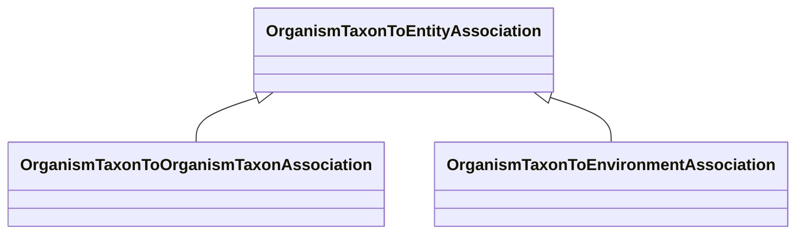

# Class: OrganismTaxonToEntityAssociation


_An association between an organism taxon and another entity_


URI: [bican:OrganismTaxonToEntityAssociation](https://identifiers.org/brain-bican/vocab/OrganismTaxonToEntityAssociation)





<!-- no inheritance hierarchy -->


## Slots

| Name | Cardinality and Range | Description | Inheritance |
| ---  | --- | --- | --- |


## Mixin Usage

| mixed into | description |
| --- | --- |
| [OrganismTaxonToOrganismTaxonAssociation](OrganismTaxonToOrganismTaxonAssociation.md) | A relationship between two organism taxon nodes |
| [OrganismTaxonToEnvironmentAssociation](OrganismTaxonToEnvironmentAssociation.md) |  |


## Identifier and Mapping Information


### Schema Source


* from schema: https://identifiers.org/brain-bican/kb-model


## Mappings

| Mapping Type | Mapped Value |
| ---  | ---  |
| self | bican:OrganismTaxonToEntityAssociation |
| native | bican:OrganismTaxonToEntityAssociation |


## LinkML Source

<!-- TODO: investigate https://stackoverflow.com/questions/37606292/how-to-create-tabbed-code-blocks-in-mkdocs-or-sphinx -->

### Direct

<details>
```yaml
name: organism taxon to entity association
description: An association between an organism taxon and another entity
from_schema: https://identifiers.org/brain-bican/kb-model
mixin: true
slot_usage:
  subject:
    name: subject
    description: organism taxon that is the subject of the association
    range: organism taxon
defining_slots:
- subject

```
</details>

### Induced

<details>
```yaml
name: organism taxon to entity association
description: An association between an organism taxon and another entity
from_schema: https://identifiers.org/brain-bican/kb-model
mixin: true
slot_usage:
  subject:
    name: subject
    description: organism taxon that is the subject of the association
    range: organism taxon
defining_slots:
- subject

```
</details>