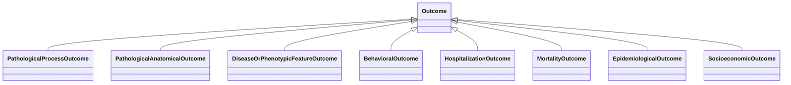

# Class: Outcome


_An entity that has the role of being the consequence of an exposure event. This is an abstract mixin grouping of various categories of possible biological or non-biological (e.g. clinical) outcomes._


URI: [bican:Outcome](https://identifiers.org/brain-bican/vocab/Outcome)





<!-- no inheritance hierarchy -->


## Slots

| Name | Cardinality and Range | Description | Inheritance |
| ---  | --- | --- | --- |


## Mixin Usage

| mixed into | description |
| --- | --- |
| [PathologicalProcessOutcome](PathologicalProcessOutcome.md) | An outcome resulting from an exposure event which is the manifestation of a p... |
| [PathologicalAnatomicalOutcome](PathologicalAnatomicalOutcome.md) | An outcome resulting from an exposure event which is the manifestation of an ... |
| [DiseaseOrPhenotypicFeatureOutcome](DiseaseOrPhenotypicFeatureOutcome.md) | Physiological outcomes resulting from an exposure event which is the manifest... |
| [BehavioralOutcome](BehavioralOutcome.md) | An outcome resulting from an exposure event which is the manifestation of hum... |
| [HospitalizationOutcome](HospitalizationOutcome.md) | An outcome resulting from an exposure event which is the increased manifestat... |
| [MortalityOutcome](MortalityOutcome.md) | An outcome of death from resulting from an exposure event |
| [EpidemiologicalOutcome](EpidemiologicalOutcome.md) | An epidemiological outcome, such as societal disease burden, resulting from a... |
| [SocioeconomicOutcome](SocioeconomicOutcome.md) | An general social or economic outcome, such as healthcare costs, utilization,... |


## Usages

| used by | used in | type | used |
| ---  | --- | --- | --- |
| [ExposureEventToOutcomeAssociation](ExposureEventToOutcomeAssociation.md) | [object](object.md) | range | [Outcome](Outcome.md) |


## Identifier and Mapping Information


### Schema Source


* from schema: https://identifiers.org/brain-bican/kb-model


## Mappings

| Mapping Type | Mapped Value |
| ---  | ---  |
| self | bican:Outcome |
| native | bican:Outcome |


## LinkML Source

<!-- TODO: investigate https://stackoverflow.com/questions/37606292/how-to-create-tabbed-code-blocks-in-mkdocs-or-sphinx -->

### Direct

<details>
```yaml
name: outcome
description: An entity that has the role of being the consequence of an exposure event.
  This is an abstract mixin grouping of various categories of possible biological
  or non-biological (e.g. clinical) outcomes.
from_schema: https://identifiers.org/brain-bican/kb-model
mixin: true

```
</details>

### Induced

<details>
```yaml
name: outcome
description: An entity that has the role of being the consequence of an exposure event.
  This is an abstract mixin grouping of various categories of possible biological
  or non-biological (e.g. clinical) outcomes.
from_schema: https://identifiers.org/brain-bican/kb-model
mixin: true

```
</details>