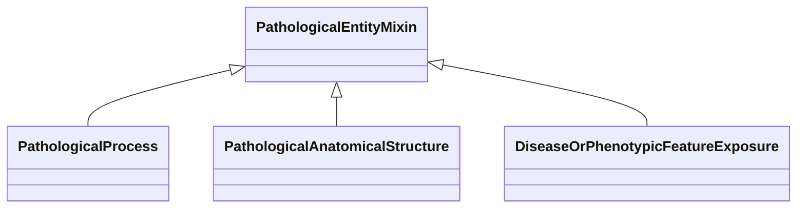

# Class: PathologicalEntityMixin


_A pathological (abnormal) structure or process._


URI: [bican:PathologicalEntityMixin](https://identifiers.org/brain-bican/vocab/PathologicalEntityMixin)





<!-- no inheritance hierarchy -->


## Slots

| Name | Cardinality and Range | Description | Inheritance |
| ---  | --- | --- | --- |


## Mixin Usage

| mixed into | description |
| --- | --- |
| [PathologicalProcess](PathologicalProcess.md) | A biologic function or a process having an abnormal or deleterious effect at ... |
| [PathologicalAnatomicalStructure](PathologicalAnatomicalStructure.md) | An anatomical structure with the potential of have an abnormal or deleterious... |
| [DiseaseOrPhenotypicFeatureExposure](DiseaseOrPhenotypicFeatureExposure.md) | A disease or phenotypic feature state, when viewed as an exposure, represents... |


## Identifier and Mapping Information


### Schema Source


* from schema: https://identifiers.org/brain-bican/kb-model


## Mappings

| Mapping Type | Mapped Value |
| ---  | ---  |
| self | bican:PathologicalEntityMixin |
| native | bican:PathologicalEntityMixin |
| exact | MPATH:0 |
| narrow | HP:0000118 |


## LinkML Source

<!-- TODO: investigate https://stackoverflow.com/questions/37606292/how-to-create-tabbed-code-blocks-in-mkdocs-or-sphinx -->

### Direct

<details>
```yaml
name: pathological entity mixin
description: A pathological (abnormal) structure or process.
from_schema: https://identifiers.org/brain-bican/kb-model
exact_mappings:
- MPATH:0
narrow_mappings:
- HP:0000118
mixin: true

```
</details>

### Induced

<details>
```yaml
name: pathological entity mixin
description: A pathological (abnormal) structure or process.
from_schema: https://identifiers.org/brain-bican/kb-model
exact_mappings:
- MPATH:0
narrow_mappings:
- HP:0000118
mixin: true

```
</details>