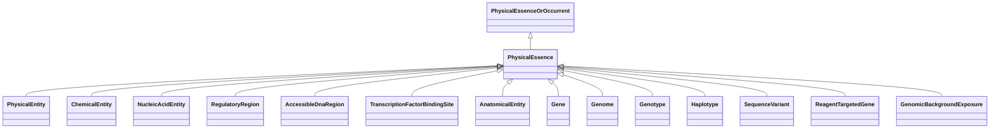

# Class: PhysicalEssence


_Semantic mixin concept.  Pertains to entities that have physical properties such as mass, volume, or charge._


URI: [bican:PhysicalEssence](https://identifiers.org/brain-bican/vocab/PhysicalEssence)





## Inheritance
* [PhysicalEssenceOrOccurrent](PhysicalEssenceOrOccurrent.md)
    * **PhysicalEssence**


## Slots

| Name | Cardinality and Range | Description | Inheritance |
| ---  | --- | --- | --- |


## Mixin Usage

| mixed into | description |
| --- | --- |
| [PhysicalEntity](PhysicalEntity.md) | An entity that has material reality (a |
| [ChemicalEntity](ChemicalEntity.md) | A chemical entity is a physical entity that pertains to chemistry or biochemi... |
| [NucleicAcidEntity](NucleicAcidEntity.md) | A nucleic acid entity is a molecular entity characterized by availability in ... |
| [RegulatoryRegion](RegulatoryRegion.md) | A region (or regions) of the genome that contains known or putative regulator... |
| [AccessibleDnaRegion](AccessibleDnaRegion.md) | A region (or regions) of a chromatinized genome that has been measured to be ... |
| [TranscriptionFactorBindingSite](TranscriptionFactorBindingSite.md) | A region (or regions) of the genome that contains a region of DNA known or pr... |
| [AnatomicalEntity](AnatomicalEntity.md) | A subcellular location, cell type or gross anatomical part |
| [Gene](Gene.md) | A region (or regions) that includes all of the sequence elements necessary to... |
| [Genome](Genome.md) | A genome is the sum of genetic material within a cell or virion |
| [Genotype](Genotype.md) | An information content entity that describes a genome by specifying the total... |
| [Haplotype](Haplotype.md) | A set of zero or more Alleles on a single instance of a Sequence[VMC] |
| [SequenceVariant](SequenceVariant.md) | A sequence_variant is a non exact copy of a sequence_feature or genome exhibi... |
| [ReagentTargetedGene](ReagentTargetedGene.md) | A gene altered in its expression level in the context of some experiment as a... |
| [GenomicBackgroundExposure](GenomicBackgroundExposure.md) | A genomic background exposure is where an individual's specific genomic backg... |


## Identifier and Mapping Information


### Schema Source


* from schema: https://identifiers.org/brain-bican/kb-model


## Mappings

| Mapping Type | Mapped Value |
| ---  | ---  |
| self | bican:PhysicalEssence |
| native | bican:PhysicalEssence |


## LinkML Source

<!-- TODO: investigate https://stackoverflow.com/questions/37606292/how-to-create-tabbed-code-blocks-in-mkdocs-or-sphinx -->

### Direct

<details>
```yaml
name: physical essence
description: Semantic mixin concept.  Pertains to entities that have physical properties
  such as mass, volume, or charge.
from_schema: https://identifiers.org/brain-bican/kb-model
is_a: physical essence or occurrent
mixin: true

```
</details>

### Induced

<details>
```yaml
name: physical essence
description: Semantic mixin concept.  Pertains to entities that have physical properties
  such as mass, volume, or charge.
from_schema: https://identifiers.org/brain-bican/kb-model
is_a: physical essence or occurrent
mixin: true

```
</details>