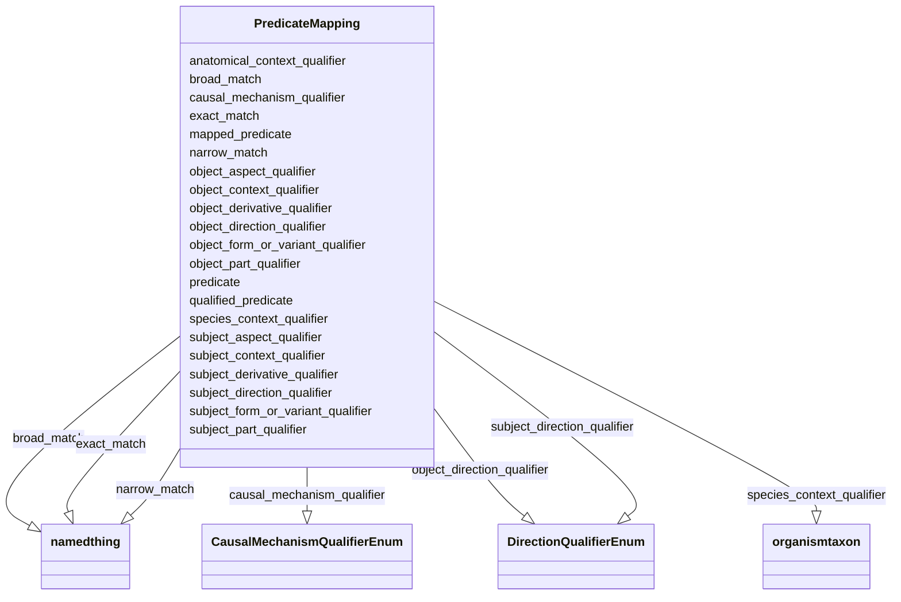

# Class: PredicateMapping


_A deprecated predicate mapping object contains the deprecated predicate and an example of the rewiring that should be done to use a qualified statement in its place._


URI: [bican:PredicateMapping](https://identifiers.org/brain-bican/vocab/PredicateMapping)





<!-- no inheritance hierarchy -->


## Slots

| Name | Cardinality and Range | Description | Inheritance |
| ---  | --- | --- | --- |
| [mapped_predicate](mapped_predicate.md) | 0..1 <br/> [String](String.md) | The predicate that is being replaced by the fully qualified representation of... | direct |
| [subject_aspect_qualifier](subject_aspect_qualifier.md) | 0..1 <br/> [String](String.md) |  | direct |
| [subject_direction_qualifier](subject_direction_qualifier.md) | 0..1 <br/> [DirectionQualifierEnum](DirectionQualifierEnum.md) |  | direct |
| [subject_form_or_variant_qualifier](subject_form_or_variant_qualifier.md) | 0..1 <br/> [String](String.md) |  | direct |
| [subject_part_qualifier](subject_part_qualifier.md) | 0..1 <br/> [String](String.md) |  | direct |
| [subject_derivative_qualifier](subject_derivative_qualifier.md) | 0..1 <br/> [String](String.md) |  | direct |
| [subject_context_qualifier](subject_context_qualifier.md) | 0..1 <br/> [String](String.md) |  | direct |
| [predicate](predicate.md) | 1..1 <br/> [PredicateType](PredicateType.md) | A high-level grouping for the relationship type | direct |
| [qualified_predicate](qualified_predicate.md) | 0..1 <br/> [String](String.md) | Predicate to be used in an association when subject and object qualifiers are... | direct |
| [object_aspect_qualifier](object_aspect_qualifier.md) | 0..1 <br/> [String](String.md) |  | direct |
| [object_direction_qualifier](object_direction_qualifier.md) | 0..1 <br/> [DirectionQualifierEnum](DirectionQualifierEnum.md) |  | direct |
| [object_form_or_variant_qualifier](object_form_or_variant_qualifier.md) | 0..1 <br/> [String](String.md) |  | direct |
| [object_part_qualifier](object_part_qualifier.md) | 0..1 <br/> [String](String.md) |  | direct |
| [object_derivative_qualifier](object_derivative_qualifier.md) | 0..1 <br/> [String](String.md) |  | direct |
| [object_context_qualifier](object_context_qualifier.md) | 0..1 <br/> [String](String.md) |  | direct |
| [causal_mechanism_qualifier](causal_mechanism_qualifier.md) | 0..1 <br/> [CausalMechanismQualifierEnum](CausalMechanismQualifierEnum.md) | A statement qualifier representing a type of molecular control mechanism thro... | direct |
| [anatomical_context_qualifier](anatomical_context_qualifier.md) | 0..1 <br/> [String](String.md) | A statement qualifier representing an anatomical location where an relationsh... | direct |
| [species_context_qualifier](species_context_qualifier.md) | 0..1 <br/> [OrganismTaxon](OrganismTaxon.md) | A statement qualifier representing a taxonomic category of species in which a... | direct |
| [exact_match](exact_match.md) | 0..* <br/> [NamedThing](NamedThing.md) | holds between two entities that have strictly equivalent meanings, with a hig... | direct |
| [narrow_match](narrow_match.md) | 0..* <br/> [NamedThing](NamedThing.md) | a list of terms from different schemas or terminology systems that have a nar... | direct |
| [broad_match](broad_match.md) | 0..* <br/> [NamedThing](NamedThing.md) | a list of terms from different schemas or terminology systems that have a bro... | direct |


## Usages

| used by | used in | type | used |
| ---  | --- | --- | --- |
| [MappingCollection](MappingCollection.md) | [predicate_mappings](predicate_mappings.md) | range | [PredicateMapping](PredicateMapping.md) |


## Identifier and Mapping Information


### Schema Source


* from schema: https://identifiers.org/brain-bican/kb-model


## Mappings

| Mapping Type | Mapped Value |
| ---  | ---  |
| self | bican:PredicateMapping |
| native | bican:PredicateMapping |


## LinkML Source

<!-- TODO: investigate https://stackoverflow.com/questions/37606292/how-to-create-tabbed-code-blocks-in-mkdocs-or-sphinx -->

### Direct

<details>
```yaml
name: predicate mapping
description: A deprecated predicate mapping object contains the deprecated predicate
  and an example of the rewiring that should be done to use a qualified statement
  in its place.
from_schema: https://identifiers.org/brain-bican/kb-model
slots:
- mapped predicate
- subject aspect qualifier
- subject direction qualifier
- subject form or variant qualifier
- subject part qualifier
- subject derivative qualifier
- subject context qualifier
- predicate
- qualified predicate
- object aspect qualifier
- object direction qualifier
- object form or variant qualifier
- object part qualifier
- object derivative qualifier
- object context qualifier
- causal mechanism qualifier
- anatomical context qualifier
- species context qualifier
- exact match
- narrow match
- broad match

```
</details>

### Induced

<details>
```yaml
name: predicate mapping
description: A deprecated predicate mapping object contains the deprecated predicate
  and an example of the rewiring that should be done to use a qualified statement
  in its place.
from_schema: https://identifiers.org/brain-bican/kb-model
attributes:
  mapped predicate:
    name: mapped predicate
    description: The predicate that is being replaced by the fully qualified representation
      of predicate + subject and object  qualifiers.  Only to be used in test data
      and mapping data to help with the transition to the fully qualified predicate
      model. Not to be used in knowledge graphs.
    from_schema: https://identifiers.org/brain-bican/kb-model
    rank: 1000
    alias: mapped_predicate
    owner: predicate mapping
    domain_of:
    - predicate mapping
    range: string
  subject aspect qualifier:
    name: subject aspect qualifier
    in_subset:
    - translator_minimal
    from_schema: https://identifiers.org/brain-bican/kb-model
    rank: 1000
    is_a: aspect qualifier
    domain: association
    alias: subject_aspect_qualifier
    owner: predicate mapping
    domain_of:
    - predicate mapping
    - chemical affects gene association
    - gene to disease or phenotypic feature association
    range: string
  subject direction qualifier:
    name: subject direction qualifier
    in_subset:
    - translator_minimal
    from_schema: https://identifiers.org/brain-bican/kb-model
    rank: 1000
    is_a: direction qualifier
    domain: association
    alias: subject_direction_qualifier
    owner: predicate mapping
    domain_of:
    - predicate mapping
    - chemical affects gene association
    range: DirectionQualifierEnum
  subject form or variant qualifier:
    name: subject form or variant qualifier
    in_subset:
    - translator_minimal
    from_schema: https://identifiers.org/brain-bican/kb-model
    rank: 1000
    is_a: form or variant qualifier
    domain: association
    alias: subject_form_or_variant_qualifier
    owner: predicate mapping
    domain_of:
    - predicate mapping
    - chemical gene interaction association
    - chemical affects gene association
    - gene has variant that contributes to disease association
    range: string
  subject part qualifier:
    name: subject part qualifier
    in_subset:
    - translator_minimal
    from_schema: https://identifiers.org/brain-bican/kb-model
    rank: 1000
    is_a: part qualifier
    domain: association
    alias: subject_part_qualifier
    owner: predicate mapping
    domain_of:
    - predicate mapping
    - chemical gene interaction association
    - chemical affects gene association
    range: string
  subject derivative qualifier:
    name: subject derivative qualifier
    in_subset:
    - translator_minimal
    from_schema: https://identifiers.org/brain-bican/kb-model
    rank: 1000
    is_a: derivative qualifier
    domain: association
    alias: subject_derivative_qualifier
    owner: predicate mapping
    domain_of:
    - predicate mapping
    - chemical gene interaction association
    - chemical affects gene association
    range: string
  subject context qualifier:
    name: subject context qualifier
    in_subset:
    - translator_minimal
    from_schema: https://identifiers.org/brain-bican/kb-model
    rank: 1000
    is_a: context qualifier
    domain: association
    alias: subject_context_qualifier
    owner: predicate mapping
    domain_of:
    - predicate mapping
    - chemical gene interaction association
    - chemical affects gene association
    range: string
  predicate:
    name: predicate
    local_names:
      ga4gh:
        local_name_source: ga4gh
        local_name_value: annotation predicate
      translator:
        local_name_source: translator
        local_name_value: predicate
    description: A high-level grouping for the relationship type. AKA minimal predicate.
      This is analogous to category for nodes.
    notes:
    - Has a value from the Biolink related_to hierarchy. In RDF,  this corresponds
      to rdf:predicate and in Neo4j this corresponds to the relationship type. The
      convention is for an edge label in snake_case form. For example, biolink:related_to,
      biolink:causes, biolink:treats
    from_schema: https://identifiers.org/brain-bican/kb-model
    exact_mappings:
    - owl:annotatedProperty
    - OBAN:association_has_predicate
    rank: 1000
    is_a: association slot
    domain: association
    slot_uri: rdf:predicate
    alias: predicate
    owner: predicate mapping
    domain_of:
    - predicate mapping
    - association
    range: predicate type
    required: true
  qualified predicate:
    name: qualified predicate
    description: Predicate to be used in an association when subject and object qualifiers
      are present and the full reading of the statement requires a qualification to
      the predicate in use in order to refine or  increase the specificity of the
      full statement reading.  This qualifier holds a relationship to be used instead
      of that  expressed by the primary predicate, in a ‘full statement’ reading of
      the association, where qualifier-based  semantics are included.  This is necessary
      only in cases where the primary predicate does not work in a  full statement
      reading.
    notes:
    - 'to express the statement that “Chemical X causes increased expression of Gene
      Y”, the core triple is read  using the fields subject:ChemX, predicate:affects,
      object:GeneY . . . and the full statement is read using  the fields subject:ChemX,
      qualified_predicate:causes, object:GeneY, object_aspect: expression,  object_direction:increased.
      The predicate ‘affects’ is needed for the core triple reading, but does not
      make  sense in the full statement reading  (because “Chemical X affects increased
      expression of Gene Y'''' is not  what we mean to say here: it causes increased
      expression of Gene Y)'
    from_schema: https://identifiers.org/brain-bican/kb-model
    rank: 1000
    is_a: qualifier
    domain: association
    alias: qualified_predicate
    owner: predicate mapping
    domain_of:
    - predicate mapping
    - chemical affects gene association
    range: string
  object aspect qualifier:
    name: object aspect qualifier
    in_subset:
    - translator_minimal
    from_schema: https://identifiers.org/brain-bican/kb-model
    rank: 1000
    is_a: aspect qualifier
    domain: association
    alias: object_aspect_qualifier
    owner: predicate mapping
    domain_of:
    - predicate mapping
    - chemical affects gene association
    range: string
  object direction qualifier:
    name: object direction qualifier
    in_subset:
    - translator_minimal
    from_schema: https://identifiers.org/brain-bican/kb-model
    rank: 1000
    is_a: direction qualifier
    domain: association
    alias: object_direction_qualifier
    owner: predicate mapping
    domain_of:
    - predicate mapping
    - gene to disease or phenotypic feature association
    - chemical entity or gene or gene product regulates gene association
    range: DirectionQualifierEnum
  object form or variant qualifier:
    name: object form or variant qualifier
    in_subset:
    - translator_minimal
    from_schema: https://identifiers.org/brain-bican/kb-model
    rank: 1000
    is_a: form or variant qualifier
    domain: association
    alias: object_form_or_variant_qualifier
    owner: predicate mapping
    domain_of:
    - predicate mapping
    - chemical gene interaction association
    - chemical affects gene association
    range: string
  object part qualifier:
    name: object part qualifier
    in_subset:
    - translator_minimal
    from_schema: https://identifiers.org/brain-bican/kb-model
    rank: 1000
    is_a: part qualifier
    domain: association
    alias: object_part_qualifier
    owner: predicate mapping
    domain_of:
    - predicate mapping
    - chemical gene interaction association
    - chemical affects gene association
    range: string
  object derivative qualifier:
    name: object derivative qualifier
    in_subset:
    - translator_minimal
    from_schema: https://identifiers.org/brain-bican/kb-model
    rank: 1000
    is_a: derivative qualifier
    domain: association
    alias: object_derivative_qualifier
    owner: predicate mapping
    domain_of:
    - predicate mapping
    range: string
  object context qualifier:
    name: object context qualifier
    in_subset:
    - translator_minimal
    from_schema: https://identifiers.org/brain-bican/kb-model
    rank: 1000
    is_a: context qualifier
    domain: association
    alias: object_context_qualifier
    owner: predicate mapping
    domain_of:
    - predicate mapping
    - chemical gene interaction association
    - chemical affects gene association
    range: string
  causal mechanism qualifier:
    name: causal mechanism qualifier
    description: A statement qualifier representing a type of molecular control mechanism
      through which an effect of a chemical on a gene or gene product is mediated
      (e.g. 'agonism', 'inhibition', 'allosteric modulation', 'channel blocker')
    in_subset:
    - translator_minimal
    from_schema: https://identifiers.org/brain-bican/kb-model
    rank: 1000
    is_a: statement qualifier
    domain: association
    alias: causal_mechanism_qualifier
    owner: predicate mapping
    domain_of:
    - predicate mapping
    - chemical affects gene association
    range: CausalMechanismQualifierEnum
  anatomical context qualifier:
    name: anatomical context qualifier
    description: A statement qualifier representing an anatomical location where an
      relationship expressed in an association took place (can be a tissue, cell type,
      or sub-cellular location).
    notes:
    - Anatomical context values can be any term from UBERON. For example, the context
      qualifier ‘cerebral cortext’  combines with a core concept of ‘neuron’  to express
      the composed concept ‘neuron in the cerebral cortext’. The species_context_qualifier
      applies  taxonomic context, e.g. species-specific molecular activity.  Ontology
      CURIEs are expected as values  here, the examples below are intended to help
      clarify the content of the CURIEs.
    examples:
    - value: blood
    - value: cerebral cortext
    in_subset:
    - translator_minimal
    from_schema: https://identifiers.org/brain-bican/kb-model
    rank: 1000
    is_a: statement qualifier
    domain: association
    alias: anatomical_context_qualifier
    owner: predicate mapping
    domain_of:
    - predicate mapping
    - chemical gene interaction association
    - chemical affects gene association
    range: string
  species context qualifier:
    name: species context qualifier
    description: A statement qualifier representing a taxonomic category of species
      in which a relationship expressed in an association took place.
    notes:
    - Ontology CURIEs are expected as values here, the examples below are intended
      to help clarify the content of the CURIEs.
    examples:
    - value: zebrafish
    - value: human
    in_subset:
    - translator_minimal
    from_schema: https://identifiers.org/brain-bican/kb-model
    rank: 1000
    is_a: statement qualifier
    domain: association
    alias: species_context_qualifier
    owner: predicate mapping
    domain_of:
    - predicate mapping
    range: organism taxon
  exact match:
    name: exact match
    annotations:
      canonical_predicate:
        tag: canonical_predicate
        value: 'True'
    description: holds between two entities that have strictly equivalent meanings,
      with a high degree of confidence
    in_subset:
    - translator_minimal
    from_schema: https://identifiers.org/brain-bican/kb-model
    exact_mappings:
    - skos:exactMatch
    - WIKIDATA:Q39893449
    - WIKIDATA:P2888
    rank: 1000
    is_a: close match
    domain: named thing
    multivalued: true
    inherited: true
    alias: exact_match
    owner: predicate mapping
    domain_of:
    - predicate mapping
    symmetric: true
    range: named thing
  narrow match:
    name: narrow match
    annotations:
      opposite_of:
        tag: opposite_of
        value: broad match
    description: a list of terms from different schemas or terminology systems that
      have a narrower, more specific meaning. Narrower terms are typically shown as
      children in a hierarchy or tree.
    in_subset:
    - translator_minimal
    from_schema: https://identifiers.org/brain-bican/kb-model
    exact_mappings:
    - skos:narrowMatch
    - WIKIDATA:Q39893967
    rank: 1000
    is_a: related to at concept level
    domain: named thing
    multivalued: true
    inherited: true
    alias: narrow_match
    owner: predicate mapping
    domain_of:
    - predicate mapping
    inverse: broad match
    range: named thing
  broad match:
    name: broad match
    annotations:
      canonical_predicate:
        tag: canonical_predicate
        value: 'True'
      opposite_of:
        tag: opposite_of
        value: narrow match
    description: a list of terms from different schemas or terminology systems that
      have a broader, more general meaning. Broader terms are typically shown as parents
      in a hierarchy or tree.
    in_subset:
    - translator_minimal
    from_schema: https://identifiers.org/brain-bican/kb-model
    exact_mappings:
    - skos:broadMatch
    - WIKIDATA:Q39894595
    rank: 1000
    is_a: related to at concept level
    domain: named thing
    multivalued: true
    inherited: true
    alias: broad_match
    owner: predicate mapping
    domain_of:
    - predicate mapping
    range: named thing

```
</details>