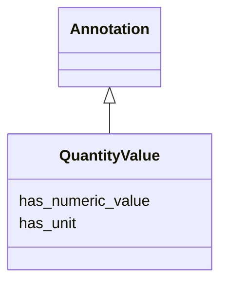

# Class: QuantityValue


_A value of an attribute that is quantitative and measurable, expressed as a combination of a unit and a numeric value_


URI: [bican:QuantityValue](https://identifiers.org/brain-bican/vocab/QuantityValue)





## Inheritance
* [Annotation](Annotation.md)
    * **QuantityValue**


## Slots

| Name | Cardinality and Range | Description | Inheritance |
| ---  | --- | --- | --- |
| [has_unit](has_unit.md) | 0..1 <br/> [Unit](Unit.md) | connects a quantity value to a unit | direct |
| [has_numeric_value](has_numeric_value.md) | 0..1 <br/> [Double](Double.md) | connects a quantity value to a number | direct |


## Usages

| used by | used in | type | used |
| ---  | --- | --- | --- |
| [QuantityValue](QuantityValue.md) | [has_unit](has_unit.md) | domain | [QuantityValue](QuantityValue.md) |
| [QuantityValue](QuantityValue.md) | [has_numeric_value](has_numeric_value.md) | domain | [QuantityValue](QuantityValue.md) |
| [Attribute](Attribute.md) | [has_quantitative_value](has_quantitative_value.md) | range | [QuantityValue](QuantityValue.md) |
| [ChemicalRole](ChemicalRole.md) | [has_quantitative_value](has_quantitative_value.md) | range | [QuantityValue](QuantityValue.md) |
| [BiologicalSex](BiologicalSex.md) | [has_quantitative_value](has_quantitative_value.md) | range | [QuantityValue](QuantityValue.md) |
| [PhenotypicSex](PhenotypicSex.md) | [has_quantitative_value](has_quantitative_value.md) | range | [QuantityValue](QuantityValue.md) |
| [GenotypicSex](GenotypicSex.md) | [has_quantitative_value](has_quantitative_value.md) | range | [QuantityValue](QuantityValue.md) |
| [SeverityValue](SeverityValue.md) | [has_quantitative_value](has_quantitative_value.md) | range | [QuantityValue](QuantityValue.md) |
| [OrganismAttribute](OrganismAttribute.md) | [has_quantitative_value](has_quantitative_value.md) | range | [QuantityValue](QuantityValue.md) |
| [PhenotypicQuality](PhenotypicQuality.md) | [has_quantitative_value](has_quantitative_value.md) | range | [QuantityValue](QuantityValue.md) |
| [Zygosity](Zygosity.md) | [has_quantitative_value](has_quantitative_value.md) | range | [QuantityValue](QuantityValue.md) |
| [ClinicalAttribute](ClinicalAttribute.md) | [has_quantitative_value](has_quantitative_value.md) | range | [QuantityValue](QuantityValue.md) |
| [ClinicalMeasurement](ClinicalMeasurement.md) | [has_quantitative_value](has_quantitative_value.md) | range | [QuantityValue](QuantityValue.md) |
| [ClinicalModifier](ClinicalModifier.md) | [has_quantitative_value](has_quantitative_value.md) | range | [QuantityValue](QuantityValue.md) |
| [ClinicalCourse](ClinicalCourse.md) | [has_quantitative_value](has_quantitative_value.md) | range | [QuantityValue](QuantityValue.md) |
| [Onset](Onset.md) | [has_quantitative_value](has_quantitative_value.md) | range | [QuantityValue](QuantityValue.md) |
| [SocioeconomicAttribute](SocioeconomicAttribute.md) | [has_quantitative_value](has_quantitative_value.md) | range | [QuantityValue](QuantityValue.md) |
| [GenomicBackgroundExposure](GenomicBackgroundExposure.md) | [has_quantitative_value](has_quantitative_value.md) | range | [QuantityValue](QuantityValue.md) |
| [PathologicalProcessExposure](PathologicalProcessExposure.md) | [has_quantitative_value](has_quantitative_value.md) | range | [QuantityValue](QuantityValue.md) |
| [PathologicalAnatomicalExposure](PathologicalAnatomicalExposure.md) | [has_quantitative_value](has_quantitative_value.md) | range | [QuantityValue](QuantityValue.md) |
| [DiseaseOrPhenotypicFeatureExposure](DiseaseOrPhenotypicFeatureExposure.md) | [has_quantitative_value](has_quantitative_value.md) | range | [QuantityValue](QuantityValue.md) |
| [ChemicalExposure](ChemicalExposure.md) | [has_quantitative_value](has_quantitative_value.md) | range | [QuantityValue](QuantityValue.md) |
| [ComplexChemicalExposure](ComplexChemicalExposure.md) | [has_quantitative_value](has_quantitative_value.md) | range | [QuantityValue](QuantityValue.md) |
| [DrugExposure](DrugExposure.md) | [has_quantitative_value](has_quantitative_value.md) | range | [QuantityValue](QuantityValue.md) |
| [DrugToGeneInteractionExposure](DrugToGeneInteractionExposure.md) | [has_quantitative_value](has_quantitative_value.md) | range | [QuantityValue](QuantityValue.md) |
| [BioticExposure](BioticExposure.md) | [has_quantitative_value](has_quantitative_value.md) | range | [QuantityValue](QuantityValue.md) |
| [GeographicExposure](GeographicExposure.md) | [has_quantitative_value](has_quantitative_value.md) | range | [QuantityValue](QuantityValue.md) |
| [EnvironmentalExposure](EnvironmentalExposure.md) | [has_quantitative_value](has_quantitative_value.md) | range | [QuantityValue](QuantityValue.md) |
| [BehavioralExposure](BehavioralExposure.md) | [has_quantitative_value](has_quantitative_value.md) | range | [QuantityValue](QuantityValue.md) |
| [SocioeconomicExposure](SocioeconomicExposure.md) | [has_quantitative_value](has_quantitative_value.md) | range | [QuantityValue](QuantityValue.md) |


## Identifier and Mapping Information


### Schema Source


* from schema: https://identifiers.org/brain-bican/kb-model


## Mappings

| Mapping Type | Mapped Value |
| ---  | ---  |
| self | bican:QuantityValue |
| native | bican:QuantityValue |


## LinkML Source

<!-- TODO: investigate https://stackoverflow.com/questions/37606292/how-to-create-tabbed-code-blocks-in-mkdocs-or-sphinx -->

### Direct

<details>
```yaml
name: quantity value
description: A value of an attribute that is quantitative and measurable, expressed
  as a combination of a unit and a numeric value
from_schema: https://identifiers.org/brain-bican/kb-model
is_a: annotation
slots:
- has unit
- has numeric value

```
</details>

### Induced

<details>
```yaml
name: quantity value
description: A value of an attribute that is quantitative and measurable, expressed
  as a combination of a unit and a numeric value
from_schema: https://identifiers.org/brain-bican/kb-model
is_a: annotation
attributes:
  has unit:
    name: has unit
    description: connects a quantity value to a unit
    in_subset:
    - samples
    from_schema: https://identifiers.org/brain-bican/kb-model
    exact_mappings:
    - qud:unit
    - IAO:0000039
    close_mappings:
    - EFO:0001697
    - UO-PROPERTY:is_unit_of
    narrow_mappings:
    - SNOMED:has_concentration_strength_denominator_unit
    - SNOMED:has_concentration_strength_numerator_unit
    - SNOMED:has_presentation_strength_denominator_unit
    - SNOMED:has_presentation_strength_numerator_unit
    - SNOMED:has_unit_of_presentation
    rank: 1000
    domain: quantity value
    multivalued: false
    alias: has_unit
    owner: quantity value
    domain_of:
    - quantity value
    range: unit
  has numeric value:
    name: has numeric value
    description: connects a quantity value to a number
    in_subset:
    - samples
    from_schema: https://identifiers.org/brain-bican/kb-model
    exact_mappings:
    - qud:quantityValue
    rank: 1000
    domain: quantity value
    multivalued: false
    alias: has_numeric_value
    owner: quantity value
    domain_of:
    - quantity value
    range: double

```
</details>