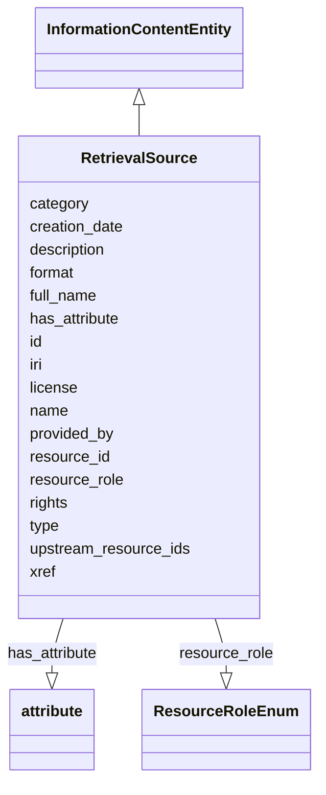

# Class: RetrievalSource


_Provides information about how a particular InformationResource served as a source from which knowledge expressed in an Edge, or data used to generate this knowledge, was retrieved._


URI: [bican:RetrievalSource](https://identifiers.org/brain-bican/vocab/RetrievalSource)





## Inheritance
* [Entity](Entity.md)
    * [NamedThing](NamedThing.md)
        * [InformationContentEntity](InformationContentEntity.md)
            * **RetrievalSource**


## Slots

| Name | Cardinality and Range | Description | Inheritance |
| ---  | --- | --- | --- |
| [resource_id](resource_id.md) | 1..1 <br/> [Uriorcurie](Uriorcurie.md) | The InformationResource that served as a source for the knowledge expressed i... | direct |
| [resource_role](resource_role.md) | 1..1 <br/> [ResourceRoleEnum](ResourceRoleEnum.md) | The role of the InformationResource in the retrieval of the knowledge express... | direct |
| [upstream_resource_ids](upstream_resource_ids.md) | 0..1 <br/> [Uriorcurie](Uriorcurie.md) | The InformationResources that served as a source for the InformationResource ... | direct |
| [xref](xref.md) | 0..* <br/> [Uriorcurie](Uriorcurie.md) | A database cross reference or alternative identifier for a NamedThing or edge... | direct |
| [license](license.md) | 0..1 <br/> [String](String.md) |  | [InformationContentEntity](InformationContentEntity.md) |
| [rights](rights.md) | 0..1 <br/> [String](String.md) |  | [InformationContentEntity](InformationContentEntity.md) |
| [format](format.md) | 0..1 <br/> [String](String.md) |  | [InformationContentEntity](InformationContentEntity.md) |
| [creation_date](creation_date.md) | 0..1 <br/> [Date](Date.md) | date on which an entity was created | [InformationContentEntity](InformationContentEntity.md) |
| [provided_by](provided_by.md) | 0..* <br/> [String](String.md) | The value in this node property represents the knowledge provider that create... | [NamedThing](NamedThing.md) |
| [full_name](full_name.md) | 0..1 <br/> [LabelType](LabelType.md) | a long-form human readable name for a thing | [NamedThing](NamedThing.md) |
| [id](id.md) | 1..1 <br/> [String](String.md) | A unique identifier for an entity | [Entity](Entity.md) |
| [iri](iri.md) | 0..1 <br/> [IriType](IriType.md) | An IRI for an entity | [Entity](Entity.md) |
| [category](category.md) | 1..* <br/> [CategoryType](CategoryType.md) | Name of the high level ontology class in which this entity is categorized | [Entity](Entity.md) |
| [type](type.md) | 0..* <br/> [String](String.md) |  | [Entity](Entity.md) |
| [name](name.md) | 0..1 <br/> [LabelType](LabelType.md) | A human-readable name for an attribute or entity | [Entity](Entity.md) |
| [description](description.md) | 0..1 <br/> [NarrativeText](NarrativeText.md) | a human-readable description of an entity | [Entity](Entity.md) |
| [has_attribute](has_attribute.md) | 0..* <br/> [Attribute](Attribute.md) | connects any entity to an attribute | [Entity](Entity.md) |


## Usages

| used by | used in | type | used |
| ---  | --- | --- | --- |
| [RetrievalSource](RetrievalSource.md) | [resource_id](resource_id.md) | domain | [RetrievalSource](RetrievalSource.md) |
| [RetrievalSource](RetrievalSource.md) | [resource_role](resource_role.md) | domain | [RetrievalSource](RetrievalSource.md) |
| [RetrievalSource](RetrievalSource.md) | [upstream_resource_ids](upstream_resource_ids.md) | domain | [RetrievalSource](RetrievalSource.md) |
| [Association](Association.md) | [retrieval_source_ids](retrieval_source_ids.md) | range | [RetrievalSource](RetrievalSource.md) |
| [ChemicalEntityAssessesNamedThingAssociation](ChemicalEntityAssessesNamedThingAssociation.md) | [retrieval_source_ids](retrieval_source_ids.md) | range | [RetrievalSource](RetrievalSource.md) |
| [ContributorAssociation](ContributorAssociation.md) | [retrieval_source_ids](retrieval_source_ids.md) | range | [RetrievalSource](RetrievalSource.md) |
| [GenotypeToGenotypePartAssociation](GenotypeToGenotypePartAssociation.md) | [retrieval_source_ids](retrieval_source_ids.md) | range | [RetrievalSource](RetrievalSource.md) |
| [GenotypeToGeneAssociation](GenotypeToGeneAssociation.md) | [retrieval_source_ids](retrieval_source_ids.md) | range | [RetrievalSource](RetrievalSource.md) |
| [GenotypeToVariantAssociation](GenotypeToVariantAssociation.md) | [retrieval_source_ids](retrieval_source_ids.md) | range | [RetrievalSource](RetrievalSource.md) |
| [GeneToGeneAssociation](GeneToGeneAssociation.md) | [retrieval_source_ids](retrieval_source_ids.md) | range | [RetrievalSource](RetrievalSource.md) |
| [GeneToGeneHomologyAssociation](GeneToGeneHomologyAssociation.md) | [retrieval_source_ids](retrieval_source_ids.md) | range | [RetrievalSource](RetrievalSource.md) |
| [GeneToGeneFamilyAssociation](GeneToGeneFamilyAssociation.md) | [retrieval_source_ids](retrieval_source_ids.md) | range | [RetrievalSource](RetrievalSource.md) |
| [GeneToGeneCoexpressionAssociation](GeneToGeneCoexpressionAssociation.md) | [retrieval_source_ids](retrieval_source_ids.md) | range | [RetrievalSource](RetrievalSource.md) |
| [PairwiseGeneToGeneInteraction](PairwiseGeneToGeneInteraction.md) | [retrieval_source_ids](retrieval_source_ids.md) | range | [RetrievalSource](RetrievalSource.md) |
| [PairwiseMolecularInteraction](PairwiseMolecularInteraction.md) | [retrieval_source_ids](retrieval_source_ids.md) | range | [RetrievalSource](RetrievalSource.md) |
| [CellLineToDiseaseOrPhenotypicFeatureAssociation](CellLineToDiseaseOrPhenotypicFeatureAssociation.md) | [retrieval_source_ids](retrieval_source_ids.md) | range | [RetrievalSource](RetrievalSource.md) |
| [ChemicalToChemicalAssociation](ChemicalToChemicalAssociation.md) | [retrieval_source_ids](retrieval_source_ids.md) | range | [RetrievalSource](RetrievalSource.md) |
| [ReactionToParticipantAssociation](ReactionToParticipantAssociation.md) | [retrieval_source_ids](retrieval_source_ids.md) | range | [RetrievalSource](RetrievalSource.md) |
| [ReactionToCatalystAssociation](ReactionToCatalystAssociation.md) | [retrieval_source_ids](retrieval_source_ids.md) | range | [RetrievalSource](RetrievalSource.md) |
| [ChemicalToChemicalDerivationAssociation](ChemicalToChemicalDerivationAssociation.md) | [retrieval_source_ids](retrieval_source_ids.md) | range | [RetrievalSource](RetrievalSource.md) |
| [ChemicalToDiseaseOrPhenotypicFeatureAssociation](ChemicalToDiseaseOrPhenotypicFeatureAssociation.md) | [retrieval_source_ids](retrieval_source_ids.md) | range | [RetrievalSource](RetrievalSource.md) |
| [ChemicalOrDrugOrTreatmentToDiseaseOrPhenotypicFeatureAssociation](ChemicalOrDrugOrTreatmentToDiseaseOrPhenotypicFeatureAssociation.md) | [retrieval_source_ids](retrieval_source_ids.md) | range | [RetrievalSource](RetrievalSource.md) |
| [ChemicalOrDrugOrTreatmentSideEffectDiseaseOrPhenotypicFeatureAssociation](ChemicalOrDrugOrTreatmentSideEffectDiseaseOrPhenotypicFeatureAssociation.md) | [retrieval_source_ids](retrieval_source_ids.md) | range | [RetrievalSource](RetrievalSource.md) |
| [GeneToPathwayAssociation](GeneToPathwayAssociation.md) | [retrieval_source_ids](retrieval_source_ids.md) | range | [RetrievalSource](RetrievalSource.md) |
| [MolecularActivityToPathwayAssociation](MolecularActivityToPathwayAssociation.md) | [retrieval_source_ids](retrieval_source_ids.md) | range | [RetrievalSource](RetrievalSource.md) |
| [ChemicalToPathwayAssociation](ChemicalToPathwayAssociation.md) | [retrieval_source_ids](retrieval_source_ids.md) | range | [RetrievalSource](RetrievalSource.md) |
| [NamedThingAssociatedWithLikelihoodOfNamedThingAssociation](NamedThingAssociatedWithLikelihoodOfNamedThingAssociation.md) | [retrieval_source_ids](retrieval_source_ids.md) | range | [RetrievalSource](RetrievalSource.md) |
| [ChemicalGeneInteractionAssociation](ChemicalGeneInteractionAssociation.md) | [retrieval_source_ids](retrieval_source_ids.md) | range | [RetrievalSource](RetrievalSource.md) |
| [ChemicalAffectsGeneAssociation](ChemicalAffectsGeneAssociation.md) | [retrieval_source_ids](retrieval_source_ids.md) | range | [RetrievalSource](RetrievalSource.md) |
| [DrugToGeneAssociation](DrugToGeneAssociation.md) | [retrieval_source_ids](retrieval_source_ids.md) | range | [RetrievalSource](RetrievalSource.md) |
| [MaterialSampleDerivationAssociation](MaterialSampleDerivationAssociation.md) | [retrieval_source_ids](retrieval_source_ids.md) | range | [RetrievalSource](RetrievalSource.md) |
| [MaterialSampleToDiseaseOrPhenotypicFeatureAssociation](MaterialSampleToDiseaseOrPhenotypicFeatureAssociation.md) | [retrieval_source_ids](retrieval_source_ids.md) | range | [RetrievalSource](RetrievalSource.md) |
| [DiseaseToExposureEventAssociation](DiseaseToExposureEventAssociation.md) | [retrieval_source_ids](retrieval_source_ids.md) | range | [RetrievalSource](RetrievalSource.md) |
| [ExposureEventToOutcomeAssociation](ExposureEventToOutcomeAssociation.md) | [retrieval_source_ids](retrieval_source_ids.md) | range | [RetrievalSource](RetrievalSource.md) |
| [InformationContentEntityToNamedThingAssociation](InformationContentEntityToNamedThingAssociation.md) | [retrieval_source_ids](retrieval_source_ids.md) | range | [RetrievalSource](RetrievalSource.md) |
| [DiseaseOrPhenotypicFeatureToLocationAssociation](DiseaseOrPhenotypicFeatureToLocationAssociation.md) | [retrieval_source_ids](retrieval_source_ids.md) | range | [RetrievalSource](RetrievalSource.md) |
| [DiseaseOrPhenotypicFeatureToGeneticInheritanceAssociation](DiseaseOrPhenotypicFeatureToGeneticInheritanceAssociation.md) | [retrieval_source_ids](retrieval_source_ids.md) | range | [RetrievalSource](RetrievalSource.md) |
| [GenotypeToPhenotypicFeatureAssociation](GenotypeToPhenotypicFeatureAssociation.md) | [retrieval_source_ids](retrieval_source_ids.md) | range | [RetrievalSource](RetrievalSource.md) |
| [ExposureEventToPhenotypicFeatureAssociation](ExposureEventToPhenotypicFeatureAssociation.md) | [retrieval_source_ids](retrieval_source_ids.md) | range | [RetrievalSource](RetrievalSource.md) |
| [DiseaseToPhenotypicFeatureAssociation](DiseaseToPhenotypicFeatureAssociation.md) | [retrieval_source_ids](retrieval_source_ids.md) | range | [RetrievalSource](RetrievalSource.md) |
| [CaseToPhenotypicFeatureAssociation](CaseToPhenotypicFeatureAssociation.md) | [retrieval_source_ids](retrieval_source_ids.md) | range | [RetrievalSource](RetrievalSource.md) |
| [BehaviorToBehavioralFeatureAssociation](BehaviorToBehavioralFeatureAssociation.md) | [retrieval_source_ids](retrieval_source_ids.md) | range | [RetrievalSource](RetrievalSource.md) |
| [GeneToDiseaseOrPhenotypicFeatureAssociation](GeneToDiseaseOrPhenotypicFeatureAssociation.md) | [retrieval_source_ids](retrieval_source_ids.md) | range | [RetrievalSource](RetrievalSource.md) |
| [GeneToPhenotypicFeatureAssociation](GeneToPhenotypicFeatureAssociation.md) | [retrieval_source_ids](retrieval_source_ids.md) | range | [RetrievalSource](RetrievalSource.md) |
| [GeneToDiseaseAssociation](GeneToDiseaseAssociation.md) | [retrieval_source_ids](retrieval_source_ids.md) | range | [RetrievalSource](RetrievalSource.md) |
| [CausalGeneToDiseaseAssociation](CausalGeneToDiseaseAssociation.md) | [retrieval_source_ids](retrieval_source_ids.md) | range | [RetrievalSource](RetrievalSource.md) |
| [CorrelatedGeneToDiseaseAssociation](CorrelatedGeneToDiseaseAssociation.md) | [retrieval_source_ids](retrieval_source_ids.md) | range | [RetrievalSource](RetrievalSource.md) |
| [DruggableGeneToDiseaseAssociation](DruggableGeneToDiseaseAssociation.md) | [retrieval_source_ids](retrieval_source_ids.md) | range | [RetrievalSource](RetrievalSource.md) |
| [VariantToGeneAssociation](VariantToGeneAssociation.md) | [retrieval_source_ids](retrieval_source_ids.md) | range | [RetrievalSource](RetrievalSource.md) |
| [VariantToGeneExpressionAssociation](VariantToGeneExpressionAssociation.md) | [retrieval_source_ids](retrieval_source_ids.md) | range | [RetrievalSource](RetrievalSource.md) |
| [VariantToPopulationAssociation](VariantToPopulationAssociation.md) | [retrieval_source_ids](retrieval_source_ids.md) | range | [RetrievalSource](RetrievalSource.md) |
| [PopulationToPopulationAssociation](PopulationToPopulationAssociation.md) | [retrieval_source_ids](retrieval_source_ids.md) | range | [RetrievalSource](RetrievalSource.md) |
| [VariantToPhenotypicFeatureAssociation](VariantToPhenotypicFeatureAssociation.md) | [retrieval_source_ids](retrieval_source_ids.md) | range | [RetrievalSource](RetrievalSource.md) |
| [VariantToDiseaseAssociation](VariantToDiseaseAssociation.md) | [retrieval_source_ids](retrieval_source_ids.md) | range | [RetrievalSource](RetrievalSource.md) |
| [GenotypeToDiseaseAssociation](GenotypeToDiseaseAssociation.md) | [retrieval_source_ids](retrieval_source_ids.md) | range | [RetrievalSource](RetrievalSource.md) |
| [GeneAsAModelOfDiseaseAssociation](GeneAsAModelOfDiseaseAssociation.md) | [retrieval_source_ids](retrieval_source_ids.md) | range | [RetrievalSource](RetrievalSource.md) |
| [VariantAsAModelOfDiseaseAssociation](VariantAsAModelOfDiseaseAssociation.md) | [retrieval_source_ids](retrieval_source_ids.md) | range | [RetrievalSource](RetrievalSource.md) |
| [GenotypeAsAModelOfDiseaseAssociation](GenotypeAsAModelOfDiseaseAssociation.md) | [retrieval_source_ids](retrieval_source_ids.md) | range | [RetrievalSource](RetrievalSource.md) |
| [CellLineAsAModelOfDiseaseAssociation](CellLineAsAModelOfDiseaseAssociation.md) | [retrieval_source_ids](retrieval_source_ids.md) | range | [RetrievalSource](RetrievalSource.md) |
| [OrganismalEntityAsAModelOfDiseaseAssociation](OrganismalEntityAsAModelOfDiseaseAssociation.md) | [retrieval_source_ids](retrieval_source_ids.md) | range | [RetrievalSource](RetrievalSource.md) |
| [OrganismToOrganismAssociation](OrganismToOrganismAssociation.md) | [retrieval_source_ids](retrieval_source_ids.md) | range | [RetrievalSource](RetrievalSource.md) |
| [TaxonToTaxonAssociation](TaxonToTaxonAssociation.md) | [retrieval_source_ids](retrieval_source_ids.md) | range | [RetrievalSource](RetrievalSource.md) |
| [GeneHasVariantThatContributesToDiseaseAssociation](GeneHasVariantThatContributesToDiseaseAssociation.md) | [retrieval_source_ids](retrieval_source_ids.md) | range | [RetrievalSource](RetrievalSource.md) |
| [GeneToExpressionSiteAssociation](GeneToExpressionSiteAssociation.md) | [retrieval_source_ids](retrieval_source_ids.md) | range | [RetrievalSource](RetrievalSource.md) |
| [SequenceVariantModulatesTreatmentAssociation](SequenceVariantModulatesTreatmentAssociation.md) | [retrieval_source_ids](retrieval_source_ids.md) | range | [RetrievalSource](RetrievalSource.md) |
| [FunctionalAssociation](FunctionalAssociation.md) | [retrieval_source_ids](retrieval_source_ids.md) | range | [RetrievalSource](RetrievalSource.md) |
| [MacromolecularMachineToMolecularActivityAssociation](MacromolecularMachineToMolecularActivityAssociation.md) | [retrieval_source_ids](retrieval_source_ids.md) | range | [RetrievalSource](RetrievalSource.md) |
| [MacromolecularMachineToBiologicalProcessAssociation](MacromolecularMachineToBiologicalProcessAssociation.md) | [retrieval_source_ids](retrieval_source_ids.md) | range | [RetrievalSource](RetrievalSource.md) |
| [MacromolecularMachineToCellularComponentAssociation](MacromolecularMachineToCellularComponentAssociation.md) | [retrieval_source_ids](retrieval_source_ids.md) | range | [RetrievalSource](RetrievalSource.md) |
| [MolecularActivityToChemicalEntityAssociation](MolecularActivityToChemicalEntityAssociation.md) | [retrieval_source_ids](retrieval_source_ids.md) | range | [RetrievalSource](RetrievalSource.md) |
| [MolecularActivityToMolecularActivityAssociation](MolecularActivityToMolecularActivityAssociation.md) | [retrieval_source_ids](retrieval_source_ids.md) | range | [RetrievalSource](RetrievalSource.md) |
| [GeneToGoTermAssociation](GeneToGoTermAssociation.md) | [retrieval_source_ids](retrieval_source_ids.md) | range | [RetrievalSource](RetrievalSource.md) |
| [EntityToDiseaseAssociation](EntityToDiseaseAssociation.md) | [retrieval_source_ids](retrieval_source_ids.md) | range | [RetrievalSource](RetrievalSource.md) |
| [EntityToPhenotypicFeatureAssociation](EntityToPhenotypicFeatureAssociation.md) | [retrieval_source_ids](retrieval_source_ids.md) | range | [RetrievalSource](RetrievalSource.md) |
| [SequenceAssociation](SequenceAssociation.md) | [retrieval_source_ids](retrieval_source_ids.md) | range | [RetrievalSource](RetrievalSource.md) |
| [GenomicSequenceLocalization](GenomicSequenceLocalization.md) | [retrieval_source_ids](retrieval_source_ids.md) | range | [RetrievalSource](RetrievalSource.md) |
| [SequenceFeatureRelationship](SequenceFeatureRelationship.md) | [retrieval_source_ids](retrieval_source_ids.md) | range | [RetrievalSource](RetrievalSource.md) |
| [TranscriptToGeneRelationship](TranscriptToGeneRelationship.md) | [retrieval_source_ids](retrieval_source_ids.md) | range | [RetrievalSource](RetrievalSource.md) |
| [GeneToGeneProductRelationship](GeneToGeneProductRelationship.md) | [retrieval_source_ids](retrieval_source_ids.md) | range | [RetrievalSource](RetrievalSource.md) |
| [ExonToTranscriptRelationship](ExonToTranscriptRelationship.md) | [retrieval_source_ids](retrieval_source_ids.md) | range | [RetrievalSource](RetrievalSource.md) |
| [ChemicalEntityOrGeneOrGeneProductRegulatesGeneAssociation](ChemicalEntityOrGeneOrGeneProductRegulatesGeneAssociation.md) | [retrieval_source_ids](retrieval_source_ids.md) | range | [RetrievalSource](RetrievalSource.md) |
| [AnatomicalEntityToAnatomicalEntityAssociation](AnatomicalEntityToAnatomicalEntityAssociation.md) | [retrieval_source_ids](retrieval_source_ids.md) | range | [RetrievalSource](RetrievalSource.md) |
| [AnatomicalEntityToAnatomicalEntityPartOfAssociation](AnatomicalEntityToAnatomicalEntityPartOfAssociation.md) | [retrieval_source_ids](retrieval_source_ids.md) | range | [RetrievalSource](RetrievalSource.md) |
| [AnatomicalEntityToAnatomicalEntityOntogenicAssociation](AnatomicalEntityToAnatomicalEntityOntogenicAssociation.md) | [retrieval_source_ids](retrieval_source_ids.md) | range | [RetrievalSource](RetrievalSource.md) |
| [OrganismTaxonToOrganismTaxonAssociation](OrganismTaxonToOrganismTaxonAssociation.md) | [retrieval_source_ids](retrieval_source_ids.md) | range | [RetrievalSource](RetrievalSource.md) |
| [OrganismTaxonToOrganismTaxonSpecialization](OrganismTaxonToOrganismTaxonSpecialization.md) | [retrieval_source_ids](retrieval_source_ids.md) | range | [RetrievalSource](RetrievalSource.md) |
| [OrganismTaxonToOrganismTaxonInteraction](OrganismTaxonToOrganismTaxonInteraction.md) | [retrieval_source_ids](retrieval_source_ids.md) | range | [RetrievalSource](RetrievalSource.md) |
| [OrganismTaxonToEnvironmentAssociation](OrganismTaxonToEnvironmentAssociation.md) | [retrieval_source_ids](retrieval_source_ids.md) | range | [RetrievalSource](RetrievalSource.md) |


## Identifier and Mapping Information


### Schema Source


* from schema: https://identifiers.org/brain-bican/kb-model


## Mappings

| Mapping Type | Mapped Value |
| ---  | ---  |
| self | bican:RetrievalSource |
| native | bican:RetrievalSource |


## LinkML Source

<!-- TODO: investigate https://stackoverflow.com/questions/37606292/how-to-create-tabbed-code-blocks-in-mkdocs-or-sphinx -->

### Direct

<details>
```yaml
name: retrieval source
description: Provides information about how a particular InformationResource served
  as a source from which knowledge expressed in an Edge, or data used to generate
  this knowledge, was retrieved.
from_schema: https://identifiers.org/brain-bican/kb-model
is_a: information content entity
slots:
- resource id
- resource role
- upstream resource ids
- xref
slot_usage:
  resource id:
    name: resource id
    description: The InformationResource that served as a source for the knowledge
      expressed in an Edge, or data used to generate this knowledge.
    domain_of:
    - retrieval source
    required: true
  resource role:
    name: resource role
    description: The role of the InformationResource in the retrieval of the knowledge
      expressed in an Edge, or data used to generate this knowledge.
    domain_of:
    - retrieval source
    required: true
  upstream resource ids:
    name: upstream resource ids
    description: The InformationResources that served as a source for the InformationResource
      that served as a source for the knowledge expressed in an Edge, or data used
      to generate this knowledge.
    domain_of:
    - retrieval source

```
</details>

### Induced

<details>
```yaml
name: retrieval source
description: Provides information about how a particular InformationResource served
  as a source from which knowledge expressed in an Edge, or data used to generate
  this knowledge, was retrieved.
from_schema: https://identifiers.org/brain-bican/kb-model
is_a: information content entity
slot_usage:
  resource id:
    name: resource id
    description: The InformationResource that served as a source for the knowledge
      expressed in an Edge, or data used to generate this knowledge.
    domain_of:
    - retrieval source
    required: true
  resource role:
    name: resource role
    description: The role of the InformationResource in the retrieval of the knowledge
      expressed in an Edge, or data used to generate this knowledge.
    domain_of:
    - retrieval source
    required: true
  upstream resource ids:
    name: upstream resource ids
    description: The InformationResources that served as a source for the InformationResource
      that served as a source for the knowledge expressed in an Edge, or data used
      to generate this knowledge.
    domain_of:
    - retrieval source
attributes:
  resource id:
    name: resource id
    description: The InformationResource that served as a source for the knowledge
      expressed in an Edge, or data used to generate this knowledge.
    from_schema: https://identifiers.org/brain-bican/kb-model
    rank: 1000
    is_a: node property
    domain: retrieval source
    alias: resource_id
    owner: retrieval source
    domain_of:
    - retrieval source
    range: uriorcurie
    required: true
  resource role:
    name: resource role
    description: The role of the InformationResource in the retrieval of the knowledge
      expressed in an Edge, or data used to generate this knowledge.
    from_schema: https://identifiers.org/brain-bican/kb-model
    rank: 1000
    is_a: node property
    domain: retrieval source
    alias: resource_role
    owner: retrieval source
    domain_of:
    - retrieval source
    range: ResourceRoleEnum
    required: true
  upstream resource ids:
    name: upstream resource ids
    description: The InformationResources that served as a source for the InformationResource
      that served as a source for the knowledge expressed in an Edge, or data used
      to generate this knowledge.
    from_schema: https://identifiers.org/brain-bican/kb-model
    rank: 1000
    is_a: node property
    domain: retrieval source
    alias: upstream_resource_ids
    owner: retrieval source
    domain_of:
    - retrieval source
    range: uriorcurie
  xref:
    name: xref
    description: A database cross reference or alternative identifier for a NamedThing
      or edge between two  NamedThings.  This property should point to a database
      record or webpage that supports the existence of the edge, or  gives more detail
      about the edge. This property can be used on a node or edge to provide multiple
      URIs or CURIE cross references.
    in_subset:
    - translator_minimal
    from_schema: https://identifiers.org/brain-bican/kb-model
    aliases:
    - dbxref
    - Dbxref
    - DbXref
    - record_url
    - source_record_urls
    narrow_mappings:
    - gff3:Dbxref
    - gpi:DB_Xrefs
    rank: 1000
    domain: named thing
    multivalued: true
    alias: xref
    owner: retrieval source
    domain_of:
    - named thing
    - publication
    - retrieval source
    - gene
    - gene product mixin
    range: uriorcurie
  license:
    name: license
    from_schema: https://identifiers.org/brain-bican/kb-model
    exact_mappings:
    - dct:license
    narrow_mappings:
    - WIKIDATA_PROPERTY:P275
    rank: 1000
    is_a: node property
    domain: information content entity
    alias: license
    owner: retrieval source
    domain_of:
    - information content entity
    range: string
  rights:
    name: rights
    from_schema: https://identifiers.org/brain-bican/kb-model
    exact_mappings:
    - dct:rights
    rank: 1000
    is_a: node property
    domain: information content entity
    alias: rights
    owner: retrieval source
    domain_of:
    - information content entity
    range: string
  format:
    name: format
    from_schema: https://identifiers.org/brain-bican/kb-model
    exact_mappings:
    - dct:format
    - WIKIDATA_PROPERTY:P2701
    rank: 1000
    is_a: node property
    domain: information content entity
    alias: format
    owner: retrieval source
    domain_of:
    - information content entity
    range: string
  creation date:
    name: creation date
    description: date on which an entity was created. This can be applied to nodes
      or edges
    from_schema: https://identifiers.org/brain-bican/kb-model
    aliases:
    - publication date
    exact_mappings:
    - dct:createdOn
    - WIKIDATA_PROPERTY:P577
    rank: 1000
    is_a: node property
    domain: named thing
    alias: creation_date
    owner: retrieval source
    domain_of:
    - information content entity
    range: date
  provided by:
    name: provided by
    description: The value in this node property represents the knowledge provider
      that created or assembled the node and all of its attributes.  Used internally
      to represent how a particular node made its way into a knowledge provider or
      graph.
    from_schema: https://identifiers.org/brain-bican/kb-model
    rank: 1000
    is_a: node property
    domain: named thing
    multivalued: true
    alias: provided_by
    owner: retrieval source
    domain_of:
    - named thing
    range: string
  full name:
    name: full name
    description: a long-form human readable name for a thing
    from_schema: https://identifiers.org/brain-bican/kb-model
    rank: 1000
    is_a: node property
    domain: named thing
    alias: full_name
    owner: retrieval source
    domain_of:
    - named thing
    range: label type
  id:
    name: id
    description: A unique identifier for an entity. Must be either a CURIE shorthand
      for a URI or a complete URI
    in_subset:
    - translator_minimal
    from_schema: https://identifiers.org/brain-bican/kb-model
    exact_mappings:
    - AGRKB:primaryId
    - gff3:ID
    - gpi:DB_Object_ID
    rank: 1000
    domain: entity
    identifier: true
    alias: id
    owner: retrieval source
    domain_of:
    - genome assembly
    - ontology class
    - entity
    range: string
    required: true
  iri:
    name: iri
    description: An IRI for an entity. This is determined by the id using expansion
      rules.
    in_subset:
    - translator_minimal
    - samples
    from_schema: https://identifiers.org/brain-bican/kb-model
    exact_mappings:
    - WIKIDATA_PROPERTY:P854
    rank: 1000
    alias: iri
    owner: retrieval source
    domain_of:
    - attribute
    - entity
    range: iri type
  category:
    name: category
    description: "Name of the high level ontology class in which this entity is categorized.\
      \ Corresponds to the label for the biolink entity type class.\n * In a neo4j\
      \ database this MAY correspond to the neo4j label tag.\n * In an RDF database\
      \ it should be a biolink model class URI.\nThis field is multi-valued. It should\
      \ include values for ancestors of the biolink class; for example, a protein\
      \ such as Shh would have category values `biolink:Protein`, `biolink:GeneProduct`,\
      \ `biolink:MolecularEntity`, ...\nIn an RDF database, nodes will typically have\
      \ an rdf:type triples. This can be to the most specific biolink class, or potentially\
      \ to a class more specific than something in biolink. For example, a sequence\
      \ feature `f` may have a rdf:type assertion to a SO class such as TF_binding_site,\
      \ which is more specific than anything in biolink. Here we would have categories\
      \ {biolink:GenomicEntity, biolink:MolecularEntity, biolink:NamedThing}"
    from_schema: https://identifiers.org/brain-bican/kb-model
    rank: 1000
    is_a: type
    domain: entity
    multivalued: true
    designates_type: true
    alias: category
    owner: retrieval source
    domain_of:
    - entity
    is_class_field: true
    range: category type
    required: true
    pattern: ^biolink:[A-Z][A-Za-z]+$
  type:
    name: type
    from_schema: https://identifiers.org/brain-bican/kb-model
    exact_mappings:
    - AGRKB:soTermId
    - gff3:type
    - gpi:DB_Object_Type
    rank: 1000
    domain: entity
    slot_uri: rdf:type
    multivalued: true
    alias: type
    owner: retrieval source
    domain_of:
    - entity
    range: string
  name:
    name: name
    description: A human-readable name for an attribute or entity.
    in_subset:
    - translator_minimal
    - samples
    from_schema: https://identifiers.org/brain-bican/kb-model
    aliases:
    - label
    - display name
    - title
    exact_mappings:
    - gff3:Name
    - gpi:DB_Object_Name
    narrow_mappings:
    - dct:title
    - WIKIDATA_PROPERTY:P1476
    rank: 1000
    domain: entity
    slot_uri: rdfs:label
    alias: name
    owner: retrieval source
    domain_of:
    - attribute
    - entity
    - macromolecular machine mixin
    range: label type
  description:
    name: description
    description: a human-readable description of an entity
    in_subset:
    - translator_minimal
    from_schema: https://identifiers.org/brain-bican/kb-model
    aliases:
    - definition
    exact_mappings:
    - IAO:0000115
    - skos:definitions
    narrow_mappings:
    - gff3:Description
    rank: 1000
    slot_uri: dct:description
    alias: description
    owner: retrieval source
    domain_of:
    - genome assembly
    - entity
    range: narrative text
  has attribute:
    name: has attribute
    description: connects any entity to an attribute
    in_subset:
    - samples
    from_schema: https://identifiers.org/brain-bican/kb-model
    exact_mappings:
    - SIO:000008
    close_mappings:
    - OBI:0001927
    narrow_mappings:
    - OBAN:association_has_subject_property
    - OBAN:association_has_object_property
    - CPT:has_possibly_included_panel_element
    - DRUGBANK:category
    - EFO:is_executed_in
    - HANCESTRO:0301
    - LOINC:has_action_guidance
    - LOINC:has_adjustment
    - LOINC:has_aggregation_view
    - LOINC:has_approach_guidance
    - LOINC:has_divisor
    - LOINC:has_exam
    - LOINC:has_method
    - LOINC:has_modality_subtype
    - LOINC:has_object_guidance
    - LOINC:has_scale
    - LOINC:has_suffix
    - LOINC:has_time_aspect
    - LOINC:has_time_modifier
    - LOINC:has_timing_of
    - NCIT:R88
    - NCIT:eo_disease_has_property_or_attribute
    - NCIT:has_data_element
    - NCIT:has_pharmaceutical_administration_method
    - NCIT:has_pharmaceutical_basic_dose_form
    - NCIT:has_pharmaceutical_intended_site
    - NCIT:has_pharmaceutical_release_characteristics
    - NCIT:has_pharmaceutical_state_of_matter
    - NCIT:has_pharmaceutical_transformation
    - NCIT:is_qualified_by
    - NCIT:qualifier_applies_to
    - NCIT:role_has_domain
    - NCIT:role_has_range
    - INO:0000154
    - HANCESTRO:0308
    - OMIM:has_inheritance_type
    - orphanet:C016
    - orphanet:C017
    - RO:0000053
    - RO:0000086
    - RO:0000087
    - SNOMED:has_access
    - SNOMED:has_clinical_course
    - SNOMED:has_count_of_base_of_active_ingredient
    - SNOMED:has_dose_form_administration_method
    - SNOMED:has_dose_form_release_characteristic
    - SNOMED:has_dose_form_transformation
    - SNOMED:has_finding_context
    - SNOMED:has_finding_informer
    - SNOMED:has_inherent_attribute
    - SNOMED:has_intent
    - SNOMED:has_interpretation
    - SNOMED:has_laterality
    - SNOMED:has_measurement_method
    - SNOMED:has_method
    - SNOMED:has_priority
    - SNOMED:has_procedure_context
    - SNOMED:has_process_duration
    - SNOMED:has_property
    - SNOMED:has_revision_status
    - SNOMED:has_scale_type
    - SNOMED:has_severity
    - SNOMED:has_specimen
    - SNOMED:has_state_of_matter
    - SNOMED:has_subject_relationship_context
    - SNOMED:has_surgical_approach
    - SNOMED:has_technique
    - SNOMED:has_temporal_context
    - SNOMED:has_time_aspect
    - SNOMED:has_units
    - UMLS:has_structural_class
    - UMLS:has_supported_concept_property
    - UMLS:has_supported_concept_relationship
    - UMLS:may_be_qualified_by
    rank: 1000
    domain: entity
    multivalued: true
    alias: has_attribute
    owner: retrieval source
    domain_of:
    - entity
    range: attribute

```
</details>