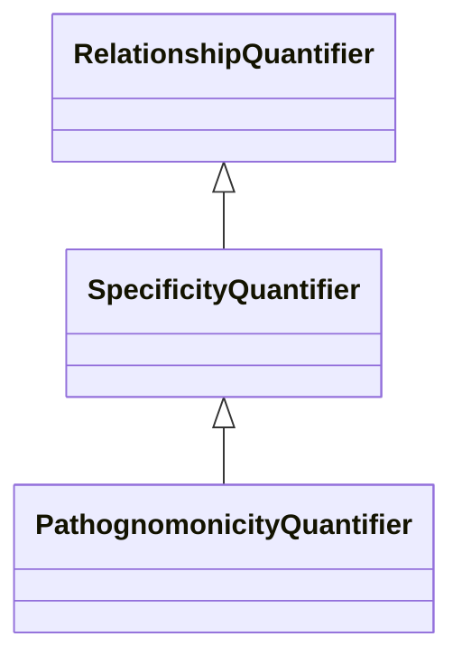

# Class: SpecificityQuantifier


URI: [bican:SpecificityQuantifier](https://identifiers.org/brain-bican/vocab/SpecificityQuantifier)





## Inheritance
* [RelationshipQuantifier](RelationshipQuantifier.md)
    * **SpecificityQuantifier**
        * [PathognomonicityQuantifier](PathognomonicityQuantifier.md)


## Slots

| Name | Cardinality and Range | Description | Inheritance |
| ---  | --- | --- | --- |


## Mixin Usage

| mixed into | description |
| --- | --- |


## Identifier and Mapping Information


### Schema Source


* from schema: https://identifiers.org/brain-bican/kb-model


## Mappings

| Mapping Type | Mapped Value |
| ---  | ---  |
| self | bican:SpecificityQuantifier |
| native | bican:SpecificityQuantifier |


## LinkML Source

<!-- TODO: investigate https://stackoverflow.com/questions/37606292/how-to-create-tabbed-code-blocks-in-mkdocs-or-sphinx -->

### Direct

<details>
```yaml
name: specificity quantifier
from_schema: https://identifiers.org/brain-bican/kb-model
is_a: relationship quantifier
mixin: true

```
</details>

### Induced

<details>
```yaml
name: specificity quantifier
from_schema: https://identifiers.org/brain-bican/kb-model
is_a: relationship quantifier
mixin: true

```
</details>