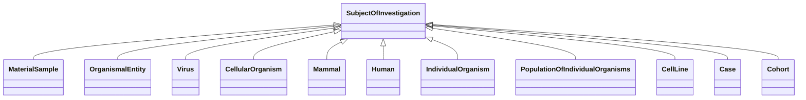

# Class: SubjectOfInvestigation


_An entity that has the role of being studied in an investigation, study, or experiment_


URI: [bican:SubjectOfInvestigation](https://identifiers.org/brain-bican/vocab/SubjectOfInvestigation)





<!-- no inheritance hierarchy -->


## Slots

| Name | Cardinality and Range | Description | Inheritance |
| ---  | --- | --- | --- |


## Mixin Usage

| mixed into | description |
| --- | --- |
| [MaterialSample](MaterialSample.md) | A sample is a limited quantity of something (e |
| [OrganismalEntity](OrganismalEntity.md) | A named entity that is either a part of an organism, a whole organism, popula... |
| [Virus](Virus.md) | A virus is a microorganism that replicates itself as a microRNA and infects t... |
| [CellularOrganism](CellularOrganism.md) |  |
| [Mammal](Mammal.md) | A member of the class Mammalia, a clade of endothermic amniotes distinguished... |
| [Human](Human.md) | A member of the the species Homo sapiens |
| [IndividualOrganism](IndividualOrganism.md) | An instance of an organism |
| [PopulationOfIndividualOrganisms](PopulationOfIndividualOrganisms.md) | A collection of individuals from the same taxonomic class distinguished by on... |
| [CellLine](CellLine.md) |  |
| [Case](Case.md) | An individual (human) organism that has a patient role in some clinical conte... |
| [Cohort](Cohort.md) | A group of people banded together or treated as a group who share common char... |


## Identifier and Mapping Information


### Schema Source


* from schema: https://identifiers.org/brain-bican/kb-model


## Mappings

| Mapping Type | Mapped Value |
| ---  | ---  |
| self | bican:SubjectOfInvestigation |
| native | bican:SubjectOfInvestigation |


## LinkML Source

<!-- TODO: investigate https://stackoverflow.com/questions/37606292/how-to-create-tabbed-code-blocks-in-mkdocs-or-sphinx -->

### Direct

<details>
```yaml
name: subject of investigation
description: An entity that has the role of being studied in an investigation, study,
  or experiment
from_schema: https://identifiers.org/brain-bican/kb-model
mixin: true

```
</details>

### Induced

<details>
```yaml
name: subject of investigation
description: An entity that has the role of being studied in an investigation, study,
  or experiment
from_schema: https://identifiers.org/brain-bican/kb-model
mixin: true

```
</details>