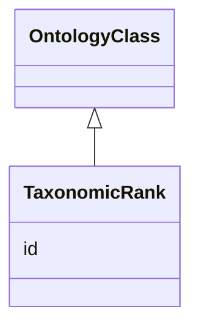

# Class: TaxonomicRank


_A descriptor for the rank within a taxonomic classification. Example instance: TAXRANK:0000017 (kingdom)_


URI: [bican:TaxonomicRank](https://identifiers.org/brain-bican/vocab/TaxonomicRank)





## Inheritance
* [OntologyClass](OntologyClass.md)
    * **TaxonomicRank**


## Slots

| Name | Cardinality and Range | Description | Inheritance |
| ---  | --- | --- | --- |
| [id](id.md) | 1..1 <br/> [String](String.md) | A unique identifier for an entity | [OntologyClass](OntologyClass.md) |


## Identifier and Mapping Information


### Valid ID Prefixes

Instances of this class *should* have identifiers with one of the following prefixes:

* TAXRANK


### Schema Source


* from schema: https://identifiers.org/brain-bican/kb-model


## Mappings

| Mapping Type | Mapped Value |
| ---  | ---  |
| self | bican:TaxonomicRank |
| native | bican:TaxonomicRank |
| undefined | WIKIDATA:Q427626 |


## LinkML Source

<!-- TODO: investigate https://stackoverflow.com/questions/37606292/how-to-create-tabbed-code-blocks-in-mkdocs-or-sphinx -->

### Direct

<details>
```yaml
name: taxonomic rank
id_prefixes:
- TAXRANK
description: 'A descriptor for the rank within a taxonomic classification. Example
  instance: TAXRANK:0000017 (kingdom)'
from_schema: https://identifiers.org/brain-bican/kb-model
mappings:
- WIKIDATA:Q427626
is_a: ontology class

```
</details>

### Induced

<details>
```yaml
name: taxonomic rank
id_prefixes:
- TAXRANK
description: 'A descriptor for the rank within a taxonomic classification. Example
  instance: TAXRANK:0000017 (kingdom)'
from_schema: https://identifiers.org/brain-bican/kb-model
mappings:
- WIKIDATA:Q427626
is_a: ontology class
attributes:
  id:
    name: id
    description: A unique identifier for an entity. Must be either a CURIE shorthand
      for a URI or a complete URI
    in_subset:
    - translator_minimal
    from_schema: https://identifiers.org/brain-bican/kb-model
    exact_mappings:
    - AGRKB:primaryId
    - gff3:ID
    - gpi:DB_Object_ID
    rank: 1000
    domain: entity
    identifier: true
    alias: id
    owner: taxonomic rank
    domain_of:
    - genome assembly
    - ontology class
    - entity
    range: string
    required: true

```
</details>