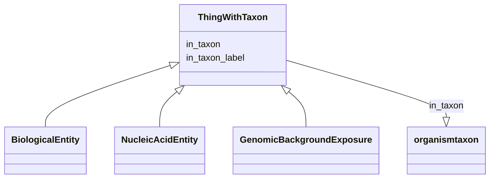

# Class: ThingWithTaxon


_A mixin that can be used on any entity that can be taxonomically classified. This includes individual organisms; genes, their products and other molecular entities; body parts; biological processes_


URI: [bican:ThingWithTaxon](https://identifiers.org/brain-bican/vocab/ThingWithTaxon)





<!-- no inheritance hierarchy -->


## Slots

| Name | Cardinality and Range | Description | Inheritance |
| ---  | --- | --- | --- |
| [in_taxon](in_taxon.md) | 0..* <br/> [OrganismTaxon](OrganismTaxon.md) | connects an entity to its taxonomic classification | direct |
| [in_taxon_label](in_taxon_label.md) | 0..1 <br/> [LabelType](LabelType.md) | The human readable scientific name for the taxon of the entity | direct |


## Mixin Usage

| mixed into | description |
| --- | --- |
| [BiologicalEntity](BiologicalEntity.md) |  |
| [NucleicAcidEntity](NucleicAcidEntity.md) | A nucleic acid entity is a molecular entity characterized by availability in ... |
| [GenomicBackgroundExposure](GenomicBackgroundExposure.md) | A genomic background exposure is where an individual's specific genomic backg... |


## Usages

| used by | used in | type | used |
| ---  | --- | --- | --- |
| [GeneAnnotation](GeneAnnotation.md) | [in_taxon](in_taxon.md) | domain | [ThingWithTaxon](ThingWithTaxon.md) |
| [GeneAnnotation](GeneAnnotation.md) | [in_taxon_label](in_taxon_label.md) | domain | [ThingWithTaxon](ThingWithTaxon.md) |
| [GenomeAnnotation](GenomeAnnotation.md) | [in_taxon](in_taxon.md) | domain | [ThingWithTaxon](ThingWithTaxon.md) |
| [GenomeAnnotation](GenomeAnnotation.md) | [in_taxon_label](in_taxon_label.md) | domain | [ThingWithTaxon](ThingWithTaxon.md) |
| [StudyPopulation](StudyPopulation.md) | [in_taxon](in_taxon.md) | domain | [ThingWithTaxon](ThingWithTaxon.md) |
| [StudyPopulation](StudyPopulation.md) | [in_taxon_label](in_taxon_label.md) | domain | [ThingWithTaxon](ThingWithTaxon.md) |
| [ThingWithTaxon](ThingWithTaxon.md) | [in_taxon](in_taxon.md) | domain | [ThingWithTaxon](ThingWithTaxon.md) |
| [ThingWithTaxon](ThingWithTaxon.md) | [in_taxon_label](in_taxon_label.md) | domain | [ThingWithTaxon](ThingWithTaxon.md) |
| [BiologicalEntity](BiologicalEntity.md) | [in_taxon](in_taxon.md) | domain | [ThingWithTaxon](ThingWithTaxon.md) |
| [BiologicalEntity](BiologicalEntity.md) | [in_taxon_label](in_taxon_label.md) | domain | [ThingWithTaxon](ThingWithTaxon.md) |
| [NucleicAcidEntity](NucleicAcidEntity.md) | [in_taxon](in_taxon.md) | domain | [ThingWithTaxon](ThingWithTaxon.md) |
| [NucleicAcidEntity](NucleicAcidEntity.md) | [in_taxon_label](in_taxon_label.md) | domain | [ThingWithTaxon](ThingWithTaxon.md) |
| [RegulatoryRegion](RegulatoryRegion.md) | [in_taxon](in_taxon.md) | domain | [ThingWithTaxon](ThingWithTaxon.md) |
| [RegulatoryRegion](RegulatoryRegion.md) | [in_taxon_label](in_taxon_label.md) | domain | [ThingWithTaxon](ThingWithTaxon.md) |
| [AccessibleDnaRegion](AccessibleDnaRegion.md) | [in_taxon](in_taxon.md) | domain | [ThingWithTaxon](ThingWithTaxon.md) |
| [AccessibleDnaRegion](AccessibleDnaRegion.md) | [in_taxon_label](in_taxon_label.md) | domain | [ThingWithTaxon](ThingWithTaxon.md) |
| [TranscriptionFactorBindingSite](TranscriptionFactorBindingSite.md) | [in_taxon](in_taxon.md) | domain | [ThingWithTaxon](ThingWithTaxon.md) |
| [TranscriptionFactorBindingSite](TranscriptionFactorBindingSite.md) | [in_taxon_label](in_taxon_label.md) | domain | [ThingWithTaxon](ThingWithTaxon.md) |
| [BiologicalProcessOrActivity](BiologicalProcessOrActivity.md) | [in_taxon](in_taxon.md) | domain | [ThingWithTaxon](ThingWithTaxon.md) |
| [BiologicalProcessOrActivity](BiologicalProcessOrActivity.md) | [in_taxon_label](in_taxon_label.md) | domain | [ThingWithTaxon](ThingWithTaxon.md) |
| [MolecularActivity](MolecularActivity.md) | [in_taxon](in_taxon.md) | domain | [ThingWithTaxon](ThingWithTaxon.md) |
| [MolecularActivity](MolecularActivity.md) | [in_taxon_label](in_taxon_label.md) | domain | [ThingWithTaxon](ThingWithTaxon.md) |
| [BiologicalProcess](BiologicalProcess.md) | [in_taxon](in_taxon.md) | domain | [ThingWithTaxon](ThingWithTaxon.md) |
| [BiologicalProcess](BiologicalProcess.md) | [in_taxon_label](in_taxon_label.md) | domain | [ThingWithTaxon](ThingWithTaxon.md) |
| [Pathway](Pathway.md) | [in_taxon](in_taxon.md) | domain | [ThingWithTaxon](ThingWithTaxon.md) |
| [Pathway](Pathway.md) | [in_taxon_label](in_taxon_label.md) | domain | [ThingWithTaxon](ThingWithTaxon.md) |
| [PhysiologicalProcess](PhysiologicalProcess.md) | [in_taxon](in_taxon.md) | domain | [ThingWithTaxon](ThingWithTaxon.md) |
| [PhysiologicalProcess](PhysiologicalProcess.md) | [in_taxon_label](in_taxon_label.md) | domain | [ThingWithTaxon](ThingWithTaxon.md) |
| [Behavior](Behavior.md) | [in_taxon](in_taxon.md) | domain | [ThingWithTaxon](ThingWithTaxon.md) |
| [Behavior](Behavior.md) | [in_taxon_label](in_taxon_label.md) | domain | [ThingWithTaxon](ThingWithTaxon.md) |
| [GeneticInheritance](GeneticInheritance.md) | [in_taxon](in_taxon.md) | domain | [ThingWithTaxon](ThingWithTaxon.md) |
| [GeneticInheritance](GeneticInheritance.md) | [in_taxon_label](in_taxon_label.md) | domain | [ThingWithTaxon](ThingWithTaxon.md) |
| [OrganismalEntity](OrganismalEntity.md) | [in_taxon](in_taxon.md) | domain | [ThingWithTaxon](ThingWithTaxon.md) |
| [OrganismalEntity](OrganismalEntity.md) | [in_taxon_label](in_taxon_label.md) | domain | [ThingWithTaxon](ThingWithTaxon.md) |
| [Bacterium](Bacterium.md) | [in_taxon](in_taxon.md) | domain | [ThingWithTaxon](ThingWithTaxon.md) |
| [Bacterium](Bacterium.md) | [in_taxon_label](in_taxon_label.md) | domain | [ThingWithTaxon](ThingWithTaxon.md) |
| [Virus](Virus.md) | [in_taxon](in_taxon.md) | domain | [ThingWithTaxon](ThingWithTaxon.md) |
| [Virus](Virus.md) | [in_taxon_label](in_taxon_label.md) | domain | [ThingWithTaxon](ThingWithTaxon.md) |
| [CellularOrganism](CellularOrganism.md) | [in_taxon](in_taxon.md) | domain | [ThingWithTaxon](ThingWithTaxon.md) |
| [CellularOrganism](CellularOrganism.md) | [in_taxon_label](in_taxon_label.md) | domain | [ThingWithTaxon](ThingWithTaxon.md) |
| [Mammal](Mammal.md) | [in_taxon](in_taxon.md) | domain | [ThingWithTaxon](ThingWithTaxon.md) |
| [Mammal](Mammal.md) | [in_taxon_label](in_taxon_label.md) | domain | [ThingWithTaxon](ThingWithTaxon.md) |
| [Human](Human.md) | [in_taxon](in_taxon.md) | domain | [ThingWithTaxon](ThingWithTaxon.md) |
| [Human](Human.md) | [in_taxon_label](in_taxon_label.md) | domain | [ThingWithTaxon](ThingWithTaxon.md) |
| [Plant](Plant.md) | [in_taxon](in_taxon.md) | domain | [ThingWithTaxon](ThingWithTaxon.md) |
| [Plant](Plant.md) | [in_taxon_label](in_taxon_label.md) | domain | [ThingWithTaxon](ThingWithTaxon.md) |
| [Invertebrate](Invertebrate.md) | [in_taxon](in_taxon.md) | domain | [ThingWithTaxon](ThingWithTaxon.md) |
| [Invertebrate](Invertebrate.md) | [in_taxon_label](in_taxon_label.md) | domain | [ThingWithTaxon](ThingWithTaxon.md) |
| [Vertebrate](Vertebrate.md) | [in_taxon](in_taxon.md) | domain | [ThingWithTaxon](ThingWithTaxon.md) |
| [Vertebrate](Vertebrate.md) | [in_taxon_label](in_taxon_label.md) | domain | [ThingWithTaxon](ThingWithTaxon.md) |
| [Fungus](Fungus.md) | [in_taxon](in_taxon.md) | domain | [ThingWithTaxon](ThingWithTaxon.md) |
| [Fungus](Fungus.md) | [in_taxon_label](in_taxon_label.md) | domain | [ThingWithTaxon](ThingWithTaxon.md) |
| [LifeStage](LifeStage.md) | [in_taxon](in_taxon.md) | domain | [ThingWithTaxon](ThingWithTaxon.md) |
| [LifeStage](LifeStage.md) | [in_taxon_label](in_taxon_label.md) | domain | [ThingWithTaxon](ThingWithTaxon.md) |
| [IndividualOrganism](IndividualOrganism.md) | [in_taxon](in_taxon.md) | domain | [ThingWithTaxon](ThingWithTaxon.md) |
| [IndividualOrganism](IndividualOrganism.md) | [in_taxon_label](in_taxon_label.md) | domain | [ThingWithTaxon](ThingWithTaxon.md) |
| [PopulationOfIndividualOrganisms](PopulationOfIndividualOrganisms.md) | [in_taxon](in_taxon.md) | domain | [ThingWithTaxon](ThingWithTaxon.md) |
| [PopulationOfIndividualOrganisms](PopulationOfIndividualOrganisms.md) | [in_taxon_label](in_taxon_label.md) | domain | [ThingWithTaxon](ThingWithTaxon.md) |
| [DiseaseOrPhenotypicFeature](DiseaseOrPhenotypicFeature.md) | [in_taxon](in_taxon.md) | domain | [ThingWithTaxon](ThingWithTaxon.md) |
| [DiseaseOrPhenotypicFeature](DiseaseOrPhenotypicFeature.md) | [in_taxon_label](in_taxon_label.md) | domain | [ThingWithTaxon](ThingWithTaxon.md) |
| [Disease](Disease.md) | [in_taxon](in_taxon.md) | domain | [ThingWithTaxon](ThingWithTaxon.md) |
| [Disease](Disease.md) | [in_taxon_label](in_taxon_label.md) | domain | [ThingWithTaxon](ThingWithTaxon.md) |
| [PhenotypicFeature](PhenotypicFeature.md) | [in_taxon](in_taxon.md) | domain | [ThingWithTaxon](ThingWithTaxon.md) |
| [PhenotypicFeature](PhenotypicFeature.md) | [in_taxon_label](in_taxon_label.md) | domain | [ThingWithTaxon](ThingWithTaxon.md) |
| [BehavioralFeature](BehavioralFeature.md) | [in_taxon](in_taxon.md) | domain | [ThingWithTaxon](ThingWithTaxon.md) |
| [BehavioralFeature](BehavioralFeature.md) | [in_taxon_label](in_taxon_label.md) | domain | [ThingWithTaxon](ThingWithTaxon.md) |
| [AnatomicalEntity](AnatomicalEntity.md) | [in_taxon](in_taxon.md) | domain | [ThingWithTaxon](ThingWithTaxon.md) |
| [AnatomicalEntity](AnatomicalEntity.md) | [in_taxon_label](in_taxon_label.md) | domain | [ThingWithTaxon](ThingWithTaxon.md) |
| [CellularComponent](CellularComponent.md) | [in_taxon](in_taxon.md) | domain | [ThingWithTaxon](ThingWithTaxon.md) |
| [CellularComponent](CellularComponent.md) | [in_taxon_label](in_taxon_label.md) | domain | [ThingWithTaxon](ThingWithTaxon.md) |
| [Cell](Cell.md) | [in_taxon](in_taxon.md) | domain | [ThingWithTaxon](ThingWithTaxon.md) |
| [Cell](Cell.md) | [in_taxon_label](in_taxon_label.md) | domain | [ThingWithTaxon](ThingWithTaxon.md) |
| [CellLine](CellLine.md) | [in_taxon](in_taxon.md) | domain | [ThingWithTaxon](ThingWithTaxon.md) |
| [CellLine](CellLine.md) | [in_taxon_label](in_taxon_label.md) | domain | [ThingWithTaxon](ThingWithTaxon.md) |
| [GrossAnatomicalStructure](GrossAnatomicalStructure.md) | [in_taxon](in_taxon.md) | domain | [ThingWithTaxon](ThingWithTaxon.md) |
| [GrossAnatomicalStructure](GrossAnatomicalStructure.md) | [in_taxon_label](in_taxon_label.md) | domain | [ThingWithTaxon](ThingWithTaxon.md) |
| [Gene](Gene.md) | [in_taxon](in_taxon.md) | domain | [ThingWithTaxon](ThingWithTaxon.md) |
| [Gene](Gene.md) | [in_taxon_label](in_taxon_label.md) | domain | [ThingWithTaxon](ThingWithTaxon.md) |
| [MacromolecularComplex](MacromolecularComplex.md) | [in_taxon](in_taxon.md) | domain | [ThingWithTaxon](ThingWithTaxon.md) |
| [MacromolecularComplex](MacromolecularComplex.md) | [in_taxon_label](in_taxon_label.md) | domain | [ThingWithTaxon](ThingWithTaxon.md) |
| [NucleosomeModification](NucleosomeModification.md) | [in_taxon](in_taxon.md) | domain | [ThingWithTaxon](ThingWithTaxon.md) |
| [NucleosomeModification](NucleosomeModification.md) | [in_taxon_label](in_taxon_label.md) | domain | [ThingWithTaxon](ThingWithTaxon.md) |
| [Genome](Genome.md) | [in_taxon](in_taxon.md) | domain | [ThingWithTaxon](ThingWithTaxon.md) |
| [Genome](Genome.md) | [in_taxon_label](in_taxon_label.md) | domain | [ThingWithTaxon](ThingWithTaxon.md) |
| [Exon](Exon.md) | [in_taxon](in_taxon.md) | domain | [ThingWithTaxon](ThingWithTaxon.md) |
| [Exon](Exon.md) | [in_taxon_label](in_taxon_label.md) | domain | [ThingWithTaxon](ThingWithTaxon.md) |
| [Transcript](Transcript.md) | [in_taxon](in_taxon.md) | domain | [ThingWithTaxon](ThingWithTaxon.md) |
| [Transcript](Transcript.md) | [in_taxon_label](in_taxon_label.md) | domain | [ThingWithTaxon](ThingWithTaxon.md) |
| [CodingSequence](CodingSequence.md) | [in_taxon](in_taxon.md) | domain | [ThingWithTaxon](ThingWithTaxon.md) |
| [CodingSequence](CodingSequence.md) | [in_taxon_label](in_taxon_label.md) | domain | [ThingWithTaxon](ThingWithTaxon.md) |
| [Polypeptide](Polypeptide.md) | [in_taxon](in_taxon.md) | domain | [ThingWithTaxon](ThingWithTaxon.md) |
| [Polypeptide](Polypeptide.md) | [in_taxon_label](in_taxon_label.md) | domain | [ThingWithTaxon](ThingWithTaxon.md) |
| [Protein](Protein.md) | [in_taxon](in_taxon.md) | domain | [ThingWithTaxon](ThingWithTaxon.md) |
| [Protein](Protein.md) | [in_taxon_label](in_taxon_label.md) | domain | [ThingWithTaxon](ThingWithTaxon.md) |
| [ProteinIsoform](ProteinIsoform.md) | [in_taxon](in_taxon.md) | domain | [ThingWithTaxon](ThingWithTaxon.md) |
| [ProteinIsoform](ProteinIsoform.md) | [in_taxon_label](in_taxon_label.md) | domain | [ThingWithTaxon](ThingWithTaxon.md) |
| [ProteinDomain](ProteinDomain.md) | [in_taxon](in_taxon.md) | domain | [ThingWithTaxon](ThingWithTaxon.md) |
| [ProteinDomain](ProteinDomain.md) | [in_taxon_label](in_taxon_label.md) | domain | [ThingWithTaxon](ThingWithTaxon.md) |
| [PosttranslationalModification](PosttranslationalModification.md) | [in_taxon](in_taxon.md) | domain | [ThingWithTaxon](ThingWithTaxon.md) |
| [PosttranslationalModification](PosttranslationalModification.md) | [in_taxon_label](in_taxon_label.md) | domain | [ThingWithTaxon](ThingWithTaxon.md) |
| [ProteinFamily](ProteinFamily.md) | [in_taxon](in_taxon.md) | domain | [ThingWithTaxon](ThingWithTaxon.md) |
| [ProteinFamily](ProteinFamily.md) | [in_taxon_label](in_taxon_label.md) | domain | [ThingWithTaxon](ThingWithTaxon.md) |
| [NucleicAcidSequenceMotif](NucleicAcidSequenceMotif.md) | [in_taxon](in_taxon.md) | domain | [ThingWithTaxon](ThingWithTaxon.md) |
| [NucleicAcidSequenceMotif](NucleicAcidSequenceMotif.md) | [in_taxon_label](in_taxon_label.md) | domain | [ThingWithTaxon](ThingWithTaxon.md) |
| [RNAProduct](RNAProduct.md) | [in_taxon](in_taxon.md) | domain | [ThingWithTaxon](ThingWithTaxon.md) |
| [RNAProduct](RNAProduct.md) | [in_taxon_label](in_taxon_label.md) | domain | [ThingWithTaxon](ThingWithTaxon.md) |
| [RNAProductIsoform](RNAProductIsoform.md) | [in_taxon](in_taxon.md) | domain | [ThingWithTaxon](ThingWithTaxon.md) |
| [RNAProductIsoform](RNAProductIsoform.md) | [in_taxon_label](in_taxon_label.md) | domain | [ThingWithTaxon](ThingWithTaxon.md) |
| [NoncodingRNAProduct](NoncodingRNAProduct.md) | [in_taxon](in_taxon.md) | domain | [ThingWithTaxon](ThingWithTaxon.md) |
| [NoncodingRNAProduct](NoncodingRNAProduct.md) | [in_taxon_label](in_taxon_label.md) | domain | [ThingWithTaxon](ThingWithTaxon.md) |
| [MicroRNA](MicroRNA.md) | [in_taxon](in_taxon.md) | domain | [ThingWithTaxon](ThingWithTaxon.md) |
| [MicroRNA](MicroRNA.md) | [in_taxon_label](in_taxon_label.md) | domain | [ThingWithTaxon](ThingWithTaxon.md) |
| [SiRNA](SiRNA.md) | [in_taxon](in_taxon.md) | domain | [ThingWithTaxon](ThingWithTaxon.md) |
| [SiRNA](SiRNA.md) | [in_taxon_label](in_taxon_label.md) | domain | [ThingWithTaxon](ThingWithTaxon.md) |
| [GeneFamily](GeneFamily.md) | [in_taxon](in_taxon.md) | domain | [ThingWithTaxon](ThingWithTaxon.md) |
| [GeneFamily](GeneFamily.md) | [in_taxon_label](in_taxon_label.md) | domain | [ThingWithTaxon](ThingWithTaxon.md) |
| [Genotype](Genotype.md) | [in_taxon](in_taxon.md) | domain | [ThingWithTaxon](ThingWithTaxon.md) |
| [Genotype](Genotype.md) | [in_taxon_label](in_taxon_label.md) | domain | [ThingWithTaxon](ThingWithTaxon.md) |
| [Haplotype](Haplotype.md) | [in_taxon](in_taxon.md) | domain | [ThingWithTaxon](ThingWithTaxon.md) |
| [Haplotype](Haplotype.md) | [in_taxon_label](in_taxon_label.md) | domain | [ThingWithTaxon](ThingWithTaxon.md) |
| [SequenceVariant](SequenceVariant.md) | [in_taxon](in_taxon.md) | domain | [ThingWithTaxon](ThingWithTaxon.md) |
| [SequenceVariant](SequenceVariant.md) | [in_taxon_label](in_taxon_label.md) | domain | [ThingWithTaxon](ThingWithTaxon.md) |
| [Snv](Snv.md) | [in_taxon](in_taxon.md) | domain | [ThingWithTaxon](ThingWithTaxon.md) |
| [Snv](Snv.md) | [in_taxon_label](in_taxon_label.md) | domain | [ThingWithTaxon](ThingWithTaxon.md) |
| [ReagentTargetedGene](ReagentTargetedGene.md) | [in_taxon](in_taxon.md) | domain | [ThingWithTaxon](ThingWithTaxon.md) |
| [ReagentTargetedGene](ReagentTargetedGene.md) | [in_taxon_label](in_taxon_label.md) | domain | [ThingWithTaxon](ThingWithTaxon.md) |
| [ClinicalFinding](ClinicalFinding.md) | [in_taxon](in_taxon.md) | domain | [ThingWithTaxon](ThingWithTaxon.md) |
| [ClinicalFinding](ClinicalFinding.md) | [in_taxon_label](in_taxon_label.md) | domain | [ThingWithTaxon](ThingWithTaxon.md) |
| [Case](Case.md) | [in_taxon](in_taxon.md) | domain | [ThingWithTaxon](ThingWithTaxon.md) |
| [Case](Case.md) | [in_taxon_label](in_taxon_label.md) | domain | [ThingWithTaxon](ThingWithTaxon.md) |
| [Cohort](Cohort.md) | [in_taxon](in_taxon.md) | domain | [ThingWithTaxon](ThingWithTaxon.md) |
| [Cohort](Cohort.md) | [in_taxon_label](in_taxon_label.md) | domain | [ThingWithTaxon](ThingWithTaxon.md) |
| [GenomicBackgroundExposure](GenomicBackgroundExposure.md) | [in_taxon](in_taxon.md) | domain | [ThingWithTaxon](ThingWithTaxon.md) |
| [GenomicBackgroundExposure](GenomicBackgroundExposure.md) | [in_taxon_label](in_taxon_label.md) | domain | [ThingWithTaxon](ThingWithTaxon.md) |
| [PathologicalProcess](PathologicalProcess.md) | [in_taxon](in_taxon.md) | domain | [ThingWithTaxon](ThingWithTaxon.md) |
| [PathologicalProcess](PathologicalProcess.md) | [in_taxon_label](in_taxon_label.md) | domain | [ThingWithTaxon](ThingWithTaxon.md) |
| [PathologicalAnatomicalStructure](PathologicalAnatomicalStructure.md) | [in_taxon](in_taxon.md) | domain | [ThingWithTaxon](ThingWithTaxon.md) |
| [PathologicalAnatomicalStructure](PathologicalAnatomicalStructure.md) | [in_taxon_label](in_taxon_label.md) | domain | [ThingWithTaxon](ThingWithTaxon.md) |


## Identifier and Mapping Information


### Schema Source


* from schema: https://identifiers.org/brain-bican/kb-model


## Mappings

| Mapping Type | Mapped Value |
| ---  | ---  |
| self | bican:ThingWithTaxon |
| native | bican:ThingWithTaxon |


## LinkML Source

<!-- TODO: investigate https://stackoverflow.com/questions/37606292/how-to-create-tabbed-code-blocks-in-mkdocs-or-sphinx -->

### Direct

<details>
```yaml
name: thing with taxon
description: A mixin that can be used on any entity that can be taxonomically classified.
  This includes individual organisms; genes, their products and other molecular entities;
  body parts; biological processes
from_schema: https://identifiers.org/brain-bican/kb-model
mixin: true
slots:
- in taxon
- in taxon label

```
</details>

### Induced

<details>
```yaml
name: thing with taxon
description: A mixin that can be used on any entity that can be taxonomically classified.
  This includes individual organisms; genes, their products and other molecular entities;
  body parts; biological processes
from_schema: https://identifiers.org/brain-bican/kb-model
mixin: true
attributes:
  in taxon:
    name: in taxon
    annotations:
      canonical_predicate:
        tag: canonical_predicate
        value: 'True'
    description: connects an entity to its taxonomic classification. Only certain
      kinds of entities can be taxonomically classified; see 'thing with taxon'
    in_subset:
    - translator_minimal
    from_schema: https://identifiers.org/brain-bican/kb-model
    aliases:
    - instance of
    - is organism source of gene product
    - organism has gene
    - gene found in organism
    - gene product has organism source
    exact_mappings:
    - RO:0002162
    - WIKIDATA_PROPERTY:P703
    narrow_mappings:
    - RO:0002160
    rank: 1000
    is_a: related to at instance level
    domain: thing with taxon
    multivalued: true
    inherited: true
    alias: in_taxon
    owner: thing with taxon
    domain_of:
    - thing with taxon
    range: organism taxon
  in taxon label:
    name: in taxon label
    annotations:
      denormalized:
        tag: denormalized
        value: 'True'
    description: The human readable scientific name for the taxon of the entity.
    in_subset:
    - translator_minimal
    from_schema: https://identifiers.org/brain-bican/kb-model
    exact_mappings:
    - WIKIDATA_PROPERTY:P225
    rank: 1000
    is_a: node property
    domain: thing with taxon
    slot_uri: rdfs:label
    alias: in_taxon_label
    owner: thing with taxon
    domain_of:
    - thing with taxon
    range: label type

```
</details>