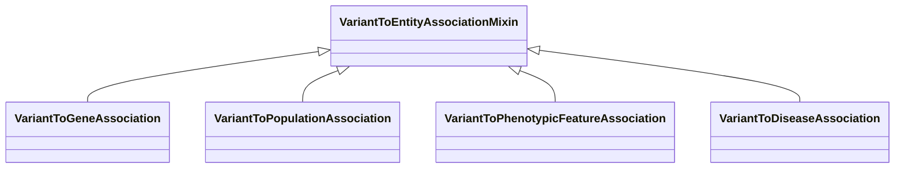

# Class: VariantToEntityAssociationMixin


URI: [bican:VariantToEntityAssociationMixin](https://identifiers.org/brain-bican/vocab/VariantToEntityAssociationMixin)





<!-- no inheritance hierarchy -->


## Slots

| Name | Cardinality and Range | Description | Inheritance |
| ---  | --- | --- | --- |


## Mixin Usage

| mixed into | description |
| --- | --- |
| [VariantToGeneAssociation](VariantToGeneAssociation.md) | An association between a variant and a gene, where the variant has a genetic ... |
| [VariantToPopulationAssociation](VariantToPopulationAssociation.md) | An association between a variant and a population, where the variant has part... |
| [VariantToPhenotypicFeatureAssociation](VariantToPhenotypicFeatureAssociation.md) |  |
| [VariantToDiseaseAssociation](VariantToDiseaseAssociation.md) |  |


## Identifier and Mapping Information


### Schema Source


* from schema: https://identifiers.org/brain-bican/kb-model


## Mappings

| Mapping Type | Mapped Value |
| ---  | ---  |
| self | bican:VariantToEntityAssociationMixin |
| native | bican:VariantToEntityAssociationMixin |


## LinkML Source

<!-- TODO: investigate https://stackoverflow.com/questions/37606292/how-to-create-tabbed-code-blocks-in-mkdocs-or-sphinx -->

### Direct

<details>
```yaml
name: variant to entity association mixin
local_names:
  ga4gh:
    local_name_source: ga4gh
    local_name_value: variant annotation
from_schema: https://identifiers.org/brain-bican/kb-model
mixin: true
slot_usage:
  subject:
    name: subject
    description: a sequence variant in which the allele state is associated with some
      other entity
    examples:
    - value: CLINVAR:38077
      description: CLINVAR representation of NM_000059.3(BRCA2):c.7007G>A (p.Arg2336His)
    - value: ClinGen:CA024716
      description: chr13:g.32921033G>C (hg19) in ClinGen
    domain_of:
    - association
    range: sequence variant
defining_slots:
- subject

```
</details>

### Induced

<details>
```yaml
name: variant to entity association mixin
local_names:
  ga4gh:
    local_name_source: ga4gh
    local_name_value: variant annotation
from_schema: https://identifiers.org/brain-bican/kb-model
mixin: true
slot_usage:
  subject:
    name: subject
    description: a sequence variant in which the allele state is associated with some
      other entity
    examples:
    - value: CLINVAR:38077
      description: CLINVAR representation of NM_000059.3(BRCA2):c.7007G>A (p.Arg2336His)
    - value: ClinGen:CA024716
      description: chr13:g.32921033G>C (hg19) in ClinGen
    domain_of:
    - association
    range: sequence variant
defining_slots:
- subject

```
</details>