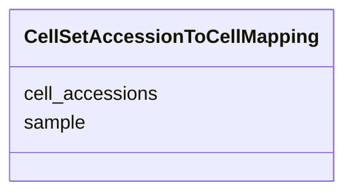

# Class: CellSetAccessionToCellMapping


URI: [ccn2:CellSetAccessionToCellMapping](https://github.com/brain-bican/CCN2CellSetAccessionToCellMapping)





<!-- no inheritance hierarchy -->


## Slots

| Name | Cardinality and Range | Description | Inheritance |
| ---  | --- | --- | --- |
| [sample](sample.md) | 1..1 <br/> [String](String.md) | Cell sample identifier | direct |
| [cell_accessions](cell_accessions.md) | 1..* <br/> [String](String.md) | List of cell set accession identifiers | direct |


## Identifier and Mapping Information


### Schema Source


* from schema: CCN2


## Mappings

| Mapping Type | Mapped Value |
| ---  | ---  |
| self | ccn2:CellSetAccessionToCellMapping |
| native | ccn2:CellSetAccessionToCellMapping |


## LinkML Source

<!-- TODO: investigate https://stackoverflow.com/questions/37606292/how-to-create-tabbed-code-blocks-in-mkdocs-or-sphinx -->

### Direct

<details>
```yaml
name: cell set accession to cell mapping
from_schema: CCN2
slots:
- sample
- cell accessions
slot_usage:
  sample:
    name: sample
    domain_of:
    - cell set accession to cell mapping
    required: true
  cell accessions:
    name: cell accessions
    domain_of:
    - cell set accession to cell mapping
    required: true

```
</details>

### Induced

<details>
```yaml
name: cell set accession to cell mapping
from_schema: CCN2
slot_usage:
  sample:
    name: sample
    domain_of:
    - cell set accession to cell mapping
    required: true
  cell accessions:
    name: cell accessions
    domain_of:
    - cell set accession to cell mapping
    required: true
attributes:
  sample:
    name: sample
    description: Cell sample identifier.
    from_schema: CCN2
    rank: 1000
    alias: sample
    owner: cell set accession to cell mapping
    domain_of:
    - cell set accession to cell mapping
    range: string
    required: true
  cell accessions:
    name: cell accessions
    description: List of cell set accession identifiers.
    from_schema: CCN2
    rank: 1000
    multivalued: true
    alias: cell_accessions
    owner: cell set accession to cell mapping
    domain_of:
    - cell set accession to cell mapping
    range: string
    required: true

```
</details>